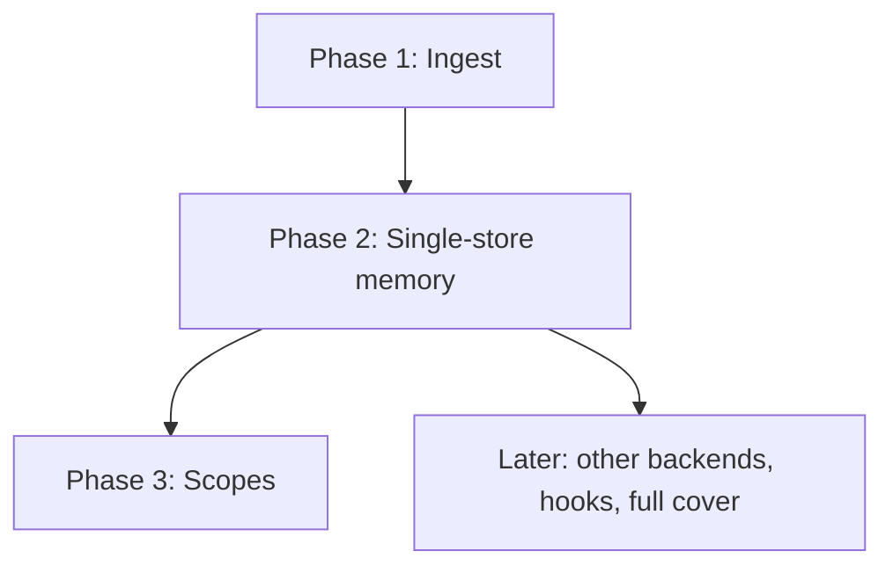

# Roadmap

`VISION.md` is the design contract. This file sequences the first file backend so each slice can fail for a real reason.

## Verdict

This is one product and one CLI. It is not one small task.

The architecture is already decided. We should not spend a creative phase rediscovering whether notes are files, whether wake may block, or whether zoom may use `git log`. That feeling is right.

What is not already decided is whether the store we write actually commutes, survives squash, and addresses more than one directory. Those are different failure modes. Landing them in one unstructured pass hides which one broke. Sequencing them does not require eight Niko tasks.

**Preferred:** one L4 whose milestones are the three phases below.

**Also fine:** one L3 that implements the same three phases in order, using this file as the plan spine. That is less ceremony, not less work. Accept it only if you want a single plan and a single QA, not because the job is small.

**Not fine:** one L2 "write the script." Also not fine: a Niko task per first-proof line. Proofs 2–6 are one store. Proofs 7–8 are addressing.

Implement in this order even inside one task. Treat each phase's proofs as a gate. Do not start scopes before a fresh clone of `main` can zoom an original sentence.

## Phase 1: Ingest

**Question this answers:** do two writers add two files, and does git merge them without help?

**Build**

- One shebang Python 3.11+ script at `.summem/summem` so agents run a script, not edit files
- Git-root auto-create on first `wake` or `note`
- `note`: one immutable file, UTC name, at most 280 bytes, temp file plus rename
- `wake`: wait-free listing of loose notes, each with a content id
- Test harness that can make worktrees and merge them

**Gate:** first proof 1 — two worktrees each `note` once, merge, zero conflicts, two notes in the view.

**Freeze here, do not revisit**

- Script path: `.summem/summem` (shebang `#!/usr/bin/env python3`, executable)
- Store path: `.summem/config.toml`. Read with stdlib `tomllib` (Python 3.11+). Write the default file as a commented template string; `tomllib` does not dump.
- Canonical hash: SHA-256 of file bytes, sorted hex digests, join, SHA-256 of the join
- How wake prints a content id and a grain line
- `.tree` dump format, even if Phase 1 does not write naps yet — Phase 2 must not invent a second identity scheme

**Out of scope:** `nap`, `zoom`, `--path`, catalog, cover, config knobs beyond internal defaults.

## Phase 2: Single-store memory

**Question this answers:** is the store right, including after squash?

**Build**

- `nap <id-a> <id-b>` and `zoom <id>` on content ids only. A positional range, one id, three ids, or no id, is rejected
- Nap pair: `.sum` caption, `.tree` canonical payload. Identity is the leaf set, not the sentence
- A child may be a raw note or another nap. Fold writes a new pair. Children leave the view only after the parent payload exists on disk
- `wake` of the current view (loose notes plus nap pairs), wait-free. A missing or conflict-marked caption degrades; it does not block
- `recall` of the view, and of original sentences inside `.tree` files
- Equal-grain fold requests when **file** count exceeds `WAKE_LINES`: the oldest adjacent same-grain pair, never 16+1. Catch-up after `nap`. `WAKE_LINES` is how many lines wake prints. When the directory is shorter, wake expands the newest nap in memory and does not write children back. Full aligned `cover(T)` after merge is later, not this expand

**Gates:** first proofs 2, 3, 4, 5, and 6.

Internal order if this phase is one task: identity and conflict proofs (2, 3, 5) before volume and longevity (4, 6). Proof 6 needs nap-of-naps. Do not implement "nap only raw notes" and extend later.

**Out of scope:** a second store, `--path`, the root catalog, a committed config file. Missing config still means script defaults.

## Phase 3: Scopes

**Question this answers:** can an agent aim at a directory without inventing a store?

**Build**

- `start <dir>` creates a store in that directory and writes a default config, commented
- Every command except `start` takes optional `--path` and walks up to the nearest existing store
- Root wake prints the root view plus a catalog of other started stores. The catalog is computed (walk the tree, honor git ignore, including `.git/info/exclude`). It is not a committed index
- `wake --path` prints only the nearest store. It does not reprint root or the full catalog
- Per-store knobs in the store. Two clones see the same budgets

**Gates:** first proofs 7 and 8.

This phase must not change note identity, nap identity, or the "zoom is a property of `HEAD`" rule. If it needs a shared index or a manifest parse to find scopes, the phase is wrong.

## Later

Not required to call the file backend done:

- A second backend (sqlite or otherwise). The CLI table in `VISION.md` stays put
- Harness hooks. They may nag; they are not how memory loads
- Full OptMem aligned cover after merge. Equal-grain file requests plus in-memory wake expand are not that rebuild
- Pack-size cap, unless a `.tree` approaches a host blob warning
- Shipping the agent prompt or Cursor rule that makes root wake mandatory
- A filled `README.md`

## Cross-phase invariants

No phase may violate these, including the first slice:

- Agents never write the store
- Ingest commutes: two notes are two paths. No next id. No shared mutable index
- Sequence is in the filename, not in `git log`
- Wake never refuses to print
- The agent interface does not mention store files, hashes as paths, or git
- Personal and machine facts stay out of the repository
- A missing implementation of `VISION.md` is unfinished work, not a reason to shrink the contract
