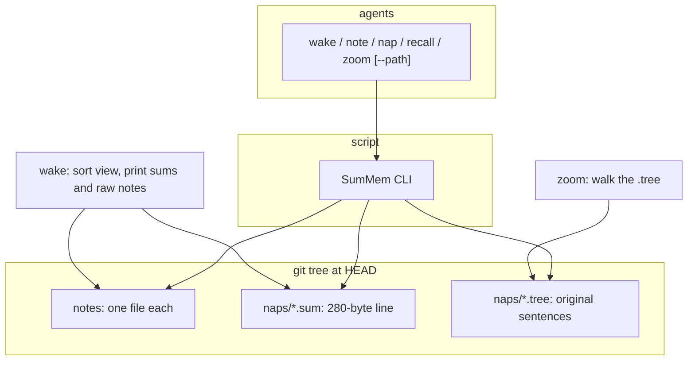

# SumMem

SumMem is a committed, concurrent memory for agents working in a git repository. Agents never touch the store. They run a script. The script owns every file. Wake prints a decaying view of what the repository has learned: recent notes verbatim, older notes as one-line summaries. Zoom can still open those summaries down to the original sentences after a squash merge.

The first consumer in mind is a Node monorepo — repo root plus many packages — but the model is any git tree, including those w/out a monorepo shape (only one top-level store). A scope is a directory that has opted in, not a `package.json` and not an actor.

## Why this is not OptMem on disk

[OptMem](https://github.com/VictorTaelin/OptMem) is the right *view*: an append-only sequence of short notes, a binary merge tree of summaries, and `cover(T, budget)` so wake stays bounded while detail decays with age. SumMem keeps that view.

OptMem’s *store* cannot live in a repository that squash-merges and that uninterested humans resolve:

- One `LOG.txt` of fixed-width records. Position is identity. Two writers assign the same next id.
- `TREE/` files are also position-indexed and append-only. Two naps hit the same path.
- Conflict markers destroy alignment. `repair()` only trims a trailing partial record.
- `#16-31` is a durable name only if one writer advances one `T`.

The cover function is a pure function of how many notes exist and how many lines you will read. It does not need those files. What git cannot preserve is a single growing log and a single next id.

Identity was doing lock-like work in OptMem: one self, one `flock`, “subagents do not write.” One laptop may run three tasks; a tennex engineer may run ten Codex agents; CI may run two jobs on a PR... all at the same time. Those writers do not share a process or a disk lock. SumMem does not have an actor. It has a grow-only set of facts and a decaying view of that set.

## Model



Ingest is wait-free union: anyone who learned something causes the script to add a note file. Integrate is cooperative: the script may nap a sealed block into a summary plus a self-contained tree, then drop the children from the view. Wake is wait-free: it uses whatever summaries exist and never refuses to print.

Git’s job is to merge a directory of files. It is not a timestamp server and not a zoom index. Squash keeps the files that exist at the branch tip. Anything zoom must still see after squash must be in those files.

## Agent interface

The interface does not mention store files, hashes as paths, or git. It must stay stable if the backend changes. It does mention `--path`, which is how the agent aims a command at work in the tree.

Every command except `start` takes an optional `--path <relative_path>`. The script walks from that path (or from `$PWD` if the flag is omitted) up to the nearest store and uses that store. `--path` may be a file: `.summem/summem note --path foo/packages/baz/fee.ts "…"` walks from `foo/packages/baz` and lands in `foo/packages/baz` if that directory was `start`ed, else further up, at least to the git root.

| Command | Contract |
|---|---|
| `wake` | Print the decaying document for the resolved store. Do what it prints. Never “cannot wake, go nap first.” If the resolved store is the git root, also print the catalog of every other started store and how to pull one. |
| `note "…"` | Record one line, at most 280 bytes, in the resolved store. The script assigns time and name. |
| `nap <id-a> <id-b> "…"` | Two adjacent content ids a wake printed, plus a caption. Not a positional range. `--path` selects which store. |
| `recall <regex>` | Search the resolved store word for word. |
| `zoom <id>` | Open that block into its two halves, down to raw notes. A content id a wake printed. |
| `start <dir>` | Create a store **in that directory** (no walk-up) and write a default config. Operator command; agents run it only when asked to start a package. |

If `note` asks for a nap, the agent does that nap before its next action. Subagents should not `note` as a taste rule so the recent window does not fill with trivia. The store does not depend on that rule.

No “write a file.” No “sort by git.” A later sqlite backend, or a different pack format, must not change this table.

## Scopes

A command resolves **one** store: from `--path` if given, otherwise from `$PWD`, walk toward the git root (or stop at `$PWD` if not in git) and take the first directory that already has a store. Do not create a store because the agent `note`d from a deep folder or passed a file under one.

`start <dir>` is the exception: it creates a store in `<dir>` itself.

Do not parse `pnpm-workspace.yaml` or any other manifest to decide what a scope is. A Cargo crate, a seed app, or any other kind of monorepo opts in the same way: `.summem/summem start <dir>`.

Intermediate folders with no store are not scopes. Work there rolls up to the nearest started ancestor, which in a git repo is at least the root.

Machine-local identity (who the operator is, this laptop, how they want to be worked with) does not belong in the repository. That stays a separate tool, such as OptMem’s global store. SumMem is facts about the THIS directory hierarchy.

## Activation

OptMem **pushes**: one wake at session start, the whole memory is in context. Nagging an agent to go fetch a store is a **pull**. We cannot know when an agent starts considering a directory, so we cannot honestly push package memory at the moment it becomes relevant. Harness hooks cannot see the conversation and cannot judge a skip. They are an optional nag, not the mechanism.

So SumMem pushes **root**, and makes every other store available to pull.

Session start is still mandatory and once. The first wake must **resolve to the true root** — cwd at the root, or `--path` aimed at the root, not `.` from a package:

> Run `.summem/summem wake` from the repository root (or `.summem/summem wake --path <root-relative>`) before any other tool call.
> If you can see a prior **root** SumMem wake in this conversation, do not run the root wake again.

That root wake prints two things:

1. The root store’s decaying document (the push).
2. A catalog of every other started store: relative path, note count, latest date, and one line of instruction — when you work under that path, `.summem/summem wake --path <that path>` if that store’s wake is not already in this conversation.

The catalog is computed by walking the tree for store directories. It is not a committed index file. If in a git repo, it should honor git ignore (not .gitignore - but `git ignore` - this includes .git/info/exclude).

`.summem/summem wake --path foo/packages/baz/fee.ts` pulls **only** the nearest store to that file. It does not reprint root. It does not reprint the full catalog.

Child memories are not guaranteed to enter context. A modern agent that can see the catalog and is about to edit `fee.ts` will probably pull. That is the honesty of the design: pull is available and advertised; it is not enforced.

Do not load every started store in the root wake. That is the budget problem `start` and per-store `WAKE_LINES` exist to solve.

## Onboarding

The script does not infer a monorepo. A tree ten folders deep whose packages live at layer three is not special until someone says so.

The **git root always auto-creates** on the first `wake` or `note` in that repository: store directory plus a config file filled with the script’s defaults, commented so a human can see every knob. Until someone `start`s another path, every note in the tree rolls up to root. A regular repository stays in that shape and can raise `WAKE_LINES` on the root config to spend the whole reading budget in one place.

`.summem/summem start <dir>` writes the same kind of store and default config into that directory. After that, `--path` under it resolves here instead of rolling up. A five-level monorepo starts the five directories that should have their own memory and sets each config tight. Root wake stays one document plus a five-line catalog. Pulling a package is one short document, not five stacked layers and not ten accidental ones.

`start` is how you onboard a package. It is not implied by `package.json`, and it is not implied by `cd`.

If a store exists but its config file is missing or a knob is omitted, the script uses internal defaults. It does not fail, and it does not rewrite the file unless someone runs `start` or an explicit config command.

## Per-store configuration

Knobs are not environment variables. Two repositories on the same machine want different budgets: one is a deep monorepo that must stay tight at every started layer; one is a single store that should burn the whole context budget at root. A process-wide `WAKE_LINES` cannot say both. A knob in each store can.

The script loads `config` from that store, then fills any missing name from built-in defaults. The file is committed with the repo, so every clone and every CI job sees the same budgets.

Each wake renders **one** store with that store’s `WAKE_LINES`. Root wake is root’s budget plus a small catalog. A pull is that package’s budget. They do not stack in a single command. That is the control: start fewer stores, or lower each store’s budget.

`ENTRY_CHARS` (280) is the note and `.sum` line limit.

Pack-size cap is optional. It bounds one `.tree`, not the lifetime of the memory.

Hot margin is how close to “now” a block may be before the script will nap it. Nap only sealed blocks: complete, and old enough that a new note will not sort into them under honest clocks. Clock skew can still insert a note into an old span; that is extra naps of new pairings, not silent corruption, because summaries are keyed by leaf set.

## Sequence

The sequence key lives in the tree, not in `git log`.

A note file is named `20260818T203512Z-<rand>`. `ls | sort` is the order. Identical timestamps tie-break on the rest of the name.

Git-add date is the wrong clock. Git does not store “when this path entered the repo” on the blob; you reconstruct it by walking history. Squash gives every file from a PR the same commit time. Shallow clones invent a boundary date. Rebase moves committer dates. In the concurrent-PR case the git date collapses and you fall through to filename anyway — so filename is the sequence.

A nap file’s sort key is the **minimum child time**, not “when we compacted.” If the nap sorted as “now,” Monday’s block would jump to the front of wake and temporal bias would invert. The script names the file from the children. The agent does not invent the name.

Wake never prints positional ranges such as `#16-31`. Agents copy whatever looks like an id; those digits are a picture of one listing and become a lie after the next merge. Wake prints the **content id** and, if useful, grain as prose: `a3f2c1b8  (16 notes, from 2026-03-01)  …`. `nap` accepts two of those ids; `zoom` accepts one. A command that looks like a range is rejected.

## Identifiers and hashing

The content id is a digest of the **leaves**, never of the summary sentence.

1. For each original note, SHA-256 of the file bytes (UTF-8 text plus one trailing newline), lowercase hex.
2. Sort those hex digests as ASCII and concatenate them with **no delimiter**.
3. SHA-256 of that ASCII join → the leaf-set id. It is identity, not the whole filename. Nap files are `{minStamp}-{rand}-{leafset}-{leaves}.sum|.tree`.

Same children → same id → same `.tree` bytes. Different sentence → same id, different `.sum`.

Canonical `.tree` bytes are UTF-8 JSON: `sort_keys=True`, `separators=(',', ':')`, `ensure_ascii=False`, exactly one trailing newline. Schema:

- Tree object: `v` (integer `1`), `kids` (array)
- Note child: `k`=`n`, `name` (filename only), `text` (note text, no terminator)
- Nap child: `k`=`p`, `id` (leaf-set hex of the original notes), `sum` (caption), `tree` (nested tree object)

Hashing is **inside the script**, SHA-256 from the language stdlib. First backend: Python 3 `hashlib`. Do not call `sha256sum` or `openssl` (PATH lottery). Do not use `git hash-object` (SHA-1 vs SHA-256 depends on the repo). The id must not change because the operator’s git was upgraded.

## Store

The first backend is files in git. The script may swap it. These roles must exist in some form.

### Notes

Ingest is one file per note. Two agents write two paths. Git sees `add` + `add`. No store-wide lock. A single note is temp file plus rename.

Notes are immutable. There is no edit. A retraction is a new note. Rewriting a note is the one way to create a real content conflict; the script never does it.

### Naps

Nap is file collection. The script compresses a sealed set of children into two files. Identity is the **leaf-set hash** (a digest of the original notes, not of the summary text). Sequence and grain live in the same name. Wake lists files without opening `.tree` when the directory meets or exceeds `WAKE_LINES`; when the directory is shorter, it may open `.tree` to expand:

| File | Bytes | Role |
|---|---|---|
| `naps/<minStamp>-<rand>-<leafset>-<leaves>.sum` | One line, ≤280 bytes | What wake prints. Two wordings of the same leaves may differ. |
| `naps/<minStamp>-<rand>-<leafset>-<leaves>.tree` | Canonical dump of the children | What zoom and word-for-word recall need after squash. Same children → same bytes. |

`minStamp` plus `rand` is the leftmost child's order key, copied from that child's filename so a same-second fold stays in the left slot. `leafset` is identity. `leaves` is the original-note count wake prints as grain.

A child is a raw note or another nap. The `.tree` stores **full bodies** of immediate children. If a child is itself a nap, that body includes *its* `.tree`. One file that represents 64 original notes contains those 64 sentences. After squash, a clone of `main` that only has three nap pairs can still zoom to the originals. The content is in `HEAD`, not in `commit^`.

Fold writes a **new** pair of files for the larger leaf set, then deletes the children from the view. It does not patch an existing `.tree`. Old pair-files disappear from `HEAD` because their bytes now live inside the parent.

Uncommitted delete is data loss, not archaeology. The script must not drop children from the working tree until the parent `.tree` exists on disk (the files that will be committed). Whether the script itself commits is an implementation choice; the invariant is that the tip tree always contains every sentence zoom still owes.

### View versus payload

Wake lists the current view: loose notes plus nap stems (a `.sum`, a `.tree`, or both), sorted by the sequence key. When file count meets or exceeds `WAKE_LINES`, that listing is the files and does not open `.tree`. When file count is short of the budget, wake may open `.tree` to expand the newest nap in memory until it has enough lines, or until nothing left will split. It does not write those children back. Expanded ids are printable and zoomable; this milestone still naps view-file ids only.

Recall of everyday use is `sort | cat` of the view, with `.sum` standing in for napped children. Recall that must see original sentences reads `.tree` files as well. That is still the tree at `HEAD`, not `git log`.

There is no shared index file, no `LOG.txt`, and no `manifest` that every `note` updates. A shared append-only file is the thing an uninterested merge resolver will corrupt.

## Temporal bias

Wake uses OptMem’s cover: tile the sorted sequence with aligned power-of-two blocks; keep a block whole when it is small relative to its age; spend leftover budget on the present. Recent notes stay one file each. Ancient notes appear as one `.sum`.

A simpler equivalent: if **file** count exceeds `WAKE_LINES`, request the oldest adjacent pair with the same leaf count. Never 16+1. The agent naps that pair; children leave the directory. `WAKE_LINES` is how many lines wake prints. When files are fewer than the budget, wake splits the newest expandable nap in memory. When files meet or exceed the budget, wake lists files. It does not write children back. Catch-up after `nap` prints the next equal-grain pair if the directory is still over budget.

Wake is wait-free. A missing or conflict-marked `.sum` still counts as a view node: wake prints the content id and grain, skips the caption, and does not refuse. It does not open `.tree` to list an at-or-over-budget directory. It may open `.tree` to expand an under-budget directory; a missing, unreadable, or malformed `.tree` means that node will not split. Zoom still reads `.tree`. Ten agents must not serialize on “cannot wake.”

## Concurrency and merge

The concurrency control is git’s tree merge plus add-only distinct paths. Not an actor. Not `flock` across machines. Not a custom merge driver. Not `merge=union`. GitHub’s resolve-conflicts button does not run your driver.

| Event | Same path? | Result |
|---|---|---|
| Two agents each `note` | No | Both files survive. |
| Two agents nap disjoint leaf sets | No | Two new `.sum`/`.tree` pairs. |
| Two agents nap the same leaves, canonical `.tree`, same sentence | Same paths, same bytes | Git agrees. |
| Two agents nap the same leaves, different sentence | Same `.sum`, one line differs | Conflict. Take either side, or mash the two sentences into one line. Both are summaries of those leaves. `.tree` should be identical and not conflict. |
| Alice folds `aa`+`bb` into `aabb` and deletes `aa`/`bb`; Bob did not edit them | New path + deletes | Git takes the deletes. Zoom of `aa` is inside `aabb.tree`. |
| Conflict markers left in a `.sum` | That file is dirty | Script rejects `<<<<<<<`. Zoom still has `.tree`. |
| Conflict markers left in a `.tree` | Zoom payload dirty | This is the failure we avoid by making `.tree` write-once and canonical so it should not conflict. |

Mix-and-match is safe when it is Alice’s sentence on Bob’s leaves **of the same leaf set**. The `.tree` is the leaves. The `.sum` is a caption. Putting Alice’s caption on a *different* leaf set is the one human resolution that lies.

People who do not know the tool will pick “Accept incoming.” If the conflict was a `.sum`, either side is a valid memory. If ingest never shared a path, they never saw a conflict.

## Long-lived branches

Two feature branches that run for months will each grow their own `.sum`/`.tree` files. If the leaf sets do not overlap, merge onto `main` is a clean union. `HEAD` then holds both pasts.

Wake does **not** rebuild OptMem’s aligned `[0, 8192)` over the interleaved leaves. Those packs were built along each branch’s sequence. After merge they interleave by minimum child time; almost no existing `.sum` would match a cover block of the combined leaf list. Re-covering would demand a storm of naps or dump thousands of raw lines.

The **view file** is the sequence element for fold. Each on-disk `.sum` counts as one file, even if its `.tree` holds thousands of notes. Wake sorts files and prints captions at or over budget. Under budget it may print finer lines from those trees. You are awake immediately.

Later naps fold **adjacent view nodes** — typically January-from-A next to January-from-B — into a new parent: union leaf-set id, canonical concat of the two `.tree` files, one new sentence. The parallel pasts become one cover again, lazily, from the left. Zoom still opens each child until that fold. A pack-size cap may leave two fat siblings forever; wake then prints two old lines instead of one.

## Squash

Squash keeps the branch-tip tree as one commit on `main`. Intermediate commits are gone. Zoom via `git show commit^` does not survive a world that loves squash-merge PRs. Shallow clones do not have the parent either.

After 100 notes on a branch have been folded, the tip must still contain the original sentences:

```text
naps/aa.sum     280 bytes
naps/aa.tree    notes 1–64, verbatim
naps/bb.sum     280 bytes
naps/bb.tree    notes 65–96, verbatim
naps/cc.sum     280 bytes
naps/cc.tree    notes 97–100, verbatim
```

That is what squash ships. A 280-byte `.sum` alone is not enough. Git history is not enough.

## What HEAD looks like a year later

`HEAD` is the current cover, not every file the project ever wrote. Folded children are gone from the view. Typical shape:

```text
naps/…  .tree     8192 notes     megabytes     oldest, sealed
naps/…  .tree     2048 notes
naps/…  .tree      512 notes
naps/…  .tree        8 notes
naps/…  .tree        2 notes     hundreds of bytes     napped yesterday
naps/…  .tree        2 notes
notes/               a dozen loose files               today
```

File **count** per scope stays on the order of the wake budget, not on the order of lifetime notes. Printed **lines** follow the knob: raising `WAKE_LINES` can crack the right edge of that on-disk tree in memory. File **size** is where `T` shows up, and only in old blocks. Each fat `.tree` is a slice of what OptMem would have kept in one `LOG.txt`. At-budget wake still only reads the matching `.sum`.

A brand-new two-entry `.tree` is the right edge. Next month it is eaten by a larger parent and leaves `HEAD`.

If one multi-megabyte blob is unwanted (GitHub warns around 50–100 MB; at ~280 bytes per note that is hundreds of thousands of notes in one block), cap pack size: never fold past *N* notes per `.tree` (256 is a reasonable first *N*). Then a busy year is many tens-of-kilobyte files instead of one monster. Wake does not change.

## Invariants

These look optional and are not.

**Agents never write the store.** The script is the only writer. That is what makes the backend swappable and what keeps invented filenames out of git.

**No actor identity.** A scope is a directory. Attribution (host, PR, agent id) may sit on a note as debug metadata. It is never an address and never a lock.

**Ingest commutes.** Two notes are two files. There is no next id.

**Sequence is in the filename**, derived from writer time **in UTC** for notes and from the leftmost child's `{stamp}-{rand}` for naps. Not from `git log`.

**`.tree` is write-once and canonical.** Same leaves, same bytes. Fold creates a new path. No growing log.

**`.sum` is the only honest conflict.** Either side, or a mashup of the two lines, is a valid caption of those leaves.

**Zoom is a property of `HEAD`.** Every sentence zoom still owes lives in some file at the tip, inside a `.tree` if not still a loose note.

**Wake is wait-free.** Missing summaries degrade to finer grain. They do not block the session.

**No shared mutable index.** Wake is a directory list. An index everyone updates is a log.

**Empty packages stay empty.** A store appears at the git root on first command, or at another path only via `start`. `--path` and `$PWD` walk up. They do not create a store.

**Root wake pushes. Other stores pull.** Root wake always includes the catalog. A pull is `wake --path`. Child memory in context is not guaranteed.

**Knobs live in the store.** Not in the environment. Missing config means script defaults.

**Wake prints content ids, never positional ranges.**

**Personal and machine facts stay out of the repo.**

## Deliberate absences

SumMem is not Niko’s `memory-bank/`. That is task-scoped working documentation, archived when a task ends. This is an append-only decaying log of facts. Do not fold them together.

SumMem is not a lease, a primary agent, a vector clock, or a merge driver that renumbers a log. Those reintroduce identity as a lock.

SumMem does not pack old notes into one growing `LOG.txt` to save file count. That re-creates the append conflict at a lower frequency. Compaction writes new immutable files.

SumMem does not use git history as the zoom tree. Elegant when nap is a later unsquashed commit; false in this world.

SumMem does not depend on harness hooks to load memory. Hooks may nag; the prompt and the root catalog are the contract.

## Change surfaces

| If you are changing | Read |
|---|---|
| What an agent is allowed to know or type | Agent interface. Do not leak paths or git. |
| How notes land under concurrency | Store, notes. Ingest must still commute. |
| How summaries and originals survive squash | Store, naps. Squash. Zoom is a property of `HEAD`. |
| Merge behavior or a new file that every `note` updates | Concurrency and merge. Invariants: no shared mutable index. |
| Wake budget, decay shape, or “cannot wake” | Temporal bias. Wake is wait-free. Per-store configuration. |
| Package vs repo vs machine-global | Scopes. Onboarding. Activation. |
| How a package becomes a scope | Onboarding. `start`. |
| How an agent aims at a file or directory | Agent interface. `--path`. Activation. |
| When memory enters context | Activation. Root pushes; children pull. |
| File count or a huge blob | What HEAD looks like a year later. Pack-size cap. |
| What `nap` / `zoom` accept | Identifiers and hashing. Long-lived branches. |
| Disk format, sqlite, or a new backend | Agent interface must not change. Store roles must still exist. |

## First proof

A spike that is not the wake UX:

1. Two worktrees each `note` once, merge. Zero conflicts. Two notes in the view.
2. Both `nap` the same pair with different sentences. One conflict, on `.sum` only. Either resolution wakes and zooms.
3. Plant `<<<<<<<` in a `.sum`. Wake skips that caption. Zoom still prints the leaves.
4. One hundred notes on a branch, fold to three naps, squash onto `main`. A fresh clone of `main` can `zoom` to an original sentence. `git log` of the branch is gone.
5. `nap` with a positional range, or with no content id, is rejected.
6. Two long-lived branches with disjoint packs merge clean. Wake prints both at pack grain. A following nap folds the two oldest neighbors into one parent.
7. `note --path foo/packages/baz/fee.ts` writes into `foo/packages/baz` if that store exists, else the next ancestor.
8. Root wake lists other started stores. `wake --path` on one of them prints that store only, not root again.

If those hold, the interface in this document is implementable on the file backend. If they do not, the store is wrong; do not paper it over in the prompt.
