# Architecture

This page is the systems atlas: how SumMem’s algorithm and store fit together, and which constraints you must not remove without understanding them. How to run the commands lives in the [README](../../README.md). What this backend is not yet lives in [Notes](../notes.md).

SumMem is a grow-only set of short facts in a git repository, plus a decaying listing of that set. Agents never edit the files. They run a script. The script owns every path, name, timestamp, and hash.

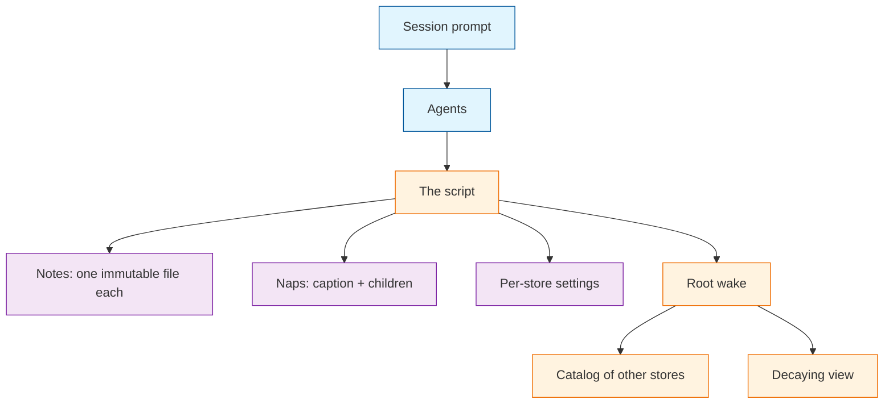

The diagram names the pieces this page will define, in this order: the prompt that loads the tool, the script agents run, the two kinds of store file, the per-store settings, and what a root wake prints.

## Store, driver, and activation

These are three different objects.

A **store** is the data: a directory of notes, naps, and settings under `.summem/`.

The **driver** is the script agents run. Creating a store creates the data directories and a default settings file. It does not place or overwrite the driver. This development repo keeps one script at the repository root and points each store’s script path at it.

**Activation** is a block of instructions at the top of committed `AGENTS.md`. The copyable file is [`docs/agents-prompt.md`](../agents-prompt.md). The `init` command prints the same text. Presence of the driver is not activation.

A command resolves one store by walking from the work path — `--path`, or the current directory — toward the git root and taking the first directory that already has a store. The git root gets a store on the first store command. Every other store is created with `start`.

The on-disk backend can change later only if agents still never touch store files.

## Why the store is files

Two writers who each learned a fact must be able to record it at the same time, on different machines, without a shared counter or a lock that spans clones. Two new files is a merge git already knows how to do. One append-only log with a next id is not: both writers pick the same next slot.

Git is also not a clock and not an archive of deleted sentences. Squash-merge keeps the files that exist at the branch tip. Anything a later zoom must still see has to be in one of those files.

So SumMem has no primary writer. It has files, and a listing of those files that gets shorter as facts age.

## Notes

A **note** is one immutable file: one line of text, with a length limit. There is no edit. A retraction is a new note. Rewriting a note is the one way to create a real content conflict; the script never does it.

The filename carries writer time in UTC and a random suffix. Filename sort is the order. Git-add date, squash commit time, and `git log` are the wrong clock.

A single note is written to a temp path and renamed into place.

## Naps

A **nap** is a summary of two neighbors in the listing. It is two files that share a name:

- The **caption** is one line, the same length limit as a note. Wake prints it.
- The **children file** is a dump of those two neighbors. Zoom and deep recall need it after squash.

The shared name starts with the left child’s time and random suffix so the nap sorts where that child sorted, not at “now.” The rest of the name is the leaf-set id and the grain, defined next.

Fold writes a new pair, then removes the children from the listing. Children leave the working tree only after the parent children file exists on disk.

## The view

The **view** is the current listing: every loose note, plus every nap. A nap still counts if only one of its two files is present. Sorted by filename.

Each of those is one **view node**. A complete nap is two physical files and still one view node.

A missing or conflict-marked caption still counts as a view node: grain and id prefix print, the caption does not. A missing or unreadable children file means that node will not split.

Each store has a committed **settings** file. Two settings matter here: the length limit, and the **wake budget** — how many lines a wake may print, and how many view nodes may exist before the script asks for a fold. Missing values use the script’s defaults. Settings are not environment variables and are not rewritten unless someone runs `start`.

## Grain

**Grain** is how many original notes a view node stands for. A loose note is grain 1. A nap that covers sixteen original notes is grain 16.

Grain is the only size fold cares about. It is not the number of physical files.

## Identity

A view node’s **content id** is a digest of the original notes it stands for, never of the caption.

1. Hash each original note’s file bytes.
2. Sort those hashes and concatenate them with no delimiter.
3. Hash that join. That value is the **leaf-set id**.

The script computes both hashes itself. It does not shell out, and it does not use git’s hasher: those would change the id when the machine or the repository hash changes.

The children file is a JSON document: a list of exactly two children. A child is either a note (its filename and its text) or a nap (its leaf-set id, its caption, and that nap’s own two children). Nesting stops at notes. Equal-grain fold builds a balanced binary tree, so 2048 original notes are eleven naps deep, not a chain of 2048 braces. Every original sentence still lives in that one file — the file gets fatter with grain, not deeper without bound. Unknown fields are ignored. A missing or unknown kind of child is an error; kind is not inferred from other keys. There is no version field.

That document is deterministic for one tree: same child order, nested captions, and grouping produce the same bytes. Two agents who nap the same two loose notes get the same children file and, if they word the caption differently, a different caption file. The same leaf-set id folded in a different grouping, or with different nested captions, is the same id and different children-file bytes.

Wake prints a unique prefix of the id, long enough to be unambiguous in that listing. Stored names keep the full id. Two notes with the same text share an id; they remain two view nodes. A command that looks like a positional range is rejected.

## Fold

When the view has more nodes than the wake budget, `note` and `nap` ask the agent to fold.

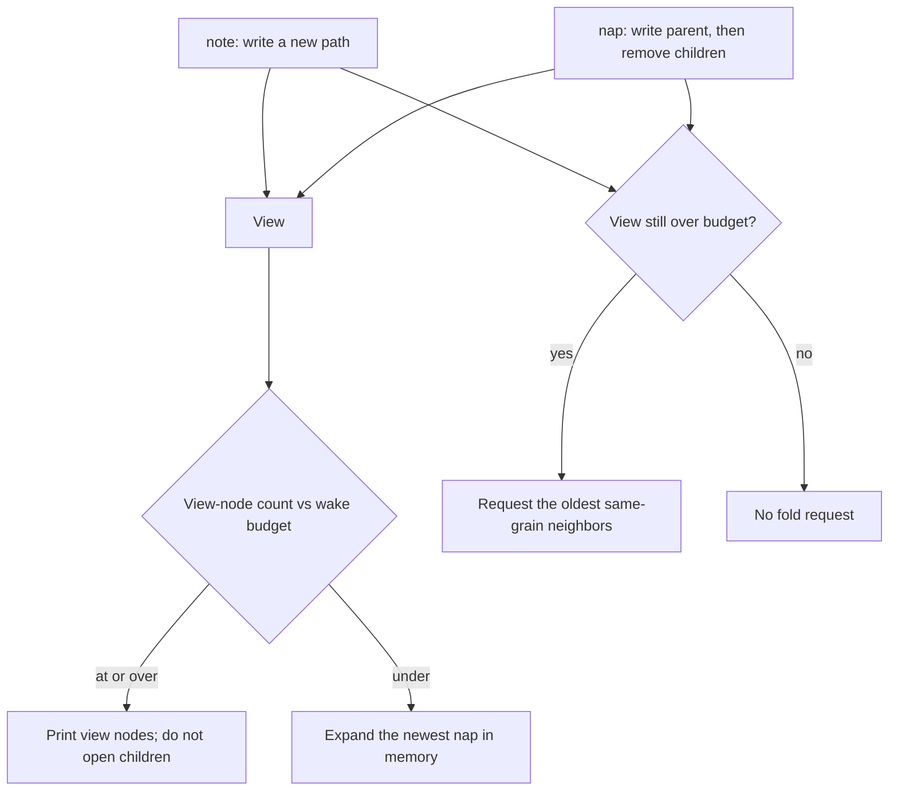

The pair is the oldest two **adjacent** view nodes with the **same grain**. Adjacent means neighbors in the sorted listing. Same grain means they stand for the same number of original notes.

That rule is load-bearing. A grain-16 nap sitting next to one leftover note is not a pair the script will request. Folding them would glue a sealed block to a singleton and invert the age order the filenames exist to preserve. The script waits for another grain-1 neighbor, or for expand to make a same-grain pair visible later.

One writer, eight notes `A`–`H`, oldest first. Imagine the wake budget is 1 so every same-grain pair gets requested. Each letter is one original note. A box `AB` is the nap of those notes.

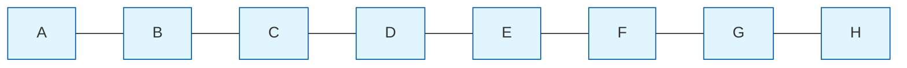

Oldest grain-1 neighbors fold, four times:

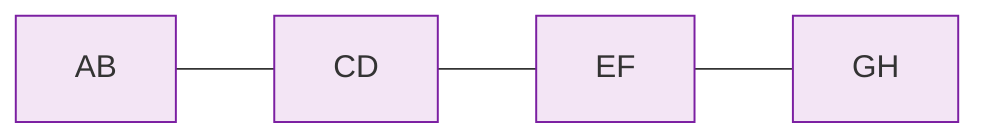

Oldest grain-2 neighbors fold, twice:

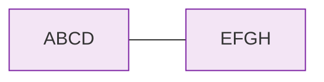

Then the last same-grain pair:

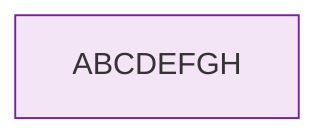

Eight notes become one view node. Zoom still opens `ABCDEFGH` into `ABCD` and `EFGH`, and so on, down to the letters. The originals never left the children files.

The agent supplies a caption. `nap` writes the new pair and removes the children. If the view is still over budget, the script asks for the next same-grain pair. Fold still removes the children; it does not keep them on disk “because wake will expand.”

`nap` of two nodes whose leaf sets overlap is rejected. Overlap is the zipper’s job.

## Expand

When the view has fewer nodes than the wake budget, wake may open a children file and replace the newest expandable nap with its two children, in memory, until it has enough lines or nothing left will split. It does not write those children back. The expanded ids are printable and zoomable.

`nap` still takes view-node ids — ids that exist as files — not ids that exist only in that in-memory expansion.

When the view meets or exceeds the budget, wake lists view nodes. It does not open children files to list, and it does not zipper.

Wake never refuses to print. A dirty caption degrades; it does not block the session.

## Zipper

Two branches can each nap overlapping sets of the same original notes. Git merge then lands two naps. The next `note` or `nap` on this machine that writes to the store heals that. That invocation may lock this machine’s naps directory. Wake does not wait on it. Git merge remains the control across clones.

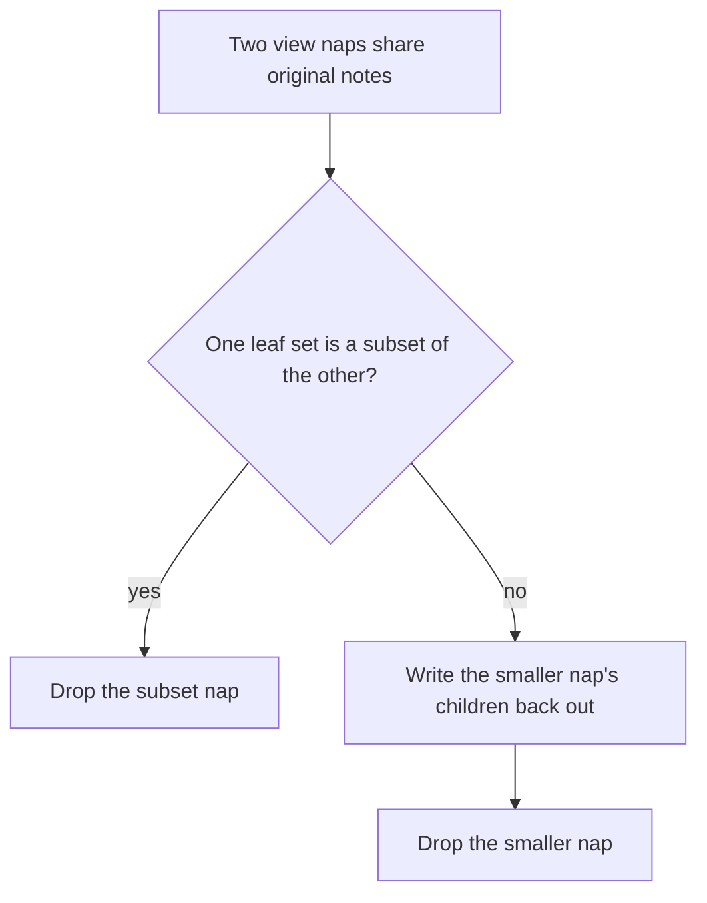

Two loose notes that happen to share text are skipped. Heal runs before `nap` resolves the ids the agent passed. If heal drops one of those ids, the command fails and does not fold; the original notes still live in the survivor. Later adjacent naps whose leaf sets do not overlap still fold as usual.

The same eight-note alphabet, two writers. Both start from the shared base `A B C D`. Writer 1 continues with letters `E F`. Writer 2 continues with numbers `1 2`.

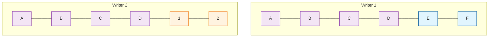

Each writer folds as in the one-writer picture, same-grain only. Both can build the shared `ABCD`. Writer 1 is then stuck with `ABCD` next to `EF` (grain 4 next to grain 2). Writer 2 is stuck with `ABCD` next to `12`. Same-grain fold will not glue those.

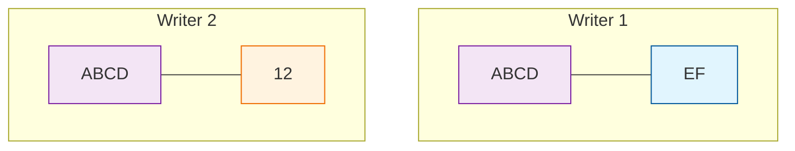

If writer 2 never folded `AB` with `CD`, merge is the union of the two views: the parts and the whole.

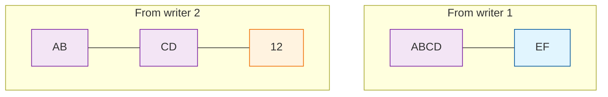

`AB` and `CD` are subsets of `ABCD`. The zipper drops the subsets. What remains does not overlap:

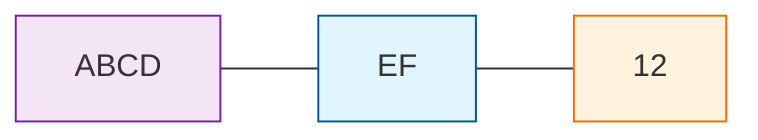

If each writer instead napped their leftover pair onto `ABCD`, merge lands two wholes. Neither contains the other: they share `A B C D` and each keeps its own continuation.

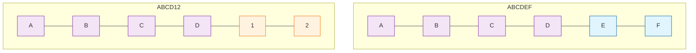

The zipper opens `ABCDEF` back into its two children, then drops `ABCDEF`:

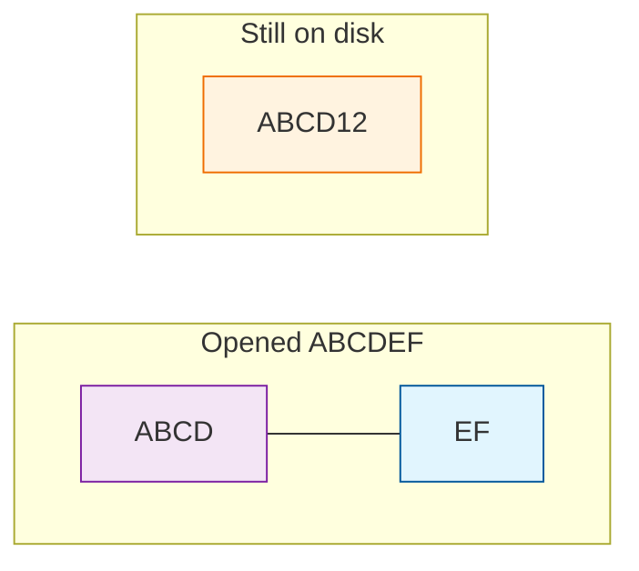

`ABCD` is now a subset of `ABCD12`, so it drops too. The shared letters live on inside `ABCD12`. Writer 1’s continuation is `EF`. Writer 2’s continuation is already inside `ABCD12`. No original note was deleted.

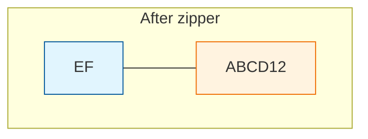

Rebuilding an age-aligned cover of the whole merged leaf list is not this algorithm. See [Notes](../notes.md).

## Zoom and recall

Zoom walks a children file in the current commit. Every sentence zoom still owes lives in a file at the tip, inside a children file if not still a loose note. An older commit is not an index.

Everyday recall is the view, with captions standing in for napped children. Recall that must see original sentences or nested nap captions reads children files as well.

Zoom and recall print one agent-safe line when they skip an unreadable sibling children file, and do not fail if another pack answered. Wake stays silent.

## Scopes

A command resolves **one** store. The work path may be a file: the walk starts at that file’s directory. The script does not parse workspace manifests. It does not create a store because someone recorded a note from a deep folder.

Root wake prints a labeled catalog of every other started store (paths only, not pull commands), then the root listing when that listing is non-empty, labeled `== Project-root Memories ==`. The catalog is a walk of the tree that honors git ignore. It is not a committed index. A wake aimed at a path prints only the nearest store.

A child store in context is advertised, not enforced. Do not load every started store in the root wake.

Outside a repository, store commands fail. `init`, `version`, and help still print.

## Invariants

These look optional and are not.

- **The script is the only writer.** Agents never create, edit, or delete store files.
- **Recording a note commutes.** Two notes are two paths. There is no next id and no shared index everyone updates.
- **Sequence is in the filename.** Writer time for notes; the left child’s time for naps. Not `git log`.
- **The children file is write-once and canonical.** The same tree dumps to the same bytes. Fold writes a new path; it does not patch. The same leaf-set id is not the same bytes when grouping or nested captions differ.
- **The caption is the only honest conflict.** Either wording, or a mashup, is a valid summary of those leaves.
- **Zoom is a property of the current commit.** Every owed sentence lives in a file at the tip.
- **Wake never blocks.** Missing or dirty captions degrade. Wake never refuses to print.
- **Empty packages stay empty.** The root auto-creates; every other store is `start`. Walking up does not create a store.
- **Root pushes; other stores pull.** Root wake catalogs. A pull is a wake aimed at a path.
- **Settings live in the store.** Not in the environment. Missing settings mean script defaults.
- **Wake prints undated lines, never ranges.** Fold and zoom take a unique prefix of a content id.
- **Personal and machine facts stay out.** This store is facts about this directory hierarchy.

Two branches whose naps do not overlap merge, then fold from the oldest neighbors. Overlapping merge is zipper, not that case.

## What this is not

This repository also keeps task working notes under `memory-bank/`. That is a different system: scoped to a task, archived when the task ends. SumMem is not that.

SumMem is also not:

- one growing log that every note appends to
- a lease, a primary agent, or a custom merge driver
- git history as the zoom tree
- harness hooks as the way memory loads — hooks may nag; the prompt and the root catalog are how memory enters context
- a package manifest as a scope

## Change surfaces

| If you are changing | Read |
|---|---|
| What an agent is allowed to know or type | The README command table and the activation block. Do not leak store paths into the agent interface. CLI output stays silent on git. The activation block treats the files the script wrote as part of your work, not a separate publish procedure. |
| How notes land under concurrency | Notes. Recording a note must still commute. |
| How summaries and originals survive squash | Naps. Fold. Zoom is a property of the current commit. |
| Merge behavior or a new file that every note updates | Zipper. Recording a note commutes. No shared mutable index. |
| Wake budget, decay shape, or “cannot wake” | The view. Grain. Fold. Expand. Wake never blocks. |
| Package vs repo vs machine-global | Scopes. Store, driver, and activation. |
| How a directory becomes a store | `start`. Empty packages stay empty. |
| Disk format or a new backend | The agent interface must not change. Store roles must still exist. See [Notes](../notes.md). |
