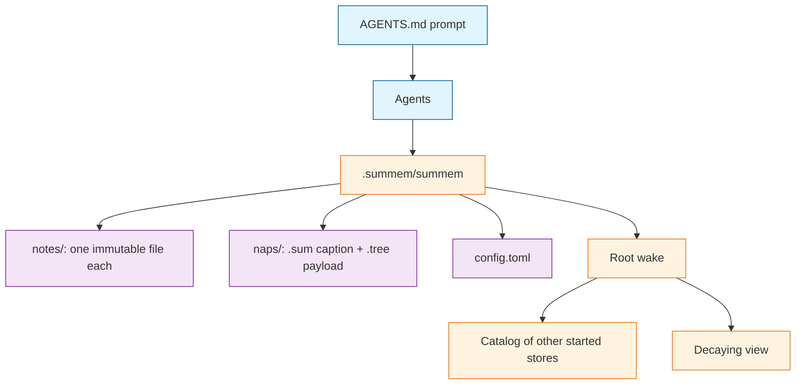
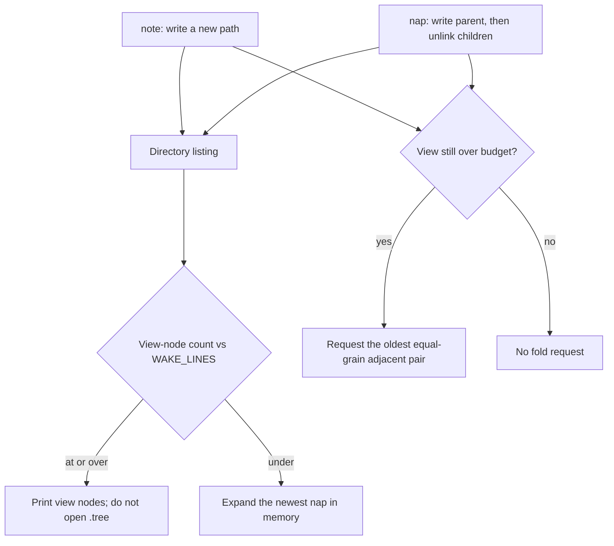
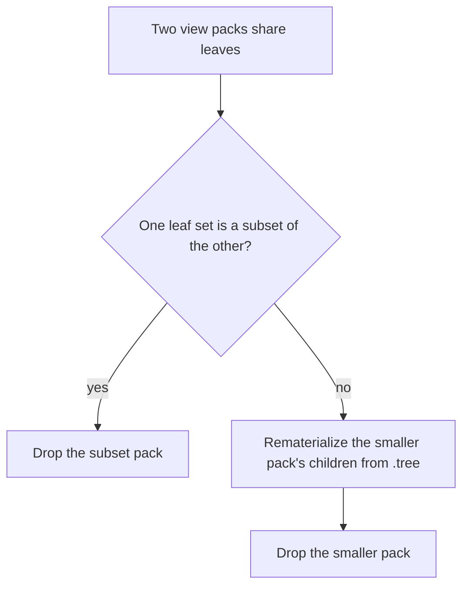

# Architecture

This is the systems atlas for SumMem: how the algorithm and the file store fit together, and which constraints you must not remove without understanding them. It is not a product how-to — that lives in the [README](../../README.md). It is not the short maintainer briefing — that lives in [`memory-bank/systemPatterns.md`](../../memory-bank/systemPatterns.md).

If you already know how to run the commands and need the design surface in your head before changing it, start here.



Agents never touch store files. They run the script. The script owns every path, name, timestamp, and hash. The on-disk backend can change later only if that boundary holds.

## Three objects

A **store** is a `.summem/` directory with `notes/`, `naps/`, and `config.toml`. A command resolves one store by walking from `--path` or `$PWD` toward the git root and taking the first started directory. The git root auto-creates on first `wake`, `note`, `nap`, `zoom`, or `recall`. Every other store is `start <dir>`.

The **driver** is the script agents invoke as `.summem/summem`. In this development repo the record is repo-root `summem`; store-local `.summem/summem` is a symlink to it. `ensure_store` creates store dirs and default config when missing. It does not place or overwrite the driver.

**Activation** is the SumMem block at the top of committed `AGENTS.md`. `init` prints that block. Presence of the driver is not activation.

Collapsing the first two — copying the script into the store on first use — is how a tree silently runs a stale driver.

## Why the store is files

The view matches [OptMem](https://github.com/VictorTaelin/OptMem): short notes, a merge tree of summaries, a bounded wake. The store does not. OptMem’s one append-only log and position-as-identity cannot survive squash-merge, uninterested conflict resolution, or many writers at once.

Identity was doing lock-like work there: one self, one `flock`, “subagents do not write.” One laptop may run three tasks; CI may run two jobs on a PR. Those writers do not share a process or a cross-clone lock. SumMem has no actor. It has a grow-only set of facts and a decaying view of that set.

Git’s job is to merge a directory of files. It is not a timestamp server and not a zoom index. Anything zoom must still see after squash must be in a file at `HEAD`.

## Store layout

```text
<started-dir>/.summem/
  config.toml
  notes/
    <stamp>-<rand>                 # one note, UTF-8 + one trailing newline
  naps/
    <stamp>-<rand>-<leafset>-<leaves>.sum    # one caption line, ≤ ENTRY_CHARS
    <stamp>-<rand>-<leafset>-<leaves>.tree   # canonical JSON of the children
```

- `stamp` is writer time in UTC (`YYYYMMDDTHHMMSSZ`) for a note, and the leftmost child’s `{stamp}-{rand}` for a nap. `ls | sort` is the order. Git-add date, squash commit time, and `git log` are the wrong clock.
- `rand` is 16 hex characters (8 random bytes).
- `leafset` is the 64-hex content id of the original notes.
- `leaves` is the original-note count wake prints as grain.

A nap stem is those four fields. The leaf-set id is a digest of original note bytes, never of captions. `dumps_tree` is deterministic for one `Tree` object: same child order, nested captions, and grouping produce the same bytes. Two agents who nap the same two loose notes get the same `.tree` and, if they word the caption differently, a different `.sum`. The same leaf set folded in a different grouping, or with different nested captions, is the same id and different `.tree` bytes.

`config.toml` is a commented template. The script reads it with stdlib `tomllib` and fills missing values from built-in defaults (`ENTRY_CHARS`, `WAKE_LINES`). It does not rewrite the file unless someone runs `start`. Settings are not environment variables.

## Identity

The content id is a digest of the **leaves**, never of the summary sentence.

1. For each original note, SHA-256 of the file bytes (UTF-8 text plus one trailing newline), lowercase hex.
2. Sort those hex digests as ASCII and concatenate them with no delimiter.
3. SHA-256 of that ASCII join → the leaf-set id.

Hashing is inside the script (`hashlib`). Do not call `sha256sum`, `openssl`, or `git hash-object`.

Canonical `.tree` bytes are UTF-8 JSON: `sort_keys=True`, `separators=(',', ':')`, `ensure_ascii=False`, exactly one trailing newline.

- Tree object: `c` (array). Unknown fields ignored. No version key.
- Note child: `type`=`note`, `name` (filename only), `text` (note text, no terminator).
- Nap child: `type`=`nap`, `id` (leaf-set hex), `sum` (caption), `tree` (nested tree object).
- Missing or unsupported `type` is an error. Do not infer kind from other keys.

Wake prints a unique prefix of that id, at least 8 hex characters, among distinct ids in the listing. Filenames and `.tree` identity stay 64 hex. Two notes with the same text share an id; adjacency must keep both. A command that looks like a positional range is rejected.

## Algorithm

Ingest is wait-free union. Integrate is cooperative fold. Wake is wait-free projection.



### Ingest

`note` writes one immutable file. Two writers write two paths. There is no next id and no shared index. A single note is temp file plus rename. There is no edit; a retraction is a new note. Rewriting a note is the one way to create a real content conflict; the script never does it.

### View

Wake’s on-disk sequence is the mixed listing: loose notes plus nap stems (a `.sum`, a `.tree`, or both), sorted by filename. A missing or conflict-marked `.sum` still counts as a view node: grain and prefix print, caption does not. A missing or malformed `.tree` means that node will not split.

### Fold

When **view-node** count exceeds `WAKE_LINES`, `note` and `nap` ask for the oldest adjacent pair with the same leaf count. A view node is one loose note or one nap stem (`.sum` and `.tree` together). Never 16+1. The agent supplies a caption. Fold writes a new pair for the union leaf set, then deletes the children from the view. Children leave the working tree only after the parent `.tree` exists on disk.

`WAKE_LINES` is how many lines wake prints. Catch-up after `nap` prints the next equal-grain pair if the view is still over budget. Fold requests still unlink; they do not keep children on disk “because wake will expand.”

`nap` of two overlapping packs is rejected. Overlap is the zipper’s job.

### Expand

When the view is short of the budget, wake opens `.tree` and splits the newest expandable nap in memory until it has enough lines, or until nothing left will split. It does not write those children back. Expanded ids are printable and zoomable. `nap` still takes view-node ids, not ids that exist only in that in-memory expansion.

When the view meets or exceeds the budget, wake lists view nodes. It does not open `.tree` to list, and it does not zipper.

### Zipper

Two long-lived branches may land overlapping packs as two files. The next mutating `note` or `nap` on this machine heals them. That invocation may `flock` the store’s `naps/` directory. Wake does not wait on it. Git merge remains the cross-clone control.



Note-note pairs are skipped. Heal runs before `nap` resolves the requested ids. If heal drops a requested overlapping id, the command exits 1 and does not concat; the leaves still live in the survivor. Later adjacent **disjoint** naps still concat. Aligned `cover(T)` after merge is not this algorithm; see [Notes](../notes.md).

### Zoom and recall

Zoom walks a `.tree` at `HEAD`. Every sentence zoom still owes lives in a file at the tip, inside a `.tree` if not still a loose note. `git show commit^` is not a zoom index.

Everyday recall is the view, with `.sum` standing in for napped children. Recall that must see original sentences reads `.tree` files as well.

## Scopes

A command resolves **one** store. `--path` may be a file: the walk starts at that file’s directory. Do not parse workspace manifests. Do not create a store because someone recorded a note from a deep folder.

Root wake prints a labeled catalog of every other started store (`== Additional SumMem Catalogs ==` and `./path` lines, not pull commands), then the root document under `== Project-root Memories ==` when that document is non-empty. The catalog is a walk of the tree that honors git ignore, including `.git/info/exclude`. It is not a committed index. `wake --path` prints only the nearest store.

Child memory in context is advertised, not enforced. Do not load every started store in the root wake.

Outside a repository, store commands fail. `init` and help still print.

## Invariants

These look optional and are not.

| Name | Statement | Defended by |
|---|---|---|
| Script is the only writer | Agents never create, edit, or delete store files. | Boundary of the CLI; no proof module (taste + review) |
| Ingest commutes | Two notes are two paths. No next id. No shared mutable index. | `tests/test_proof_ingest.py` |
| Sequence is in the filename | Writer UTC for notes; leftmost child’s `{stamp}-{rand}` for naps. Not `git log`. | Store layout; squash proof assumes it |
| `.tree` is write-once and canonical | The same `Tree` dumps to the same bytes. Fold writes a new path; it does not patch. Same leaf set is not the same bytes when grouping or nested captions differ. | `tests/test_proof_conflict.py`, `tests/test_proof_squash.py` |
| `.sum` is the only honest conflict | Either caption, or a mashup, is valid for those leaves. | `tests/test_proof_conflict.py` |
| Zoom is a property of `HEAD` | Every owed sentence lives in a file at the tip. | `tests/test_proof_squash.py` |
| Wake is wait-free | Missing or dirty captions degrade. Wake never refuses to print. | `tests/test_proof_conflict.py` |
| Empty packages stay empty | Root auto-creates; every other store is `start`. Walk-up does not create. | `tests/test_proof_scopes.py` |
| Root pushes; other stores pull | Root wake catalogs. A pull is `wake --path`. | `tests/test_proof_scopes.py` |
| Knobs live in the store | Not in the environment. Missing config means script defaults. | `config.toml` + `knobs()` |
| Wake prints undated lines, never ranges | `nap` / `zoom` take a unique prefix of a content id. | `tests/test_proof_reject.py` |
| Personal and machine facts stay out | This store is facts about this directory hierarchy. | Prompt; not a proof |

`tests/test_proof_branches.py` defends disjoint long-lived packs merging, then folding the two oldest neighbors. Overlapping merge is zipper, not that proof.

## Deliberate absences

- Not OptMem’s on-disk log, and not a growing `LOG.txt` “to save file count.”
- Not Niko’s `memory-bank/` (task-scoped working documentation).
- Not a lease, primary agent, vector clock, or custom merge driver.
- Not git history as the zoom tree.
- Not harness hooks as the load mechanism. Hooks may nag; the prompt and the root catalog are how memory enters context.
- Not a package manifest as a scope.

## Change surfaces

| If you are changing | Read |
|---|---|
| What an agent is allowed to know or type | README command table. `prompt_text` / `usage_text` in `summem`. Do not leak paths or git into the agent interface. |
| How notes land under concurrency | Ingest. Ingest must still commute. |
| How summaries and originals survive squash | Store layout. Fold. Zoom is a property of `HEAD`. |
| Merge behavior or a new file that every `note` updates | Zipper. Ingest commutes. No shared mutable index. |
| Wake budget, decay shape, or “cannot wake” | Expand. Fold. Wake is wait-free. Knobs live in the store. |
| Package vs repo vs machine-global | Scopes. Three objects. |
| How a directory becomes a store | `start`. Empty packages stay empty. |
| Disk format, sqlite, or a new backend | The agent interface must not change. Store roles must still exist. See [Notes](../notes.md). |
