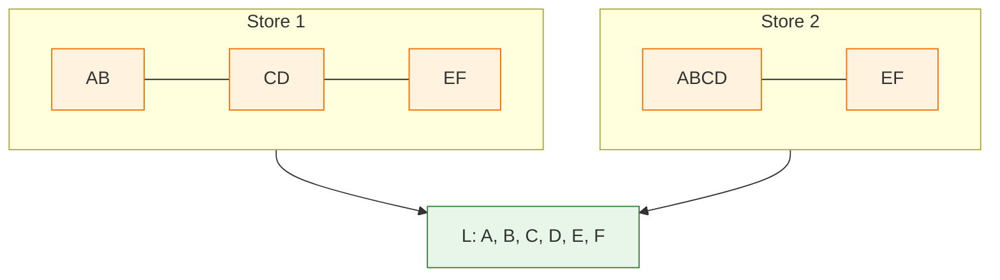
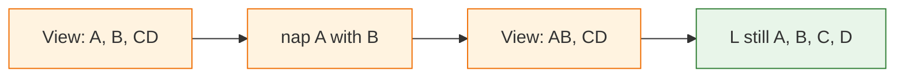
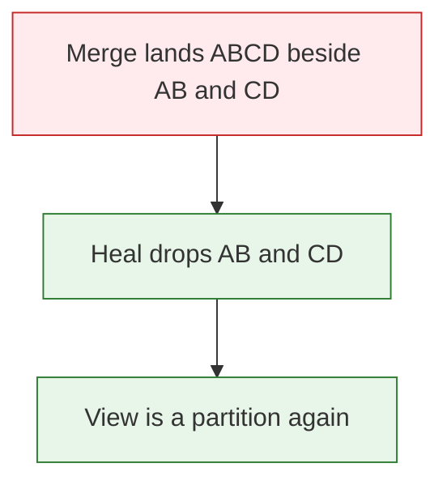

# Why SumMem Converges

This page explains why many agents can write to one memory, on different machines, with no lock between them, and still agree on the set of sentences the repository can produce.

The claim, once you have seen it: **the notes form a grow-only set, and that set converges. The files are a shrinking picture of that set. Compaction is invisible to the thing that converges.**

## Two writers, no lock

Two agents learn something at the same moment, in two clones, on two machines. Both must be able to record it. Neither can wait for the other.

The usual answer is a lock, or one writer everyone else defers to. SumMem has neither, and cannot have them. The clones may sit on different laptops, or on a CI runner. They meet only when someone merges a branch. A lock that spans those machines would mean waiting for a person to merge — for the other writer, next week, or never.

The second problem is size. A memory that only grows is unreadable by the thousandth fact. The store has to shrink its own listing while it grows its own contents.

Shrinking is where most designs fail. Two agents who each tidy up, alone, usually produce two tidyings that fight.

## A shoebox of receipts

Start here. No code yet.

Keep every receipt in a box. Never throw one away.

When the box gets crowded, staple a batch together and write one line on the front of the batch. You have not lost a receipt. Pull the staple and they all come back. The box reads shorter and holds the same money.

Now give two people their own box and let them staple their own batches. Tip both boxes into one.

You may find a receipt loose *and* inside somebody else's stapled bundle. Throw away the loose copy. You have lost nothing: the loose one and the stapled one are the same receipt.

You may find a small staple sitting next to a large one that already holds those same receipts plus more. Throw away the small staple. The large one still holds the money.

You may find two staples that overlap but neither sits inside the other. Pull the smaller staple, put its receipts back in the box, and throw the empty wrapper. Some of those receipts now sit loose next to the larger staple. They are already inside it, so they go too. The receipts that lived only in the smaller staple stay. The money is unchanged.

That is the whole design. Two people tidy at the same time, in different rooms, and never argue — because tidying does not change what the box is worth.

Those objects have names:

- A receipt is a **note**.
- A stapled bundle with a line on the front is a **nap**.
- Tipping the boxes together is a **git merge**.

## Notes, naps, and the view

### A note

**A note** is one immutable file holding one line of text. There is no edit and no delete. A retraction is a new note. The filename carries the moment it was written, in UTC, plus random characters so two writers never pick the same name.

### A nap

**A nap** is two files that share a name:

- the caption (`.summ`), one line, which is what `wake` prints;
- the children file (`.tree`), which holds the full text of every note underneath it.

The word *summary* misleads here. The caption summarises. The nap does not. A nap carries every original sentence inside it, spelled out.

### The view and grain

**The view** is the current listing: every loose note, plus every nap, sorted by filename. **Grain** is how many original notes a listed item stands for. A loose note is grain 1. A nap of sixteen original notes is grain 16.

## Names that come from contents

Give every note a name that depends only on its contents: the [SHA-256](https://en.wikipedia.org/wiki/SHA-2) of its bytes. Two files with the same bytes get the same name. This is [content addressing](https://en.wikipedia.org/wiki/Content-addressable_storage). It lets us talk about *which* notes a bundle holds without caring where the bundle came from.

Each item in the view stands for some collection of notes. A loose note stands for one. A bundle stands for all the notes inside it. Call that collection `leaves(v)`.

The question this page answers:

> When two clones merge, do they remember the same things?

To answer it we need a single object that is "what the store remembers."

## What the store means

A [set](https://en.wikipedia.org/wiki/Set_(mathematics)) is a collection with no order and no repeats.

Let `S` be a store: the finite collection of items currently in its view. Define

    L(S)  =  the union of leaves(v), for every v in S

`L(S)` is the set of notes the store can still produce. Call it **what the store means**.

`L` throws away grouping and wording. It does not care how the notes are bundled. It does not care what the captions say.

Look at two stores that hold the same six notes and grouped them differently:



The files differ. The meaning does not. Convergence is a claim about `L`, not about files.

## What each operation does to meaning

Run each thing SumMem does and watch `L`.

| Operation | What happens to the files | What happens to `L(S)` |
|---|---|---|
| `note` | one file appears | gains one note |
| `nap(a, b)` | `a` and `b` are deleted, a bundle holding both appears | **nothing** |
| heal, drop a covered item | one item is deleted | **nothing** |
| heal, unbundle then drop | one item becomes its children | **nothing** |
| git merge | the two file sets are unioned | `L(S₁) ∪ L(S₂)` |

The middle rows are the load-bearing ones. **Folding does not change what the store means.** Neither does healing. They move notes between groupings. They never add a fact and never lose one.



This is why `nap` deletes files without danger. It is not deleting notes. It is re-describing the same notes more compactly, and the notes are still spelled out inside the bundle it just wrote. SumMem writes the bundle before it unlinks either child so no moment exists where a sentence lives nowhere.

Across the whole system there is exactly one operation that changes `L`, and it only ever adds: `note`.

## The homomorphism

A [monotone](https://en.wikipedia.org/wiki/Monotonic_function) function never goes down. `L` is monotone: no operation shrinks it.

A structure where any two elements have a well-defined least upper bound is a [join-semilattice](https://en.wikipedia.org/wiki/Semilattice). Sets under union are the standard example: the join of two sets is their union.

The store's files form one such structure, joined by git's union of paths. The sets of notes form another, joined by union. And `L` carries one to the other:

    L(S₁ ∪ S₂)  =  L(S₁) ∪ L(S₂)

A map that turns the join on one side into the join on the other is a [semilattice homomorphism](https://en.wikipedia.org/wiki/Homomorphism). That single line is the whole convergence argument. Everything above was naming the pieces it uses.

Union has three properties that make the rest follow:

- It is [idempotent](https://en.wikipedia.org/wiki/Idempotence): merging twice is merging once.
- It is [commutative](https://en.wikipedia.org/wiki/Commutative_property): order does not matter.
- It is [associative](https://en.wikipedia.org/wiki/Associative_property): grouping does not matter.

Every clone that has seen the same notes agrees on `L`, no matter what order the merges happened in and no matter who folded what along the way.

That property is [strong eventual consistency](https://en.wikipedia.org/wiki/Eventual_consistency#Strong_eventual_consistency). A structure with it is a [conflict-free replicated data type](https://en.wikipedia.org/wiki/Conflict-free_replicated_data_type), or CRDT.

**So: the notes form a grow-only set, and that set is a CRDT. The files are not. Compaction is invisible to the thing that converges.**

For anyone comparing this to the CRDT literature:

- The notes are a [G-Set](https://en.wikipedia.org/wiki/Conflict-free_replicated_data_type#G-Set_(Grow-only_Set)) — grow-only, no removes.
- Fold and heal are **compaction**, the standard state-based-CRDT move of shrinking a representation without touching the value it denotes. Compaction is not part of the join, and it is not required for correctness. It is allowed here for one reason only: it preserves `L`.

## The view is a partition

`L` tells us the store converges. It says nothing about what `wake` prints. That needs a second idea.

A [partition](https://en.wikipedia.org/wiki/Partition_of_a_set) of a set is a way of cutting it into pieces that do not overlap and that together cover everything.

After healing, the view is a partition of `L(S)`. Each listed item is one block. Its grain is the block's size. Its caption is a label on the block.

SumMem's "healing" is what forces this. It loops until no two items share a note:

- if one block sits entirely inside another, drop the smaller;
- otherwise open the smaller block into its children and drop it.

Both moves preserve `L`, which is why heal is safe to run at any time, in any order, on any clone. `nap` heals before it folds. `note` heals after it writes. `wake` never does — reading must not block on repair.

Git merge is the only thing that breaks the partition. It can land a bundle beside the very notes that bundle contains. Heal puts it right.



Fold is: merge two adjacent blocks of equal size. Expand is: split a block, for display only, writing nothing back.

## A nap's filename

A nap's two files share one stem. Here is one:

```
20260829T161934Z-c4a81e07b39d52f6-7e2b0c91a4d8351f-2-b8f16d03e5a9274c
```

The same stem with `.summ` is the caption; with `.tree`, the children. The fields, in order:

1. `20260829T161934Z` — the UTC time from the leftmost child
2. `c4a81e07b39d52f6` — that child's random suffix
3. `7e2b0c91a4d8351f` — the leaf-set id, a hash of the notes inside
4. `2` — grain, how many notes
5. `b8f16d03e5a9274c` — the variant tag, a hash of the children-file bytes and the caption bytes

The first four fields are fixed by which notes went in, and which of them sorts first. Only the last field moves when two agents write different captions for the same pair.

## A max-register for captions

Imagine: two agents fold the same two notes and each writes a different caption.

Same notes means the same leaf-set field, the same leftmost child, the same grain. Only the variant tag differs. Two filenames. Git unions them. Both appear in the view, briefly, as two rows with one id.

Heal settles it. The view is sorted by filename, and when two items cover the same notes, the earlier name loses. Since the names differ only in that trailing hash, the surviving caption is the one whose variant tag sorts highest.

That is a **max-register**: one value per key, chosen by taking the largest under a fixed [total order](https://en.wikipedia.org/wiki/Total_order). Maximum is idempotent, commutative and associative, so it is a real CRDT join, and every clone picks the same caption without asking anyone.

It resolves by content, not by clock. There is no last-write-wins here and there could not be — the clones have no shared clock, and the file timestamps a merge produces describe the merge, not the writing.

## What does not converge

Facts converge. Structure does not.

Two clones that have seen the same notes always agree on `L`. They need not agree on the partition. One may hold `ABCD` beside `EF` where the other holds `AB`, `CD` and `EF`. Both are correct: same notes, different cuts.

[Architecture](architecture/index.md) says this and rules the "repair" out of scope.

Leaving it open is a judgement, not an oversight. Rebuilding one canonical grouping after every merge would mean rewriting bundles that are already correct, and it would still not settle the captions — two agents wrote two English sentences about the same pair of notes, and no rule picks the better one. SumMem picks one by a fixed rule and keeps every original sentence reachable underneath it. The cut is cosmetic; the contents are not.

State it plainly: **strong eventual consistency on what is remembered, and none on how it is grouped or worded.**

## Duplicate receipts

The shoebox already said this. A receipt loose and inside a bundle is one receipt: throw the loose copy away. Two loose copies of one sentence are one receipt: keep the later filename.

An agent that notes a sentence the store already holds still hears `Saved.` The fact is in `L`. The new file is gone. That is the design. `L` is a set. Noting a duplicate does not grow it.

Folding the two copies is refused. A bundle must not claim grain 2 for one receipt.

A hash of a list would count the same sentence twice. Overlap walks a set. Heal and that refuse make a duplicate list a path the view does not offer.

**The store converges over the set of remembered notes.** Multiplicity is not a fact.
