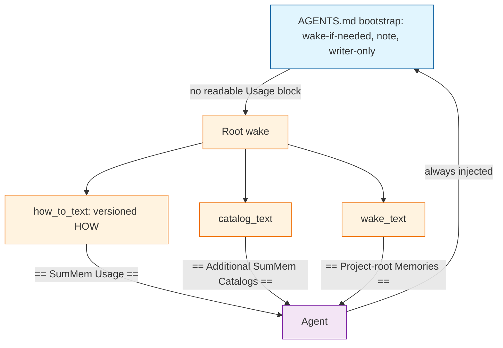
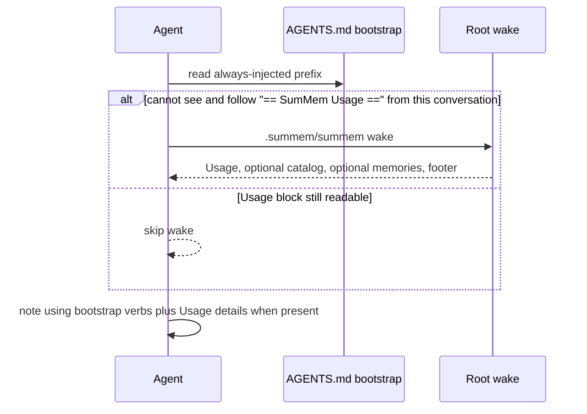

# Architecture Decision: Agent-Document Split

## Requirements & Constraints

**Functional**

- A small committed `AGENTS.md` bootstrap that does not change when the script's usage details change.
- Repository-root `wake` prints the versioned how-to: note, nap, zoom/recall grammar, catalog pull.
- A consumer that already has the bootstrap upgrades by copying the script, not by editing `AGENTS.md`.
- An agent that cannot see this conversation's root-wake usage block runs root `wake`.
- A pull (`wake --path`) does not reprint the how-to or the catalog.

**Quality attributes (ranked)**

1. Maintainability — stop the two-artifact upgrade tax; versioned HOW lives next to the script that implements it.
2. Fitness — agents still wake once, note clone-portable facts, nap when asked, and use the current id grammar.
3. Risk — a wrong split must not drop the note duty or teach a cheap agent to execute wake as a script.
4. Simplicity — no new files, hooks, or upgrade command.

**Technical constraints**

- Activation is the committed `AGENTS.md` block. Presence of the driver is not.
- `init` does not write `AGENTS.md`.
- Wake is a document. Catalog lines stay labeled paths. How-to must not read as a script to run now.
- `usage_text()` is the operator `-h` catalog (`CLI_NAME`). It is not the agent how-to (`AGENT_BIN`). Do not reuse that name.
- Prompt template stays 0BSD. Program stays AGPL. `surgery.py` is out of scope.
- Store, fold, and ingest do not change.

**Boundaries**

- In scope: which sentences live in the bootstrap, which sentences root `wake` prints, the skip/re-wake predicate, how the how-to section is headed and ordered.
- Out of scope: `summem upgrade`, harness hooks, rewriting consumer repos in this task, changing zoom/recall/note behavior.

## Components

- **Bootstrap** — stranger-clone activation. Always-on verbs that must survive compaction. Inserted via `docs/agents-prompt.md`; `prompt_text()` is this text.
- **How-to** — versioned manual, printed only on root `wake`, headed `== SumMem Usage ==`. Lives in the script as `how_to_text()`.
- **Memory document** — catalog, view, footer. Unchanged roles. Pulls still print only the child view plus footer.

Session skip is a sequence, not a second structure:

## Options Evaluated

- **Pointer-only**: Bootstrap is “this repo uses SumMem; run root wake.” All HOW, including note and writer-only, lives on wake. Skip keys off the Usage block.
- **Stable verbs**: Bootstrap keeps wake-if-needed, note, and writer-only. Wake prints membership detail, nap protocol, id grammar, and catalog pull. Skip keys off the Usage block.
- **Dual-publish**: Keep today’s full prompt in `AGENTS.md` and also dump it on wake. Eliminated: `AGENTS.md` still moves when grammar changes, so the upgrade tax remains.

`systemPatterns.md` today says session start wakes because of the `AGENTS.md` block, and the pull recipe belongs in `AGENTS.md` because catalog lines that look like commands get executed. Pointer-only and Stable verbs both keep activation in `AGENTS.md`. Both move the pull recipe onto the wake document (labeled, not a command list). Dual-publish matches the old “recipe in AGENTS.md” lesson and fails the brief.

## Analysis

| Criterion | Pointer-only | Stable verbs | Dual-publish |
|-----------|--------------|--------------|--------------|
| Fitness | Upgrade tax gone. Note duty exists only after a successful wake. | Upgrade tax gone for the sentences that actually churn. Note and writer-only stay on even if wake is skipped wrongly. | Fails requirement 1: the committed prefix still tracks grammar. |
| Simplicity | Thinnest bootstrap. One HOW home. | Two HOW homes (verbs vs details). Still two functions, no new files. | Two copies of the same prompt. |
| Maintainability | Best for operators: prefix never changes. | Almost as good: prefix changes only if wake/note/writer-only change, which has been rarer than id grammar. | Worst: every prompt edit is still `AGENTS.md` surgery. |
| Risk | High: always-injected file has almost no duty; a bad skip drops noting. | Medium: always-injected verbs survive compaction. Grammar can be stale until re-wake. | Low operational risk, zero tax relief. |
| Reversibility | Put sentences back in `prompt_text()`. | Same. | Already the status quo. |

Key insights:

- The churn that forced consumer `AGENTS.md` edits was id grammar, nap-after-note wording, and membership phrasing — not “run wake,” “note a fact,” or “the script is the only writer.”
- OptMem keeps stable HOW in an always-applied rule and dumps WHAT on wake. SumMem’s always-applied rule is the repo `AGENTS.md`. Pointer-only throws that away. Stable verbs keep it.
- `You are up to speed.` is a footer, not a skip key. Keying skip off “a prior root wake” is how compaction can keep a stub and drop the manual.
- Existing consumers still have the fat prefix until they do **one** shrink to the new bootstrap. After that, script copies leave `AGENTS.md` alone. The brief’s acceptance line assumes they already have the bootstrap, not the old prompt.

## Decision

### Choice Pre-Mortem

- Always-injected note duty does not matter and pointer-only would have been enough: checked — Risk is ranked; OptMem’s always-on HOW is the parallel; cutting verbs later is easy if the operator wants thinner.
- Some harnesses inject `AGENTS.md` only at session start, so “always-on” is overstated: checked — the product already treats `AGENTS.md` as activation, not a per-turn Cursor rule. Both remaining options share that. Stable verbs still win because the first file the agent reads still carries the duties.
- Skip keys off a header that compaction keeps while dropping the body, so the agent skips and has no how-to: checked — the predicate is “see **and follow** `== SumMem Usage ==`,” not “a wake happened.” False re-wake is acceptable; wake never refuses. False skip is the failure mode the predicate is written to avoid.

**Selected**: Stable verbs
**Rationale**: Maintainability is met for the sentences that move; Fitness and Risk stay intact because note and writer-only remain in the always-injected bootstrap. Pointer-only wins a purity contest and loses the reason HOW was in `AGENTS.md` at all. Dual-publish does not solve the stated problem.
**Tradeoff**: The bootstrap is not zero HOW. A future change to when-to-note or writer-only still edits `AGENTS.md`. That has been rarer than grammar. Accepted.

## Implementation Notes

- `prompt_text()` is the bootstrap only. `docs/agents-prompt.md` and this repo’s `AGENTS.md` prefix stay lockstep with it. `init_text()` still wraps that file and writes nothing.
- Bootstrap contents:
  - H1 `# Project Memory` and one sentence that this repository’s shared memory is SumMem, invoked as `{AGENT_BIN}`.
  - Session start: if this conversation does not contain a root-wake `== SumMem Usage ==` block the agent can still see and follow, run `{AGENT_BIN} wake` from the repository root. Do not skip because of a remembered wake or the footer alone.
  - While working: `{AGENT_BIN} note "…"` for a fact another contributor would still need. Personal, machine-local, and preference facts stay out. Follow further instructions that wake or `note` printed.
  - The script is the only writer. Do not invent filenames, rewrite note bytes, or delete memory files by hand. The files it writes are part of your work; do not leave them untracked.
- `how_to_text()` is the versioned how-to. Do not name it `usage_text`. Contents:
  - Membership detail and nap protocol (already stored; do not retry the same note).
  - Zoom and recall grammar (dated leaf vs pack prefix; leaf is not a zoom target).
  - Catalog pull: listed `./path` lines are not commands; when you work under a cataloged path, `{AGENT_BIN} wake --path <path>` if that store’s wake is not already in this conversation. Ignore `--path` when the root wake had no catalog.
- Root `wake` document order:
  1. `== SumMem Usage ==` plus `how_to_text()`
  2. `== Additional SumMem Catalogs ==` plus paths, when other stores exist
  3. `== Project-root Memories ==` plus `wake_text()`, when the root view is non-empty
  4. `You are up to speed.`
- Pull wakes: no Usage section, no catalog, no Project-root header.
- How-to is a labeled document. Do not print a bare command runbook that a cheap agent will execute as the next actions.
- One-time consumer migration: replace the old fat prefix with the new bootstrap once. README / `init` recipe say that. Subsequent script copies do not touch `AGENTS.md`.
- Invariants that pin membership, nap-ack, or id grammar move from `prompt_text()` tests onto `how_to_text()`. Wake/root/conversation invariants stay on `prompt_text()`.
