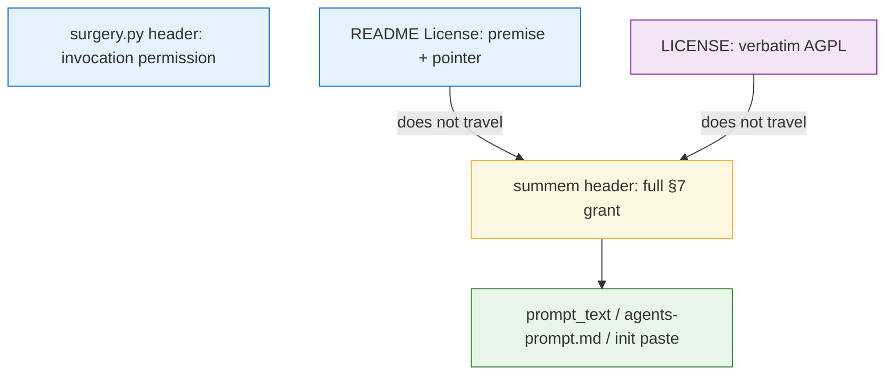

# Architecture Decision: Authority and Echoes

## Requirements & Constraints

**Functional**:
- A reader who has only `summem` can see AGPL on the program, the prompt carve-out, and the full invocation permission.
- Repo-root files, if any, do not outrank or contradict the script.
- `docs/agents-prompt.md` / `init` paste stays obligation-free (no license notice in the pasted text).
- GitHub / SCA still identify the project as AGPL.
- `surgery.py` is a separate emergency program; typical installs do not copy it.

**Quality attributes** (ranked):
1. Completeness of a script-only install
2. Scanner and GitHub still say AGPL
3. Discoverability for a human opening the GitHub repo
4. Simplicity (no new license machinery)
5. One place to edit the grant (echoes stay short)

**Technical constraints**:
- Q1: AGPL §7 terms belong in the relevant source files. Pointer-only to a file that does not travel is not enough.
- SPDX on the program stays AGPL. No `WITH` exception.
- Operator: *if* REUSE, drop `LICENSE` for a `COPYING` that explains the premise. REUSE is not required.
- A preamble on `LICENSE` can break GitHub’s license detector. `LICENSE` today is verbatim AGPL.
- `summem version` currently prints `__version__` plus a newline (`tests/test_version.py`). Changing that is new executable behavior the brief does not ask for.

**Out of scope**: Dual-license, CLA/DCO, registering an SPDX exception, putting grant text inside the emitted prompt.

## Components

The only component that reaches a typical consumer repo is `summem`. Everything else is a repo echo or the AGPL stock text.

## Options Evaluated

- **Script-complete, no REUSE**: Full §7 text in the `summem` header. `LICENSE` stays verbatim AGPL. README states the premise and points at the script. `surgery.py` echoes the invocation permission. No `COPYING`, no `LICENSING.md`, no REUSE.
- **COPYING replaces LICENSE, no REUSE**: Drop `LICENSE`. A `COPYING` file restates the premise and includes or points at AGPL. Script still has the full grant.
- **Full REUSE**: SPDX headers, `LICENSES/`, snippet tags on the prompt, drop `LICENSE` for `COPYING` as the operator allowed if REUSE is chosen.

## Analysis

| Criterion | Script-complete, no REUSE | COPYING replaces LICENSE | Full REUSE |
|-----------|---------------------------|--------------------------|------------|
| Script-only completeness | Yes — grant is in `summem` | Yes, if the script still has the full text | Yes, if the script still has the full text |
| GitHub / SCA say AGPL | Yes — current `LICENSE` untouched | Usually (`COPYING` is a known name) | Yes if identifiers stay `AGPL-3.0-or-later` |
| Repo discoverability | README premise; LICENSE-only readers see stock AGPL | Stronger premise at repo root | Strong, at the cost of many files |
| Simplicity | Highest | Rename plus a second copy of the premise | Lowest — new tool, snippet ignore rules, CI lint |
| Drift | README is a short pointer | `COPYING` and header can drift | Snippets, `LICENSES/`, `COPYING`, header |
| Fits “if REUSE then COPYING” | Does not take the REUSE branch | Takes COPYING without the reason for it | Takes that branch |

Key insights:
- REUSE solves mixed-license bookkeeping. Q1 refused a second license on the program. There is nothing for REUSE to catalog except comments.
- `COPYING` plus `LICENSE` together confuse GitHub’s detector. The operator tied `COPYING` to the REUSE branch, not to the default.
- Putting a premise preamble *into* `LICENSE` risks `NOASSERTION` from license detectors. Leave `LICENSE` verbatim.
- The paste files must not carry the grant. A license header on `docs/agents-prompt.md` would be pasted into `AGENTS.md` and recreate the obligation we are removing.
- Printing the notice from `summem version` is counsel-convenience, not authority. The header already travels. Leave `version` alone.

## Decision

### Choice Pre-Mortem

- Counsel opens only `LICENSE`, never the script, and concludes there is no carve-out: **checked** — README states the premise and points at the header; `LICENSE` is intentionally stock AGPL so detection stays clean. Same shape as any GPL project that puts §7 terms in source.
- A scanner later wants snippet-level SPDX on the prompt string and flags it as AGPL: **checked** — the string lives in an AGPL file; §7 says that part may be used separately. We do not have a requirement for snippet SPDX. Accept.
- `surgery.py` is copied alone and someone thinks the invocation permission is missing: **checked** — echo the invocation permission on `surgery.py`. Typical install is still `summem`.

**Selected**: Script-complete, no REUSE
**Rationale**: Rank 1 is a script-only install; only a complete header satisfies it. Rank 2 is keeping `LICENSE` verbatim. Rank 4 rejects REUSE when we are not mixing licenses. Rank 3 is a short README echo, not a second legal file.
**Tradeoff**: No repo-root `COPYING` essay. Visitors who never open `summem` or the README License section will see stock AGPL only.

## Implementation Notes

- **`summem`**: After the existing AGPL short notice, add the two §7 permissions from `creative-legal-instruments.md`. That block is the authority.
- **Do not** put grant text, SPDX tags, or license notices inside `prompt_text()` / `init` output / `docs/agents-prompt.md`.
- **`LICENSE`**: Do not edit. Verbatim AGPL.
- **`README.md` License section**: A few sentences: program is AGPL (`LICENSE`); additional permissions for the prompt and for agent invocation live in the comment block at the top of `summem` and are the authoritative statement; typical install copies that file.
- **`surgery.py`**: Keep the AGPL short notice; add the invocation permission only (this file does not emit the prompt).
- **Do not add** `COPYING`, `LICENSING.md`, `REUSE.toml`, or `LICENSES/`.
- **`summem version`**: No change.
- **Tests**: No change-detectors on header or README wording. Existing `version` and `init` lockstep tests stay as they are.
- **`memory-bank/techContext.md`**: After build, keep “License: GNU AGPL v3, in `LICENSE`” and note that additional permissions are in the `summem` header (surgical update when the files exist).
