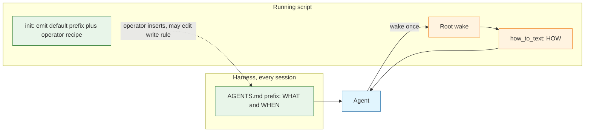
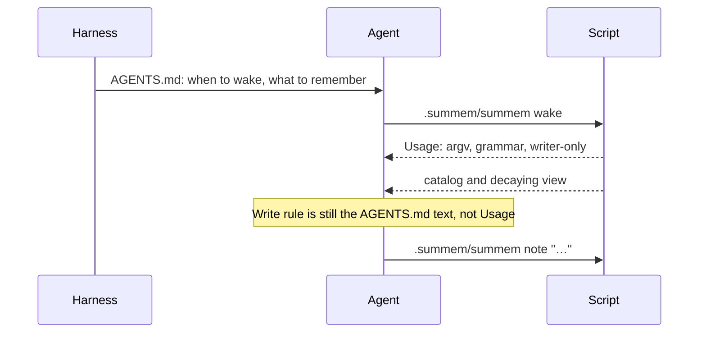

# Architecture Decision: Entry Gate Split

The write rule — what a repository chooses to remember, and when an agent should record it — is a per-repo policy. The command recipes — argv, id grammar, writer-only, fold follow-ups — are a property of the script version. Those two concerns currently share both prompt surfaces, so a consumer cannot change the first without being overridden by the second, and cannot upgrade the second without a stale copy of it sitting in `AGENTS.md`.

This is the same three-part test [the persistence essay](https://blog.cani.ne.jp/2026/08/03/disintegration-of-persistence-of-memory-md.md) uses on a memory class: a write rule, a read trigger, a retention policy. SumMem already has a read trigger (root wake, hard-capped) and a retention policy (naps). The write rule is the rung that got trapped inside the script when Usage absorbed membership to stop command-syntax drift.

## Requirements and Constraints

### Functional requirements

- A consuming repository can choose its write rule (work log, PR-review only, the shipped default, something else) without forking the script.
- Mechanical how-to stays versioned with the script. Copying a new `summem` updates how to invoke `note` / `nap` / `recall` / `zoom` / catalog pull without requiring an `AGENTS.md` edit.
- The two surfaces do not restate each other. Restatement is how they drift, and how the script's default write rule stamps over a consumer's edit every session.
- Session start still wakes. The harness loads `AGENTS.md` before any wake has printed; activation cannot wait for Usage.
- `init` still writes nothing. It prints a default block the operator inserts. After insert, that block is that repository's write rule until someone edits it.

### Ranked quality attributes

1. **Policy sovereignty.** A repo's write rule is whatever it committed. The script must not reassert a different one.
2. **Mechanical non-drift.** Argv, grammar, and writer-only come from the running script, not from a committed paragraph that can lag it.
3. **Activation reliability.** Root wake still happens at session start, skip-if-already-woke still lives where the decision is made (before wake).
4. **Simplicity.** No new store file, no overlay, no `summem upgrade`. Two existing functions, a cleaner cut.
5. **Prompt density.** Default write-rule copy stays short. The bootstrap may grow on the policy axis; it must not grow on the mechanical axis.

### Technical constraints

- Activation is the committed `AGENTS.md` prefix. `prompt_text()` is what `init` prints. This repo lockstep-tests that prefix against `prompt_text()` as dogfood of the shipped default, not as a consumer contract.
- Root wake prepends `how_to_text()` under `== SumMem Usage ==`. Pulls omit it. Post-reflect from wake-usage-prompt: do not name Usage or footer flags in the bootstrap.
- `init` writes nothing. Recipe must not say "paste."
- The script never interprets note text against a write rule. Enforcement is prompt-only today and stays prompt-only.
- Product intent in `productContext.md` and the architecture invariant "Personal and machine facts stay out" describe the shipped default and what this product is for. They are not a parser. A consumer who deletes that sentence from their `AGENTS.md` can put those facts in the store; the script will accept the line.
- Prompt template remains 0BSD. Writer-only and command recipes stay in the versioned how-to, which is still program output.

### Scope

In: `prompt_text()`, `how_to_text()`, `init_text()` operator wrapper, the meaning of this repo's `AGENTS.md` lockstep, and the test pins in `tests/test_init.py`.

Out: store format, CLI verbs, nap algorithm, changing what *this* repository remembers (the shipped default stays the current membership probe, genre list, denylist, and personal/machine stay-out), OptMem, Niko `memory-bank/`.

## Components

The harness always loads the prefix. That is the write rule's read trigger for *when to write*: it is present before the agent has run any command. Root wake then pushes mechanics for the running script version. `init` is an operator action, once per onboarding. It does not stay in the agent's context.

Single responsibilities:

| Surface | Owns | Must not own |
|---|---|---|
| `prompt_text()` / committed prefix | Write rule (what). When to wake. When to consider recording. Skip-if-already-woke. | Argv besides root `wake`. Id grammar. Writer-only. Nap/retry. Catalog `--path`. Genre restated as Usage. |
| `how_to_text()` / root wake Usage | How to invoke `note` / `nap` / `recall` / `zoom`. Pack/leaf grammar. Writer-only. Fold follow-ups. Catalog pull recipe. | Membership probe. Genre list. Denylist. Personal/machine stay-out. Skip-if-nothing-qualifies. "Follow AGENTS.md." |
| `init_text()` wrapper | Operator recipe: this block is a starting template; edit the write rule to change what this repo remembers; do not copy command syntax into the prefix. | Agent-facing policy. Putting "you may edit this" in `prompt_text()` would invite agents to rewrite the prefix. |

The allowed seam between WHEN and HOW is the **verb name** `note`, not a command line. The prefix may say to record a qualifying fact with SumMem's `note`. Usage supplies `{AGENT_BIN} note "…"`. Naming the verb is an interface. Teaching argv is a recipe.

The other allowed seam is the **wake handoff**: `{AGENT_BIN} wake` plus skip-if-prior-project-root-wake. That decision is made before Usage exists. It is the one mechanical line the prefix may contain. It is not a license to teach `note` argv, `zoom`, or `--path`.

## Options Evaluated

- **Disjoint split**: Write rule and when-to-record live only in the init-emitted prefix. Mechanics live only in Usage. No restatement.
- **Store overlay**: Usage stays mechanical. `start` / `ensure_store` writes a default write-rule file the script prints on wake. Consumers edit that file.
- **Policy in Usage only**: Deepen wake-usage-prompt. `AGENTS.md` is wake-if-needed plus writer-only. Membership stays in `how_to_text()`.
- **Dual copy, prefix editable**: Consumers edit `AGENTS.md`; Usage still prints the shipped membership paragraph.

Option "dual copy" is not viable. It is listed to record why.

## Analysis

| Criterion | Disjoint split | Store overlay | Policy in Usage only |
|---|---|---|---|
| Policy sovereignty | Prefix is harness-loaded and Usage cannot contradict it | Overlay printed on wake; script default never speaks if the file exists | Script default is the only rule; forking is the customization path |
| Mechanical non-drift | Usage is the only argv teacher besides the wake line | Same, if the overlay is policy-only | Same for argv; policy upgrades ride the script whether the repo wanted them or not |
| Activation | Unchanged: prefix still names wake | Unchanged | Unchanged |
| Simplicity | Two functions, cleaner cut | New file, new default, new "script writes policy the operator then edits" story, fights "script is the only writer" optics | Status quo; no work |
| Write-rule read trigger | Harness, every session, before any command | After a successful root wake | After a successful root wake |
| Upgrade tax on HOW | None | None | None |
| Upgrade tax on WHAT | None, and that is the point: a new default is for the next `init`, not a rewrite of existing prefixes | None for existing overlays; new stores get new defaults | Every script copy rewrites every consumer's write rule |

Key insights:

- Reinforcement is not a style preference. If Usage still says "not that a PR opened," a repo whose prefix says "record every PR review" is contradicted every session by a louder, later document. Customization that cannot survive the next wake is not customization.
- wake-usage-prompt's "small bootstrap" was a correct fix for *mechanical* drift (the bath water). The mistaken generalization was moving the write rule with it (the baby). "Small" should mean small mechanical surface, not a short policy. A repo that wants a long write rule can have one; the shipped default stays short.
- Pointer-only was rejected then because note duty would exist only after a successful wake. This split keeps the *duty* and the *gate* in the prefix. It moves only the *recipe*. That is not pointer-only.
- Dual-publish was rejected then because HOW in two places recreates the upgrade tax. This split does not put HOW back in the prefix except the wake handoff, which cannot live anywhere else.
- An overlay would satisfy sovereignty and non-drift, and would keep `AGENTS.md` tiny. It fails the write-rule read trigger the essay cares about: the gate would load only after wake, and it adds a file the operator has never edited in this product. The harness already loads `AGENTS.md`. Using it is the lazy path that actually works.
- The architecture invariant "Personal and machine facts stay out" remains product intent and the shipped default. It was never a script check. Demoting the prefix to an editable template makes that honesty visible; it does not newly weaken the store.

## Decision

### Choice Pre-Mortem

- **Agents stop recording because the `note` argv left the prefix and they do not bind "record" to the Usage command line.** Checked as an implementation risk, not an architecture miss. The seam is the verb name `note` in the prefix without `{AGENT_BIN}` and without `"…"`. QA of the built prompts should watch for silent non-noting. If that fails in use, the fix is a clearer duty sentence, not putting argv back.
- **Consumers will not edit `AGENTS.md` and this is solving a hypothetical.** Checked: the operator runs this stack across repositories and named two real policies (work log; PR-review only) that the current how-to forbids. The cost of the split is borne even if some consumers keep the default.
- **The wake handoff in the prefix rots the way `note` argv did, and we slowly pour HOW back into `AGENTS.md`.** Checked: disjointness tests are the fence. The prefix may contain `{AGENT_BIN} wake` and the skip rule. Everything else mechanical is a pin-fail. Process, not a reason to pick overlay.
- **An overlay would have been the real write-rule store, and `AGENTS.md` is the wrong object because Niko and other text live below the prefix.** Unchecked as a taste about objects, checked as a product fact: activation is already defined as that prefix (`docs/architecture/index.md`, `techContext.md`). Inventing a second policy object now is the speculative layer.

No unchecked constraint blocks high confidence. The overlay taste is a rejected option, not a missing measurement.

**Selected**: Disjoint split

**Rationale**: Policy sovereignty is rank 1, and only a write rule that Usage does not repeat can survive a consumer edit. Mechanical non-drift is rank 2, and only Usage (plus the wake handoff) should teach argv. The overlay matches those two ranks but loses the harness read trigger and adds a file. Policy-in-Usage-only is the status quo that forces one design on every consumer.

**Tradeoff**: The shipped default write rule no longer upgrades when someone copies a new script. That is the feature. Operators who want a later default re-run `init` and merge by hand. This repo's lockstep will keep dogfooding the current default; consumers who edited the prefix will diverge, and tests in this repository must not treat that as a product failure.

## Implementation Notes

### Component boundaries

`prompt_text()` becomes the default write rule plus activation:

- Keep `# Project Memory`, SumMem as this repository's shared memory, session-start `{AGENT_BIN} wake`, skip if a prior project-root wake is in the conversation.
- Move the membership probe, genre list, denylist, personal/machine stay-out, and skip-if-nothing-qualifies out of `how_to_text()` and into the Register Memories section. That section is WHEN (while working, if it matches) and WHAT (the gate).
- Name the recording verb (`note`) without a command line. Do not interpolate `{AGENT_BIN}` except on the wake line. Do not mention `== SumMem Usage ==`, `You are up to speed.`, zoom/recall grammar, `--path`, or writer-only.
- Writer-only ("script is the only writer", "part of your work", "do not leave them untracked") moves to `how_to_text()`. It is how, not what. After session-start wake it is in context before the first `note`.

`how_to_text()` becomes recipes only:

- `{AGENT_BIN} note "…"` records one short line. Byte shape and invoke path, not membership.
- Nap-already-stored / do-not-retry / do the nap before your next action.
- Recall and zoom grammar, catalog paths, `wake --path`.
- Writer-only paragraph.
- No "another contributor", no genre list, no "PR opened", no "Personal, machine-local", no "Skip if nothing qualifies", no "see AGENTS.md".

`init_text()` wrapper, operator-facing only: insert this block at the top of `AGENTS.md`; it is a starting write rule you may edit; command syntax comes from root wake and should not be copied into the prefix. Still no "paste." Do not put that demotion in `prompt_text()`.

### Tests

`tests/test_init.py` is the contract.

- `test_prompt_text_invariants`: keep wake, skip, project-root, conversation. Add pins for the write-rule tokens that used to live only in how-to. Drop pins that require `{AGENT_BIN} note`, writer-only, or `part of your work` in the prefix. Forbid `x1 YYYY-MM-DD`, `wake --path`, `== SumMem Usage ==`.
- `test_how_to_text_is_the_usage_section`: keep argv, grammar, already-stored, do-not-retry. Drop `work on this repository`. Forbid that phrase, `personal`, and the denylist examples.
- New disjointness test: write-rule phrases are absent from `how_to_text()`; mechanical phrases (writer-only, `wake --path`, pack grammar) are absent from `prompt_text()`.
- `test_agents_md_starts_with_prompt_text` stays: this repository dogfoods the shipped default. Comment the test so the next agent does not "fix" a consumer repo by re-lockstepping.
- Move writer-only asserts from `test_prompt_text_notes_are_part_of_the_work` onto how-to, or retarget that test.

Do not add a test that a foreign `AGENTS.md` matches `prompt_text()`. That would undo sovereignty.

### Migration

- No store migrate. No `summem upgrade`.
- This repository: rewrite `prompt_text()` / `how_to_text()`, then the lockstep prefix in `AGENTS.md` updates with the function (including the fuller write rule now leaving Usage).
- Consumers: copying a new script updates Usage immediately. Their existing prefix keeps whatever write rule they had, including the old short membership sentence, until they edit it or re-run `init` and merge. That is correct.
- Briefing follow-through when this is built: `systemPatterns.md` still says `prompt_text` is the committed bootstrap and `how_to_text` is the versioned how-to; add that the bootstrap owns the write rule and Usage must not repeat it. Architecture change-surface row "what an agent is allowed to know or type" should stop implying the activation block teaches writer-only. Product constraint "personal and machine facts stay out" stays as product intent; the atlas can note the gate is repo policy.

### Prompt-authoring checks

- Prefix is a composite: workflow (when to wake, when to consider `note`) plus reference (the gate). Usage is reference (CLI facts) plus a short workflow (nap, then continue).
- No cross-reference from Usage to the prefix, and none from the prefix to Usage section names. Each document is complete for its job. The harness guarantees the prefix is present; root wake guarantees Usage is present. That is a closed stack, so silence about the other document is safe.
- Reserve "mandatory" for wake-if-needed. Register Memories already taught that `(mandatory)` without skip-if-nothing emits a tweet to satisfy the heading. Skip-if-nothing lives in the write rule, in the prefix.
