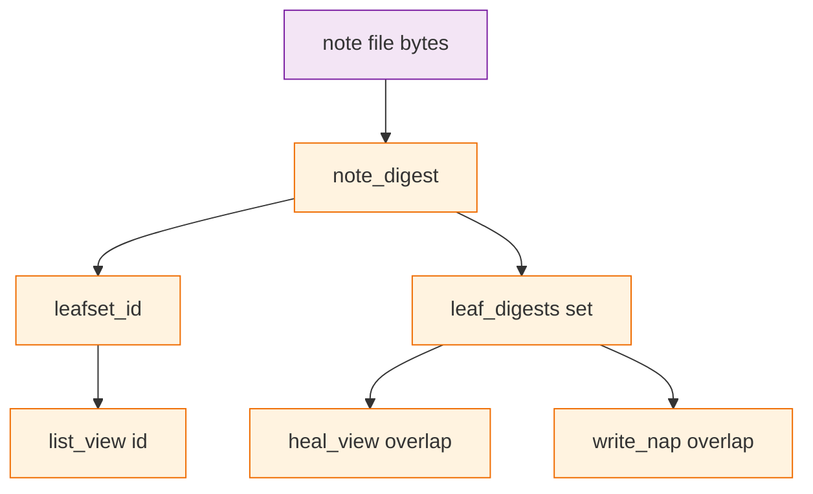

# Architecture Decision: Leaf Identity

## Requirements & Constraints

**Functional**

- `L` is a set of facts. Two recordings of the same sentence are one leaf. Heal dropping a loose note whose text already sits inside a pack is the shoebox: the loose receipt and the stapled one are the same receipt. Issue #77 trigger 1 is intended.
- Napping two identical notes must not produce a pack whose grain disagrees with `|leaf set|` (trigger 2).
- Rematerializing a packed `NoteChild` and healing must still drop that file. `test_heal_note_covered_by_nap_dropped` stays.
- Concurrent same-block naps of the same files still zipper.
- `Saved.` means the fact is in `L`. It stays even when heal then unlinks the new file. Do not add an “already remembered” message.

**Quality attributes (ranked)**

1. Honesty with `docs/theory.md` — `L` is a set; content addressing names leaves.
2. Honesty of grain — never a grain-2 pack with one content leaf.
3. Simplicity — no migrate; `note_digest` stays bytes-only.
4. Recency-as-a-feature — not a requirement. Re-noting a packed fact does not bump it to the front of the view.

**Technical constraints**

- Script is the only writer. Leaf identity remains SHA-256 of file bytes.
- Stored public ids stay 16 hex. No `migrate.py` pass.
- Agents never write the store. Do not invent a repair in CLI output.

**In scope:** which layer is honest about “two recordings of one sentence,” given that `L` is a set of facts.

**Out of scope:** per-file identity; a recency-bump protocol; designing around a broken third-party write rule that re-notes the same line.

**Operator direction (2026-08-29):** `L` is a set of facts. A fact is a fact regardless of when it is asserted. “The sky is blue” noted today and in a month is one fact. Chance of accidental collision is treated as miniscule; do not design around broken write rules.

## Components

Heal already drops a note covered by a pack. It skips two notes, which is what lets two copies sit in the view and later fold into a lying grain-2 pack.

## Options Evaluated

- **Per-file identity:** Hash filename with bytes. Two recordings are two leaves. Rejected by operator: that is not `L`.
- **Multiset heal (issue option 2):** Keep copies until multiplicity is covered. Wrong model: `L` has no multiplicity.
- **Nap-reject duplicates (issue option 3):** `write_nap` refuses a combined digest list with a repeat. Stops trigger 2. Does not by itself collapse two loose copies, so `fold_request` can stick on `(id, id)` at budget.
- **Heal note/note overlap:** Remove the note/note skip. Two loose copies of one fact collapse to one file (newer stamp kept: view is filename-sorted, older is `left`, unlinked). Packed+loose stays as today. `write_nap` also rejects any digest overlap so a direct API call cannot build the lying pack.

## Analysis

| Criterion | Per-file identity | Multiset heal | Nap-reject only | Heal note/note + nap-reject |
|-----------|-------------------|--------------|-----------------|------------------------------|
| Matches `L` as a set of facts | No | No | Partial | Yes |
| Trigger 1 (packed+loose) | Keeps a second file | Would keep it | Unchanged (drop) | Drop; intended |
| Trigger 2 (grain vs set) | Honest as two leaves | Still a lying pack | Stops the pack | Never a pair to nap |
| Fold at budget | Valid pair of two ids | Unchanged | Can stick | Heal runs first; one node left |
| Migration | Required | None | None | None |

Key insights:

- The first creative pass treated `docs/theory.md` “Where the theory leaks” as spec. That section is the bug report talking. The shoebox is the spec: throw away the loose copy.
- `note  |  one file appears  |  gains one note` is true only when the sentence is new. A duplicate, after heal, is a no-op on `L`. `Saved.` is still true of `L`.
- Recency bump by re-noting a packed fact would require keeping the new file. That is a different product. Not this issue.

## Decision

### Choice Pre-Mortem

- The operator will later want re-noting to bump recency: checked as out of scope. If that becomes a product, it is a new task, not a silent per-file identity change.
- Removing the note/note skip drops the older of two concurrent same-text files after merge: checked — that is `L` as a set. Git still has both in history. The view keeps one (the later filename).
- `Saved.` after a healed-away file will confuse agents into retrying: checked — how-to already says the note is stored; retrying the same line is a no-op on `L` after heal. Do not add a second ack.

**Selected**: Heal note/note overlap, and `write_nap` reject any digest overlap
**Rationale:** Operator: `L` is a set of facts. Trigger 1 is the shoebox. Trigger 2 is the remaining code lie. Collapsing loose copies on heal plus rejecting overlap in `write_nap` closes it with no migrate.
**Tradeoff:** Atlas sentence “they remain two view nodes” is false after a mutating command. Two concurrent same-text files become one view node on the next `note` or `nap`. `test_nap_two_identical_notes_by_repeated_id` and friends retarget.

## Implementation Notes

- Do not change `note_digest`. It stays SHA-256 of file bytes.
- `_first_overlap`: delete the `left.kind == "note" and right.kind == "note": continue` skip. Equal grain-1 sets: `left.leaves <= right.leaves`, unlink `left` (older filename). Packed vs note: unchanged.
- `write_nap`: change `if (set(digs_l) & set(digs_r)) and (left.kind == "nap" or right.kind == "nap")` to reject on any intersecting digest sets. Error stays `overlapping packs` or a shared “overlapping leaves” if that string is already the contract — do not invent a new repair; keep the existing overlap error if tests pin it, or one error for both.
- `fold_request`: after heal, two identical notes are not both in the view. No special case required if mutating commands always heal first. Direct `fold_request` in tests may still see two files; do not build a second overlap walker unless a test requires it.
- Atlas Identity: two notes with the same text share an id; heal keeps one. `docs/theory.md` leak section: not a leak. `leaf_digests` (set) is the model; `leafset_id` hashing a duplicate list is a path heal should make unreachable.
- No `migrate.py`. No rewrite of this clone’s naps for identity.
