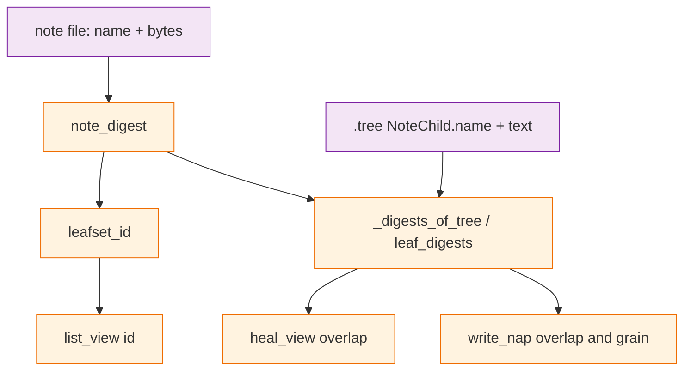

# Architecture Decision: Leaf Identity

## Requirements & Constraints

**Functional**

- A note written after its text was folded still exists after the next `note` or `nap` (issue #77 trigger 1).
- Napping two identical notes must not produce a pack whose grain disagrees with its leaf set (trigger 2).
- Rematerializing a packed `NoteChild` and healing must still drop that file: the pack already holds that filename and those bytes (surgery / zipper unique-cover of the same physical note). `test_heal_note_covered_by_nap_dropped` stays.
- Concurrent same-block naps of the *same files* still zipper: same names, same bytes, same leaf-set id.

**Quality attributes (ranked)**

1. Honesty — grain equals `|leaf set|`; one identity used for ids, overlap, and fold.
2. Fitness — both triggers, without a fold-stuck pair at budget.
3. Simplicity — one digest rule, not a note/note skip plus a nap/note name walk plus a content-hash set.
4. Maintainability — every overlap check uses the same helper.
5. Migration cost — accepted; `migrate.py` already exists for this class of rewrite.

**Technical constraints**

- Script is the only writer. Leaf identity is SHA-256 from stdlib, not git, not `sha256sum`.
- Stored public ids stay 16 hex. `leafset_id` still sorts, concatenates, hashes, truncates.
- Notes remain `{stamp}-{rand}` immutable files. Names do not contain NUL.
- Trees already store `NoteChild.name` and `text`. Digests can be recomputed from the children file.

**In scope:** which layer is honest about “two recordings of one sentence.”

**Out of scope:** changing seq/grain/variant width; a `summem migrate` verb; dual-read of old ids in the driver; vector identity; making surgery match on digest instead of filename.

## Components

Heal today skips two notes, then treats a nap/note pair as covered when the note’s *content* digest is in the pack’s *set*. That is the leak: a new file is not a rematerialized child.

## Options Evaluated

- **Per-file identity:** Hash filename with file bytes. Two recordings are two leaves. Grain equals `|leaf set|`. Existing stems need `migrate.py`.
- **Multiset heal (issue option 2):** Keep content identity; compare leaf multisets and drop only when multiplicity is covered.
- **Nap-reject duplicates (issue option 3):** `write_nap` refuses a combined digest list with a repeat. Trigger 2 only.
- **Heal by filename membership:** Keep content ids; a loose note is covered by a pack only when its filename is a `NoteChild.name` in that tree. No migrate.

## Analysis

| Criterion | Per-file identity | Multiset heal | Nap-reject | Heal by filename |
|-----------|-------------------|--------------|------------|------------------|
| Trigger 1 | Yes | No: a grain-2 pack of two distinct notes already has multiplicity 1 of each digest; the new note is a subset | No | Yes |
| Trigger 2 | Honest fold: two leaves, grain 2 | Pack still lies unless identity also counts files | Stops the lying pack | Pack still lies unless nap is also refused |
| Rematerialize heal | Same name + bytes → same leaf → drop | Cannot tell rematerialize from a new recording | Unrelated | Same name in tree → drop |
| Fold at budget | Two identical notes are a valid same-grain pair | Unchanged | If nap rejects them, fold_request can stick on that pair | Same stick if combined with nap-reject; if nap allowed, grain lies |
| Zipper of same files | Same names → same ids | Unchanged | Unchanged | Unchanged |
| Simplicity | One digest | `leafset_id` (multiset) vs `leaf_digests` (set) stay split | Extra reject rule | Two overlap rules: names for nap/note, digests for nap/nap |
| Risk | Breaking: every note id and nap stem changes; migrate required | Small code change, wrong fix | Small, incomplete | Small blast radius, two rules forever |

Key insights:

- Issue option 2 does not fix trigger 1. A later copy of a sentence that already sits once inside a pack is still a subset of that pack’s content-hash multiset. Teaching heal to count does not distinguish “this file” from “this sentence.”
- Nap-reject without identity change can stick fold: two identical grain-1 notes stay adjacent, `fold_request` asks for them, `nap` fails.
- Heal-by-filename is the real no-migrate alternative. It keeps the atlas sentence “two notes with the same text share an id.” It also keeps two overlap definitions and leaves trigger 2 open unless nap is refused, which reintroduces the fold stick.
- Per-file identity is the only option that makes grain, leaf set, overlap, and fold tell one story. Concurrent writers who folded the *same files* still zipper: names are in the tree. Independently recorded same sentences become two leaves, which is what [#77](https://github.com/Texarkanine/SumMem/issues/77) and `docs/theory.md` call correct about the world.
- `test_heal_note_covered_by_nap_dropped` is not the bug. It rematerializes the packed child’s *name*. That must keep dropping.

## Decision

### Choice Pre-Mortem

- Independently recorded same sentences should still collapse as one leaf so the store is a set of sentences: checked — the issue and the theory leak section reject that. Two recordings are two things.
- NUL-in-name could alias two files into one digest: checked — note names are `{stamp}-{rand}` filesystem names; they cannot contain NUL.
- Operator wanted the no-migrate filename-coverage heal to avoid rewriting stores: checked as a tradeoff, not a requirement. Trigger 1 needs a per-occurrence leaf. Filename-only heal leaves grain dishonest or fold stuck. L3 still gates build on `/niko-build`.

**Selected**: Per-file identity
**Rationale**: Honesty and fitness outrank migration cost. It is the only option that fixes both triggers, keeps rematerialize-heal, and leaves fold able to pair two same-text notes. `migrate.py` is the existing tool for rewriting stems and nested ids (#67).
**Tradeoff**: Every stored public id changes, including unique notes, because the digest input grows. This clone’s root and `dogfood` stores must be rewritten in the same change. Agents must not reuse ids from a pre-fix wake.

## Implementation Notes

- `note_digest(name: str, file_bytes: bytes) -> str` returns lowercase hex SHA-256 of `name.encode("utf-8") + b"\0" + file_bytes`. Full 64 hex; `leafset_id` still truncates the join.
- Pass `path.name` / `NoteChild.name` at every call site: `list_view`, `leaf_digests`, `_note_child`, `_digests_of_tree`, `_digests_of_dict`, `_projected_child`, and the `named_ids` walk.
- `_digests_of_dict` already binds `name` and ignores it. That is the content-only walk in miniature.
- `write_nap` overlap guard can stay: two different files with the same text are disjoint leaves, so they fold. Grain is `len(digests)`.
- Heal’s note/note skip can stay (harmless) or go (redundant once ids differ). Prefer leave it: two notes still must not unique-cover each other if a future hash collision appears.
- `migrate.py`: for each complete pair, recompute nested `NapChild.id` from the new digest walk, recompute stem leaf-set and variant, write, unlink source if the stem changed. Idempotent when already per-file. Keep the existing 4-part-64 / 5-part-64 path. Driver does not dual-read old content-only 16-hex stems.
- Atlas Identity, `systemPatterns.md` wake-dates paragraph, and the `docs/theory.md` leak section update to: two notes with the same text are two leaves. `leafset_id` and `leaf_digests` agree because both walk per-file digests.
