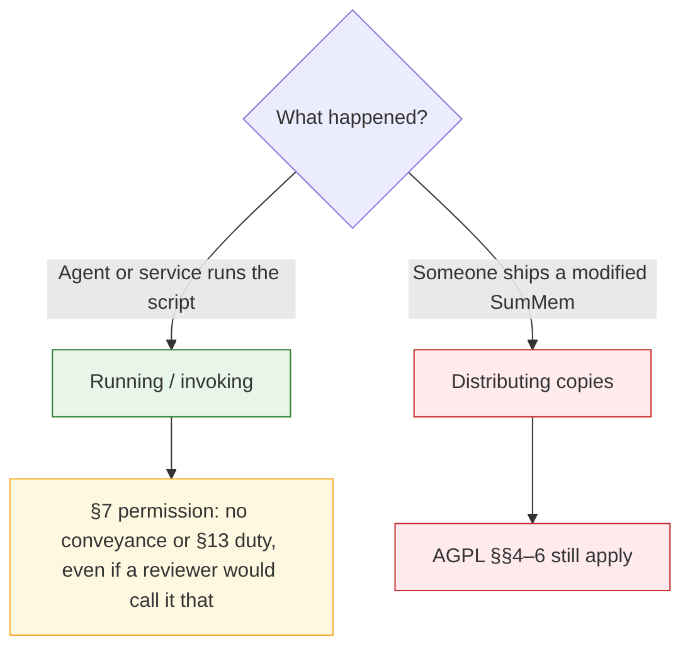

# Decision: Legal Instruments

## Context

**What**: Which legal instrument writes the two carve-outs so they are real grants, the program stays AGPL, and scanners still see AGPL.

**Why it matters**: An interpretation-only note can lose the meeting. A second license or an SPDX exception can make scanners stop saying AGPL. The wrong grant can look like a dual-license of the program, or can accidentally bless publishing a fork.

**Constraints**:
- The program stays AGPL. Do not dual-license it.
- Prompt text: no copyright claim and no obligation (no notice-retention).
- Invocation: not conveyance and not §13; **and even if it is**, explicitly permitted.
- Publishing a modified SumMem still fires AGPL.
- Do not use an SPDX exception that forces `LicenseRef-` and hides AGPL.
- AGPL §7 requires the additional terms (or a pointer to them) in the relevant source files.

## Options Evaluated

- **Interpretation-only rider**: Linux-syscall-note style. “We do not consider agent invocation to be conveyance, a combined work, or §13.” Prompt called uncopyrighted in prose. No extra grant.
- **AGPL §7 additional permissions in the source**: Two exceptions stated in the script, using the license’s own additional-terms mechanism. SPDX on the file stays AGPL. Prompt portion “may be used separately”; invocation excepts conveyance/§13 duties for *running*.
- **Dual-license the program**: AGPL or Apache/MIT. Recipient picks the permissive branch.
- **SPDX exception identifier**: `AGPL-3.0-or-later WITH LicenseRef-SumMem-agent` (or a new listed exception). Prompt as 0BSD/CC0 snippet.

## Analysis

| Criterion | Interpretation-only | §7 additional permissions | Dual-license | SPDX exception |
|-----------|---------------------|---------------------------|--------------|----------------|
| Satisfies “even if it is, I permit” | No — only a scope claim | Yes — exception from those conditions | Yes, but by leaving AGPL | Maybe, if the exception text says so |
| Program stays AGPL | Yes | Yes | No — forbidden | File identifier becomes WITH-exception |
| Scanners still see AGPL | Yes | Yes (`AGPL-3.0-or-later`) | Dashboard shows both / “OR” | `LicenseRef-` or unknown exception |
| Prompt: no copyright, no notice | Weak (prose only) | Yes — part-of-program permission + no-copyright claim | N/A (whole program permissive) | 0BSD still claims copyright; CC0 is closer but second license |
| Fork / summemv2 still AGPL | Yes | Yes — permission is for *running*, not for distributing copies | No | Yes if exception is narrow |
| Mechanism the license already defines | Informal | [AGPL §7](https://opensource.org/license/agpl-3-0) | Different license | SPDX exception list; ours is not on it |

Key insights:
- [AGPL §7](https://opensource.org/license/agpl-3-0) defines “additional permissions” as exceptions from one or more conditions. They may apply to the whole Program (treated as part of this License) or to a part (that part may be used separately; the Program remains AGPL). The copyright holder must put the terms in the relevant source files, or a notice pointing to them. Recipients may strip additional permissions when they convey a copy. That is acceptable: a hostile fork can drop the carve-out and is still AGPL.
- The [Linux syscall note](https://spdx.org/licenses/Linux-syscall-note.html) is the vibe, not the instrument. It says user programs that use syscalls are not derived works. It does not say “and if a court disagrees, I still permit it.” The operator asked for that second sentence.
- Dual-license is out: the operator already said AGPL that is dual-licensed is not AGPL.
- An unlisted SPDX exception is the scanner failure the brief forbids. Framing the carve-out as an “exception identifier” also concedes that copyleft reached the invocation, which §7 does not require us to do in SPDX.
- 0BSD on the prompt is a copyright license without notice-retention. The operator asked for *no copyright*, not a second license. A §7 permission on that part, plus a no-copyright claim, matches the words. CC0 is the usual waiver instrument and can be an echo later if REUSE is chosen; it is not required as the grant.
- The invocation permission must be limited to *running / invoking* the Program. It must not except §§4–6 for distributing copies of the Program or a modified version. That is the fork line.

## Decision

**Selected**: AGPL §7 additional permissions in the source
**Rationale**: It is the license’s own way to grant “even if it is.” The file stays AGPL for scanners. The prompt part can be used separately with no notice. Distributing a fork is still conveying a covered work.
**Tradeoff**: A later conveyor may remove the additional permissions from their copy. They do not get a permissive program; they get AGPL without the carve-out. Also: this is an instrument choice, not a courtroom guarantee.

## Implementation Notes

- Put both permissions in the relevant source (`summem` at minimum). A pointer-only notice to a repo file the consumer never copies does not satisfy “script is authoritative” and is a weak §7 notice.
- Do not add `SPDX-License-Identifier: AGPL-3.0-or-later WITH …` for this. SPDX on the program file stays AGPL (exact identifier is a later placement question).
- Do not attach 0BSD/MIT/Apache to the program.
- Draft terms for Build (legal prose, not executable). Keep the two permissions distinct:

**Prompt (part of the Program):** The agent prompt template this Program emits for pasting into `AGENTS.md` may be copied, modified, and published without restriction and without retaining any copyright notice, permission notice, or license text. The copyright holder claims no copyright in that template.

**Invocation (whole Program):** Invoking through ordinary process invocation is not conveyance and is not, by itself, “users interacting with it remotely through a computer network” under §13. The invoking program is not a covered work or a work based on the Program by reason of that invocation. Unmodified Program may be run even when users interact with it that way. Modified Program may be run by you and your agents; if users interact with that modified version remotely through a computer network, this permission does not apply and §13 does. Distributing a modified version is not covered by this permission. Do not say a fork “must retain” the carve-outs: §7 lets a conveyor strip additional permissions. A stripped fork is still AGPL, not more permissive.

- Placement of echoes (`COPYING`, REUSE, `surgery.py`, `version`) is the next open question.

## Operator amendment

After preflight, the operator chose **0BSD** as the separately written license for the prompt template (not a dual-license of the Program). The invocation grant stays the §7 paragraph above. Put the 0BSD terms in the `summem` header so the file is self-contained. Do not add REUSE. Verbatim root `LICENSE` does not revoke these terms.
