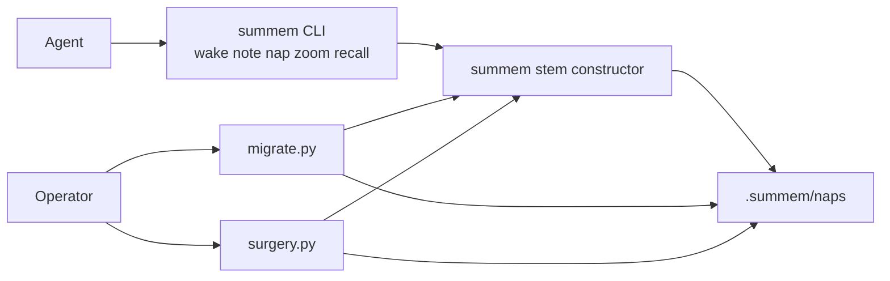

# Architecture Decision: Migration Script Home

## Requirements & Constraints

The helper must rewrite complete four-part nap pairs to five-part stems using the same variant-tag digest the driver will write, so an upgraded store matches new folds. It must be runnable by an operator on a clone. It must not become an agent-facing everyday command.

Ranked quality attributes:

1. **Correctness** — hashed bytes are the on-disk pair; dest names match `write_nap` / `rematerialize_child`.
2. **Simplicity** — one extra operator file, no new runtime, no new package.
3. **Maintainability** — hash logic lives in `summem`; the helper only loads and renames.
4. **Discoverability** — an operator reading the breaking PR can find and run it.
5. **Cost / scale** — a store is a directory of files; no service.

Technical constraints:

- Product is one shebang plus `surgery.py`. Tests and surgery load `summem` with `SourceFileLoader`.
- Tech context: the README command table must not change when the on-disk format changes.
- Issue #61 non-goals: no user-facing dedupe command; no merge driver; wake does not heal.
- Dual-read of four-part stems stays in the driver; the helper is optional eager rewrite.
- Incomplete `.tree`/`.summ` pairs cannot produce a pair digest.

In scope: home of the script, how it finds stores, rename vs re-dump, what it refuses.

Out of scope: variant-tag algorithm, heal survivor rule, agent CLI verbs, caption-union policy.

## Components

`summem` owns the digest and filename grammar. `surgery.py` already shows the operator-tool pattern: sibling file, loads the driver, not listed in the agent command table. The migration helper is the same kind of tool with a different job (rename complete pairs, do not excise notes).

## Options Evaluated

- **A. Sibling `migrate.py`**: repo-root Python like `surgery.py`; loads `summem`; not a CLI verb.
- **B. `summem migrate` verb**: first-class argparse command next to `wake`/`note`.
- **C. Fold into `surgery.py`**: one operator binary, new subcommand or flag on the excision tool.
- **D. Shell snippet in the PR only**: not committed, or a `find`/`mv` script that re-implements the digest.

## Analysis

| Criterion | A sibling | B CLI verb | C surgery.py | D PR snippet |
|-----------|-----------|------------|--------------|--------------|
| Fitness | Operator rewrite; hash via driver | Same, plus agents see it | Same hash, wrong tool | Hash drift or untested |
| Alignment | Matches surgery + stable command table | Conflicts with “command table must not change” | Conflicts with surgery’s excision contract | Conflicts with “script is the only writer” if operators `mv` by hand |
| Simplicity | One new file, copy of the 10-line loader | Touches argparse, usage_text, README table | Couples unrelated jobs | Looks simple, wrong digest |
| Maintainability | Driver is source of tag | Driver is source of tag | Two jobs in one file | Two implementations |
| Scalability | Directory rename | Same | Same | N/A |
| Risk | File remains after most stores upgrade | Agents run migrate as if it were nap | Accidental excision UX | Silent mis-named stems |

Key insights:

- Correctness eliminates D: the pair digest is domain-tagged SHA-256 with 8-byte lengths. A shell reimplementation will drift. A committed Python file that calls the driver will not.
- The README command-table constraint and the issue’s “no user-facing dedupe command” eliminate B as the shipped agent surface. A hidden verb still expands argparse and `usage_text` unless we special-case it; that is more machinery than a sibling.
- C fails the damage test: `surgery.py` must not write nap captions and must not treat a nap as a leaf. Migration is rename-of-pairs. Mixing those stories is how an operator passes the wrong flag.
- Discoverability is satisfied by committing A and naming it in the PR and atlas change-surface row. It does not require a `summem` verb.

## Decision

### Choice Pre-Mortem

- Operators expected `summem migrate` as the upgrade command: **checked** — tech context forbids expanding the agent command table for a backend change; issue #61 keeps `note`/`wake`/`nap`/`zoom`/`recall` as the interface.
- A permanent `migrate.py` becomes dead weight after everyone upgrades: **checked** — `surgery.py` is already a rare operator tool that stays in tree; late clones still need the rewrite.
- Duplicating `load_summem` from surgery drifts: **checked** — that ten-line loader already exists in two places (surgery, tests). A third copy is the established pattern; extracting a package is a new product surface.

**Selected**: Option A — sibling `migrate.py`
**Rationale**: Correctness (driver-owned digest) and simplicity (surgery analogue) beat a new CLI verb. Alignment with the stable command table and “script is the only writer” eliminates B and D.
**Tradeoff**: Operators type `python migrate.py` (or `uv run`) instead of `summem migrate`. The PR and atlas must say so.

## Implementation Notes

- Repo-root `migrate.py`, AGPL header like `surgery.py` (no prompt 0BSD carve-out). No `__version__`, no Release Please extra-file.
- Load sibling `summem` with `SourceFileLoader` the way `surgery.py` does. Call the shared stem constructor / `variant_tag`. Do not copy the hash framing.
- Default: git repository of cwd; rewrite every started store (root plus cataloged `.summem/` trees). `--path DIR` limits to one store.
- For each complete four-part pair: hash **on-disk** `.tree` and `.summ` bytes (do not re-`dumps_tree`). Rename both files to the five-part stem. Skip stems that already parse as five-part. If the dest exists, skip that pair.
- Incomplete pairs: skip, message on stderr, non-zero if any pair was skipped for that reason.
- Do not call `heal_view`. Equal-set twins after a union stay until the next `note`/`nap`.
- Idempotent: a second run is a no-op (exit 0) on an already five-part store.
- Tests in `tests/test_migrate.py`. This repository’s committed stores are rewritten in the same breaking change so dogfood is the new shape.
- Document invocation in the atlas change-surface row and the PR; do not add a README command-table row.
