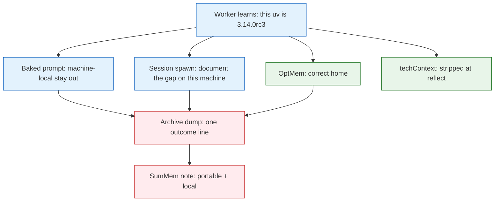

# Decision: Note Membership After a Machine-Local Leak

## Context

A tox-runner worker recorded a portable fact and a machine-local clause in one SumMem note:

`tox is the suite command: … 211 pytest. This uv only had 3.14.0rc3.`

The operator does not want that note redacted. The open question is whether SumMem’s **baked prompt** or **store/CLI design** should change, or whether this instance was driven by the **session operator prompt**.

**What:** Choose one response: leave SumMem alone, change only `prompt_text()`, or change the product (filters, channels, wake nags).

**Why it matters:** The next agent will `note` under the same baked paragraph. A store-side “fix” would fight wait-free ingest. Leaving a real prompt defect unfixed will keep losing to session-end dumps. Blaming only the baked prompt will miss that this spawn told the worker to document a machine gap.

**Constraints:**

- Stranger-clone activation: the baked prompt must not name OptMem or any other local diary ([agents-prompt archive](../../archive/features/20260819-agents-prompt.md)).
- The script does not interpret note English. Ingest commutes. Agents never write store files ([systemPatterns](../../systemPatterns.md), atlas § Invariants).
- Policy already exists: “Personal and machine facts stay out” ([productContext](../../productContext.md), atlas). Policy is not an enforcer.
- Wake is a document, not a script. Do not turn wake into a reminder list.
- Do not redact this note.
- Cheap-agent lesson already paid for: a late or unlabeled constraint loses to the nearest imperative ([agents-prompt archive](../../archive/features/20260819-agents-prompt.md)).

## Options Evaluated

- **A. No SumMem change:** This leak was the session spawn. The baked line already says machine-local stays out. More prompt text is an arms race.
- **B. Prompt structure only:** Keep the store and CLI. Split the membership test out of the mandatory-note sentence. End on a clone-portability test. Do not name OptMem. Do not cite this leak as the example.
- **C. Design: script-side filter:** Reject or warn on “this machine”, “this uv”, version strings, and similar. The script becomes an English cop.
- **D. Design: a second channel:** A local/private store, a `--local` flag, or “put that in OptMem” in the baked prompt.

## Analysis

| Criterion | A. No change | B. Prompt structure | C. Script filter | D. Second channel |
|-----------|--------------|---------------------|------------------|-------------------|
| Cause of *this* instance | Names it | Names it, still hardens | Treats symptom as parser bug | Treats symptom as missing product |
| Atlas: ingest commutes, script is dumb | Holds | Holds | Conflicts | New writer surface |
| Stranger clone (no OptMem) | Holds | Holds | Holds | D names OptMem or splits the product |
| Cheap-agent: constraint vs dump workflow | Leaves buried negative | Separates workflow from membership | N/A | N/A |
| Simplicity | Highest | One paragraph in `prompt_text()` | Heuristics, false positives | New object to explain |
| Reversibility | n/a | One commit | Policy in code is sticky | Sticky |
| Overfit to rc3 | None | Avoid if example is a clone test, not “uv” | High | Low |

Key insights:

- The worker **already split channels correctly** at plan and build: OptMem got the rc3 sentence; the first SumMem note was portable; reflect stripped rc3 from `techContext.md`. The leak is the **closing dump**, not ignorance of the rule.
- The session spawn was more specific than the baked filter. It copied “this machine” from `techContext.md` / issue text, then added “unless 3.14 is impractical on this machine; then **document the gap**,” and asked the final message for **leftover risk**. A more specific instruction beats a trailing negative. The worker put leftover risk in the PR body *and* in SumMem.
- The baked membership test is a **reference constraint smuggled into a mandatory workflow sentence**. “Call it whenever you learn something” is the imperative. “Machine-local stay out” is a late clause in the same paragraph. Prompt-authoring: a reference that is not its own sentence will lose when the workflow is “dump what you learned.”
- Naming OptMem in `prompt_text()` is not available. A stranger clone has no OptMem. “Stay out” is the only honest baked routing.
- A script-side filter would be a new product: the CLI would judge English. False positives (“this machine’s flock of `naps/`” is already atlas vocabulary). It does not commute with “the script owns files, not meaning.”
- `techContext.md` already says “Do not use this machine’s bare `python3` (3.10).” That is in-repo precedent that “this machine” is legitimate git-forever voice. The spawn did not invent the dialect; it amplified it.

## Decision

**Selected**: B. Prompt structure only (no store or CLI change)

**Rationale**: This instance’s proximate cause was the session spawn, not a hole in the file backend. Changing the store would optimize the wrong layer. Option A is honest about cause and still leaves a known cheap-agent defect: a mandatory dump workflow with a buried membership test. Option B is the smallest change that applies the lesson already bought on catalog lines, without naming OptMem and without teaching the script English. Options C and D conflict with the atlas.

**Tradeoff**: A clearer baked prompt still loses to a session that says “document this machine’s gap.” That is accepted. Spawn hygiene (name the channel: PR body, Niko archive, OptMem — not SumMem) is operator practice, not a SumMem object. The leaked note stays.

## Implementation Notes

- Change `prompt_text()` in `summem` only, then the lockstep `AGENTS.md` test (`tests/test_init.py` `test_agents_md_starts_with_prompt_text`).
- Split **Register Memories** so the workflow and the membership test are separate:
  - Workflow: note when you learn a project fact another contributor still needs; nap if asked.
  - Membership: the test is clone-portability — would this still be true for a stranger who cloned tomorrow on another machine? Personal, machine-local, and preference facts stay out.
- Do not use this leak’s wording as the negative example (that would reprint the local sentence on every wake-adjacent read of the prompt). Do not name OptMem. Do not add a token denylist. Do not print a reminder from `wake`.
- Keep existing invariants in `test_prompt_text_invariants` (`personal`, `contributor`, `.summem/summem`, no “before any other tool call”).
- Out of scope here: rewriting `techContext.md`’s “this machine’s bare python3” (portable intent, local phrasing); operator spawn templates.
- Follow-on: a small `/niko` to land the `prompt_text()` split. This creative does not implement it.
