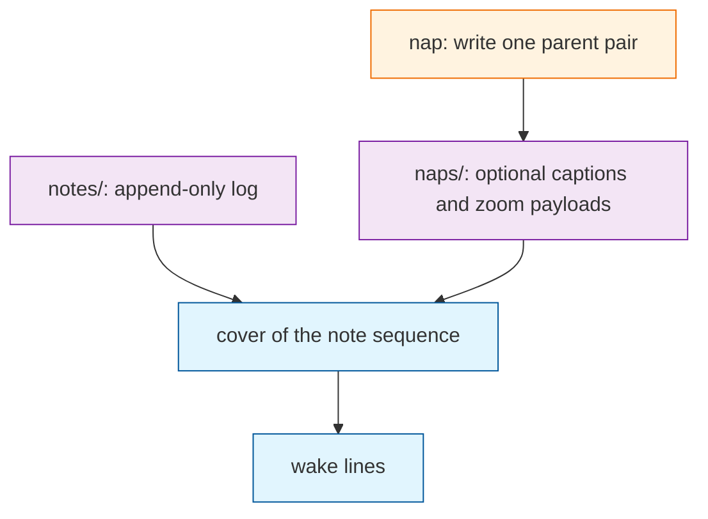

# Architecture Decision: Wake Projection

## Requirements & Constraints

`WAKE_LINES` is a store knob. OptMem applies it at view time: the log does not change when the budget does. The equal-grain plan applies it at write time: `fold_request` plus `write_nap` unlinks children until `HEAD` has about that many files. Widening the knob then cannot reveal more wake lines. The operator rejected that. The lens may not be burned into the film.

### Functional requirements

- Raising `WAKE_LINES` must be able to print more lines of a store that was previously shown under a smaller budget, including the 1024-note / budget-2 → budget-32 case, without rewriting history.
- Lowering the budget must not require deleting files. It only changes which cut wake prints.
- Missing captions degrade to finer grain. They do not block wake. That sentence is already an invariant in `VISION.md`.
- `nap` stays binary and adjacent. The CLI table does not grow. Agents still do not write store files.
- Zoom remains a property of `HEAD`: every original sentence still lives in some tip file.
- Wake stays wait-free and cheap enough to run at session start: it must not parse a year-later multi-megabyte `.tree` to print 32 lines.
- Sequence stays in filenames. No shared mutable index.

### Quality attributes

1. **Correctness of the knob** — `WAKE_LINES` is a projection. This outranks disk compactness.
2. **Wake cheapness and wait-freedom** — directory list plus small `.sum` reads; no fat-payload parse.
3. **Recoverability** — originals at `HEAD`.
4. **Simplicity** — one script, one identity scheme, no second log.
5. **Bounded git file count** — the year-later “file count ≈ wake budget” picture. In tension with (1). Subordinate here.

### Technical constraints

- Product is `.summem/summem`. Notes are `{stamp}-{rand}`. Nap identity is the leaf-set hash.
- This repo is a sub-run of L4 `file-backend`. Proofs 2–6 exist and assume unlink. They will need a rewrite if children stay.
- `config.toml` is still unread. The knob’s *meaning* must be right before scopes start parsing it.
- Out of this decision: redaction, scopes addressing, pack-size cap as a blob warning, a second backend, harness hooks.

### Boundaries

In scope: what wake lists, what `nap` may delete, where `WAKE_LINES` is consulted.

Out of scope: inventing a new agent verb, flattening to leaves as a command, shipping a full OptMem `cover(T)` pretty-printer on top of an unlinked store.

## Components

`note` only appends. `nap` only adds a captioned interval. `wake` chooses a cut of the log. `WAKE_LINES` is an argument to that cut, not to `nap`.

Today those three are coupled: `list_view` is the directory, `fold_request` uses `WAKE_LINES` as a file-count trigger, and `write_nap` unlinks so the directory *is* the last cut.

## Options Evaluated

- **Notes stay, wake covers:** The log is `notes/`. `nap` writes `.sum`/`.tree` and does not unlink. Wake computes a budget-sized cut of the sorted notes and prints a matching nap caption when one exists, else degrades to finer existing files (smaller naps or the notes themselves).
- **Unlink stays, wake explodes trees:** Children still leave the directory. A larger budget walks `.tree` JSON and synthesizes extra lines from nested `NapChild` / `NoteChild` nodes.
- **Keep nap layers, unlink notes:** Notes disappear after first fold; every intermediate nap stays. Wake picks existing nap files whose grains fit the budget. Finest cheap grain is a 2-note nap.

A fourth idea — stop requesting folds from `WAKE_LINES` but still unlink when an agent naps — does not satisfy the 1024 / budget-2 case. Agents who follow the old printer still burn the lens. Eliminated.

## Analysis

| Criterion | Notes stay, wake covers | Unlink stays, wake explodes | Keep naps, unlink notes |
|-----------|-------------------------|-----------------------------|-------------------------|
| Fitness | Widen to 32 or to T. Missing caption → real finer lines. | Widen works. Printed ids are virtual unless `nap`/`zoom` grow a resolver. | Widen 2 → 32 works. Widen to one line per note does not. |
| Alignment | Matches `VISION.md` opening: cover is a function of T and budget; it does not need nap files. Conflicts with year-later “folded children gone from HEAD.” | Keeps year-later file count. Conflicts with “wake does not open `.tree`” and with cheap wake. | Middle of both contracts. |
| Simplicity | `write_nap` loses unlink. Wake is no longer `ls`. Cover (or a left-biased cut of the same shape) moves from Later into wake. | Wake becomes a tree walker. `write_nap` must resolve ids that are not files. | Wake still lists files, but must ignore parents or children so both do not print. |
| Maintainability | Proof 4’s “only three files after squash” is rewritten. Zoom can use notes or `.tree`. | New virtual-id surface. Easy to get `nap` of a synthesized child wrong. | Two lifetimes (notes die, naps live) to explain. |
| Scalability | Git has T note files. Wake is a `notes/` readdir plus one small `.sum` per printed tile that has a caption. Computing an uncaptioned tile’s leaf-set id may read those notes once, then `fold_request` asks for the caption. | Year-later wake parses megabyte `.tree` blobs to print 32 lines. That is the failure `.sum` exists to avoid. | O(T) nap files (a binary tree has T−1 internals). Cheaper than explode, still not year-later-small. |
| Risk | Reversible: unlink can be added later as a pack-size / blob policy, not as the wake knob. Proofs and VISION year-later need a surgical rewrite. | Reversible only until agents depend on virtual ids. Wrong if fat-tree I/O is acceptable; that is unverified and unlikely. | Reversible toward “notes stay” by stopping the note unlink. Fails full OptMem widen-to-T. |

Key insights:

- `VISION.md` already contains both answers. The opening says cover does not need nap files and missing summaries degrade to finer grain. Year-later then treats `HEAD` as a materialized cover and deletes children. The operator picked the opening.
- Cheap wake and unlinked children cannot both serve an arbitrary later budget. The finer listing has to exist as files wake is allowed to read, or wake must open the payload it was designed not to open.
- Equal-grain as a *write* policy was an approximation of cover. Once wake is the projector, equal-grain (or aligned cover) belongs there. `nap` builds captions for intervals; it does not shrink the log.
- Carry-stable nap names remain useful so a captioned interval sorts as its left edge. They are no longer what saves same-second *wake* order: that order is the note filenames.

## Decision

### Choice Pre-Mortem

- The operator still wanted year-later “file count on disk ≈ budget” and only meant “stop using `WAKE_LINES` as the *request* trigger”: checked — that reading fails their 1024 → 32 example once any agent has napped. They required a projection, not a quieter printer on burned film.
- `notes/` readdir at large T is too slow: checked as acceptable for repository-scale T (thousands), not as a million-file store. No shared index will be added to dodge this.
- Proof 4 and squash-clone “three files only” are load-bearing product tests, not helpers: checked — they encode the film. They change. Zoom-from-`HEAD` still holds because the notes remain.

**Selected (first pass)**: Notes stay, wake covers
**Rationale**: The knob’s correctness and cheap wait-free wake both hold only if the log remains listable without opening `.tree`. Explode fails cheapness. Unlinking notes fails widen-to-T, which is what OptMem’s lens does.
**Tradeoff**: Git `HEAD` grows with T note files plus whatever naps were written. Year-later compactness becomes printed-line count, not inode count. Pack-size / blob warnings stay Later and may delete *payloads* for host limits, never as an implementation of `WAKE_LINES`.

### Operator amendment

The operator rejected “notes stay.” The locked choice is **unlink stays, wake expands trees in memory**.

`write_nap` still unlinks. `WAKE_LINES` is a view-time budget. When `len(list_view) < WAKE_LINES`, wake loads the newest expandable nap’s `.tree` and replaces that node with its two kids, repeating until the frontier meets the budget or nothing left will split. No cracked files are written. Once enough native view files exist (new 1s, or a larger directory), wake is `ls` again.

Further expand walks the in-memory kids, not only the rightmost node once. `fold_request` still uses **file** count, not printed-line count. `nap` still requires view-file ids this milestone; `zoom` already resolves in-tree ids. Python `json` parse of the opened pack is accepted.

## Implementation Notes

- `write_nap` writes the parent pair and leaves children on disk. Fold is caption, not compaction.
- Wake’s input is the sorted `notes/` list (T, order). It does not treat `naps/` as the sequence. A nap is a caption lookup: same leaf-set id as a chosen tile → print that `.sum` (or degrade if the caption is missing or conflict-marked).
- The cut is OptMem-shaped: aligned power-of-two tiles of the note sequence, leftover budget on the right. A missing tile caption degrades to finer existing files (smaller naps whose leaf sets partition the tile, or the notes). That may print more than `WAKE_LINES`. That is wait-free, not a defect.
- `fold_request` names one binary adjacent pair that helps *build* a missing caption for the current cut, not “the directory has too many files.” One pair per request. Catch-up after `nap` still makes sense: another needed caption, not another unlink.
- `WAKE_LINES` is read by wake (and by that request printer). It is not read by `write_nap`.
- Proof 4: 100 notes remain after the three pack captions are written; squash clone wakes at a small budget as three captioned lines and still zooms originals (from notes or from `.tree`).
- Proof 6: merge still unions files. Wake may already show both pasts at pack grain. A later `nap` writes a parent caption; it does not have to delete the packs.
- `VISION.md` year-later and “drop the children from the view” must be amended in the next plan so “view” means the projection. The directory is the log plus captions.
- Issue #1’s short tree remains a property of the *caption* tree (zoom / later surgery). It is not what bounds wake.
- This invalidates the approved equal-grain plan as a build. Next step is `/niko-plan`, likely L3: wake projection plus the VISION amendment, not a picker-only L2.
