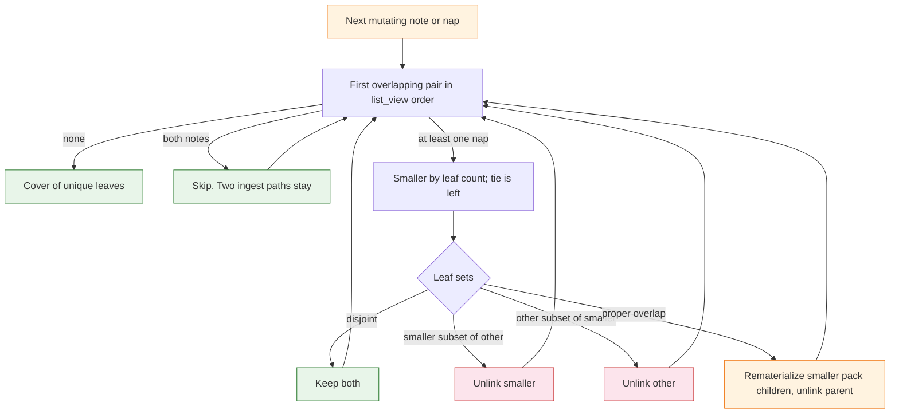

# Task: zipper-heal

* Task ID: zipper-heal
* Complexity: Level 3
* Type: feature

Zipper-heal overlapping nap leaf-sets after a long-lived merge so the next `note` or `nap` leaves a cover of unique leaves. `write_nap` must not concatenate overlapping packs. Wake stays wait-free and does not rewrite the store. [Texarkanine/SumMem#3](https://github.com/Texarkanine/SumMem/issues/3).

Issue #3 mentions a containment pass. Do not build one. Crash leftovers are handled by ⊆. `flock` the `naps/` directory; do not create a lock file.

## Pinned Info

### Zipper step

Heal loops this step until every view file’s leaf-set is disjoint from every other, except two notes (ingest keeps both paths).

## Component Analysis

### Affected Components

- **Tree codec** (`NoteChild`, `NapChild`, `Tree`, `_digests_of_tree`): no schema change. Zipper copies those bytes back to files.
- **View** (`list_view`, `ViewNode`): unchanged listing. Heal rereads it after each unlink.
- **Nap writer** (`write_nap`, `_as_child`, `_unlink_node`): refuse overlapping packs (at least one side is a nap). Still the only place that writes a new caption.
- **Fold request** (`equal_grain_pair`, `fold_request`): already silent when no adjacent equal-grain pair exists. Add a regression after heal.
- **Wake** (`wake_text`, `expand_frontier`): must not call heal, must not flock, must still print a dirty overlapping `HEAD`.
- **CLI** (`main`, `write_note`): `note` and `nap` flock `naps/`, run heal, then the existing write/request path. `wake` / `zoom` / `recall` do not.
- **Store bootstrap** (`ensure_store`): unchanged. Do not add files there; `list_view` calls it, so `wake` would create them.
- **Contract** (`VISION.md` Long-lived branches and concurrency, `memory-bank/systemPatterns.md`, `memory-bank/productContext.md`): surgical wording. Aligned `cover(T)` stays Later.

### Cross-Module Dependencies

- CLI → flock `naps/` → heal_view → list_view / `.tree` parse / rematerialize / unlink
- CLI `nap` → heal_view → maybe `write_nap` → `fold_request`
- CLI `note` → `write_note` → heal_view → `fold_request`
- `write_nap` → overlap guard using `_as_child` digests; does not call heal
- Wake → `list_view` / `expand_frontier` only

### Boundary Changes

- New functions: `heal_view(parent)`, rematerialize helpers, `with_store_lock(parent, fn)` (names may tighten in build). No new CLI subcommand.
- `write_nap` gains a `ValueError` when leaf-sets intersect **and** at least one node is a nap. Agent-facing text names packs, not paths.
- `nap` of two overlapping ids: heal may remove those files. Command still exits 0 and prints `fold_request`. It does not write the supplied caption as a concat parent.
- `fcntl.flock` `LOCK_EX` on the `naps/` directory fd for one mutating invocation. Wake does not wait on it.

### Invariants

- Agents never write the store. Rematerialize copies existing child bytes; it does not invent `.sum` sentences.
- Two note files are two paths. Heal never unlinks a note because another **note** has the same digest.
- A loose note whose digest sits inside a **nap** is redundant; unlink the note.
- Leaf-set identity, carry-stable stems, binary `nap`, write-once `.tree`, wait-free wake stay.
- Remainder keeps grain. Do not fold `8+1`.
- Crash order: rematerialize children, then unlink parent. Leaves stay in parent `.tree` until that unlink. Recovery is ⊆, not finishing the split.
- Flatten is the worst case of scattered shared leaves, not the normal path.
- `flock` is this store, this machine, this invocation, on `naps/`. It is not a git object.

### Plan decisions

1. **Note-note pairs are skipped.** Duplicate-text notes stay until an agent naps them.
2. **Split only the smaller pack** against the other. Smaller means `ViewNode.leaves`; equal size picks the left node.
3. **⊆ only.** `{A,B}` next to `{A,B,C,D}` drops `{A,B}` and keeps the coarse pack.
4. **Heal is not inside `write_note` / `write_nap`.** CLI and tests call `heal_view`. `write_nap` still refuses overlapping packs so `fold_ids` cannot duplicate leaves.
5. **Vanished nap ids are success.** After heal, `write_nap` runs only if both ids still resolve.
6. **Lock the `naps/` directory**, opened read-only. Do not `flock` a path the script `os.replace`s.

## Open Questions

None - implementation approach is clear.

## Test Plan (TDD)

### Behaviors to Verify

- Leaf-set of a note is its digest; leaf-set of a nap is the set of `_digests_of_tree`; missing/malformed `.tree` yields no set and is not split.
- Two notes with the same text: `heal_view` leaves both files.
- Loose note whose digest is inside a nap: `heal_view` unlinks the note; zoom of the nap still reaches the sentence.
- Nap stem for a rematerialized `NapChild` is `{leftmost NoteChild seq}-{child.id}-{leaves}`. Existing dest is left unchanged.
- Note rematerialize writes `notes/{name}` with `note_file_bytes`; existing dest is left unchanged.
- `{A,B}` view file plus `{A,B,C,D}` view file: heal drops `{A,B}`, keeps `{A,B,C,D}`, does not write `{C,D}`.
- Parent plus both children on disk and no other overlap: heal drops the children, keeps the parent; zoom reaches every original.
- Parent plus both children plus a neighbor that overlaps the parent: heal drops the children, then splits the parent; no leaf lost.
- Disjoint packs: `heal_view` is a no-op; `write_nap` still concatenates.
- ABD vs ABE prefix overlap: unique-leaf cover; no new caption text; zoom reaches A, B, D, E; not O(T) loose notes.
- `write_nap` of two overlapping packs raises; two identical-text notes still concat.
- CLI `note` after an overlapping merge heals, then prints `fold_request` (possibly empty).
- CLI `note` whose text already sits inside a nap exits 0; that note does not remain in the view.
- CLI `nap` of two overlapping ids exits 0, does not concat, writes no new `.sum` sentence.
- CLI `wake` on overlapping `HEAD` prints and adds no file to `notes/` or `naps/`; wake must not flock.
- After heal leaves `8, 2, 1` and `WAKE_LINES=2`, `fold_request` is empty; `wake_text` still prints two lines via expand.
- Two git branches nap overlapping-but-unequal packs, merge, next mutating command; unique cover; zoom originals.
- Proof 6 disjoint merge+nap still passes.
- While `with_store_lock` holds, a second non-blocking `flock` of `naps/` fails. No lock file appears under `.summem/`.

### Edge Cases

- Malformed `.tree` on one overlapping nap: do not crash; do not drop leaves; `write_nap` of that pair still refuses if digests can be read, otherwise `unknown id` as today.
- Same-second notes inside a rematerialized pack keep the left child’s `{stamp}-{rand}` stem.
- `heal_view` is idempotent on an already-disjoint store.
- Dot-prefixed temp files in `naps/` stay ignored.
- A nap whose `.tree` has one kid or three kids still makes progress (rematerialize every kid); the loop strictly reduces view files plus reachable internal nodes.

### Test Infrastructure

- Framework: pytest as configured in `pytest.ini`, run with `uv run --python 3.11 --with pytest pytest`
- Test location: `tests/`
- Conventions: `load_summem()` via `SourceFileLoader`; `init_repo` / `git` / `fold_ids` / `zoom_reaches` from `tests/gitutil.py`; harvest ids from `list_view`, not `wake_text`; pin `WAKE_LINES` when asserting captions
- New test files: `tests/test_zipper.py`
- Existing files to extend: `tests/test_nap.py` (overlap refusal), `tests/test_proof_branches.py` (overlapping merge)

## Implementation Plan

### 1. Leaf-sets and rematerialize — executable

- Files: `.summem/summem`, `tests/test_zipper.py`

1. Stub tests: digest sets, skip note-note, rematerialize note, rematerialize nap stem, skip overwrite
2. Stub interface: `leaf_digests(node) -> set[str] | None`, `rematerialize_child(parent, child: NoteChild | NapChild) -> None`, `_nap_stem(child: NapChild) -> str`. Stem leafset field is `child.id`, not a hash of `child.tree`. Leaf count is `len(_digests_of_tree(child.tree))`
3. Write tests and run red: note digest set; nap union set; two identical notes stay; rematerialize writes expected paths and bytes; second call does not clobber
4. Write code and run green: helpers only; no CLI wiring

### 2. Zipper and heal_view — executable

- Files: `.summem/summem`, `tests/test_zipper.py`

1. Stub tests: AB vs ABCD keeps the coarse pack; parent+children with no neighbor keeps the parent; parent+children+overlaping neighbor re-splits; ABD vs ABE unique cover; note covered by nap dropped; disjoint no-op; odd-arity tree does not spin
2. Stub interface: `heal_view(parent) -> list[Action]` returning split/drop with the ids involved. Return value only — never printed
3. Write tests and run red: assertions on returned actions plus `list_view` ids, payload names, `zoom_text` / `zoom_reaches`, no new distinct `.sum` text for rematerialized siblings
4. Write code and run green: loop first overlapping pair until disjoint; split only smaller; skip note-note; rematerialize every kid of the split tree. Each pass strictly reduces (view file count + internal nodes reachable from view trees)

### 3. write_nap overlap guard — executable

- Files: `.summem/summem`, `tests/test_nap.py`

1. Stub tests: overlapping adjacent naps raise; note whose digest is inside the adjacent nap raises; disjoint adjacent naps still unlink and concat; two identical-text notes still concat
2. Stub interface: none new; `write_nap` already exists
3. Write tests and run red: `pytest.raises(ValueError)` matching agent-facing text without `notes/`, `naps/`, or `git`
4. Write code and run green: raise before `_replace_bytes` when `set(digs_l) & set(digs_r)` and at least one node is a nap

### 4. flock naps/ and CLI heal — executable

- Files: `.summem/summem`, `tests/test_zipper.py`

1. Stub tests: `main(["note", ...])` and `main(["nap", ...])` call heal; `main(["wake"])` adds no file to `notes/` or `naps/` on overlapping HEAD; overlapping `nap` ids exit 0 without concat caption; `note` of text already in a nap exits 0 and leaves no loose note; two identical notes still nappable via `write_nap` after `heal_view`; second non-blocking acquire fails while the lock is held; `.summem/` has no `lock` file
2. Stub interface: `with_store_lock(parent, fn)` opens `naps/` and `fcntl.flock` `LOCK_EX`
3. Write tests and run red: monkeypatch `heal_view` to count calls; payload snapshot around wake; nap overlapping ids
4. Write code and run green: flock around note and nap only; heal after `write_note`, before maybe `write_nap`; vanished ids skip `write_nap` and still print `fold_request`

### 5. Merge proof, crash, budget silence — executable

- Files: `tests/test_zipper.py`, `tests/test_proof_branches.py`

1. Stub tests: two-branch overlapping merge then CLI mutate; planted parent+children crash; heal to `8, 2, 1` then empty `fold_request` at `WAKE_LINES=2` with wake still printing two lines
2. Stub interface: none
3. Write tests and run red: git merge of ABD/ABE-style packs; kill window simulated by extra parent file; grain remainder not folded
4. Write code and run green: should already be green from units 2–4; only add tests, unless a hole appears

### 6. Contract wording — prose/policy

- Files: `VISION.md`, `memory-bank/systemPatterns.md`, `memory-bank/productContext.md`
- No tests: prose/policy artifact

1. Long-lived branches: overlapping packs are healed on the next `note`/`nap` by zipper rematerialize; later adjacent **disjoint** naps still concat; aligned `cover(T)` stays Later
2. Concurrency table: overlapping leaf sets land as two files; the next mutating command zippers them. Git merge remains the cross-clone control. This machine may flock `naps/` for one mutating invocation; wake does not
3. Product context: qualify Target Audience, Key Benefits, and Key Constraints — no cross-clone lock, no actor; same-machine flock of `naps/` on one mutating invocation is not a committed object
4. System patterns: wake still does not open `.tree` to heal; mutating commands may

## Technology Validation

No new technology - validation not required. `fcntl.flock` is stdlib on this POSIX host.

## Challenges & Mitigations

- **Identical-text notes look like overlapping singletons:** skip note-note pairs; `write_nap` guard requires a nap. Covered by units 1 and 3.
- **`fold_ids` / direct `write_nap` bypass heal:** overlap guard in `write_nap`; overlapping setups use `heal_view` or CLI.
- **Wake tests harvesting ids:** use `list_view` for files; pin `WAKE_LINES` for caption lines.
- **Rematerialize stem mismatch duplicates a pack:** stem uses `NapChild.id` plus leftmost note seq plus leaf count.
- **Malformed `.tree`:** treat as unsplittable; do not raise from `heal_view`.
- **`os.replace` on a locked file would drop the lock:** flock `naps/`, never a file the script rewrites.

## Pre-Mortem

- **Heal ran only once and left a three-pack overlap:** loop until no overlapping nap-involved pair. Already in unit 2.
- **`nap` of overlapping ids errored `unknown id`:** vanished ids are success. Already in unit 4.
- **We flattened every overlap to notes:** prefix-overlap test forbids O(T) notes as the normal result.
- **We flocked wake or wrote a lock file:** unit 4 asserts wake writes nothing and `.summem/` has no `lock`.
- **We finished exploding `{A,B,C,D}` because `{A,B}` was on disk:** unit 2's coarse-pack case.
- **This is actually L4:** identity and CLI table do not change. Stay L3.

## Preflight Findings

Result: **FAIL — fixable plan revision required.** The amended ⊆ and `naps/` directory-lock design is consistent with the Project Brief and existing architecture, and the 101-test baseline passes.

### Blocking

1. **Unit 5 violates test-first ordering.** It schedules merge, crash-window, and budget-silence tests after units 2–4 have implemented the behavior and says they “should already be green,” while its preceding step says to run them red. Move each acceptance test into the executable unit that implements its behavior, before that unit's production code, or place all acceptance tests in a pre-implementation test unit after the interfaces are stubbed.
2. **The claimed termination measure is false.** Splitting a binary nap increases view-file count by one and removes one reachable nap root, so `view file count + internal nodes` can stay equal; odd arity can increase it. Use the lexicographic measure `(total reachable nap nodes, view file count)`: a split reduces the first component, while a subset drop either reduces the first component or leaves it equal and reduces the second.
3. **Malformed `.tree` handling is incomplete and based on a false existing-behavior claim.** `_as_child` currently lets parse exceptions escape; it does not return `unknown id as today`. Specify and test the CLI/direct-`write_nap` behavior for a selected malformed nap so the command does not traceback or leak store internals, then order the parser/error implementation after the red test.
4. **The stubbed return type is undefined.** Unit 2 requires `heal_view(parent) -> list[Action]`, but no `Action` interface is stubbed or defined anywhere. Define and stub the action type explicitly, or remove the diagnostic return value and assert the resulting store state instead.

### Required Regression Coverage

1. Validate the `nap` caption before healing. As written, CLI `nap` heals first and relies on `write_nap` to reject an invalid caption afterward, changing the store on a command that existing behavior rejects before reading the view. Add a red CLI test that an invalid caption leaves an overlapping store unchanged, then call `require_entry` before the lock/heal sequence.
2. State that `with_store_lock` bootstraps the store before opening `naps/`, and that its critical section covers the full mutating sequence through `fold_request`. This preserves first-use `note`/`nap` behavior and the one-invocation lock contract.

### Advisory

- **Accretive simplification:** remove the action-list return unless a production consumer needs it. Store-state and zoom assertions already establish the observable contract; avoiding a test-only action API reduces surface area and eliminates the undefined `Action` type.

## Status

- [x] Component analysis complete
- [x] Open questions resolved
- [x] Test planning complete (TDD)
- [x] Implementation plan complete
- [x] Technology validation complete
- [x] Pre-Mortem complete
- [x] Preflight
- [ ] Build
- [ ] QA
