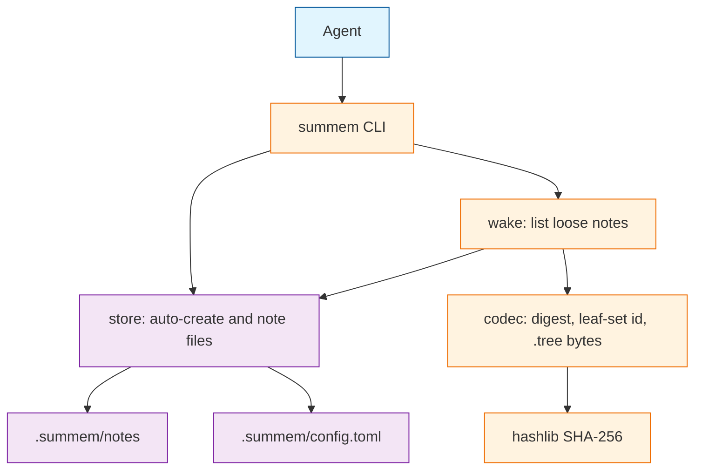
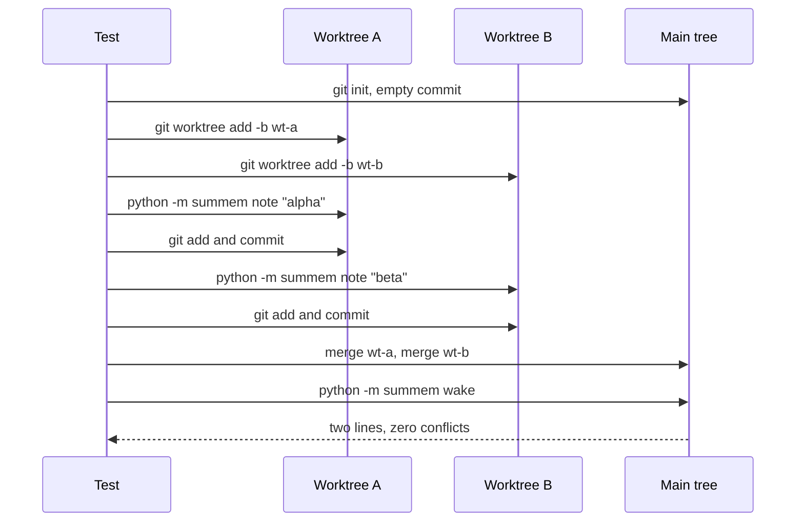

# Task: ingest

* Task ID: ingest
* Complexity: Level 3
* Type: feature

Python 3 CLI that auto-creates a git-root `.summem/` store, records immutable notes, and wakes a wait-free listing of those notes. First proof 1 is the gate. Store layout and leaf-set hashing freeze here, including canonical `.tree` bytes that this milestone does not yet persist.

## Pinned Info

### Format freezes

These are the identity contract. Later milestones consume them; they do not invent a second scheme.

- Store parent: walk from `$PWD` toward parents; first directory that contains `.git` (file or directory) wins. If none, the store parent is `$PWD`. Phase 1 only auto-creates at that parent. It does not walk to a non-root `.summem/` and does not implement `--path`.
- Store paths: `<parent>/.summem/config.toml`, `<parent>/.summem/notes/<name>`. Naps will live at `<parent>/.summem/naps/<leafset>.sum` and `.tree`. Phase 1 creates `notes/` and `config.toml` only.
- Note name: `YYYYMMDDTHHMMSSZ-` plus 16 lowercase hex characters from 8 random bytes. Sequence is `ls | sort` of that name.
- Note file bytes: UTF-8 of the note text plus a single trailing `\n`. The 280-byte `ENTRY_CHARS` limit is the text before that terminator.
- Note digest: lowercase hex `hashlib.sha256(file_bytes).hexdigest()`.
- Leaf-set id: sort those hex strings as ASCII, concatenate with **no delimiter** (safe: each digest is 64 hex characters), then lowercase hex `hashlib.sha256(join.encode("ascii")).hexdigest()`. A singleton note's content id is the leaf-set id of that one digest.
- Canonical `.tree` bytes: UTF-8 JSON, `sort_keys=True`, `separators=(',', ':')`, `ensure_ascii=False`, exactly one trailing `\n`. Schema:
  - Tree object: `v` (integer `1`), `kids` (array)
  - Note child: `k`=`n`, `name` (filename only), `text` (note text, no terminator)
  - Nap child: `k`=`p`, `id` (leaf-set hex of the **original notes**), `sum` (caption), `tree` (nested tree object)
- Wake line for a loose note: `<64-hex-id>  (1 note, from YYYY-MM-DD)  <text>` — two spaces around the grain parenthetical. Date comes from the filename prefix, not mtime. Full id, never an 8-character abbreviation, never a positional range, never a store path.
- Console entry: `summem` → `summem.cli:main`. Also `python -m summem`. Subcommands this milestone implements: `wake`, `note`. Everything else is an error.
- Package: `src/summem/` hatchling project, `requires-python = ">=3.11"`. Tests: pytest under `tests/`. Run with `uv run --python 3.11 pytest`. Do not use the bare `python3.11` pyenv shim on this machine (it 127s unless `PYENV_VERSION=3.11.11`).
- Default config file: a commented template string, not a TOML dump. `tomllib` reads; missing keys mean script defaults (`ENTRY_CHARS = 280`).

### Ingest components

Who calls whom, and which layer owns identity versus disk versus the agent-facing command names.

### Proof 1 merge

Two worktrees, two `note` processes, one git merge, two lines on wake.

## Component Analysis

### Affected Components
- **Identity codec** (`src/summem/codec.py`): does not exist → pure functions for note file bytes, note digest, leaf-set id, dumps/loads of canonical `.tree` bytes including nested nap children.
- **Store I/O** (`src/summem/store.py`): does not exist → find store parent, auto-create `.summem/`, write one immutable note via temp file plus `os.replace`.
- **Wake listing** (`src/summem/wake.py`): does not exist → wait-free list of loose notes with content ids; empty print is success.
- **CLI** (`src/summem/cli.py`, `src/summem/__main__.py`): does not exist → `wake` and `note` only; unknown commands and flags fail.
- **Package / test runner** (`pyproject.toml`, `tests/`): does not exist → hatchling + pytest so later milestones have a place to hang proofs 2–8.
- **Tech context** (`memory-bank/techContext.md`): still says no runner → point at `pyproject.toml` and `uv run --python 3.11 pytest` after the runner exists.

### Cross-Module Dependencies
- CLI → store: `note` and first-use auto-create.
- CLI → wake → store + codec: listing reads note files, codec names each line.
- Store does not import wake. Codec has no disk I/O.
- Proof 1 test → CLI as a process, then git merge, then CLI wake. It does not call store functions.

### Boundary Changes
- Public agent interface appears for the first time: `summem wake`, `summem note TEXT`.
- On-disk schema appears for the first time: `.summem/config.toml`, `.summem/notes/<utc>-<rand>`.
- Identity schema appears for the first time: digest, no-delimiter hex join, JSON `.tree` bytes. Phase 2 must import this codec, not re-derive it.
- No existing public interface to break. Empty `README.md` stays empty.

### Invariants and Constraints
- Agents never write the store. The script is the only writer.
- Ingest commutes: two notes are two paths. No next id. No shared mutable index.
- Sequence is in the filename.
- Wake never refuses to print.
- The agent interface does not mention store files, hashes as paths, or git.
- Hashing is `hashlib` SHA-256 only.
- Store directory is `.summem/`, not `.mem/`.
- This milestone does not implement `nap`, `zoom`, `recall`, `start`, `--path`, catalog, cover, or `ROADMAP.md` Later items.
- Compatibility-vector tests fail before codec code exists.

## Open Questions

None - implementation approach is clear. Architecture is already in `VISION.md`. Remaining format details are frozen in Pinned Info above, not rediscovered in a creative phase.

## Test Plan (TDD)

### Behaviors to Verify

- Note file bytes: text `"hello"` → `b"hello\n"`.
- Note digest: SHA-256 of those file bytes, lowercase hex.
- Leaf-set id of one digest: SHA-256 of that hex string as ASCII.
- Leaf-set id of two digests: sort the hex strings, concatenate with no delimiter, SHA-256 of the join. Order of inputs must not matter.
- `.tree` dumps of one note child: exact canonical JSON bytes including trailing newline.
- `.tree` dumps of a nap child whose nested tree holds two notes: exact bytes; nested object, not a string; `id` is the leaf-set id of the two original note file bytes.
- `loads_tree(dumps_tree(t))` round-trips note and nested nap trees.
- `note` of empty text is rejected. `note` of 281 UTF-8 bytes is rejected. `note` containing `\n` or `\r` is rejected. `note` of 280 UTF-8 bytes is accepted.
- First `note` in a git repo creates `.summem/config.toml` (comment-only template) and `.summem/notes/<utc>-<16hex>` whose contents are the file bytes above.
- First `wake` in a git repo with no store creates the store and prints nothing (exit 0).
- `wake` after two notes prints two lines, sorted by filename, each with a 64-hex content id and the grain `(1 note, from YYYY-MM-DD)`, and neither line contains `.summem`, `notes/`, or `git`.
- `note` does not take a caller-supplied filename. Two notes in the same UTC second still produce two paths.
- Unknown CLI command (`nap`) and unknown flag (`--path`) exit nonzero.
- First proof 1: two worktrees each `python -m summem note` once, commit, merge onto main, zero conflicts, `wake` shows both texts.

### Test Infrastructure

- Framework: pytest (none exists yet; created in unit 1 stub interface)
- Test location: `tests/`
- Conventions: `test_*.py`, pytest functions, `tmp_path` for repos, no assertions on `VISION.md` wording
- New test files: `tests/test_codec.py`, `tests/test_store.py`, `tests/test_wake.py`, `tests/test_cli.py`, `tests/test_proof_ingest.py`, `tests/gitutil.py`
- Runner: `uv run --python 3.11 pytest`

### Integration Tests

- Proof 1 (`tests/test_proof_ingest.py`): real git worktrees, real CLI process, real merge. This is the product gate, not a change-detector on the vision document.

## Implementation Plan

### 1. Identity codec — executable

- Files: `pyproject.toml`, `src/summem/__init__.py`, `src/summem/codec.py`, `tests/test_codec.py`
- Creative ref: none — format frozen in Pinned Info

1. Stub tests: `tests/test_codec.py` empty cases `test_note_file_bytes_appends_newline`, `test_note_digest_is_sha256_of_file_bytes`, `test_leafset_id_singleton_hashes_hex_ascii`, `test_leafset_id_sorts_and_concatenates_without_delimiter`, `test_dumps_tree_one_note_exact_bytes`, `test_dumps_tree_nested_nap_exact_bytes`, `test_loads_tree_round_trip`.
2. Stub interface: hatchling `pyproject.toml` (`requires-python = ">=3.11"`, script `summem = "summem.cli:main"`, optional `test = ["pytest"]`); empty `src/summem/__init__.py`; `src/summem/codec.py` signatures `note_file_bytes(text: str) -> bytes`, `note_digest(file_bytes: bytes) -> str`, `leafset_id(digests: list[str]) -> str`, `dumps_tree(tree) -> bytes`, `loads_tree(data: bytes)`, plus `NoteChild`, `NapChild`, `Tree` types — no bodies.
3. Write tests and run red: expected hashes via `hashlib` in the test (not via the codec). Exact `.tree` bytes written out as literals that match the Pinned Info dumps rules. Nested case uses two notes and one nap caption. Run `uv run --python 3.11 pytest tests/test_codec.py` — fail on missing implementation.
4. Write code and run green: implement the codec only. No store files. No CLI.

### 2. Store auto-create and note — executable

- Files: `src/summem/store.py`, `src/summem/defaults.py`, `tests/test_store.py`, `tests/gitutil.py`
- Creative ref: none

1. Stub tests: `test_note_rejects_empty`, `test_note_rejects_over_280_bytes`, `test_note_rejects_newline`, `test_note_accepts_280_bytes`, `test_first_note_creates_config_and_note_file`, `test_note_name_uses_injected_clock_and_rand`, `test_same_second_notes_are_two_paths`, `test_note_is_temp_then_replace`.
2. Stub interface: `ENTRY_CHARS = 280` and `CONFIG_TEMPLATE` in `src/summem/defaults.py`; `find_store_parent(cwd)`, `ensure_store(parent)`, `write_note(parent, text, now, rng)` in `src/summem/store.py`. `tests/gitutil.py`: `init_repo(path)` sets `user.name` / `user.email` and makes an empty commit.
3. Write tests and run red: use `tmp_path` + `init_repo`. Inject `now` and `rng`. Assert config is comments only (`tomllib.loads` yields `{}`) and contains `ENTRY_CHARS` as a comment. Assert file bytes equal `note_file_bytes(text)`. Assert no shared index file.
4. Write code and run green: mkdir, write template if config absent, validate text, write temp in `notes/`, `os.replace` to the UTC name. Do not hash-join in this unit except as needed to stay out of the file body.

### 3. Wake listing — executable

- Files: `src/summem/wake.py`, `tests/test_wake.py`

1. Stub tests: `test_wake_without_store_creates_and_prints_nothing`, `test_wake_lists_two_notes_sorted_by_filename`, `test_wake_line_has_full_id_and_grain_date_from_name`, `test_wake_output_omits_store_paths_and_git`, `test_wake_skips_unreadable_note_and_still_prints`.
2. Stub interface: `wake_text(parent) -> str` (empty string if no notes).
3. Write tests and run red: two injected names so sort order is known. Expected content id from `leafset_id([note_digest(note_file_bytes(text))])`. Grain date from the name prefix. Assert `.summem`, `notes/`, and `git` do not appear.
4. Write code and run green: `ensure_store`, list `notes/` regular files, skip names starting with `.`, skip unreadable files, sort, format lines, join with `\n` and a trailing `\n` if any lines else `""`.

### 4. CLI — executable

- Files: `src/summem/cli.py`, `src/summem/__main__.py`, `tests/test_cli.py`

1. Stub tests: `test_note_subcommand_writes_and_wake_reads`, `test_nap_is_unknown`, `test_path_flag_is_unknown`, `test_note_without_text_fails`.
2. Stub interface: `main(argv: list[str] | None = None) -> int`; `__main__.py` calls `sys.exit(main())`.
3. Write tests and run red: `monkeypatch.chdir` to an `init_repo` tmp. Call `main(["note", "hello"])` and `main(["wake"])`. `nap` and `--path` must be nonzero. Do not implement those commands to make the tests pass.
4. Write code and run green: argparse subcommands `wake` and `note` only. `note` takes one argument (the line). Store parent from cwd. Return 0 on success, 2 on usage errors, 1 on validation errors. Error text may say the line is too long or empty; it must not mention store paths or git.

### 5. Proof 1 worktree merge — executable

- Files: `tests/test_proof_ingest.py`

1. Stub tests: `test_two_worktrees_note_merge_without_conflict`.
2. Stub interface: none new — uses CLI and `gitutil`.
3. Write tests and run red: `git worktree add` two branches from the empty commit; in each, `subprocess` `[sys.executable, "-m", "summem", "note", ...]` then add/commit `.summem`; merge both into main; assert merge exit 0 and no conflict markers; `wake` stdout contains both texts and two content ids.
4. Write code and run green: if this fails, fix store/CLI, not the test. Do not add a lock or a shared index to make merge easier.

### 6. Python gitignore — prose/policy

- Files: `.gitignore`
- No tests: prose/policy artifact

1. Ignore `__pycache__/`, `*.py[cod]`, `*.egg-info/`, `.pytest_cache/`, `dist/`, `.venv/`, `uv.lock` only if we decide not to commit a lock (do not commit a lock in this milestone).
2. Do not ignore `.summem/` — that directory is product data users commit.

### 7. Tech context pointer — prose/policy

- Files: `memory-bank/techContext.md`
- No tests: prose/policy artifact

1. Replace "no runtime pin / no test runner" with pointers: Python `>=3.11` in `pyproject.toml`; hatchling build backend in `pyproject.toml`; tests via pytest as configured there, run with `uv run --python 3.11 pytest`.
2. Keep the hashing and `.summem/config.toml` facts. Do not add session-specific pyenv shim notes.

## Technology Validation

New tooling for this repo: Python 3.11+, hatchling, pytest, uv as the runner.

PoC in `/tmp/summem-tech-poc` (not in this tree): hatchling `src/` package, `uv run --python 3.11 --with pytest --with hatchling pytest` — 1 passed; `uv build --python 3.11` produced sdist and wheel. CPython used by uv was 3.11.13. `tomllib` and `hashlib` import on `~/.pyenv/versions/3.11.11/bin/python`. Bare `python3` is 3.10.12 (too old). Bare `python3.11` pyenv shim exits 127 unless `PYENV_VERSION=3.11.11`.

No new runtime dependencies. pytest is an optional test extra.

## Challenges & Mitigations

- **pyenv `python3.11` shim 127s:** always invoke tests through `uv run --python 3.11`. Document that in techContext as the run command, not as machine biography.
- **Worktree tests need an author:** `tests/gitutil.py` sets `user.name` and `user.email` locally on the temp repo.
- **Canonical JSON drift:** only `dumps_tree` may serialize trees. Tests lock exact bytes. Do not call `json.dumps` from store or wake.
- **Same-second collision:** 8 random bytes in the name; retry `os.replace` only if the destination exists.
- **Scope creep into nap/path:** CLI tests require those tokens to fail. Proof 1 is notes and merge only.
- **Unreadable note during wake:** skip that file and print the rest. Do not raise a "cannot wake" path.
- **Proof 1 must exercise the agent interface:** subprocess `python -m summem`, not `write_note()` directly.

## Pre-Mortem

- **Phase 2 invents a second `.tree` or a delimited hex join:** already covered by unit 1 nested vectors and the no-delimiter freeze; if a later reading of "join" tempts a newline separator, the vectors fail on purpose.
- **Wake prints 8-character ids because the vision example did:** freeze is full 64 hex; wake tests assert length 64.
- **Proof 1 is green because the test called library helpers and never merged blobs:** already covered by Challenge "Proof 1 must exercise the agent interface."
- **Tests run under Python 3.10 and someone backports tomllib:** already covered by `requires-python` and the uv 3.11 runner.
- **We "helpfully" implement `--path` so a worktree cwd still finds the store:** worktrees have their own cwd at the linked tree; git root detection is enough. `--path` stays unknown.
- **Default config is a `tomllib`-illegal dump or a rewritten file on every wake:** template is comments; `ensure_store` writes the file only when it is missing.

## Status

- [x] Component analysis complete
- [x] Open questions resolved
- [x] Test planning complete (TDD)
- [x] Implementation plan complete
- [x] Technology validation complete
- [x] Pre-Mortem complete
- [ ] Preflight
- [ ] Build
- [ ] QA
