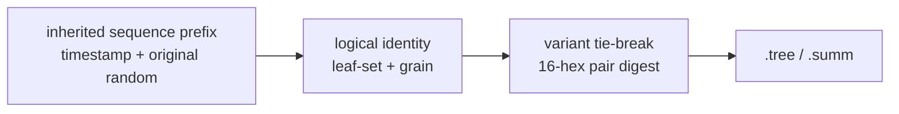
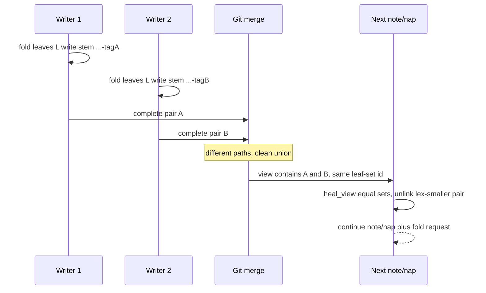

# Task: nap-variant-stems

* Task ID: nap-variant-stems
* Complexity: Level 3
* Type: feature (breaking disk-format)

Give nap pairs a five-part stem whose last field is a 16-hex digest of the pair bytes, so concurrent same-block folds merge as distinct paths. Git union, then the existing zipper drops all but one equal-leaf-set variant on the next `note`/`nap`. Dual-read four-part stems. Ship sibling `migrate.py` to rename complete legacy pairs. Spec: [issue #61](https://github.com/Texarkanine/SumMem/issues/61). Migration home: `memory-bank/active/creative/creative-nap-stem-migrate.md`.

## Pinned Info

### Nap stem fields

Sequence prefix is inherited and stable. Variant tag is only a same-block arbitrary tie-break. Agents never see or type the tag.

### Merge then zipper

Wake may print two same-id rows after a clean union. That is valid. The next mutating command reduces.

## Component Analysis

### Affected Components

- **Stem grammar** (`_parse_nap_stem`, new `variant_tag` / `nap_stem`): today four-part `{seq}-{leafset}-{grain}`. Add five-part `-{variant}`; parse both; constructor is the only writer of new names.
- **Fold write** (`write_nap`): today interpolates a four-part stem and dumps twice (once per file). Serialize once, hash those bytes, write those bytes via shared `_write_pair`.
- **Rematerialize** (`rematerialize_child`): today `_nap_stem` interpolates `{leftmost-seq}-{child.id}-{leaves}`. Delete `_nap_stem`. Serialize child pair bytes once, `nap_stem`, `_write_pair`. `surgery.py` `plan_break_out` uses the same `nap_stem` call (stem computation now serializes; that cost is required to name a five-part dest).
- **View** (`list_view`): already groups by stem and sorts by `node.name`. Dual-read only; public `ViewNode.id` stays the leaf-set field.
- **Heal** (`heal_view`, `_first_overlap`, `_unlink_node`): no algorithm change. Equal leaf sets already `<=`; list order makes the lex-smaller complete pair the one unlinked. Pin that consequence.
- **CLI** (`note`, `nap`, `wake`, `zoom`, `recall`): no new verbs, no new id grammar. Transient duplicate wake rows are allowed.
- **Migration helper** (`migrate.py`): new sibling operator tool. Loads `summem`, uses `started_stores` + `variant_tag` on on-disk bytes, renames complete four-part pairs. See creative.
- **Store listing** (`catalog_text`): extract `started_stores(git_root)` so catalog and migrate share ignore rules. `catalog_text` still prints other stores only.
- **Docs**: atlas nap naming + invariants; `systemPatterns.md` “honest conflict”; `productContext.md` success criteria.
- **This repo’s stores**: committed `.summem/naps` (root and `dogfood`) rewritten with `migrate.py` in the same breaking change.

### Cross-Module Dependencies

- `write_nap` / `rematerialize_child` / `surgery.py` → serialize pair bytes once → `nap_stem` → `_write_pair`.
- `list_view` → `_parse_nap_stem` (4 or 5 parts) → `heal_view` / `wake` / `zoom` / `recall`.
- `migrate.py` → `SourceFileLoader` `summem` → `started_stores` + `variant_tag` on **on-disk** bytes → rename both suffixes. Does not call `heal_view`.

### Boundary Changes

- Disk schema: new naps are five-part stems. Breaking vs a legacy driver (unsupported concurrent writer).
- `_parse_nap_stem` return value gains a fifth field (variant hex, or `""` for legacy).
- Agent CLI and leaf-set ids unchanged.
- README command table unchanged. `migrate.py` is not a `summem` verb.

### Invariants & Constraints

- Must preserve leaf-set identity as a digest of original notes, never of the caption or variant tag.
- Must preserve inherited `{timestamp}-{random}` sequence prefix byte-for-byte.
- Bytes hashed must be bytes written (`write_nap` / rematerialize) or bytes already on disk (`migrate.py`).
- `.tree` and `.summ` remain one atomic pair sharing the complete stem.
- Wake stays wait-free and does not heal.
- Script (driver or `migrate.py`) remains the only writer.
- Must not add a merge driver, wake-time heal, user-facing dedupe command, or caption-union policy.
- Must not preserve every competing summary; original note text is never lost.
- File count returns to O(view) after heal.

## Open Questions

- [x] **Where does the migration helper live, and what does it do?** → Resolved: sibling `migrate.py` (surgery analogue). Loads `summem`, hashes on-disk pair bytes, renames complete four-part pairs. Not a CLI verb. See `memory-bank/active/creative/creative-nap-stem-migrate.md`.

## Test Plan (TDD)

### Behaviors to Verify

- Domain-tagged pair digest: `variant_tag(tree_bytes, caption_bytes)` → 16 lowercase hex; identical inputs match; same tree/different caption differ; same caption/different tree differ; length prefixes keep `b"ab"+b"c"` from matching `b"a"+b"bc"`.
- Shared constructor: `nap_stem(seq, leafset, grain, tree_bytes, caption_bytes)` → `{seq}-{leafset}-{grain}-{tag}` with `tag == variant_tag(...)`.
- Parse dual-read: four-part stem → variant `""`; five-part → 16-hex variant; 3-part, 6-part, non-hex variant, non-digit grain → `None`.
- `write_nap` path is five-part; `{stem}.tree` / `{stem}.summ` bytes equal the hashed buffers; `dumps_tree` / `note_file_bytes` run once per fold.
- `rematerialize_child` of a `NapChild` reconstructs the same five-part paths as `write_nap` of that tree+caption; a second call is a no-op; nested grain-4 child uses the child’s pair bytes, not the parent’s.
- `list_view` lists both four-part and five-part complete pairs; `ViewNode.id` is the leaf-set field; a four-part stem of the same logical block sorts before the matching five-part stem.
- Atomic identity at unit level: two repos fold the same notes with captions "one" and "two" → identical `.tree` bytes, different complete stems, different `.summ` bytes (`test_same_children_same_tree_bytes_and_paths`).
- Grain-2 process test: two worktrees, different captions → `git merge` returncode 0, no unmerged `.summem/` paths, two same-id view rows (`test_same_pair_two_captions_conflict_only_on_sum` inverted in unit 2).
- Variant tag is not the public id: a five-part nap’s wake line uses a prefix of the leaf-set id, not the 16-hex tag; `zoom`/`nap` of that tag is `unknown id` when it is not a unique prefix of any named leaf-set id.
- Heal equal variants: two five-part equal-set pairs → one complete survivor, lex-greatest stem; three variants collapse to that same survivor regardless of insert order; four-part + five-part same set → five-part remains.
- Next `note` and next `nap` each heal before fold selection (existing `nap_locked` / `note_locked` threading stays).
- Different captions, same grain-2 leaves, two worktrees: `git merge` has zero unmerged `.summem/` paths; wake may show two same-id rows; after `note` or `nap`, one complete pair; both original notes zoom.
- Identical pair bytes: same stem; merge is one pair.
- Triple-worker 1→2→4 with different intermediate and parent captions: zero `.summem/` conflicts; next mutation one internally consistent pack; all four notes zoom.
- Merge-order determinism: reversing branch merge order keeps the same survivor stem.
- After merge+heal+commit+squash, a fresh clone zooms every original note from the surviving tree.
- Scan of `.summem/` after the merge scenario: no `<<<<<<<` and no stem whose `.tree`/`.summ` came from different variants.
- Ordering: distinct timestamps keep sequence-prefix order; two variants of one block are adjacent and differ only at the tag.
- Legacy four-part still wakes, zooms, recalls; rematerializing a nested child out of a legacy parent writes five-part.
- Existing zipper: strict-subset, partial-overlap, odd-arity, crash-recovery stay green.
- `migrate.py` on a four-part complete pair: dest is the constructor stem; sources gone; driver `list_view` sees one five-part node; second run exit 0; incomplete pair skipped with non-zero; `--path` does not touch another store; cataloged second store is rewritten on a default run.
- Existing `split("-")[-2]` test oracles that meant “leaf-set” go through `_parse_nap_stem` (those tests currently break on five-part names).

### Test Infrastructure

- Framework: pytest via `tox` (`py311`–`py314`), `testpaths = tests`, `SourceFileLoader` of repo-root `summem`.
- Test location: `tests/`.
- Conventions: one module per concern; process-level git tests use `gitutil.init_repo` and worktrees (`tests/test_caption_conflict.py`, `tests/test_worktree_note_merge.py`). Surgery tests load a sibling script via `SourceFileLoader` (`tests/test_surgery.py`).
- New test files: `tests/test_nap_variants.py` (process-level union/heal/squash), `tests/test_migrate.py` (operator helper). Unit digest/parse cases go in `tests/test_codec.py`.

### Integration Tests

- Two-worktree grain-2 caption divergence: git + `list_view` + `wake` + `heal_view` / CLI `note`/`nap` + `zoom`.
- Triple-worker 1→2→4: three worktrees, merge, heal, zoom of four notes.
- Squash clone: merge, heal, commit, squash, fresh clone zoom (extend the existing squash-clone pattern in `tests/test_squash_clone_zoom.py` or live in `test_nap_variants.py`).
- `migrate.py` default run across root + cataloged store in one tmp repo.

## Implementation Plan

### 1. Pair digest, stem constructor, dual-read parse — executable

- Files: `summem`, `tests/test_codec.py`
- Creative ref: n/a (algorithm is issue #61)

1. Stub tests: `test_variant_tag_is_16_lowercase_hex`, `test_variant_tag_changes_with_caption_or_tree`, `test_variant_tag_length_prefixes_are_unambiguous`, `test_nap_stem_is_five_part`, `test_parse_nap_stem_four_and_five_part`, `test_parse_nap_stem_rejects_bad_shape`.
2. Stub interface: `variant_tag(tree_bytes: bytes, caption_bytes: bytes) -> str`; `nap_stem(seq_prefix: str, leafset: str, grain: int, tree_bytes: bytes, caption_bytes: bytes) -> str`; change `_parse_nap_stem` signature to return `(stamp, rand, leafset, grain, variant) | None` with `variant=""` on four-part. Keep `write_nap` on four-part until unit 2. Leave `_nap_stem` as-is until unit 3 deletes it.
3. Write tests and run red: pin domain tag `b"SumMem nap pair v1\0"`, 8-byte big-endian lengths, SHA-256 then `[:16]`; pin parse of a real four-part fixture and a five-part fixture.
4. Write code and run green: implement those three functions. Update the one existing unpack in `tests/test_zoom.py` (`stamp, _rand, leafset, leaves = m._parse_nap_stem(...)`) to the five-tuple so the suite compiles; do not change that test’s planted four-part sibling yet.

### 2. `write_nap` five-part, bytes hashed are bytes written — executable

- Files: `summem` (`write_nap`, `_write_pair`), `tests/test_fold.py`, `tests/test_nap.py`, `tests/test_view.py`, `tests/test_wake.py`, `tests/test_caption_conflict.py`, `tests/test_zoom.py`

1. Stub tests: replace `test_nap_stem_inherits_left_child_seq_prefix` expected path with `nap_stem(...)`; add `test_write_nap_hashes_the_bytes_it_writes` (read back `.tree`/`.summ` and assert they equal the buffers passed to `variant_tag`); add `test_write_nap_serializes_tree_once` (wrap `dumps_tree`); add `test_wake_pack_line_uses_leafset_prefix_not_variant_tag`. Rewrite `test_same_children_same_tree_bytes_and_paths` (same `.tree` bytes, different stems, different `.summ`). Invert `test_same_pair_two_captions_conflict_only_on_sum` here (merge returncode 0, no `--diff-filter=U` paths, two same-id view rows) — do not wait until unit 5. Keep `test_planted_conflict_markers_wake_skips_caption_zoom_prints_leaves`.
2. Stub interface: add `_write_pair(naps_dir, stem, tree_bytes, caption_bytes)` that temp-replaces `{stem}.tree` then `{stem}.summ`. `write_nap` still four-part until step 4.
3. Write tests and run red: expected stems include the variant tag; `tests/test_nap.py` line 45 stem literal, line 68 same-path assertion, and line 271 `split("-")[-2]` oracle; `test_view.py` / `test_wake.py` leaf-set extraction via `_parse_nap_stem`; inverted caption-conflict merge assertions.
4. Write code and run green: `write_nap` serializes once, `stem = nap_stem(_seq_prefix(left.name), leafset, leaves, tree_bytes, caption_bytes)`, writes those bytes. Suite including `test_nap.py` and `test_caption_conflict.py` is green before unit 3.

### 3. Rematerialize uses the same constructor — executable

- Files: `summem` (`rematerialize_child`, delete `_nap_stem`), `surgery.py` (one call site), `tests/test_zipper.py`, `tests/test_surgery.py` if a dest-name pin exists

1. Stub tests: rewrite `test_rematerialize_nap_stem_uses_leftmost_seq_child_id_and_leaves` to expect `nap_stem` of the **same** `tree_bytes`/`caption_bytes` buffers later written; add `test_rematerialize_nap_is_idempotent_on_five_part`; add `test_rematerialize_nested_child_uses_child_pair_bytes`; add `test_rematerialize_serializes_tree_once`.
2. Stub interface: delete `_nap_stem`. Rematerialize and `surgery.py` (`plan_break_out`, line 145) call `nap_stem` with child pair bytes. Share `_write_pair` with `write_nap` so hashed bytes are written bytes by construction, not by a second `dumps_tree`.
3. Write tests and run red.
4. Write code and run green. Surgery dest names become five-part as a consequence; update a surgery test only if it pins a four-part dest.

### 4. Equal-set heal survivor — executable

- Files: `tests/test_zipper.py`, `summem` only if a test proves `_first_overlap`/`heal_view` wrong (expected: no production change)

1. Stub tests: `test_heal_equal_five_part_variants_keeps_lex_greatest`, `test_heal_three_equal_variants_same_survivor_any_order`, `test_heal_legacy_four_part_loses_to_five_part`.
2. Stub interface: none. Plant pairs by writing files (or `write_nap` then copy/rename a second caption’s dest).
3. Write tests and run red: after `heal_view`, exactly one complete pair; survivor name is `max(stems)`; zoom reaches original notes.
4. Write code and run green: production change only if a test fails; the issue claims existing `<=` + sort order already implements this.

### 5. Concurrent union proofs — executable

- Files: `tests/test_nap_variants.py` (new)

1. Stub tests in `test_nap_variants.py` only (caption-conflict inversion already landed in unit 2): identical bytes share a stem; `note` heals twins; `nap` heals twins; reversed merge order; three variants; triple-worker 1→2→4; sequence-prefix order; squash clone; no conflict markers / no mismatched pair.
2. Stub interface: none.
3. Write tests and run red: use the worktree pattern in `tests/test_caption_conflict.py` / `tests/test_worktree_note_merge.py`; scan `.summem` for `<<<<<<<`. Confirm `tests/test_branch_pack_merge.py` stays green (disjoint packs and overlapping heal-on-mutate); rewrite it only if a stem literal pins four-part names.
4. Write code and run green: production change only if union still conflicts (means step 2 stem constructor is wrong).

### 6. Legacy read and rematerialize-from-legacy — executable

- Files: `tests/test_view.py` or `tests/test_nap_variants.py`, `summem` if needed

1. Stub tests: plant a four-part pair; `wake`/`zoom`/`recall` succeed; split that pack via rematerialize of its `NapChild` kids and assert children land on five-part stems.
2. Stub interface: none.
3. Write tests and run red.
4. Write code and run green: should already follow from steps 1 and 3.

### 7. `migrate.py` — executable

- Files: `migrate.py`, `tests/test_migrate.py`
- Creative ref: `memory-bank/active/creative/creative-nap-stem-migrate.md`

1. Stub tests: load via `SourceFileLoader` like `tests/test_surgery.py`; four-part complete pair renamed to `nap_stem` of on-disk bytes; second run exit 0; incomplete pair skipped, exit non-zero; `--path` leaves a second store untouched; default run rewrites root and a cataloged child store. Add `test_started_stores_includes_root_and_other_parents` next to existing catalog tests.
2. Stub interface: `started_stores(git_root) -> list[Path]` in `summem` (root if `is_store`, plus parents of git-visible `/.summem/` paths, same ls-files ignore rules as `catalog_text`). `catalog_text` filters that list to “other” stores. `migrate.py` with `load_summem()`, `main()`, AGPL header like `surgery.py`, no `__version__`.
3. Write tests and run red.
4. Write code and run green: `migrate.py` calls `started_stores` (or `--path` / `resolve_parent`); hash on-disk bytes; rename both files; do not heal; do not re-`dumps_tree`. Then run the helper on this clone so committed `.summem/naps` and `dogfood/.summem/naps` become five-part; `git add` those rewritten files — they are store output the script wrote.

### 8. Atlas, patterns, product copy — prose/policy

- Files: `docs/architecture/index.md`, `memory-bank/systemPatterns.md`, `memory-bank/productContext.md`
- No tests: prose/policy artifact
- Creative ref: migrate invocation lives in the atlas change-surface row, not the README command table

1. Nap naming: five-part stem; logical id vs variant tag; sequence prefix inherited. Replace atlas naming sentence that currently ends “the rest of the name is the leaf-set id and the grain” (`docs/architecture/index.md` ~line 63).
2. Replace “the caption is the only honest conflict” / “same-block naps conflict only on the caption” with union then zipper-reduce; transient duplicate wake rows are valid; equal-set survivor is hash-order; `.tree`/`.summ` are one atomic variant pair; file count returns to O(view) after heal; legacy drivers are unsupported once five-part stems exist. Rewrite the atlas paragraph that currently says two agents who nap the same two loose notes get the same children file and a different caption file (`docs/architecture/index.md` ~line 95): different pair bytes are different paths; git unions them.
3. Add a change-surface row for upgrading on-disk nap names: run `migrate.py`; do not `mv` by hand.
4. Close #59 as superseded in the PR body (no code).

## Technology Validation

No new technology - validation not required. `hashlib` and `SourceFileLoader` are already how this repo hashes and how `surgery.py` loads the driver.

## Challenges & Mitigations

- **Tests still parse leaf-set as `split("-")[-2]`**: five-part names make that grain. Mitigation: unit 2 rewrites those oracles to `_parse_nap_stem` in the same red/green cycle as `write_nap`.
- **Existing tests assert same dest paths / caption-only merge conflict**: `test_same_children_same_tree_bytes_and_paths` and `test_same_pair_two_captions_conflict_only_on_sum` invert in unit 2 so units 2–4 can go green. Unit 5 does not repeat that inversion.
- **`write_nap` hashes a second `dumps_tree` call**: Mitigation: serialize once; `_write_pair`; unit 2 and unit 3 both assert call count and disk bytes.
- **`migrate.py` re-serializes and disagrees with on-disk JSON**: Mitigation: creative decision — hash file bytes, never re-dump.
- **Heal does not drop the lex-smaller equal variant**: Mitigation: unit 4 fails first; only then change `_first_overlap` (do not pre-emptively rewrite heal).
- **Windows path length**: Mitigation: issue already counts 121+d; add no full 64-hex suffix. No extra Windows CI; keep ASCII-only names.
- **This repo stays on four-part stems and never dogfoods**: Mitigation: unit 7’s green step runs `migrate.py` on this clone and commits the rewritten store.
- **`test_zoom` planted four-part sibling unpack breaks**: Mitigation: unit 1 updates the unpack to five-tuple immediately; keep the planted four-part file as a dual-read fixture until unit 6 replaces or complements it.
- **Single-file `.nap` instead of `.tree`+`.summ`**: out of scope. A conflict-marked caption must still degrade wake while the payload stays zoomable. Do not collapse the pair.

## Pre-Mortem

- **The plan treats heal as “already correct” and ships without pinning survivor order**: unit 4 exists specifically to pin lex-greatest / legacy-loses-to-new. Already covered by Challenge “Heal does not drop…”.
- **Caption-conflict process test is left asserting unmerged `.summ`**: inversion now lives in unit 2, not unit 5. Already covered by Challenge “Existing tests assert same dest paths…”.
- **Migration is documented but operators `mv` and mismatch `.tree`/`.summ`**: change-surface row plus “script is the only writer” already forbids hand `mv`; `migrate.py` renames both suffixes together. Already covered.
- **L3 was the wrong level because triple-worker git proofs balloon**: those proofs are additional tests on one constructor, not extra subsystems. No re-level. If preflight disagrees, stop.

## Status

- [x] Component analysis complete
- [x] Open questions resolved
- [x] Test planning complete (TDD)
- [x] Implementation plan complete
- [x] Technology validation complete
- [x] Pre-Mortem complete
- [x] Preflight
- [ ] Build
  - [x] Unit 1: pair digest, stem constructor, dual-read parse
  - [x] Unit 2: write_nap five-part
  - [x] Unit 3: rematerialize uses nap_stem
  - [x] Unit 4: equal-set heal survivor
  - [x] Unit 5: concurrent union proofs
  - [x] Unit 6: legacy read and rematerialize-from-legacy
  - [ ] Unit 7: migrate.py
  - [ ] Unit 8: atlas, patterns, product copy
- [ ] QA
