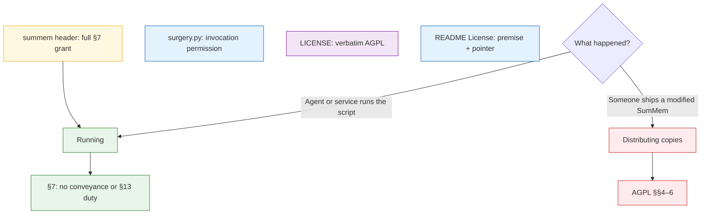

# Task: agpl-carve-outs

* Task ID: agpl-carve-outs
* Complexity: Level 3
* Type: enhancement

Two AGPL carve-outs (obligation-free prompt text; full permission for AI-agent invocation) with the script as the authoritative source. Use is allowed. A published fork still trips AGPL.

## Pinned Info

### Authority and use versus fork

The script is the grant. Repo files echo or hold stock AGPL. Running is permitted; distributing copies of the Program is not.

## Component Analysis

### Affected Components
- `summem` header: AGPL short notice today → add both §7 permissions (authority)
- `prompt_text()` / `init` / `docs/agents-prompt.md` / `AGENTS.md`: lockstep paste → **no license text** in the paste
- `LICENSE`: verbatim AGPL → **do not edit**
- `README.md` License section: link to `LICENSE` only → premise + pointer at the script header
- `surgery.py` header: AGPL short notice → add invocation permission only
- `summem version`: prints `__version__` → **no change**

### Cross-Module Dependencies
- `init` prints `prompt_text()`; `docs/agents-prompt.md` and `AGENTS.md` stay lockstep (`tests/test_init.py`)
- Consumers typically copy only `summem`; repo-root files do not travel
- GitHub / SCA read verbatim `LICENSE` plus the script

### Boundary Changes
- Legal public interface of the program (what a recipient may do when *running* it) is stated in the script header
- No CLI, store, or prompt-string behavior change

## Open Questions

- [x] **Legal instruments** → Resolved: AGPL §7 additional permissions in the source (prompt = part-of-program, no-copyright + unrestricted copy; invocation = running only, including “even if”). No dual-license, no SPDX `WITH` exception. See `memory-bank/active/creative/creative-legal-instruments.md`.
- [x] **Authority and echoes** → Resolved: script-complete, no REUSE. Full §7 text in the `summem` header; `LICENSE` stays verbatim AGPL; README premise + pointer; `surgery.py` echoes invocation only. See `memory-bank/active/creative/creative-authority-echoes.md`.

## Test Plan (TDD)

### Behaviors to Verify

No new executable behavior.

### Test Infrastructure

- Framework: pytest via `tox` (`pytest.ini`, `testpaths = tests`)
- Test location: `tests/`
- Conventions: load repo-root `summem` with `SourceFileLoader`; existing lockstep tests in `tests/test_init.py` and version tests in `tests/test_version.py`
- New test files: none
- Do not add change-detectors on header, README, or license wording
- Do not modify `tests/test_init.py` or `tests/test_version.py` unless a later edit accidentally changes `prompt_text()` or `version` output (that would be a bug, not a planned test change)

### Integration Tests

None. No cross-component executable interaction changes.

## Implementation Plan

### 1. summem header — prose/policy ✅

- Files: `summem`
- No tests: prose/policy artifact
- Creative ref: `memory-bank/active/creative/creative-legal-instruments.md`, `memory-bank/active/creative/creative-authority-echoes.md`

1. After the existing AGPL short notice, insert the §7 invocation paragraph from `creative-legal-instruments.md` and the 0BSD terms for the prompt template (operator amendment). A short use-versus-fork capsule may sit above the FSF short notice (preflight advisory).
2. Do not add `SPDX-License-Identifier` with `WITH`. Do not dual-license the Program. Do not put grant text, SPDX tags, or license notices inside `prompt_text()`, `init_text()`, `docs/agents-prompt.md`, or `AGENTS.md`.

### 2. surgery.py header — prose/policy ✅

- Files: `surgery.py`
- No tests: prose/policy artifact
- Creative ref: `memory-bank/active/creative/creative-authority-echoes.md`

1. After the existing AGPL short notice, add the **invocation** permission only, using the same words as the invocation paragraph in `summem`.
2. Do not add the prompt permission (this file does not emit the template).

### 3. README License section — prose/policy ✅

- Files: `README.md`
- No tests: prose/policy artifact
- Creative ref: `memory-bank/active/creative/creative-authority-echoes.md`

1. Rewrite the `## License` section: the program is AGPL (link `LICENSE`); additional permissions for the prompt and for agent invocation live in the comment block at the top of `summem` and are the authoritative statement; a typical install copies that file.
2. Do not add `COPYING`, `LICENSING.md`, `REUSE.toml`, or `LICENSES/`. Do not edit `LICENSE`.

### 4. techContext pointer — prose/policy ✅

- Files: `memory-bank/techContext.md`
- No tests: prose/policy artifact

1. Surgical update: keep “License: GNU AGPL v3, in `LICENSE`”; add that additional permissions are stated in the `summem` header (authoritative) and echoed on `surgery.py` (invocation only).

## Technology Validation

No new technology - validation not required

## Challenges & Mitigations

- Grant wording drifts from Creative during Build: copy the draft terms from `creative-legal-instruments.md`; do not invent a wider or narrower grant.
- Wording that sounds like permission to publish a fork: keep the sentence that the permission does not apply to distributing copies of the Program or a modified version.
- License notice accidentally lands in the paste prompt: step 1 forbids editing `prompt_text()` and the lockstep files; existing `tests/test_init.py` lockstep will catch an accidental string change.
- Editing `LICENSE` breaks GitHub detection: step 3 forbids it.
- Preflight or QA demand tests for the header: this is prose/policy; always-tdd says omitting tests for those artifacts passes.

## Pre-Mortem

- Build improvises “friendlier” legal text and accidentally dual-licenses or blesses conveying a fork: already covered by the Creative-copy challenge; the plan names the draft source and the “distributing copies” sentence as load-bearing.
- Plan is treated as a feature with new `version` output or REUSE tooling, and TDD/preflight explodes: those are explicit non-goals in Component Analysis and Technology Validation. Do not add them in Build.
- `surgery.py` is skipped and only `summem` is updated: step 2 is a required unit, not optional polish.

## Status

- [x] Component analysis complete
- [x] Open questions resolved
- [x] Test planning complete (TDD)
- [x] Implementation plan complete
- [x] Technology validation complete
- [x] Pre-Mortem complete
- [x] Preflight
- [x] Build
- [x] QA

## QA Results

✅ PASS

- **KISS / DRY / YAGNI** — Comment-only grant and echoes. Invocation text is duplicated on `surgery.py` by design. No new files, SPDX `WITH`, REUSE, or `version` output.
- **Completeness** — Four planned units landed. Script-only reader sees AGPL, invocation permission, and 0BSD prompt terms. Paste files and `LICENSE` were not edited.
- **Regression / Integrity** — FSF short-notice shape kept (blank lines became `#` separators). No stubs, TODOs, placeholders, or grant leakage into `prompt_text()` / lockstep files.
- **Documentation** — README License and `techContext.md` updated as planned. `productContext.md` and `docs/` have no license clause that needed a change.
- **Advisory** — Live invocation wording is the operator-settled three-paragraph form, not the Creative draft’s “even if” / “not conveyance” sentences. Do not reopen.
- **Advisory** — README restates two header conclusions (caller not a covered work; outside-org modified availability stays AGPL). Consistent today; drift if only one side is edited.
