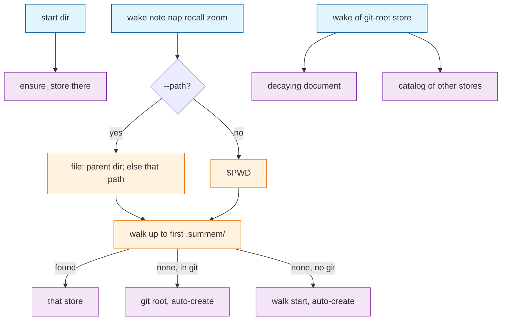

# Task: scopes

* Task ID: scopes
* Complexity: Level 2
* Type: simple enhancement

Addressing on the existing CLI: `start`, `--path` walk-up, root-wake catalog, per-store `config.toml`, first proofs 7-8. Identity, nap, zipper, and zoom-from-`HEAD` stay.

## Test Plan (TDD)

### Behaviors to Verify

- Resolve from a subdirectory with no nested store → git-root store, same as today; auto-create still happens at the git root, not at the subdirectory.
- Resolve from inside a started directory → that store, not the git root.
- `--path` to an existing directory → walk from that directory.
- `--path` to a file, including one that does not exist yet → walk from its parent directory.
- `--path` omitted → walk from `$PWD`.
- `start <dir>` → creates `.summem/` in that directory, including driver and commented config; does not create stores on ancestors; does not walk-up.
- `note --path foo/packages/baz/fee.ts` after `start foo/packages/baz` → note file lands in `foo/packages/baz/.summem/notes/`, not in the git-root store.
- `note --path` under an unstarted sibling → git-root store.
- Root `wake` with another started store → decaying document plus a catalog entry: relative path of the started directory, note count, latest date when notes exist, and `.summem/summem wake --path <relpath>`. Empty catalog prints nothing extra.
- `wake --path` on a started store → that store's document only. No root notes. No catalog.
- A `.summem/` ignored by git, including `.git/info/exclude` → omitted from the catalog.
- `config.toml` `WAKE_LINES` on a store → that store's wake and fold-request budget. Another store's file does not. Missing or commented names → module constants so existing `monkeypatch.setattr(m, "WAKE_LINES", …)` tests stay green.
- Unreadable `config.toml` → defaults. Wake still prints. File is not rewritten.
- `--path` is a known flag. `start` does not take `--path`.
- Catalog and errors still omit `notes/`, `naps/`, and `git`.

### Test Infrastructure

- Framework: pytest as configured in `pytest.ini`, run with `uv run --python 3.11 --with pytest pytest`
- Test location: `tests/`
- Conventions: `test_*.py`, `load_summem()` + `init_repo()` from `conftest.py` / `gitutil.py`; CLI via `m.main([...])` with `monkeypatch.chdir`; first proofs as subprocess against `SCRIPT`
- New test files: `tests/test_scopes.py`, `tests/test_proof_scopes.py`
- Existing tests to invert: `tests/test_cli.py` (`test_path_flag_is_unknown`), `tests/test_fold.py` (`test_config_toml_is_not_read`)

## Implementation Plan

### 1. Resolve walk-up — executable

- Files: `tests/test_scopes.py`, `.summem/summem`

1. Stub tests: `tests/test_scopes.py` empty cases `test_resolve_subdir_without_store_is_git_root`, `test_resolve_inside_started_dir_is_that_store`, `test_resolve_path_file_walks_from_parent`, `test_resolve_missing_file_walks_from_parent`, `test_resolve_omitted_path_uses_cwd`.
2. Stub interface: `is_store(directory)`, `resolve_parent(cwd, path_arg=None)` with docstrings. Keep `find_store_parent` as the `.git` walk for auto-create and "is this the git root".
3. Write tests and run red: subdirectory without `.summem/` resolves to the git root; after `ensure_store` on a nested dir, resolve from that dir or from a missing file under it returns the nested parent; omitted `path_arg` uses cwd; `is_file` vs missing path uses parent; existing directory uses itself.
4. Write code and run green: walk from the start path toward the git root and return the first `is_store`. If none, return the git root when in git, else the start path. Existing directory: start there. Else: start at parent. Switch `main` to `resolve_parent(Path.cwd())` so CLI from a subdirectory still auto-creates at git root. Do not add `--path` or `start` yet. Do not call `ensure_store` on skipped ancestors.

### 2. start — executable

- Files: `tests/test_scopes.py`, `tests/test_cli.py`, `.summem/summem`

1. Stub tests: `test_start_creates_store_in_dir`, `test_start_does_not_create_ancestor_stores`, `test_start_without_dir_is_usage`.
2. Stub interface: `start` subparser with positional `dir`; no `--path` on it.
3. Write tests and run red: `main(["start", "foo/packages/baz"])` creates `foo/packages/baz/.summem/{summem,config.toml,notes,naps}`; `foo/.summem` and `foo/packages/.summem` absent; `tomllib.loads` of that config is `{}`; `main(["start"])` nonzero; existing `test_first_note_creates_config_notes_and_driver` still holds at git root.
4. Write code and run green: resolve `dir` against cwd, create the directory if needed, `ensure_store` there, return 0. Do not walk-up. Do not heal. Do not flock waiting for a caption.

### 3. --path on every other command — executable

- Files: `tests/test_cli.py`, `tests/test_scopes.py`, `tests/test_proof_scopes.py`, `.summem/summem`

1. Stub tests: replace `test_path_flag_is_unknown` with `test_path_flag_is_known`; add `test_note_path_writes_started_store`, `test_note_path_rolls_up_when_unstarted`; add `tests/test_proof_scopes.py` empty `test_note_path_lands_in_started_store_else_ancestor`.
2. Stub interface: optional `--path` on `wake`, `note`, `nap`, `zoom`, `recall` only.
3. Write tests and run red: `main(["wake", "--path", "."])` returns 0; `note --path foo/packages/baz/fee.ts` after start writes under baz, not root; unstarted sibling rolls up; proof 7 as subprocess: start `foo/packages/baz`, `note --path foo/packages/baz/fee.ts`, the note bytes live only in that store; a second `note --path` under an unstarted sibling lives only in the git-root store.
4. Write code and run green: `main` passes `args.path` into `resolve_parent`. Nap, zoom, recall, and wake use the same parent. Invert the unknown-flag pin. Do not load other stores.

### 4. Per-store config — executable

- Files: `tests/test_fold.py`, `tests/test_scopes.py`, `.summem/summem`

1. Stub tests: replace `test_config_toml_is_not_read` with `test_config_toml_wake_lines_is_read`; add `test_config_wake_lines_is_per_store`, `test_unreadable_config_uses_defaults`, `test_monkeypatch_wake_lines_still_applies_when_config_omits_knob`.
2. Stub interface: `knobs(parent)` returning `WAKE_LINES` and `ENTRY_CHARS`; `import tomllib`; `CONFIG_TEMPLATE` gains a commented `# WAKE_LINES = 32`.
3. Write tests and run red: store config `WAKE_LINES = 1` makes `main(["note", "beta"])` after one existing note print a fold request; a second store with default config still uses 32; broken TOML uses defaults and does not rewrite the file; `monkeypatch.setattr(m, "WAKE_LINES", 1)` still applies when the template is all comments; `test_first_note_creates_config_notes_and_driver` still sees `tomllib.loads(config) == {}`.
4. Write code and run green: after `ensure_store`, parse `config.toml` if present; omit or unreadable → module constants. `wake_text` and `fold_request` and CLI `require_entry` use that store's knobs. Do not rewrite config on wake or note. Do not read environment variables.

### 5. Root-wake catalog — executable

- Files: `tests/test_scopes.py`, `tests/test_proof_scopes.py`, `.summem/summem`

1. Stub tests: `test_root_wake_catalogs_other_store`, `test_pull_wake_omits_catalog_and_root_notes`, `test_ignored_store_omitted_from_catalog`, `test_empty_catalog_adds_no_output`; add `test_root_wake_lists_other_stores_pull_prints_only_that_store` to `tests/test_proof_scopes.py`.
2. Stub interface: `catalog_text(git_root, resolved_parent)` .
3. Write tests and run red: after `start pkg` and a note in each store, root `wake` contains `pkg`, a note count, a latest date, and `.summem/summem wake --path pkg`, and does not contain `notes/`, `naps/`, or `git`; `wake --path pkg` contains the package note, not the root note, and not the catalog instruction for `pkg`; a store listed in `.git/info/exclude` is absent from the catalog; a repo with only the git-root store has the same wake bytes as the decaying document. Proof 8 as subprocess covering the same split.
4. Write code and run green: only when the resolved store is the git root, walk for other `.summem/` directories, skip `.git`, skip paths `git check-ignore -q --` accepts, skip the root store itself. Note count = non-dot files in that store's `notes/`. Latest date = max filename stamp among notes and naps, omitted when count is 0. Sort by relative path. Append after the document with no extra banner when the list is empty. Do not `ensure_store` or flock discovered stores. Do not keep an index file.

## Technology Validation

No new technology - validation not required. `tomllib` is stdlib on the existing Python 3.11 floor. `git check-ignore` is git, already required to merge stores.

## Dependencies

- Unit 2 needs unit 1 (`ensure_store` at a resolved nested path).
- Unit 3 needs unit 2 (`start` before `--path` proofs).
- Unit 4 is independent of the catalog; it must land before unit 5 so a pull can assert per-store `WAKE_LINES` if a catalog test sets one.
- Unit 5 needs units 1–3.

## Challenges & Mitigations

- Catalog emptiness because `.summem/notes/` is gitignored: `git check-ignore` the `.summem` directory path, not `notes/`. This repo's `.gitignore` ignores root `notes/` and `naps/` and still tracks `.summem/summem`, so the root store directory is not ignored.
- `monkeypatch.setattr(m, "WAKE_LINES", N)` suite: `knobs` fills omitted names from the module constant, so those tests stay valid.
- `wake_text` exact-equality tests: catalog is appended in `main` for git-root resolution only, not inside `wake_text`, so in-process `wake_text(repo)` stays the decaying document.
- Missing `--path` target: if the path exists as a directory, walk from it; otherwise walk from its parent, so `fee.ts` does not have to exist yet.
- `list_view` → `ensure_store`: catalog must not call `list_view` on discovered stores.

## Pre-Mortem

- Catalog never lists nested stores because we treated gitignored *data* as an ignored *store*: already covered by the check-ignore challenge.
- Existing fold tests go red because config always wins over the constant: already covered by filling omitted names from `WAKE_LINES`.
- Treating this as four products and inventing a second identity or a committed catalog index: out of brief; do not.
- `--path` to a not-yet-written file walking from the file path itself and missing the started parent: already covered by the missing-target rule.

## Status

- [x] Initialization complete
- [x] Test planning complete (TDD)
- [x] Implementation plan complete
- [x] Technology validation complete
- [x] Pre-Mortem complete
- [ ] Preflight
- [ ] Build
- [ ] QA
