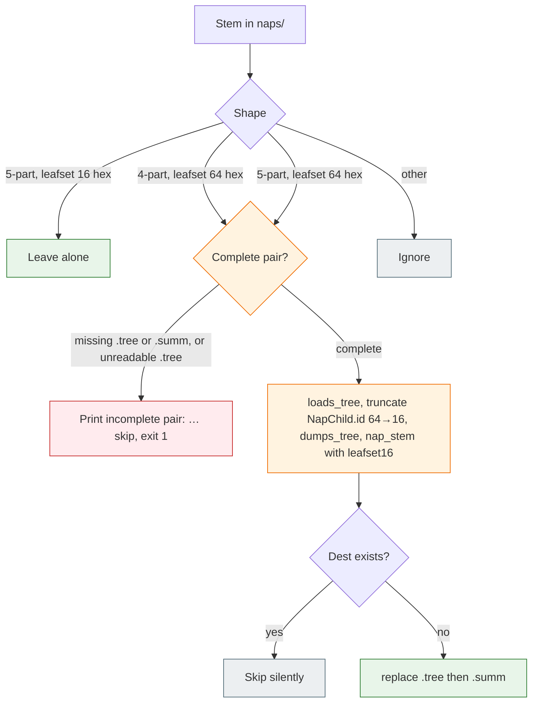

# Task: 16-hex-leafset

* Task ID: 16-hex-leafset
* Complexity: Level 3
* Type: enhancement (breaking on-disk identity width)

Store public leaf-set ids as the first 16 hex of the existing SHA-256. Driver writes and parses only five-part stems with a 16-hex leaf-set field. `migrate.py` consumes four-part 64-hex and five-part 64-hex pairs in one pass, rewrites nested `.tree` `id` fields, recomputes the variant tag, and writes five-part 16-hex. Spec: [SumMem #67](https://github.com/Texarkanine/SumMem/issues/67).

## Pinned Info

### Migrate dispatch

One pass over each store's `naps/` stems. The driver never reads the two old forms; only this helper does.

## Component Analysis

### Affected Components
- **`leafset_id` / `_parse_nap_stem` (`summem`)**: Identity and view listing. `leafset_id` still SHA-256 of sorted concatenated note-digest hex; **return value is `[:16]`** so every stored public id (note `ViewNode.id`, nap stem field, `NapChild.id` from `write_nap`) is 16 hex from one function. `_parse_nap_stem` requires `len(leafset) == 16` (variant stays 16). Four-part and five-part-64 stems are not view nodes.
- **`write_nap` / `child_nap_stem` / `nap_stem` (`summem`)**: No new serialize-then-name path. They already pass `leafset_id(...)` or `child.id` into `nap_stem`. After the truncation they write five-part-16. Rematerialize follows `child_nap_stem`.
- **`list_view` / `_index_tree` / `named_ids` (`summem`)**: View nap ids come from the stem; nested ids come from `.tree`. After migrate they are the same 16-hex width, so `resolve_id` is not a prefix of a leftover 64-hex nested id. Heal still walks **note digests** from raw JSON (`_digests_of_dict`); that 64-hex layer is unchanged (note rands / note file hashes are not this issue).
- **`migrate.py`**: Today `_four_part_stem` + rename hashing **on-disk** bytes (no re-`dumps_tree`). Grows a second source grammar: 4-part-64 and 5-part-64. Must parse `.tree`, truncate nested nap `id` fields, re-`dumps_tree`, recompute `variant_tag` from the **new** pair bytes, write five-part-16. 5-part-16 left alone. Incomplete / dest-exists / `--path` / default-all-started-stores unchanged in policy. Still no `__version__`, still not a `summem` verb.
- **This clone's stores**: Root `.summem/naps` and `dogfood/.summem/naps` are currently five-part-64. Same change rewrites them so committed files match the driver.
- **Atlas / `systemPatterns.md` / `README.md`**: “64-hex stays on disk” / “Filenames and `.tree` identity stay 64 hex” / Identity “Stored names keep the full id” become 16 hex stored, unique-prefix displayed. Change-surfaces row for `migrate.py` covers both old grammars and nested-id rewrite. README on-disk walkthrough (`README.md:91-92`) still prints a 64-hex leaf-set in the pair basename; truncate that field to 16 hex (example `.tree` is note-only, so the variant tag stays). There is no in-tree “do not shorten the leaf-set id” sentence to retire.

### Cross-Module Dependencies
- `write_nap` → `leafset_id` → `nap_stem` → `_write_pair`. Truncation at `leafset_id` is sufficient for new folds.
- `list_view` → `_parse_nap_stem` (stem field) and `_index_tree` → `NapChild.id` (JSON). Both must be 16 hex or `resolve_id` is ambiguous.
- `migrate.py` → `load_summem()` → `loads_tree` / `dumps_tree` / `nap_stem` / `started_stores` / `resolve_parent`. Migrate is the only old-stem reader.
- Tests load `summem` via `conftest._SUMMEM`; migrate tests `exec_module` overwrite `sys.modules["summem"]` (already handled).

### Boundary Changes
- **Breaking:** on-disk nap stem leaf-set field 64 hex → 16 hex; nested `.tree` `"id"` values for `type=nap` likewise. Unmigrated 4-part and 5-part-64 files are invisible to wake, zoom, and recall.
- **Not a boundary change:** hash algorithm, variant tag, seq prefix, grain, note filename rands, `short_id` floor 8, CLI verbs, heal overlap (note digests).
- **Plan decision (not an open question):** truncation lives **inside** `leafset_id`, not at each call site. The issue's birthday bound is the `named_ids` pool (notes + naps). Call-site slicing would leave note view ids at 64 hex and reintroduce prefix ambiguity. Do not add a production `leafset_id_full`; migrate tests that plant 64-hex fixtures compute the full digest with `hashlib` in the test module.

### Invariants
- `leafset_id` is SHA-256 of sorted no-delimiter note-digest hex; stored form is the first 16 lowercase hex characters.
- Driver lists only `{seq}-{leafset16}-{grain}-{variant16}`.
- `write_nap` and `child_nap_stem` remain one serialize-then-name path; bytes hashed are bytes written.
- Nested `NapChild.id` and the parent stem's leaf-set field are the same 16-hex public id.
- `migrate.py` is the only reader of 4-part and 5-part-64 stems.
- Filename-only truncate is forbidden: JSON `id` fields of nap children must shorten too.
- Agents never see or type the variant tag; addressing is unique prefix of the 16-hex leaf-set field; `short_id` floor stays 8.

## Open Questions

None - implementation approach is clear. The issue already chose 16 hex, dual-source migrate, nested-id rewrite, and no driver dual-read.

## Test Plan (TDD)

### Behaviors to Verify

- `leafset_id` of a singleton (or of two sorted digests) equals `hashlib.sha256(...).hexdigest()[:16]`, length 16, lowercase hex.
- `_parse_nap_stem` accepts five-part with `len(leafset)==16` and `len(variant)==16`; returns `None` for four-part, five-part-64, 3-part, 6-part, non-hex variant, non-digit grain.
- `nap_stem` / `child_nap_stem` with a 16-hex leafset parse; a 64-hex leafset in `nap_stem` is not a view name (`_parse_nap_stem` is `None`).
- `write_nap` of two notes writes a five-part stem whose leaf-set field is `leafset_id` (16 hex) and whose `.tree` has no 64-hex nap `id` (grain-2 has only notes).
- Folding two grain-2 naps: nested `NapChild.id` in the parent `.tree` is 16 hex and equals the child's public id.
- `list_view` note id length is 16 (same function).
- A planted five-part-64 pair is not a view node (wake/zoom/recall miss it), matching today's four-part invisibility.
- `migrate.py` on a complete four-part-64 grain-2 pair: dest is five-part-16; `.tree` bytes are `dumps_tree` of the shortened tree (identity for note-only trees that were already canonical); caption unchanged; source gone; `list_view` sees the dest.
- `migrate.py` on a complete five-part-64 grain-2 pair: same dest form; second run no-op.
- `migrate.py` on a complete five-part-64 grain-4 pair whose nested `id` is 64 hex: nested `id` becomes 16 hex; variant is `variant_tag` of the **rewritten** tree bytes plus original caption (not the old tag); dest stem uses `leafset[:16]`.
- Incomplete old pair (missing `.summ`): stderr `incomplete pair: …`, exit 1, leftover file unchanged.
- Unreadable `.tree` on an old stem: same incomplete skip (cannot filename-only truncate).
- Dest already exists: skip silently, source left, exit 0.
- `--path` rewrites one store; default run rewrites root and a cataloged child.
- 5-part-16 already on disk: migrate does not rename or rewrite.

### Test Infrastructure

- Framework: pytest as in `pytest.ini` (`testpaths = tests`), iterate `tox -e py311 -- <file>::<test>`.
- Test location: `tests/`
- Conventions: module docstring; per-test docstring is the behavior; `summem` fixture; `init_repo`; migrate loaded via `SourceFileLoader` in `tests/test_migrate.py`.
- New test files: none. Extend `tests/test_codec.py`, `tests/test_migrate.py`, `tests/test_nap_variants.py`, and adjust length assertions in `tests/test_wake.py` (`test_wake_line_is_dated_grain_for_a_note` line 58 `== 64` → `== 16`; `test_wake_over_budget_prints_every_view_node` line 270 `len(part) != 64` → `len(part) != 16`, so it still guards against printing a full stored id) and `tests/test_caption_conflict.py`. Hardcoded `"c" * 64` / `"b" * 64` **leafset** fixtures in `tests/test_codec.py` become `* 16`. Unknown-id sentinels (`"0" * 64` in zoom/nap CLI) may stay: they are not stored ids.

### Integration Tests

- `tests/test_migrate.py`: plant 64-hex fixtures with `hashlib` (do not round-trip `write_nap` then strip a now-16-hex field). Cover 4-part and 5-part-64, including a nested nap `id`.
- Existing process-level nap/wake/zoom/recall tests keep passing against 16-hex ids they obtain from `list_view`.

## Implementation Plan

### 1. Stored leaf-set width — executable

- Files: `summem` (`leafset_id`, `_parse_nap_stem`), `tests/test_codec.py`, `tests/test_wake.py`, `tests/test_caption_conflict.py`, `tests/test_codec.py` (`nap_stem` / `child_nap_stem` fixtures), `tests/test_nap_variants.py` (five-part-64 invisibility), `tests/test_wake_expand.py` (planted `NapChild.id`)

1. Stub tests: in `tests/test_codec.py`, change `test_leafset_id_*` expected values to `hexdigest()[:16]`; change `test_parse_nap_stem_five_part_only` / `test_parse_nap_stem_rejects_bad_shape` / `test_nap_stem_is_five_part` / `test_child_nap_stem_returns_stem_and_pair_bytes` to use 16-hex leafset and assert five-part-64 is `None`. Add `test_parse_nap_stem_rejects_64_hex_leafset`. In `tests/test_nap_variants.py`, add `test_legacy_five_part_64_is_not_a_view_node` (plant a 64-hex five-part pair; wake/zoom/recall miss it). Change `test_wake_line_is_dated_grain_for_a_note` `len(...) == 64` and `test_caption_conflict.py` `len(nap_id) == 64` to `== 16`. In `test_wake_over_budget_prints_every_view_node`, change `len(part) != 64` to `len(part) != 16`. Change planted `NapChild(id="0" * 64)` / `"c" * 64` **as leaf-set ids** to `* 16`. Do **not** rewrite `tests/test_migrate.py` in this unit.
2. Stub interface: no new functions. Keep `leafset_id(digests) -> str` and `_parse_nap_stem(stem) -> tuple | None`.
3. Write tests and run red: `tox -e py311 -- tests/test_codec.py tests/test_wake.py::test_wake_line_is_dated_grain_for_a_note`. New parse/leafset assertions fail; `len(...) == 16` on the note id fails until `leafset_id` truncates.
4. Write code and run green: `leafset_id` returns `hashlib.sha256(join.encode("ascii")).hexdigest()[:16]`; `_parse_nap_stem` requires `len(leafset) == 16`. Re-run the files above plus `tox -e py311 -- tests/test_nap.py tests/test_nap_variants.py tests/test_caption_conflict.py tests/test_wake_expand.py tests/test_zipper.py tests/test_fold.py tests/test_zoom.py tests/test_cli.py tests/test_view.py tests/test_surgery.py` and fix any leftover 64-hex **leafset** fixtures the grep of `" * 64` on leaf-set ids finds. Do not shorten note rands or variant tags. `write_nap` / `child_nap_stem` / `nap_stem` stay as they are. **`tests/test_migrate.py` stays red until unit 2 step 1** (`_legacy_complete_pair` plants four-part-16 once `leafset_id` truncates; current `_four_part_stem` requires 64). Do not patch that file in this unit.

### 2. migrate.py dual-source rewrite — executable

- Files: `migrate.py`, `tests/test_migrate.py`

1. Stub tests: rewrite `tests/test_migrate.py` so helpers plant **64-hex** stems with `hashlib` (full digest), not `write_nap` then strip variant. Keep: complete 4-part rename, second-run no-op, incomplete skip, `--path`, default root+catalog. Add: complete 5-part-64 grain-2 rewrite; complete 5-part-64 grain-4 nested `id` 64→16 and new `variant_tag`; 5-part-16 untouched; dest-exists skip; unreadable `.tree` on an old stem prints incomplete and exits 1. Oracle dest is `m.nap_stem(seq, full[:16], grain, rewritten_tree_bytes, caption_bytes)` and rewritten tree is `dumps_tree` after truncating `NapChild.id` where `len(id)==64`.
2. Stub interface: replace `_four_part_stem` with a migrate-only `_old_stem(stem) -> (stamp, rand, leafset64, grain) | None` accepting 4-part-64 and 5-part-64 only. Add `_shorten_tree(m, tree) -> Tree` that **recurses** into every nested `NapChild.tree` (grain-32 in this clone is several levels deep; a one-level walk of `tree.kids` leaves grandchild ids at 64 hex). Truncate `id` where `len(id)==64` via `m._replace(child, id=child.id[:16], tree=_shorten_tree(m, child.tree))`; leave 16-hex ids and `NoteChild` nodes as they are. No `summem` export for old stems.
3. Write tests and run red: `tox -e py311 -- tests/test_migrate.py`. Existing four-part tests fail because `write_nap` no longer produces a 64-hex field; new 5-part-64 / nested cases fail because migrate only renames four-part without rewriting trees.
4. Write code and run green: `_migrate_store` for each old complete pair: `loads_tree`, `_shorten_tree`, `dumps_tree`, `nap_stem` with `leafset[:16]`, dest-exists skip, else `Path.replace` `.tree` then `.summ` (same order as today). If `loads_tree` raises `_TREE_PARSE_ERRORS`, print `incomplete pair: {stem}`, skip, remember failure. 5-part-16: `_old_stem` is `None`, leave files. Update the module docstring. `--path` / `started_stores` unchanged.

### 3. Atlas, systemPatterns, and README — prose/policy

- Files: `docs/architecture/index.md`, `memory-bank/systemPatterns.md`, `README.md`
- No tests: prose/policy artifact

1. Identity: stored leaf-set id is 16 hex; wake/recall/zoom unique-prefix that field; rewrite “Stored names keep the full id.” (`docs/architecture/index.md` ~line 97) to 16 hex stored / unique-prefix displayed. There is no separate #61 “do not shorten” sentence in-tree.
2. Replace “64-hex stays on disk” (Zoom and recall) with 16 hex stored / unique-prefix displayed.
3. Naps naming paragraph: leaf-set field is 16 hex; four-part **and** five-part-64 are not view nodes; `migrate.py` rewrites both and nested JSON ids.
4. Change surfaces row: old forms → five-part-16; do not `mv` by hand; nested `.tree` ids change so the variant tag is recomputed; unmigrated old stems are invisible.
5. `systemPatterns.md` “Filenames and `.tree` identity stay 64 hex” → filenames and `.tree` nap identity stay **16 hex**; display is unique prefix (floor 8).
6. `README.md` on-disk walkthrough: in both pair basenames (~lines 91–92), truncate the leaf-set field `cfbf987aa25d8492e257e0484faa9be9903b3d3e9f74fcb83ed2ca443cada000` to `cfbf987aa25d8492`. Seq, grain, and variant tag `8f8111f124e6075e` stay. The example `.tree` (lines 106–121) is note-only; do not edit it.

### 4. This clone's stores — data migration

- Files: `.summem/naps/*`, `dogfood/.summem/naps/*`
- No tests: unit 2 owns migrate behavior; this unit applies that tool to tracked artifacts. Root grain-32/16/8/4 pairs nest many 64-hex ids; `_shorten_tree` must recurse (unit 2).

1. After units 1–2 are green, run `migrate.py` from the repository root (default: all started stores).
2. Confirm root and dogfood naps are five-part-16, nested `"id"` values at every depth are 16 hex, and `.summem/summem wake` still lists packs.
3. Stage the rewritten pairs with the rest of the change. Do not `mv` by hand.
4. End-of-work: `tox run-parallel` (py311–py314) green — maps AC 7.

## Technology Validation

No new technology - validation not required.

## Challenges & Mitigations

- **Planting old stems after the writer is 16-hex:** `write_nap` then strip variant would plant 16-hex four-part, which `_old_stem` must reject. Mitigation: migrate tests compute the full SHA-256 with `hashlib` and write files directly (unit 2 step 1).
- **Filename-only truncate:** `list_view` would take 16 from the stem while `_index_tree` still saw 64 in JSON; `resolve_id` treats the short id as a prefix of the long one. Mitigation: migrate always `loads_tree` / shorten / `dumps_tree`; unreadable trees are incomplete, not rename-only.
- **Re-`dumps_tree` vs #61 on-disk hash:** pair bytes change when nested ids shrink, so the variant must be recomputed. Grain-2 note-only canonical trees should round-trip; tests oracle the rewritten buffers, not the pre-migrate tag.
- **This clone invisible until migrated:** driver change and store rewrite land in the same change (unit 4 after unit 2).
- **Dest-exists orphans:** same as today; skip silently. Do not invent a merge.

## Pre-Mortem

- **Plan assumed truncating only nap stems, leaving note view ids at 64 hex:** that splits `named_ids` widths and revives prefix ambiguity. Response: truncation is inside `leafset_id` (Component Analysis plan decision). Already covered.
- **Migrate tests kept `_legacy_complete_pair` via current `write_nap`:** they would plant the new grammar and never exercise 64-hex. Response: Challenge 1; unit 2 forbids that helper shape. Unit 1 step 4 now names `tests/test_migrate.py` as expected-red until then.
- **README walkthrough still showed a 64-hex pair basename:** unit 3 step 6 truncates that field. Already covered.
- **Task is actually L4 (new identity scheme):** rejected — same hash, same five-part grammar, width change plus a second migrate source. Not milestone-shaped.
- **`_shorten_tree` walked only the first kid level:** grain-32 nested ids would stay 64 hex. Response: unit 2 step 2 recurses and uses `m._replace`.

## Status

- [x] Component analysis complete
- [x] Open questions resolved
- [x] Test planning complete (TDD)
- [x] Implementation plan complete
- [x] Technology validation complete
- [x] Pre-Mortem complete
- [ ] Preflight (re-run after 2026-08-26 FAIL (fixable))
- [ ] Build
- [ ] QA
