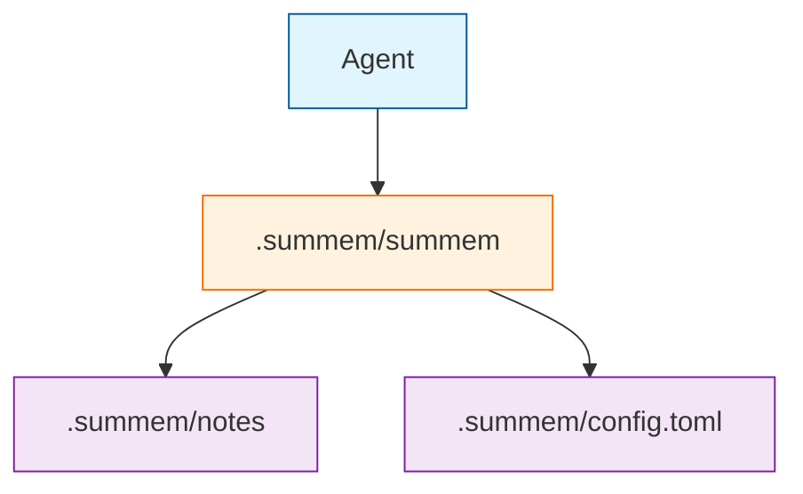
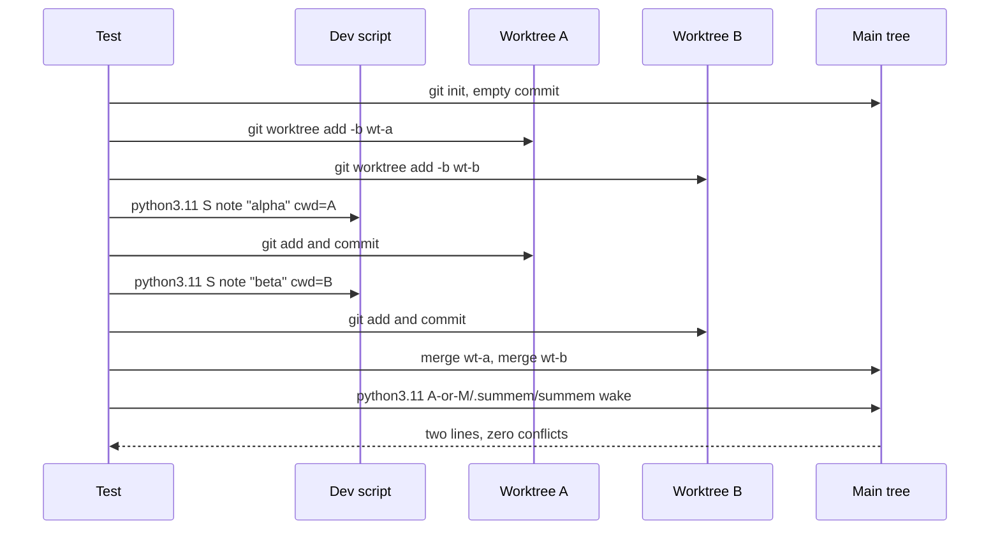

# Task: ingest

* Task ID: ingest
* Complexity: Level 3
* Type: feature

One shebang Python script at `.summem/summem` that auto-creates the git-root store, records immutable notes, and wakes a wait-free listing of those notes. First proof 1 is the gate. Store layout and leaf-set hashing freeze here, including canonical `.tree` bytes that this milestone does not yet persist. Tests live outside the script.

## Pinned Info

### Format freezes

These are the identity contract. Later milestones consume them; they do not invent a second scheme.

- Brand directory: `.summem/` (not `.mem/`). The ride-along driver is `.summem/summem`. Data is `.summem/config.toml`, `.summem/notes/<name>`, and later `.summem/naps/<leafset>.sum` / `.tree`. Nested stores (Phase 3) are data only; they do not each get a copy of the driver.
- Agent invocation: `.summem/summem wake` and `.summem/summem note "…"`. That path is the tool (same shape as `~/.optmem/memo`). It is not a leaked store file. Store files are `notes/…` and `naps/…`.
- Store parent: walk from `$PWD` toward parents; first directory that contains `.git` (file or directory) wins. If none, the store parent is `$PWD`. Phase 1 only auto-creates at that parent. It does not walk to a non-root `.summem/` and does not implement `--path`.
- Shebang: `#!/usr/bin/env python3`. File mode includes execute. Refuse `sys.version_info < (3, 11)` before doing work. `tomllib` is stdlib at that floor.
- Version guard runs before anything a pre-3.11 interpreter cannot execute. This machine's `python3` is 3.10, so the shebang path really does hit an old interpreter: a `ModuleNotFoundError: tomllib` traceback is not a refusal. Do not import `tomllib` (or any other 3.11-only module) at module scope. This milestone writes `config.toml` and never reads it — `ENTRY_CHARS` comes from the script default, so the product needs no `tomllib` import at all yet.
- Note temp file: the pre-rename temp lives in `notes/` and its name starts with `.` (for example `.tmp-<16hex>`). Wake skips dot-prefixed names, so a crashed or concurrent write is never listed and never mistaken for a note. These two rules are one contract; do not change either alone.
- Driver install: if `<parent>/.summem/summem` is missing, copy `Path(__file__).resolve()` there and `chmod 0o755`. If it exists, leave it. Wake and note never overwrite the driver.
- Note name: `YYYYMMDDTHHMMSSZ-` plus 16 lowercase hex characters from 8 random bytes. Sequence is `ls | sort` of that name.
- Clock: `datetime.now(timezone.utc)` or an injected timezone-aware UTC `now`. Formatting local time with a `Z` suffix is a defect.
- Note file bytes: UTF-8 of the note text plus a single trailing `\n`. The 280-byte `ENTRY_CHARS` limit is the UTF-8 byte length of the text before that terminator, not a character count.
- Note digest: lowercase hex `hashlib.sha256(file_bytes).hexdigest()`.
- Leaf-set id: sort those hex strings as ASCII, concatenate with **no delimiter** (each digest is 64 hex characters), then lowercase hex `hashlib.sha256(join.encode("ascii")).hexdigest()`. A singleton note's content id is the leaf-set id of that one digest. The join is ASCII hex; Chinese and any other UTF-8 live in the file bytes that produced those digests.
- Canonical `.tree` bytes: UTF-8 JSON, `sort_keys=True`, `separators=(',', ':')`, `ensure_ascii=False`, exactly one trailing `\n`. `ensure_ascii=False` is load-bearing for non-ASCII notes (default `json.dumps` would emit `\uXXXX` and break identity). Schema:
  - Tree object: `v` (integer `1`), `kids` (array)
  - Note child: `k`=`n`, `name` (filename only), `text` (note text, no terminator)
  - Nap child: `k`=`p`, `id` (leaf-set hex of the **original notes**), `sum` (caption), `tree` (nested tree object)
- Wake line for a loose note: `<64-hex-id>  (1 note, from YYYY-MM-DD)  <text>` — two spaces around the grain parenthetical. Date comes from the filename prefix, not mtime. Full id, never an 8-character abbreviation, never a positional range, never `notes/`, `naps/`, or `git`.
- Stdout/stderr: `reconfigure(encoding="utf-8")` when the stream has that method (OptMem's locale fix).
- Subcommands this milestone implements: `wake`, `note`. Everything else is an error.
- Tests: pytest under `tests/`, loading the script with `SourceFileLoader` + `spec_from_loader` + `exec_module` (a path with no `.py` suffix makes `spec_from_file_location` return `None`). Run with `uv run --python 3.11 --with pytest pytest`. Process tests use `sys.executable` (the 3.11 under pytest) as `argv[0]`'s interpreter so this machine's `python3` 3.10 shebang is not the runner. Do not use the bare `python3.11` pyenv shim.
- Default config file: a commented template string, not a TOML dump. `tomllib` reads; missing keys mean script defaults (`ENTRY_CHARS = 280`).

### Brand layout

Tool and data are siblings inside `.summem/`, the same way OptMem keeps `memo` and `memory` inside `.optmem/`.

### Proof 1 merge

Two worktrees, two `note` processes, one git merge, two lines on wake. Both trees also receive the same driver bytes if the script copies itself; git agrees on that path.

## Component Analysis

### Affected Components
- **Driver script** (`.summem/summem`): does not exist → one shebang file holding codec, store I/O, wake, and `main`. This is the whole product.
- **Test harness** (`tests/`, `pytest.ini`): does not exist → pytest loads the script; git worktree helper for proof 1.
- **Activation copy** (`VISION.md`, `ROADMAP.md`): still say `summem` as if it were on `PATH`, and ROADMAP still says "package and CLI entry" → point invocations at `.summem/summem` and freeze the script path instead of a package layout.
- **Briefing files** (`memory-bank/techContext.md`, `memory-bank/systemPatterns.md`): tech context still says no runner; system patterns name commands but not the brand path → surgical pointers after the script exists.

### Cross-Module Dependencies
- There are no in-repo modules. Functions in `.summem/summem` call each other: `main` → `cmd_note` / `cmd_wake` → store + codec. Codec has no disk I/O.
- Tests → script via `SourceFileLoader`. Proof 1 → script as a process, then git merge, then `wake` as a process.
- Auto-create may copy the running file onto `<parent>/.summem/summem`. That is the only write of the driver, and only when the path is missing.

### Boundary Changes
- Public agent interface appears: `.summem/summem wake`, `.summem/summem note TEXT`.
- On-disk schema appears: `.summem/summem`, `.summem/config.toml`, `.summem/notes/<utc>-<rand>`.
- Identity schema appears: digest, no-delimiter hex join, JSON `.tree` bytes. Phase 2 must call the same functions in this file, not re-derive them.
- No existing public interface to break. Empty `README.md` stays empty.

### Invariants and Constraints
- Agents never write store files. The script is the only writer.
- Ingest commutes: two notes are two paths. No next id. No shared mutable index.
- Sequence is in the filename. Time is UTC.
- Wake never refuses to print.
- Wake listings do not mention `notes/`, `naps/`, hashes as paths, or git.
- Hashing is `hashlib` SHA-256 only.
- The product is one file. Tests are not the product.
- This milestone does not implement `nap`, `zoom`, `recall`, `start`, `--path`, catalog, cover, or `ROADMAP.md` Later items.
- Compatibility-vector tests fail before codec bodies exist.
- An existing `.summem/summem` is never overwritten by auto-create.

## Open Questions

None - implementation approach is clear. Operator decided the shebang lives at `.summem/summem`. Remaining format choices stay pinned above.

## Test Plan (TDD)

### Behaviors to Verify

- Note file bytes: text `"hello"` → `b"hello\n"`.
- Note digest: SHA-256 of those file bytes, lowercase hex.
- Leaf-set id of one digest: SHA-256 of that hex string as ASCII.
- Leaf-set id of two digests: sort, concatenate with no delimiter, SHA-256 of the join. Input order must not matter.
- Leaf-set id of a Chinese note: `你好` file bytes are UTF-8 plus `\n`; digest is SHA-256 of those bytes (not of `\uXXXX`).
- `.tree` dumps of one note child: exact canonical JSON bytes including trailing newline.
- `.tree` dumps of a note whose text is `你好`: JSON contains the UTF-8 characters, not `\u4f60\u597d`.
- `.tree` dumps of a nap child whose nested tree holds two notes: exact bytes; `id` is the leaf-set id of the two original note file bytes.
- `loads_tree(dumps_tree(t))` round-trips note and nested nap trees.
- `note` of empty text is rejected. `note` of 281 UTF-8 bytes is rejected. `note` containing `\n` or `\r` is rejected. `note` of 280 UTF-8 bytes is accepted. `note` of 280 bytes of UTF-8 Chinese (truncated to the byte budget) is accepted; 281 is not.
- Clock used for the name is UTC. An injected local `now` must not be accepted as if it were UTC (require `tzinfo` is `timezone.utc`).
- First `note` in a git repo creates `.summem/config.toml` (comment-only template), `.summem/notes/<utc>-<16hex>`, and `.summem/summem` if missing. Config `tomllib.loads` yields `{}`. Existing driver bytes are unchanged if the file already exists.
- First `wake` in a git repo with no store creates the store (including driver copy) and prints nothing (exit 0).
- `wake` after two notes prints two lines, sorted by filename, each with a 64-hex content id and the grain `(1 note, from YYYY-MM-DD)`, and neither line contains `notes/`, `naps/`, or `git`.
- Two notes in the same UTC second still produce two paths.
- A dot-prefixed leftover temp file in `notes/` is not listed by `wake`, and the real notes still print.
- A `你好` note wakes without crashing when the child process runs with `PYTHONIOENCODING=ascii` (the reconfigure is what makes this pass; without it the process dies with `UnicodeEncodeError`). Verified as a red/green vector during preflight.
- Rejection text for an over-long `note` mentions neither `notes/`, `naps/`, nor `git`.
- Unknown CLI command (`nap`) and unknown flag (`--path`) exit nonzero.
- `sys.version_info < (3, 11)` is rejected by the version guard function, which takes the version tuple as an argument so no test has to monkeypatch `sys`.
- First proof 1: two worktrees each run the script as a process (`sys.executable`, script path, `note`); commit; merge onto main; zero conflicts; `wake` shows both texts.

### Test Infrastructure

- Framework: pytest (none exists yet; created in unit 1)
- Test location: `tests/`
- Conventions: `test_*.py`, `tmp_path`, no assertions on document wording. `tests/conftest.py` exposes `load_summem()` and `SCRIPT` (path to the development `.summem/summem`).
- New test files: `tests/conftest.py`, `tests/test_codec.py`, `tests/test_store.py`, `tests/test_wake.py`, `tests/test_cli.py`, `tests/test_proof_ingest.py`, `tests/gitutil.py`
- Config: `pytest.ini` with `testpaths = tests` only. No `pyproject.toml`.
- Runner: `uv run --python 3.11 --with pytest pytest`

### Integration Tests

- Proof 1 (`tests/test_proof_ingest.py`): real git worktrees, real script process, real merge. Product gate, not a change-detector on `VISION.md`.

## Implementation Plan

### 1. Identity codec — executable

- Files: `.summem/summem`, `tests/conftest.py`, `tests/test_codec.py`, `pytest.ini`
- Creative ref: none — format frozen in Pinned Info

1. Stub tests: `tests/test_codec.py` empty cases `test_note_file_bytes_appends_newline`, `test_note_digest_is_sha256_of_file_bytes`, `test_leafset_id_singleton_hashes_hex_ascii`, `test_leafset_id_sorts_and_concatenates_without_delimiter`, `test_leafset_id_hashes_utf8_chinese_file_bytes`, `test_dumps_tree_one_note_exact_bytes`, `test_dumps_tree_keeps_chinese_not_uescaped`, `test_dumps_tree_nested_nap_exact_bytes`, `test_loads_tree_round_trip`.
2. Stub interface: shebang file `.summem/summem` (`#!/usr/bin/env python3`, executable bit) with empty `note_file_bytes`, `note_digest`, `leafset_id`, `dumps_tree`, `loads_tree`, and `NoteChild` / `NapChild` / `Tree`. `tests/conftest.py`: `load_summem()` via `SourceFileLoader` + `spec_from_loader` + `exec_module`. `pytest.ini`: `testpaths = tests`.
3. Write tests and run red: expected hashes via `hashlib` in the test. Exact `.tree` literals matching the dumps rules, including one `你好` vector. Run `uv run --python 3.11 --with pytest pytest tests/test_codec.py` — fail on missing bodies.
4. Write code and run green: implement those functions in `.summem/summem` only. No store I/O. No CLI.

### 2. Store auto-create and note — executable

- Files: `.summem/summem`, `tests/test_store.py`, `tests/gitutil.py`

1. Stub tests: `test_note_rejects_empty`, `test_note_rejects_over_280_bytes`, `test_note_rejects_newline`, `test_note_accepts_280_bytes`, `test_note_280_is_utf8_bytes_not_chars`, `test_note_rejects_non_utc_now`, `test_first_note_creates_config_notes_and_driver`, `test_existing_driver_is_not_overwritten`, `test_note_name_uses_injected_utc_clock_and_rand`, `test_same_second_notes_are_two_paths`.
2. Stub interface: `ENTRY_CHARS = 280`, `CONFIG_TEMPLATE`, `require_utc(now)`, `find_store_parent(cwd)`, `ensure_store(parent)`, `write_note(parent, text, now, rng)` in `.summem/summem`. `tests/gitutil.py`: `init_repo(path)` sets local `user.name` / `user.email` and makes an empty commit.
3. Write tests and run red: `tmp_path` + `init_repo`. Inject UTC `now` and `rng`. Assert config is comments only. Assert file bytes equal `note_file_bytes(text)`. Assert a pre-existing driver with different bytes is left intact. Assert a naive datetime is rejected. Assert `notes/` holds exactly one non-dot entry after a successful `write_note` (no temp file survives).
4. Write code and run green: mkdir, copy driver only if missing, write template if config absent, validate text, write a dot-prefixed temp in `notes/`, `os.replace` to the UTC name.

### 3. Wake listing — executable

- Files: `.summem/summem`, `tests/test_wake.py`

1. Stub tests: `test_wake_without_store_creates_and_prints_nothing`, `test_wake_lists_two_notes_sorted_by_filename`, `test_wake_line_has_full_id_and_grain_date_from_name`, `test_wake_output_omits_notes_naps_and_git`, `test_wake_skips_unreadable_note_and_still_prints`, `test_wake_skips_dot_prefixed_temp_file`.
2. Stub interface: `wake_text(parent) -> str`.
3. Write tests and run red: two injected names so sort order is known. Expected content id from `leafset_id([note_digest(note_file_bytes(text))])`. Assert `notes/`, `naps/`, and `git` do not appear.
4. Write code and run green: `ensure_store`, list `notes/` regular files, skip names starting with `.`, skip unreadable files, sort, format lines, join with `\n` plus a trailing `\n` if any lines else `""`.

### 4. CLI — executable

- Files: `.summem/summem`, `tests/test_cli.py`

1. Stub tests: `test_note_subcommand_writes_and_wake_reads`, `test_nap_is_unknown`, `test_path_flag_is_unknown`, `test_note_without_text_fails`, `test_note_error_text_omits_store_paths_and_git`, `test_wake_prints_chinese_under_ascii_io_encoding`, `test_refuses_python_before_311`, `test_shebang_and_executable_bit`.
2. Stub interface: `require_python(version_info: tuple[int, ...] = ...) -> None` (defaults to `sys.version_info`; injectable so the test never monkeypatches `sys`), `main(argv: list[str] | None = None) -> int`, `if __name__ == "__main__"` calling `sys.exit(main())`. UTF-8 `reconfigure` at import.
3. Write tests and run red: `monkeypatch.chdir` to an `init_repo` tmp. Call `main(["note", "hello"])` and `main(["wake"])`. `nap` and `--path` nonzero. Version guard tested by calling `require_python((3, 10, 12))`. Process invocation uses `[sys.executable, str(SCRIPT), ...]`, not the shebang. The ascii-encoding test is a subprocess with `env` including `PYTHONIOENCODING=ascii`; assert exit 0 and `你好` in `stdout.decode("utf-8")`.
4. Write code and run green: argparse subcommands `wake` and `note` only, `require_python()` first. Store parent from cwd. `main` catches `SystemExit` from `parse_args` and returns its code, so callers get an int rather than an exception: 0 on success, 2 on usage, 1 on validation. Error text may say the line is too long or empty; it must not mention `notes/`, `naps/`, or git.

### 5. Proof 1 worktree merge — executable

- Files: `tests/test_proof_ingest.py`

1. Stub tests: `test_two_worktrees_note_merge_without_conflict`.
2. Stub interface: none new.
3. Write tests and run red: `git worktree add` two branches from the empty commit; in each, `subprocess` `[sys.executable, str(SCRIPT), "note", ...]` then add/commit `.summem`; merge both into main; assert merge exit 0 and no conflict markers; `wake` stdout contains both texts and two content ids.
4. Write code and run green: if this fails, fix the script, not the test. Do not add a lock or a shared index.

### 6. Activation and roadmap invocation — prose/policy

- Files: `VISION.md`, `ROADMAP.md`
- No tests: prose/policy artifact

1. In `VISION.md` Activation (and any command example that currently writes a bare `summem` as the program), use `.summem/summem` as the program path. Keep the CLI table's command names (`wake`, `note`, …). Do not mention `notes/` or `naps/` in the agent-facing table.
2. In `VISION.md` "Identifiers and hashing", write down the bytes the freeze actually pins: the sorted hex digests join with **no delimiter**; canonical `.tree` is UTF-8 JSON with `sort_keys=True`, `separators=(',', ':')`, `ensure_ascii=False`, one trailing newline; the schema is `v`/`kids` with `k=n` note children (`name`, `text`) and `k=p` nap children (`id`, `sum`, `tree`). Requirement 6 asks later milestones not to invent a second identity scheme, and `VISION.md` is the only durable home for that contract — this plan is archived, and test literals are evidence, not a contract. Keep it to the byte rules; do not import the plan.
3. In `ROADMAP.md` Phase 1, replace "Python 3 package and a CLI entry" and "Package layout and console entry" with the shebang at `.summem/summem`. Leave Later's empty `README.md` out.

### 7. Python gitignore — prose/policy

- Files: `.gitignore`
- No tests: prose/policy artifact

1. Ignore `__pycache__/`, `*.py[cod]`, `.pytest_cache/`, `.venv/`.
2. Track `.summem/summem` (the product). Ignore this repo's generated store data: `.summem/config.toml`, `.summem/notes/`, `.summem/naps/`. A stray `wake` here must not turn SumMem into a store. This tree becomes a store only when a working driver is bound to an agentic hook (Later). Consumer repos write their own ignore rules; this `.gitignore` is the development tree's.

### 8. Persistent briefing pointers — prose/policy

- Files: `memory-bank/techContext.md`, `memory-bank/systemPatterns.md`
- No tests: prose/policy artifact

1. `techContext.md`: the program is `.summem/summem`; tests are pytest as configured in `pytest.ini`, run with `uv run --python 3.11 --with pytest pytest`. No hatchling. Keep hashing and `config.toml` facts.
2. `systemPatterns.md`: one surgical line that the committed driver is `.summem/summem` inside the brand directory, sibling to data. Do not dump the plan.

## Technology Validation

New tooling for this repo: pytest as a test extra (not a runtime dependency). The product is stdlib-only Python 3.11+.

PoC in `/tmp/summem-script-poc` (not in this tree): shebang file at `.summem/summem`, `chmod +x`, `uv run --python 3.11 .summem/summem` printed `5`. `spec_from_file_location` returned `None` (no `.py` suffix). `SourceFileLoader` + pytest passed. Plan uses `spec_from_loader` + `exec_module` so we do not call deprecated `load_module()`.

No hatchling. No `pyproject.toml`. No new runtime dependencies.

## Challenges & Mitigations

- **No-suffix import:** load tests only through `SourceFileLoader` + `exec_module`. Do not use `spec_from_file_location` alone.
- **This machine's `python3` is 3.10:** process tests use `sys.executable` from the uv 3.11 pytest run. Shebang remains `#!/usr/bin/env python3` for consumers who already have 3.11+. Version guard covers the rest.
- **pyenv `python3.11` shim 127s:** do not document or call that shim. Runner is `uv run --python 3.11 --with pytest pytest`.
- **Overwriting the driver:** `ensure_store` copies only when `<parent>/.summem/summem` is missing. Tests plant a different payload and assert it survives.
- **Local time stamped `Z`:** `require_utc` rejects naive or non-UTC `tzinfo`. CLI passes `datetime.now(timezone.utc)`.
- **Worktree tests need an author:** `tests/gitutil.py` sets `user.name` and `user.email` locally.
- **Canonical JSON drift:** only `dumps_tree` serializes trees.
- **Scope creep into nap/path:** CLI tests require those tokens to fail.
- **Proof 1 must exercise the agent interface:** subprocess of the script, not `write_note()` directly.

## Pre-Mortem

- **We "simplify" by putting `summem` at the git root or adding hatchling back:** the brief and this pinned layout forbid both. Preflight should fail if `pyproject.toml` or a root-level `summem` appears in the plan's file list — they do not appear.
- **Phase 2 invents a second `.tree` or a delimited hex join:** already covered by unit 1 nested and Chinese vectors.
- **Wake prints 8-character ids because the vision example did:** freeze is full 64 hex.
- **Auto-create "refreshes" the script on every wake and fights a local edit or a merge:** already covered by "existing driver is not overwritten."
- **Proof 1 is green because the test called helpers and never merged blobs:** already covered by the subprocess challenge.
- **Chinese notes break on a latin-1 locale:** UTF-8 `reconfigure` at import; codec vector with `你好`.

## Preflight Findings

Status: **PASS WITH ADVISORY**. Blocking checks (TDD encoding, convention compliance, dependency impact, conflict detection, completeness) all pass. Amendments below are already folded into the plan above.

### Verified against reality, not asserted

- `SourceFileLoader` + `spec_from_loader` + `exec_module` loads a no-suffix executable and pytest calls into it under `uv run --python 3.11 --with pytest pytest` (3.11.13, pytest 9.1.1).
- Proof 1's merge shape: two worktrees each add an identical `.summem/summem` (mode `100755`) and `.summem/config.toml` plus one distinct note; both merges onto main exit 0 with zero conflict markers and all four paths at `HEAD`. The worktree root's `.git` is a **file**, which the "`.git` file or directory" walk-up already handles.
- Argparse with a required subparser raises `SystemExit(2)` rather than returning; `main` must catch it to honor "2 on usage" (folded into unit 4).
- `PYTHONIOENCODING=ascii` makes a `你好` print die with `UnicodeEncodeError` without the reconfigure and succeed with it — a real red/green vector (folded into unit 4).

### Amendments made

1. **Requirement 5 had no test.** UTF-8 reconfigure was an implementation instruction with nothing to fail if someone deleted it. Added `test_wake_prints_chinese_under_ascii_io_encoding` to unit 4.
2. **Requirement 9's error-text rule had no test.** "Must not mention `notes/`, `naps/`, or git" was prose in unit 4 step 4; a natural implementation prints the path it failed to write. Added `test_note_error_text_omits_store_paths_and_git`.
3. **Temp-file naming was an unstated coupling.** Unit 2 wrote "temp in `notes/`"; unit 3 skipped names starting with `.`. Those only agree by luck. The dot prefix is now pinned as one contract, with a wake test.
4. **Version guard could be preempted by its own imports.** `python3` on this machine is 3.10, and the shebang is `#!/usr/bin/env python3`, so a module-scope `tomllib` import would hand the operator a `ModuleNotFoundError` instead of the refusal requirement 10 asks for. Pinned: guard first, no 3.11-only module at module scope, and this milestone writes config without reading it.
5. **Version guard was hard to test cleanly.** `require_python()` now takes the version tuple, so no test monkeypatches `sys`.
6. **The format freeze had no durable home.** `VISION.md` states the three hashing steps but not the no-delimiter join, `ensure_ascii=False`, `sort_keys`, the trailing newline, or the `v`/`kids`/`k=n`/`k=p` schema. Everything requirement 6 freezes lived only in this ephemeral plan and in test literals. Unit 6 now writes the byte rules into `VISION.md`.

### Advisory - operator decision

- **This repo is not a store because the driver lives here.** Resolved: a store exists when a working `summem` is bound to an agentic hook. Ingest ships the driver. It does not onboard this tree. Unit 7 now ignores generated store data here and tracks only `.summem/summem`. Tests stay in `tmp_path`.
- **`note` text starting with `-` needs `--`.** Still open unless the operator says otherwise. Plan keeps strict argparse.

## Status

- [x] Component analysis complete
- [x] Open questions resolved
- [x] Test planning complete (TDD)
- [x] Implementation plan complete
- [x] Technology validation complete
- [x] Pre-Mortem complete
- [x] Preflight (PASS WITH ADVISORY)
- [ ] Build
    - [x] 1. Identity codec
    - [x] 2. Store auto-create and note
    - [x] 3. Wake listing
    - [ ] 4. CLI
    - [ ] 5. Proof 1 worktree merge
    - [ ] 6. Activation and roadmap invocation
    - [ ] 7. Python gitignore
    - [ ] 8. Persistent briefing pointers
- [ ] QA
