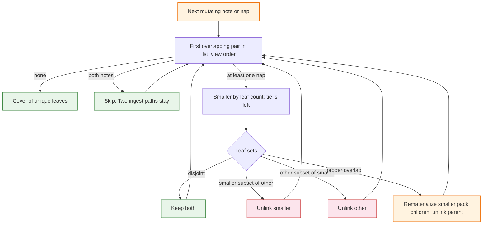

# Task: zipper-heal

* Task ID: zipper-heal
* Complexity: Level 3
* Type: feature

Zipper-heal overlapping nap leaf-sets after a long-lived merge so the next `note` or `nap` leaves a cover of unique leaves. `write_nap` must not concatenate overlapping packs. Wake stays wait-free and does not rewrite the store. [Texarkanine/SumMem#3](https://github.com/Texarkanine/SumMem/issues/3).

Issue #3 mentions a containment pass. Do not build one. Crash leftovers are handled by ⊆. `flock` the `naps/` directory; do not create a lock file. `heal_view` returns nothing; tests assert store state and zoom.

## Pinned Info

### Zipper step

Heal loops this step until a pass cannot mutate. Two notes with overlapping digests are skipped (ingest keeps both paths).

CLI `nap`: `require_entry(caption)` first, then lock. Invalid caption does not heal.

`with_store_lock`: `ensure_store`, open `naps/`, `flock` `LOCK_EX`, run the mutating sequence through `fold_request`.

## Component Analysis

### Affected Components

- **Tree codec** (`NoteChild`, `NapChild`, `Tree`, `_digests_of_tree`): no schema change. Zipper copies those bytes back to files.
- **View** (`list_view`, `ViewNode`): unchanged listing. Heal rereads it after each unlink.
- **Nap writer** (`write_nap`, `_as_child`, `_unlink_node`): refuse overlapping packs (at least one side is a nap). Malformed `.tree` is `ValueError`, not a traceback. Still the only place that writes a new caption.
- **Fold request** (`equal_grain_pair`, `fold_request`): already silent when no adjacent equal-grain pair exists.
- **Wake** (`wake_text`, `expand_frontier`): must not call heal, must not flock, must still print a dirty overlapping `HEAD`.
- **CLI** (`main`, `write_note`): `note` and `nap` take `with_store_lock`. `wake` / `zoom` / `recall` do not.
- **Store bootstrap** (`ensure_store`): unchanged as a public helper. `with_store_lock` calls it before opening `naps/`. Do not add a lock file.
- **Contract** (`VISION.md`, `memory-bank/systemPatterns.md`, `memory-bank/productContext.md`): surgical wording. Aligned `cover(T)` stays Later.

### Cross-Module Dependencies

- CLI `nap` → `require_entry` → `with_store_lock` → heal_view → maybe `write_nap` → `fold_request`
- CLI `note` → `require_entry` → `with_store_lock` → `write_note` → heal_view → `fold_request`
- `write_nap` → overlap and unreadable-pack guards using `_as_child`; does not call heal
- Wake → `list_view` / `expand_frontier` only

### Boundary Changes

- New functions: `heal_view(parent) -> None`, rematerialize helpers, `with_store_lock(parent, fn)`. No new CLI subcommand. No action-list API.
- `write_nap` gains `ValueError` when leaf-sets intersect and at least one node is a nap, and when a selected nap's `.tree` is missing, unreadable, or malformed. Agent-facing text names packs, not paths: overlapping packs vs `unreadable pack`.
- `nap` of two overlapping ids: heal may remove those files. Command still exits 0 and prints `fold_request`. It does not write the supplied caption as a concat parent.
- `fcntl.flock` `LOCK_EX` on the `naps/` directory fd. Wake does not wait on it.

### Invariants

- Agents never write the store. Rematerialize copies existing child bytes; it does not invent `.sum` sentences.
- Two note files are two paths. Heal never unlinks a note because another **note** has the same digest.
- A loose note whose digest sits inside a **nap** is redundant; unlink the note.
- Leaf-set identity, carry-stable stems, binary `nap`, write-once `.tree`, wait-free wake stay.
- Remainder keeps grain. Do not fold `8+1`.
- Crash order: rematerialize children, then unlink parent. Recovery is ⊆, not finishing the split.
- Flatten is the worst case of scattered shared leaves, not the normal path.
- `flock` is this store, this machine, this invocation, on `naps/`. It is not a git object.
- Each mutating heal pass strictly decreases `(reachable nap nodes, view file count)` lexicographically. Reachable nap nodes are nap files in the view plus `NapChild` nodes inside their trees. A pass that cannot mutate stops. Tests cap iterations so a hang fails.

### Plan decisions

1. **Note-note pairs are skipped.** Duplicate-text notes stay until an agent naps them.
2. **Split only the smaller pack** against the other. Smaller means `ViewNode.leaves`; equal size picks the left node.
3. **⊆ only.** `{A,B}` next to `{A,B,C,D}` drops `{A,B}` and keeps the coarse pack.
4. **Heal is not inside `write_note` / `write_nap`.** CLI and tests call `heal_view`.
5. **Vanished nap ids are success.** After heal, `write_nap` runs only if both ids still resolve.
6. **Lock the `naps/` directory**, opened after `ensure_store`. Do not `flock` a path the script `os.replace`s. The lock is held through `fold_request`.
7. **`require_entry` before lock** on CLI `note` and `nap`.
8. **No heal report type.** Assert `list_view`, payload names, and zoom.

## Open Questions

None - implementation approach is clear.

## Test Plan (TDD)

### Behaviors to Verify

- Leaf-set of a note is its digest; leaf-set of a nap is the set of `_digests_of_tree`; missing, unreadable, or malformed `.tree` yields no set.
- Two notes with the same text: `heal_view` leaves both files.
- Loose note whose digest is inside a nap: `heal_view` unlinks the note; zoom of the nap still reaches the sentence.
- Nap stem for a rematerialized `NapChild` is `{leftmost NoteChild seq}-{child.id}-{leaves}`. Existing dest is left unchanged.
- Note rematerialize writes `notes/{name}` with `note_file_bytes`; existing dest is left unchanged.
- `{A,B}` view file plus `{A,B,C,D}` view file: heal drops `{A,B}`, keeps `{A,B,C,D}`, does not write `{C,D}`.
- Parent plus both children on disk and no other overlap: heal drops the children, keeps the parent; zoom reaches every original.
- Parent plus both children plus a neighbor that overlaps the parent: heal drops the children, then splits the parent; no leaf lost.
- ABD vs ABE prefix overlap: unique-leaf cover; no new caption text; zoom reaches A, B, D, E; not O(T) loose notes.
- Disjoint packs: `heal_view` is a no-op.
- Heal of a one-kid or three-kid nap finishes without hanging (iteration cap).
- After heal leaves `8, 2, 1` and `WAKE_LINES=2`, `fold_request` is empty; `wake_text` still prints two lines via expand.
- `write_nap` of two overlapping packs raises; two identical-text notes still concat.
- `write_nap` of a malformed `.tree` raises `ValueError` whose text has no `notes/`, `naps/`, or `git`; CLI returns 1 without a traceback.
- Heal of an overlapping pair where one `.tree` is malformed does not raise and does not drop leaves.
- CLI `note` after an overlapping merge heals, then prints `fold_request` (possibly empty).
- CLI `note` whose text already sits inside a nap exits 0; that note does not remain in the view.
- CLI `nap` of two overlapping ids exits 0, does not concat, writes no new `.sum` sentence.
- CLI `nap` with an invalid caption on an overlapping store exits nonzero and leaves that store unchanged.
- CLI `wake` on overlapping `HEAD` prints and adds no file to `notes/` or `naps/`; wake must not flock.
- Two git branches nap overlapping-but-unequal packs, merge, next mutating command; unique cover; zoom originals.
- While `with_store_lock` holds, a second non-blocking `flock` of `naps/` fails. No lock file appears under `.summem/`.

### Edge Cases

- Same-second notes inside a rematerialized pack keep the left child’s `{stamp}-{rand}` stem.
- `heal_view` is idempotent on an already-disjoint store.
- Dot-prefixed temp files in `naps/` stay ignored.

### Test Infrastructure

- Framework: pytest as configured in `pytest.ini`, run with `uv run --python 3.11 --with pytest pytest`
- Test location: `tests/`
- Conventions: `load_summem()` via `SourceFileLoader`; `init_repo` / `git` / `fold_ids` / `zoom_reaches` from `tests/gitutil.py`; harvest ids from `list_view`, not `wake_text`; pin `WAKE_LINES` when asserting captions
- New test files: `tests/test_zipper.py`
- Existing files to extend: `tests/test_nap.py`, `tests/test_proof_branches.py`, `tests/test_cli.py` (invalid caption / malformed CLI)

## Implementation Plan

- [x] 1. Leaf-sets and rematerialize
- [ ] 2. Zipper and heal_view
- [ ] 3. write_nap guards
- [ ] 4. flock naps/ and CLI heal
- [ ] 5. Contract wording

### 1. Leaf-sets and rematerialize — executable

- Files: `.summem/summem`, `tests/test_zipper.py`

1. Stub tests: digest sets; missing/malformed `.tree` yields `None`; skip note-note; rematerialize note; rematerialize nap stem; skip overwrite
2. Stub interface: `leaf_digests(node) -> set[str] | None`, `rematerialize_child(parent, child: NoteChild | NapChild) -> None`, `_nap_stem(child: NapChild) -> str`. Stem leafset field is `child.id`. Leaf count is `len(_digests_of_tree(child.tree))`. Parse failures return `None`; they do not raise
3. Write tests and run red: note digest set; nap union set; two identical notes stay; rematerialize writes expected paths and bytes; second call does not clobber; malformed bytes yield `None`
4. Write code and run green: helpers only; no CLI wiring

### 2. Zipper and heal_view — executable

- Files: `.summem/summem`, `tests/test_zipper.py`

1. Stub tests: AB vs ABCD keeps the coarse pack; parent+children with no neighbor keeps the parent; parent+children plus overlapping neighbor re-splits; ABD vs ABE unique cover; note covered by nap dropped; disjoint no-op; odd-arity tree finishes under an iteration cap; malformed overlapping nap is skipped without raise; heal to `8, 2, 1` then empty `fold_request` at `WAKE_LINES=2` with wake still printing two lines
2. Stub interface: `heal_view(parent) -> None`
3. Write tests and run red: `list_view` ids, payload names, `zoom_text` / `zoom_reaches`, no new distinct `.sum` text for rematerialized siblings, iteration cap, `fold_request` empty
4. Write code and run green: loop until a pass cannot mutate; split only smaller; skip note-note and pairs with a `None` leaf-set; rematerialize every kid of the split tree. Each mutating pass decreases `(reachable nap nodes, view file count)` lexicographically

### 3. write_nap guards — executable

- Files: `.summem/summem`, `tests/test_nap.py`

1. Stub tests: overlapping adjacent naps raise; note whose digest is inside the adjacent nap raises; disjoint adjacent naps still unlink and concat; two identical-text notes still concat; malformed `.tree` raises `ValueError` without store paths
2. Stub interface: none new; `_as_child` / `write_nap` already exist
3. Write tests and run red: `pytest.raises(ValueError)` matching agent-facing text without `notes/`, `naps/`, or `git`
4. Write code and run green: raise before `_replace_bytes` when sets intersect and at least one node is a nap; wrap tree load so parse errors become `ValueError("unreadable pack")`

### 4. flock naps/ and CLI heal — executable

- Files: `.summem/summem`, `tests/test_zipper.py`, `tests/test_cli.py`, `tests/test_proof_branches.py`

1. Stub tests: `main(["note", ...])` and `main(["nap", ...])` call heal; `main(["wake"])` adds no file to `notes/` or `naps/` on overlapping HEAD; overlapping `nap` ids exit 0 without concat caption; `note` of text already in a nap exits 0 and leaves no loose note; invalid `nap` caption on an overlapping store exits nonzero and leaves payloads unchanged; two identical notes still nappable via `write_nap` after `heal_view`; second non-blocking acquire fails while the lock is held; `.summem/` has no `lock` file; two-branch overlapping merge then CLI mutate; malformed `.tree` via CLI returns 1 without traceback
2. Stub interface: `with_store_lock(parent, fn)` calls `ensure_store`, opens `naps/`, `fcntl.flock` `LOCK_EX`, runs `fn`, releases
3. Write tests and run red: monkeypatch `heal_view` to count calls; payload snapshot around wake and invalid caption; git merge of ABD/ABE-style packs; CLI malformed stderr
4. Write code and run green: CLI `note`/`nap` call `require_entry` then `with_store_lock` whose `fn` runs write, heal, maybe `write_nap`, and `fold_request`; vanished ids skip `write_nap` and still print `fold_request`; `wake` does not lock

### 5. Contract wording — prose/policy

- Files: `VISION.md`, `memory-bank/systemPatterns.md`, `memory-bank/productContext.md`
- No tests: prose/policy artifact

1. Long-lived branches: overlapping packs are healed on the next `note`/`nap` by zipper rematerialize; later adjacent **disjoint** naps still concat; aligned `cover(T)` stays Later
2. Concurrency table: overlapping leaf sets land as two files; the next mutating command zippers them. Git merge remains the cross-clone control. This machine may flock `naps/` for one mutating invocation; wake does not
3. Product context: qualify Target Audience, Key Benefits, and Key Constraints — no cross-clone lock, no actor; same-machine flock of `naps/` on one mutating invocation is not a committed object
4. System patterns: wake still does not open `.tree` to heal; mutating commands may

## Technology Validation

No new technology - validation not required. `fcntl.flock` is stdlib on this POSIX host.

## Challenges & Mitigations

- **Identical-text notes look like overlapping singletons:** skip note-note pairs; `write_nap` guard requires a nap.
- **`fold_ids` / direct `write_nap` bypass heal:** overlap guard in `write_nap`.
- **Wake tests harvesting ids:** use `list_view`; pin `WAKE_LINES` for caption lines.
- **Rematerialize stem mismatch duplicates a pack:** stem uses `NapChild.id` plus leftmost note seq plus leaf count.
- **Malformed `.tree`:** `leaf_digests` returns `None`; heal skips; `write_nap` raises `unreadable pack`.
- **`os.replace` on a locked file would drop the lock:** flock `naps/`.
- **Invalid nap caption must not heal:** `require_entry` before `with_store_lock`.

## Pre-Mortem

- **Heal ran only once and left a three-pack overlap:** loop until a pass cannot mutate.
- **`nap` of overlapping ids errored `unknown id`:** vanished ids are success.
- **We flattened every overlap to notes:** prefix-overlap test forbids O(T) notes as the normal result.
- **We flocked wake or wrote a lock file:** unit 4 asserts wake writes nothing and `.summem/` has no `lock`.
- **We finished exploding `{A,B,C,D}` because `{A,B}` was on disk:** unit 2's coarse-pack case.
- **The loop did not terminate:** lex measure plus iteration cap on odd-arity.
- **This is actually L4:** identity and CLI table do not change. Stay L3.

## Status

- [x] Component analysis complete
- [x] Open questions resolved
- [x] Test planning complete (TDD)
- [x] Implementation plan complete
- [x] Technology validation complete
- [x] Pre-Mortem complete
- [x] Preflight
- [ ] Build
- [ ] QA
