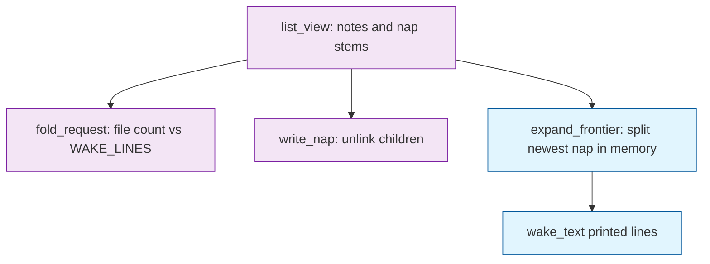

# Task: equal-grain

* Task ID: equal-grain
* Complexity: Level 3
* Type: feature

Equal-grain fold requests and carry-stable nap names (issue #1), plus in-memory wake expand so `WAKE_LINES` is a view-time projection. `write_nap` still unlinks. See `memory-bank/active/creative/creative-wake-projection.md` (operator amendment).

## Pinned Info

### Disk files vs printed cut

`list_view` / `fold_request` / `write_nap` see the directory. `wake` / `recall` of the view listing see the expanded frontier when that directory is shorter than `WAKE_LINES`.

## Component Analysis

### Affected Components

- **Nap writer** (`.summem/summem` `write_nap`, `_parse_nap_stem`): stem becomes `{stamp}-{rand}-{leafset}-{leaves}` from the left child's filename; still unlinks; still accepts any adjacent **files**.
- **Fold request** (`equal_grain_pair`, `fold_request`, `main` after `note`/`nap`): first adjacent same-`leaves` file pair; one pair; catch-up after `nap`; keys off file count.
- **Wake listing** (`wake_text`, new `expand_frontier`): when `len(list_view) < WAKE_LINES`, load the newest expandable nap’s `.tree` and replace it with its two kids until the budget is met or nothing splits.
- **Zoom / recall**: `zoom` already finds in-tree ids. `recall_text` uses `wake_text`, so it inherits expand. No new resolver for `nap`.
- **Proofs / helpers** (`tests/test_proof_squash.py`, `tests/gitutil.py` `fold_ids`): pack sizes 64/32/4; CLI wake in proof 4 pinned to 3 lines.
- **Contract** (`VISION.md`, `ROADMAP.md`, `memory-bank/systemPatterns.md`): stems, equal-grain, wake-as-projection.

### Cross-Module Dependencies

- `wake_text` → `list_view` → optional `loads_tree` on the naps it splits.
- `fold_request` → `list_view` only. Must not use the expanded frontier, or a short directory would never look over budget and would never look under either in a useful way.
- Tests that used `wake_text` as a file-id oracle (`tests/test_nap.py` `_ids`, `tests/test_cli.py` after `nap`, several `tests/test_wake.py` line counts, proof 4/6 wake length) must pin `WAKE_LINES` to the file count or switch to `list_view`.

### Boundary Changes

- Wake may print more lines than store files, and those lines may use in-tree leaf-set ids.
- `nap` this milestone still requires view-file ids. An agent who copies an expanded child id into `nap` still gets `unknown id`.
- Wake may open `.tree` when expanding. That amends “wake never opens `.tree`” for the under-budget case only. Over-budget and at-budget listing still does not.

### Invariants

- Agents never write the store.
- Ingest commutes. Sequence is in the filename. Leaf-set id is identity.
- `.tree` is write-once. Zoom is a property of `HEAD`.
- Wake never refuses. Missing `.sum` still degrades; a missing `.tree` means that node will not split.
- `WAKE_LINES` does not decide which files may exist. `write_nap` does not read `WAKE_LINES`.
- No shared mutable index. No second identity. No `cover(T)` rebuild of interleaved leaves.

## Open Questions

- [x] How does `WAKE_LINES` stay a lens if `nap` unlinks? → Resolved: in-memory right-edge expand when file count `<` budget; unlink stays; no children written back. Operator amendment on `memory-bank/active/creative/creative-wake-projection.md`.
- [x] Notes stay vs explode `.tree`? → Resolved: explode in memory. Notes do not stay.

## Test Plan (TDD)

### Behaviors to Verify

- Carry-stable stem: two notes → file `{left.stamp}-{left.rand}-{leafset}-2`.
- Same-second slot: four notes, one UTC second, nap two oldest → `list_view` grains `[2, 1, 1]`.
- All-ones picker: three notes → `equal_grain_pair` is the two oldest ids.
- 16+1 picker: 16-pack plus a later note → `None`; `fold_request` empty.
- Over-budget 16+1 CLI: lone 16-pack, `WAKE_LINES=1`, `note` → stdout empty.
- Two 8s beside a 16 → the two 8s.
- `2, 1, 1` → the two 1s.
- Duplicate-id ones → `(id, id)`.
- Over-budget ones: `WAKE_LINES=3`, fourth note → two oldest file ids, no nap.
- Catch-up: `WAKE_LINES=2`, four ones, `nap` first pair → remaining two 1s.
- Catch-up quiet: at or under file budget → stdout empty.
- Same-second stream: 24 notes, one datetime, `WAKE_LINES=8`, loop request+`write_nap` → pow2 file grains, `len(list_view) <= 8`, some `leaves >= 4`, none `== 17`.
- Depth: 16 ones folded by `equal_grain_pair` until one file → max NoteChild depth `<= 4`.
- Under-budget expand: two 8-packs, `WAKE_LINES=4` → 4 wake lines; left grain 8; right side split (8+4+2+2 or equivalent fill); `list_view` still 2 files; no new paths.
- At-budget no expand: two 8-packs, `WAKE_LINES=2` → 2 lines, the two captions.
- Native 1s fill: two 8-packs plus two later notes, `WAKE_LINES=4` → 4 lines, no `.tree` load (or no split).
- Expand then zoom: an id from an expanded child line `zoom`s to that child's kids / text.
- Expand writes nothing: payload name set unchanged.
- Cannot split a note; cannot split a nap whose `.tree` is missing (print it as one line).
- Proof 4: 100 notes, helper 64/32/4, squash, clone zooms `n000` / `n064` / `n096`; clone `wake` with `WAKE_LINES=3` is 3 pack lines.

### Test Infrastructure

- Framework: pytest as configured in `pytest.ini`
- Test location: `tests/`
- Conventions: `test_*.py`; `load_summem()`; `gitutil.init_repo` / `fold_ids` / `zoom_reaches`; monkeypatch `WAKE_LINES`; CLI via `m.main` + `capsys`
- New test files: `tests/test_wake_expand.py`

### Integration Tests

- `tests/test_proof_squash.py`: three power-of-two packs survive squash; wake at budget 3 is three lines; zoom originals.
- `tests/test_proof_branches.py`: two packs merge; `list_view` has two files; a following `write_nap` of those file ids folds them. Pin `WAKE_LINES` to 2 when asserting pack-grain wake, or assert files separately from printed lines.
- Existing `wake_text`-as-id helpers in `tests/test_nap.py`, `tests/test_view.py`, `tests/test_wake.py`, `tests/test_cli.py`, `tests/test_zoom.py`, `tests/test_recall.py`: switch id harvest to `list_view`, or pin `WAKE_LINES` to current file count, in the expand unit so they do not go red for the wrong reason.

## Implementation Plan

### 1. Carry-stable nap names — executable

- Files: `tests/test_nap.py`, `tests/test_view.py`, `tests/test_wake.py`, `tests/test_fold.py`, `.summem/summem`

1. Stub tests: empty `test_nap_stem_inherits_left_child_seq_prefix` and `test_same_second_nap_stays_in_left_slot` in `tests/test_fold.py`.
2. Stub interface: `_seq_prefix(name: str) -> str` returning `""`. Do not change `write_nap` yet.
3. Write tests and run red: `uv run --python 3.11 --with pytest pytest tests/test_nap.py tests/test_view.py tests/test_wake.py tests/test_fold.py`. Stem `f"{_seq_prefix(left.name)}-{leafset}-2"`; four same-second notes, nap oldest two, `[n.leaves for n in list_view] == [2, 1, 1]`. Change `split("-")[1]`-as-leafset in `tests/test_nap.py`, `tests/test_view.py`, `tests/test_wake.py` to `split("-")[-2]`. Expected red: stems still `{stamp}-{leafset}-{leaves}`.
4. Write code and run green: `_seq_prefix` is `"-".join(name.split("-")[:2])`; `write_nap` stem `f"{_seq_prefix(left.name)}-{leafset}-{leaves}"`; `_parse_nap_stem` returns `(stamp, rand, leafset, leaves)`; `list_view` unpacks `stamp, _, leafset, leaves = parsed`. Re-run those four files.

### 2. Equal-grain picker and catch-up — executable

- Files: `tests/test_fold.py`, `.summem/summem`

1. Stub tests: empty `test_equal_grain_pair_returns_two_oldest_ids_when_all_ones`, `test_equal_grain_pair_returns_none_for_16_plus_1`, `test_equal_grain_pair_returns_two_8s_not_16_plus_8`, `test_equal_grain_pair_returns_two_1s_not_2_plus_1`, `test_equal_grain_pair_duplicate_ids_when_same_text`, `test_over_budget_note_prints_nothing_when_16_plus_1`, `test_long_stream_same_second_grains_are_powers_of_two`, `test_sixteen_leaf_pack_tree_depth_is_log`, `test_nap_prints_remaining_ones_not_parent_plus_one`, `test_nap_prints_nothing_when_at_or_under_budget`.
2. Stub interface: `equal_grain_pair(nodes: list[ViewNode]) -> tuple[str, str] | None` returning `None`.
3. Write tests and run red: all-ones → two oldest; 16-pack plus later note → `None`; lone 16-pack, `WAKE_LINES=1`, `note` → empty stdout; two 8s plus older 16 → the 8s; `2, 1, 1` → two 1s; two `"same"` → `(id, id)`; 24 same-second notes, `WAKE_LINES=8`, loop `fold_request`+`write_nap` → pow2 files, `len(list_view) <= 8`; 16 ones folded via `equal_grain_pair` → depth `<= 4`; catch-up prints remaining 1s; quiet when at file budget. Delete `test_oldest_adjacent_returns_two_oldest_ids`. Rename the all-ones CLI case to `test_over_budget_note_requests_equal_grain_ones`. Expected red: stub `None`; `nap` prints nothing.
4. Write code and run green: scan adjacent same `leaves`; `fold_request` uses `equal_grain_pair` and `len(list_view)`; delete `oldest_adjacent`; after successful `write_nap` in `main`, print `fold_request`. Depth helper stays in `tests/test_fold.py`. Re-run `tests/test_fold.py`.

### 3. In-memory wake expand — executable

- Files: `tests/test_wake_expand.py`, `tests/test_wake.py`, `tests/test_nap.py`, `tests/test_cli.py`, `tests/test_view.py`, `tests/test_zoom.py`, `tests/test_recall.py`, `tests/test_proof_branches.py`, `.summem/summem`
- Creative ref: `memory-bank/active/creative/creative-wake-projection.md` operator amendment

1. Stub tests: empty cases in `tests/test_wake_expand.py` for the four expand behaviors and the write-nothing / missing-tree / zoom-expanded-id cases.
2. Stub interface: `expand_frontier(nodes: list[ViewNode], budget: int) -> list` returning `nodes` unchanged. Do not change `wake_text` yet.
3. Write tests and run red: two 8-packs (`fold_ids` of 8+8), `WAKE_LINES=4` → 4 lines, 2 files; `WAKE_LINES=2` → 2 caption lines; two 8s plus two later notes, `WAKE_LINES=4` → 4 file lines; zoom an expanded child id; payload names unchanged; nap without `.tree` does not split. Switch id harvest in the listed existing tests to `list_view` (or pin `WAKE_LINES` to file count) so they stay green when `wake_text` starts expanding. Expected red: stub returns the two 8s when budget is 4.
4. Write code and run green: `expand_frontier` loops while `len(frontier) < budget`: from the right, find a nap with two kids (load `.tree` once per view-file nap; further splits use the in-memory `NapChild.tree`); replace that slot with two printable rows (note → id/text/1; nap child → id/sum/leaf-count). `wake_text` prints `expand_frontier(list_view(parent), WAKE_LINES)`. Grain and day for a virtual nap child come from its nested notes (`len` of note descendants; min `NoteChild.name` stamp). Do not write files. Do not change `write_nap` lookup. Re-run `tests/test_wake_expand.py` and the files whose id harvest changed.

### 4. Proof 4 helper packs — executable

- Files: `tests/test_proof_squash.py`

1. Stub tests: none new. Modify `test_three_packs_squash_clone_zooms_originals`.
2. Stub interface: none.
3. Write tests and run red: not expected to go red if the clone `wake` is invoked with `WAKE_LINES=3` (monkeypatch the loaded script or `main` after setting `m.WAKE_LINES = 3`). Slices `ids[0:64]`, `ids[64:96]`, `ids[96:100]`; grains 64/32/4; zoom `n000` / `n064` / `n096`. Run `tests/test_proof_squash.py`, then the full suite.
4. Write code and run green: no production change.

### 5. Contract wording — prose/policy

- Files: `VISION.md`, `ROADMAP.md`, `memory-bank/systemPatterns.md`
- No tests: prose/policy artifact
- Creative ref: operator amendment — lens is expand, film is unlink

1. Nap files `{minStamp}-{rand}-{leafset}-{leaves}`. `minStamp`+`rand` is the leftmost order key.
2. Temporal bias / simpler equivalent: equal-grain **file** requests, never 16+1. `WAKE_LINES` is how many lines wake prints. When files are fewer than the budget, wake splits the newest nap in memory. When files meet or exceed the budget, wake lists files. It does not write children back.
3. “Wake never opens `.tree`” becomes: wake does not open `.tree` to list an at-or-over-budget directory; it may open `.tree` to expand an under-budget directory. Missing `.sum` still does not block.
4. Year-later: directory file count stays on the order of the budget; printed lines follow the knob. The 8192/2048/512 picture is the on-disk tree, which wake may crack on the right.
5. Squash listing 40/30/30 → 64/32/4.
6. `ROADMAP.md` Phase 2: equal-grain requests plus wake expand. Later: full aligned `cover(T)` after merge, not this expand.
7. `systemPatterns.md`: one briefing sentence — fold requests are equal-grain and unlink; wake may expand in memory when the directory is short.

## Technology Validation

No new technology - validation not required

## Challenges & Mitigations

- `wake_text` as a file-id oracle: unit 3 retargets those helpers before `wake_text` expands, or the suite goes red for the wrong reason.
- Always-split-rightmost only yields ~`log2(leaves)` extra lines: the loop must split the rightmost **expandable** node repeatedly (including new kids) until `len == budget`.
- Proof 4/6 line counts: pin `WAKE_LINES` to the intended pack listing; do not treat expand as a proof failure.
- Missing `.tree`: that node will not split; wake still prints the file line. Wait-free.
- Expanded ids are not nappable: document in VISION; `fold_request` only names files. Do not add a virtual-id writer in this milestone.
- Same-second file order still needs the carry-stable stem (unit 1). Expand uses tree kid order, not filenames.

## Pre-Mortem

- Plan failed because `fold_request` used printed-line count: then a 2-file store at budget 32 never requests a nap (under) and wake always expands. Keep file count as the fold trigger.
- Plan failed because we shipped “notes stay”: operator locked unlink. Covered by the creative amendment.
- Plan failed because we only split once: unit 3 requires four lines from two 8s, which needs more than one split of the right 8.
- Plan failed because proof 4 still expected 3 wake lines at default 32: pin budget 3 in that test.
- Plan failed because we taught `nap` virtual ids: out of scope; do not add it when a test looks convenient.

## Status

- [x] Component analysis complete
- [x] Open questions resolved
- [x] Test planning complete (TDD)
- [x] Implementation plan complete
- [x] Technology validation complete
- [x] Pre-Mortem complete
- [ ] Preflight
- [ ] Build
- [ ] QA
