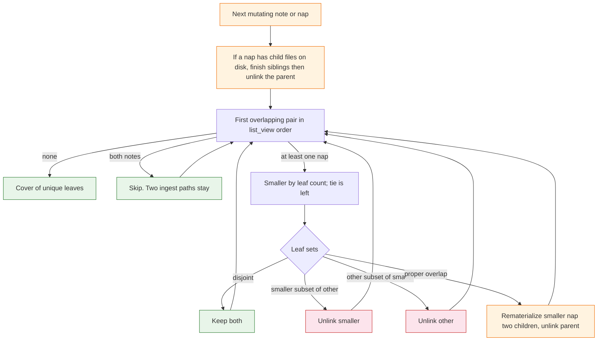

# Task: zipper-heal

* Task ID: zipper-heal
* Complexity: Level 3
* Type: feature

Zipper-heal overlapping nap leaf-sets after a long-lived merge so the next `note` or `nap` leaves a cover of unique leaves. `write_nap` must not concatenate overlapping packs. Wake stays wait-free and does not rewrite the store. [Texarkanine/SumMem#3](https://github.com/Texarkanine/SumMem/issues/3).

## Pinned Info

### Zipper step

Heal loops this step until every view file’s leaf-set is disjoint from the others. Containment (crash leftover) runs first so subset-drop cannot undo a finished split.

## Component Analysis

### Affected Components

- **Tree codec** (`NoteChild`, `NapChild`, `Tree`, `_digests_of_tree`): already stores names, captions, and nested trees. No schema change. Zipper copies those bytes back to files.
- **View** (`list_view`, `ViewNode`): wait-free directory listing. Unchanged algorithm. Heal rereads it after each unlink.
- **Nap writer** (`write_nap`, `_as_child`, `_unlink_node`): today concatenates any adjacent pair. Must refuse overlapping leaf-sets. Still the only place that writes a new caption.
- **Fold request** (`equal_grain_pair`, `fold_request`): already returns empty when no adjacent equal-grain pair exists (`8, 2, 1` under a small budget). No picker change. Add a regression after heal.
- **Wake** (`wake_text`, `expand_frontier`): must not call heal, must not take the lock, must still print a dirty overlapping `HEAD`.
- **CLI** (`main`, `write_note`): `note` and `nap` take a local `flock`, run heal, then the existing write/request path. `wake` / `zoom` / `recall` do not.
- **Store bootstrap** (`ensure_store`): create `.summem/lock` next to `notes/` and `naps/`. Gitignore the lock file.
- **Contract** (`VISION.md` Long-lived branches and concurrency, `memory-bank/systemPatterns.md` wait-free wake, `memory-bank/productContext.md` lock sentence): surgical wording. Aligned `cover(T)` stays Later.

### Cross-Module Dependencies

- CLI → lock → heal_view → list_view / `.tree` parse / rematerialize / unlink
- CLI `nap` → heal_view → maybe `write_nap` → `fold_request`
- CLI `note` → `write_note` → heal_view → `fold_request`
- `write_nap` → overlap guard using `_as_child` digests; does not call heal (tests and `fold_ids` stay explicit)
- Wake → `list_view` / `expand_frontier` only

### Boundary Changes

- New functions: `heal_view(parent)`, rematerialize helpers, `with_store_lock(parent, fn)` (names may tighten in build). No new CLI subcommand. Caption grammar unchanged.
- `write_nap` gains a `ValueError` when the two ids’ leaf-sets intersect. Agent-facing text names packs, not paths.
- `nap` of two overlapping ids: heal may remove those files. Command still exits 0 and prints `fold_request`. It does not write the supplied caption as a concat parent.
- Local `fcntl.flock` on `.summem/lock` for one mutating invocation. Not a cross-worktree lock. Wake does not wait on it.

### Invariants

- Agents never write the store. Rematerialize copies `NoteChild.name`/`text` and `NapChild` caption+tree; it does not invent `.sum` sentences.
- Ingest still commutes: two note files are two paths. Heal never unlinks a note because another **note** has the same digest.
- A loose note whose digest sits inside a **nap** is redundant with that pack; unlink the note.
- Leaf-set identity, carry-stable stems, binary `nap`, write-once `.tree`, wait-free wake stay.
- Remainder keeps grain: rematerialized children are the existing kids. Do not fold `8+1`.
- Crash order: write both children, then unlink parent. Leaves stay in parent `.tree` until that unlink.
- Flatten is the worst case of scattered shared leaves, not the normal path. Aligned `[0, 8192)` stays Later.
- `flock` is this store, this machine, this invocation. Do not hold it waiting for a caption (the caption is already argv).

### Plan decisions locked here

These were ambiguous on a first reading of the issue and are now plan rules, not creative work:

1. **Note-note pairs are skipped.** Duplicate-text notes stay until an agent naps them (`test_nap_two_identical_notes_by_repeated_id`).
2. **Split only the smaller pack** against the other. The larger pack stays if it already covers the shared prefix.
3. **Smaller** means fewer leaves (`ViewNode.leaves`); equal size picks the left (older filename) node.
4. **Containment before overlap.** If both rematerialized child paths exist, the parent is the extra. If exactly one child path exists, write the missing sibling then unlink the parent.
5. **Heal is not inside `write_note` / `write_nap`.** CLI and tests call `heal_view`. `write_nap` still refuses overlap so `fold_ids` cannot duplicate leaves.
6. **Vanished nap ids are success.** After heal, `write_nap` runs only if both ids still resolve.

## Open Questions

None - implementation approach is clear. Operator already locked remainder grain, local flock, and no zipper inside wake. Containment vs subset-drop is ordered above so a crash retry cannot drop children and keep the parent.

## Test Plan (TDD)

### Behaviors to Verify

- Leaf-set of a note is its digest; leaf-set of a nap is the set of `_digests_of_tree`; missing/malformed `.tree` yields no set and is not split.
- Two notes with the same text: `heal_view` leaves both files.
- Loose note whose digest is inside a nap: `heal_view` unlinks the note; zoom of the nap still reaches the sentence.
- Nap stem for a rematerialized `NapChild` is `{leftmost NoteChild seq}-{leafset}-{leaves}`, matching `write_nap`. Existing dest is left unchanged.
- Note rematerialize writes `notes/{name}` with `note_file_bytes`; existing dest is left unchanged.
- Parent plus both children on disk: `heal_view` unlinks the parent; children stay; zoom reaches every original.
- Parent plus one child: `heal_view` writes the missing sibling, unlinks the parent, drops no leaves.
- Disjoint packs: `heal_view` is a no-op; `write_nap` still concatenates.
- ABD vs ABE (prefix overlap, equal grain): heal leaves a unique-leaf cover; no new caption text; zoom reaches A, B, D, E; file count is O(log N) siblings, not four loose notes as the normal result.
- `write_nap` of two overlapping packs raises; no new parent file; children remain.
- CLI `note` after an overlapping merge heals, then prints `fold_request` (possibly empty).
- CLI `nap` of the two overlapping ids exits 0, does not concat, writes no new `.sum` sentence.
- CLI `wake` on overlapping `HEAD` prints, writes nothing, does not create `.summem/lock` contention requirement for correctness (wake must not flock).
- After heal leaves `8, 2, 1` and `WAKE_LINES=2`, `fold_request` is empty; `wake_text` still prints two lines via expand.
- Two git branches nap overlapping-but-unequal packs, merge, next mutating command; unique cover; zoom originals.
- Proof 6 disjoint merge+nap still passes.
- Lock file exists after `ensure_store`; `.gitignore` lists `.summem/lock`.

### Edge Cases

- Malformed `.tree` on one overlapping nap: do not crash; do not drop leaves; `write_nap` of that pair still refuses if digests can be read, otherwise `unknown id` as today.
- Same-second notes inside a rematerialized pack keep the left child’s `{stamp}-{rand}` stem.
- `heal_view` is idempotent on an already-disjoint store.
- Dot-prefixed temp files in `naps/` stay ignored.

### Test Infrastructure

- Framework: pytest as configured in `pytest.ini`, run with `uv run --python 3.11 --with pytest pytest`
- Test location: `tests/`
- Conventions: `load_summem()` via `SourceFileLoader`; `init_repo` / `git` / `fold_ids` / `zoom_reaches` from `tests/gitutil.py`; harvest ids from `list_view`, not `wake_text`; pin `WAKE_LINES` when asserting captions
- New test files: `tests/test_zipper.py`
- Existing files to extend: `tests/test_nap.py` (overlap refusal), `tests/test_proof_branches.py` (overlapping merge), `tests/test_store.py` only if `ensure_store` assertions become too tight (prefer not)

### Integration Tests

- Git two-branch overlapping packs, merge, `main(["note", ...])` or `main(["nap", ...])`, unique cover, zoom
- Planted parent+children crash, `heal_view`, no lost leaves
- Wake dirty HEAD: payload names unchanged

## Implementation Plan

### 1. Leaf-sets and rematerialize — executable

- Files: `.summem/summem`, `tests/test_zipper.py`

1. Stub tests: `tests/test_zipper.py` empty cases for digest sets, skip note-note, rematerialize note, rematerialize nap stem, skip overwrite
2. Stub interface: `leaf_digests(node) -> set[str] | None`, `rematerialize_child(parent, child: NoteChild | NapChild) -> None`, `_nap_stem_from_tree(tree) -> str`
3. Write tests and run red: note digest set; nap union set; two identical notes stay; rematerialize writes expected paths and bytes; second call does not clobber
4. Write code and run green: helpers only; no CLI wiring

### 2. Containment, zipper, heal_view — executable

- Files: `.summem/summem`, `tests/test_zipper.py`

1. Stub tests: containment both children; containment one child; disjoint no-op; ABD vs ABE unique cover; note covered by nap dropped; idempotent disjoint
2. Stub interface: `heal_view(parent) -> None` and internal zipper/containment functions
3. Write tests and run red: assertions on `list_view` ids, payload names, `zoom_text` / `zoom_reaches`, no new distinct `.sum` text for rematerialized siblings
4. Write code and run green: loop containment then first overlapping pair until disjoint; split only smaller; skip note-note

### 3. write_nap overlap guard — executable

- Files: `.summem/summem`, `tests/test_nap.py`

1. Stub tests: overlapping adjacent naps raise; disjoint adjacent naps still unlink and concat
2. Stub interface: none new; `write_nap` already exists
3. Write tests and run red: `pytest.raises(ValueError)` matching agent-facing text without `notes/`, `naps/`, or `git`
4. Write code and run green: if `set(digs_l) & set(digs_r)`, raise before `_replace_bytes`

### 4. Local flock and CLI heal — executable

- Files: `.summem/summem`, `.gitignore`, `tests/test_zipper.py`, `tests/test_store.py` only if required

1. Stub tests: `ensure_store` creates lock file; `main(["note", ...])` and `main(["nap", ...])` call heal; `wake_text` / `main(["wake"])` do not write store files on overlapping HEAD; `main(["nap", overlapping...])` exits 0 without concat caption; two identical notes still nappable via `write_nap` after `heal_view`
2. Stub interface: `with_store_lock(parent, fn)`; `ensure_store` touches `.summem/lock`
3. Write tests and run red: monkeypatch `heal_view` to count calls; payload snapshot around wake; nap overlapping ids
4. Write code and run green: `fcntl.flock` `LOCK_EX` around note and nap only; heal after `write_note`, before maybe `write_nap`; vanished ids skip `write_nap` and still print `fold_request`; gitignore `.summem/lock`

### 5. Merge proof, crash, budget silence — executable

- Files: `tests/test_zipper.py`, `tests/test_proof_branches.py`, `tests/test_fold.py` only if the `8+2+1` case fits existing fold tests better

1. Stub tests: two-branch overlapping merge then CLI mutate; planted crash; heal to `8, 2, 1` then empty `fold_request` at `WAKE_LINES=2` with wake still printing two lines
2. Stub interface: none
3. Write tests and run red: git merge of ABD/ABE-style packs; kill window simulated by extra parent file; grain remainder not folded
4. Write code and run green: should already be green from units 2–4; only add tests, unless a hole appears

### 6. Contract wording — prose/policy

- Files: `VISION.md`, `memory-bank/systemPatterns.md`, `memory-bank/productContext.md`, `ROADMAP.md` only if Phase 2 still claims disjoint-only proof 6 is the whole merge story
- No tests: prose/policy artifact

1. Long-lived branches: overlapping packs are healed on the next `note`/`nap` by zipper rematerialize; later adjacent disjoint naps still concat; aligned `cover(T)` stays Later
2. Concurrency: git merge remains the cross-clone control; this machine may `flock` one mutating invocation; wake does not
3. Product context: replace “there is no lock” with “no cross-clone lock”; local flock is not an actor
4. System patterns: wake still does not open `.tree` to heal; mutating commands may

## Technology Validation

No new technology - validation not required. `fcntl.flock` is stdlib on this POSIX host. Python 3.11 floor unchanged.

## Challenges & Mitigations

- **Subset-drop undoes a crash split:** containment pass unlinks the parent when children exist, before any ⊆ rule. Challenge if we only implemented the issue’s “drop if ⊆” line.
- **Identical-text notes look like overlapping singletons:** skip note-note pairs. Covered by unit 1 and unit 4.
- **`fold_ids` / direct `write_nap` bypass heal:** overlap guard in `write_nap` so a test cannot duplicate leaves; overlapping setups use `heal_view` or CLI.
- **Wake tests harvesting ids:** use `list_view` for files; pin `WAKE_LINES` for caption lines.
- **Rematerialize stem mismatch duplicates a pack:** stem must reuse `_seq_prefix` of the leftmost `NoteChild.name` plus `NapChild.id` plus leaf count, the same as `write_nap`.
- **Malformed `.tree`:** treat as unsplittable; do not raise from `heal_view`; wait-free wake already degrades.

## Pre-Mortem

- **Heal ran only once on one pair and left a three-pack overlap:** the plan requires a loop until `list_view` has no overlapping nap-involved pair. Already in unit 2.
- **`nap` of overlapping equal-grain ids errored `unknown id` and agents stalled:** CLI treats vanished ids as success. Already in unit 4.
- **We flattened every overlap to notes and called it zipper:** prefix-overlap test forbids O(T) notes as the normal result. Already in unit 2 / 5.
- **We flocked wake and called it safety:** contradicts wait-free; unit 4 asserts wake writes nothing and does not need the lock.
- **Product brief still said “no lock” after shipping flock:** unit 6 surgical edit. Already scheduled.
- **This is actually L4:** identity and CLI table do not change; one heal pass on the existing store. Stay L3.

## Status

- [x] Component analysis complete
- [x] Open questions resolved
- [x] Test planning complete (TDD)
- [x] Implementation plan complete
- [x] Technology validation complete
- [x] Pre-Mortem complete
- [ ] Preflight
- [ ] Build
- [ ] QA
