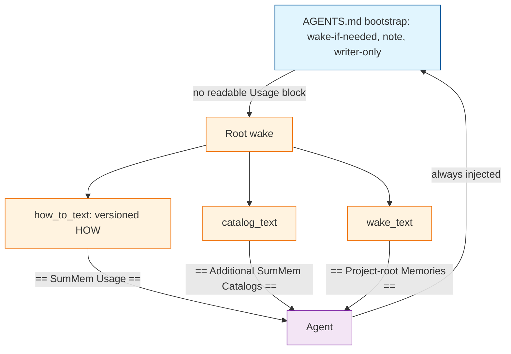

# Task: wake-usage-prompt

* Task ID: wake-usage-prompt
* Complexity: Level 3
* Type: feature

A small committed `AGENTS.md` bootstrap that stays put, and a root `wake` that prints the versioned how-to, so a consumer upgrade is copying the script.

## Pinned Info

### Agent documents

Bootstrap is always injected. Versioned HOW is a root-wake section. Skip keys off a readable Usage block. See `memory-bank/active/creative/creative-agent-document-split.md`.

## Component Analysis

### Affected Components
- `prompt_text()` / `docs/agents-prompt.md` / `AGENTS.md` prefix: today one baked prompt is activation, session-start, note membership, nap protocol, and zoom/recall/catalog recipes. Becomes the insertable bootstrap only; this repo keeps the Niko suffix after that prefix.
- `init_text()` / `init`: prints insert recipe plus `prompt_text()`. Prints the new bootstrap, still writes nothing.
- `how_to_text()` (new): versioned how-to section including the `== SumMem Usage ==` header, same shape as `catalog_text()`.
- Root `wake` (`main` wake branch): compose Usage, then catalog, then memories, then footer. Pulls omit Usage.
- Lockstep and prompt tests (`tests/test_init.py`): retarget grammar/membership-detail invariants onto `how_to_text()`; keep writer-only and lockstep on `prompt_text()`.
- Root-wake tests (`tests/test_scopes.py`, `tests/test_proof_ingest.py`, `tests/test_proof_scopes.py`, `tests/test_cli.py`): Usage is first; catalog/memories pins move off `lines[0]` and off whole-stdout forbids of `{AGENT_BIN}` / `wake --path`.
- Briefing docs (`README.md`, `memory-bank/systemPatterns.md`, `memory-bank/techContext.md`, `docs/architecture/index.md`, `docs/notes.md`): activation, onboarding, root-wake document order, one-time prefix shrink.

### Cross-Module Dependencies
- `AGENTS.md` prefix → agent runs `{AGENT_BIN} wake` at repo root when Usage is not readable.
- Root `wake` → `how_to_text()` then `catalog_text(root, parent)` then `wake_text(parent)` then footer.
- `prompt_text()` → `init_text()` and both lockstep files.
- `usage_text()` stays the operator `-h` catalog. Do not reuse that name.

### Boundary Changes
- Public agent document: `AGENTS.md` prefix shrinks; root `wake` stdout gains `== SumMem Usage ==`.
- `prompt_text()` means bootstrap only.
- Pull `wake --path` stdout stays catalog-free, memories-header-free, and Usage-free.
- `WAKE_LINES` still budgets only `wake_text()` / the view. Usage does not force more naps.

### Invariants & Constraints
- Activation is the committed bootstrap. Driver presence is not activation.
- `init` does not write `AGENTS.md`.
- Wake is a document. Catalog paths stay labeled paths. How-to must not read as a script to execute now (`Run:` stays on `fold_request` only).
- Pull wakes omit Usage, catalog, and Project-root header.
- Wake never refuses to print.
- Copying the script remains the upgrade path. No `summem upgrade`.
- Prompt template stays 0BSD. Program stays AGPL. `surgery.py` is out of scope.
- Store, fold, note, nap, zoom, and recall behavior stay the same except the root-wake document.
- Lockstep remains for the insertable bootstrap, not for versioned how-to prose in `AGENTS.md`.

## Open Questions

- [x] **Agent-document split** → Resolved: Stable verbs. Bootstrap keeps wake-if-needed (key off a readable `== SumMem Usage ==` block, not the footer), note, and writer-only. Root `wake` prints `how_to_text()` (membership, nap protocol, id grammar, catalog pull). See `memory-bank/active/creative/creative-agent-document-split.md`.

## Test Plan (TDD)

### Behaviors to Verify

- `how_to_text()` → a section that starts with `== SumMem Usage ==`, names `{AGENT_BIN}`, teaches note/nap-already-stored/do-not-retry, clone-portability (`clone`, `another machine`), dated-leaf zoom grammar, recall, and catalog pull (`wake --path` plus ignore-if-no-catalog). Omits `git` (including `git add`), `notes/`, `naps/`, `Run:`, and `must still be true after a fresh clone`.
- `how_to_text()` → is not `usage_text()` (operator `-h` catalog stays `summem`, not `.summem/summem`).
- `prompt_text()` → bootstrap: H1, `{AGENT_BIN}`, skip keyed on a readable Usage block, `note`, writer-only / untracked / invent filenames. Omits `clone`, `another machine`, `x1 YYYY-MM-DD`, `before any other tool call`, `git`, `notes/`, `naps/`, and the old “prior **root** SumMem wake” skip sentence.
- `docs/agents-prompt.md` → exact `prompt_text()` bytes.
- This repo’s `AGENTS.md` → starts with `prompt_text()`.
- `init` → recipe names `PROMPT_DOC`, includes `prompt_text()`, writes nothing, does not say paste.
- Root `wake` (empty view, no catalog) → `how_to_text()` + `You are up to speed.\n`. No Project-root header.
- Root `wake` (notes, no catalog) → `how_to_text()` + blank line + `== Project-root Memories ==\n` + `wake_text()` + footer.
- Root `wake` (catalog, no root notes) → `how_to_text()` + blank line + catalog + footer. No Project-root header. Catalog lines are `./path`. The catalog *section* does not contain `wake --path`.
- Root `wake` (catalog + root notes) → Usage, catalog, Project-root header, root notes, footer. Child note text absent.
- Pull `wake --path` → child view + footer. No Usage header, no catalog header, no Project-root header, no root notes.
- Footer remains the last line of every successful `wake`.
- `WAKE_LINES` / fold request unchanged when Usage is present (Usage is not a view row). No new test: existing fold tests call `wake_text()` / `fold_request()` and never see Usage.

### Test Infrastructure

- Framework: pytest via `tox` (`pytest.ini` `testpaths = tests`). Suite command `tox` or `uvx --with tox tox`.
- Test location: `tests/`
- Conventions: load repo-root `summem` via `SourceFileLoader` (`conftest.load_summem`). CLI tests use `init_repo` + `monkeypatch.chdir` + `main([...])`. Proofs spawn the shebang.
- New test files: none. Extend `tests/test_init.py` and `tests/test_scopes.py`. Retarget `tests/test_proof_ingest.py` and `tests/test_proof_scopes.py`.

### Integration Tests

- Root vs pull document shape: `tests/test_scopes.py` and `tests/test_proof_scopes.py` (catalog + Usage + pull omit).
- Concurrent ingest proof still shows both notes and the memories header: `tests/test_proof_ingest.py` (find the memories section; do not require it to be `lines[0]`).

## Implementation Plan

### 1. how_to_text — executable ✅

- Files: `summem`, `tests/test_init.py`
- Creative ref: `memory-bank/active/creative/creative-agent-document-split.md`

1. Stub tests: `test_how_to_text_is_the_usage_section`, `test_how_to_text_is_not_operator_help` in `tests/test_init.py` (empty bodies).
2. Stub interface: `def how_to_text() -> str:` on `summem` with a docstring; return `""`.
3. Write tests and run red: section header; `{AGENT_BIN}` / note / nap-already-stored / do not retry / `clone` / `another machine` / `x1 YYYY-MM-DD` / zoom target / recall / `wake --path` / ignore `--path` without catalog; forbid `git` (not only `git add`), `notes/`, `naps/`, `Run:`, `must still be true after a fresh clone`; `how_to_text() != usage_text()` and `.summem/summem` in how-to while `usage_text()` keeps `summem` and omits `.summem/summem`.
4. Write code and run green: implement `how_to_text()` as a labeled document (prose plus taught commands, not a runbook). Include the header and a trailing newline.

### 2. Bootstrap prompt_text — executable ✅

- Files: `summem` (`prompt_text`), `docs/agents-prompt.md`, `AGENTS.md`, `tests/test_init.py`
- Creative ref: same

1. Stub tests: retarget `test_prompt_text_invariants` — add Usage-block skip tokens; drop `clone`, `another machine`, grammar (`x1 YYYY-MM-DD` is already absent from this test; keep it absent), and the old skip sentence. Keep `test_prompt_text_notes_are_part_of_the_work`, lockstep tests, `test_init_prints_recipe_and_prompt`.
2. Stub interface: none (function exists).
3. Write tests and run red: bootstrap names Usage as the skip key; omits `clone`, `another machine`, `x1 YYYY-MM-DD`, and “prior **root** SumMem wake”; still has `note`, writer-only, `{AGENT_BIN}`, no `before any other tool call`. Lockstep tests go red when the committed files still have the fat prompt.
4. Write code and run green: rewrite `prompt_text()` to the creative bootstrap. Copy those bytes to `docs/agents-prompt.md`. Replace this repo’s `AGENTS.md` prefix; leave the Niko suffix. `init_text()` stays a wrapper.

### 3. Root wake document — executable ✅

- Files: `summem` (`main` wake branch), `tests/test_scopes.py`, `tests/test_proof_ingest.py`, `tests/test_proof_scopes.py`
- Creative ref: same (document order; pull omit; catalog-section pins)

1. Stub tests: replace exact stdout strings in `test_empty_root_omits_project_root_header` and `test_root_only_wake_labels_nonempty_document`; add `test_root_wake_starts_with_usage` and `test_pull_wake_omits_usage`; narrow `test_root_wake_catalog_is_labeled_paths_not_commands` so `lines[0]` is Usage and `wake --path` is forbidden in the catalog section only; drop whole-stdout `.summem/summem` forbids in `test_root_wake_catalogs_other_store` and `test_proof_scopes.py` (keep `summem wake --path pkg` out of the catalog section; keep whole-stdout `git` forbid). In `test_proof_ingest.py`, find `== Project-root Memories ==` and compare `set(lines[header+1:-1])` — the slice from the line after that header to the line before the footer — to the expected notes. Do not use `lines[1:-1]` on the full document. `tests/test_cli.py` wake cases stay as they are (note text + footer last).
2. Stub interface: none. Composition stays in the existing `args.cmd == "wake"` branch.
3. Write tests and run red: the exact-string and `lines[0] == catalog` assertions fail on current wake.
4. Write code and run green: if `parent` is root, prepend `how_to_text()`; then catalog; then Project-root header + `wake_text` when the view is non-empty; blank line between non-empty sections (same as today’s catalog-to-memories gap); footer last. Pulls skip `how_to_text()`. Do not pass Usage through `expand_frontier` / `WAKE_LINES`.

### 4. Briefing — prose/policy ✅

- Files: `README.md`, `memory-bank/systemPatterns.md`, `memory-bank/techContext.md`, `docs/architecture/index.md`, `docs/notes.md`
- No tests: prose/policy artifact
- Creative ref: same (one-time shrink; Usage on root wake; pull recipe no longer lives in `AGENTS.md`)

1. README Quick Start: insert the bootstrap file; say existing fat prefixes are replaced once (this sentence lives here, not in `init_text()`). Day-to-day notes that root `wake` prints current usage. `init_text()` stays the new-install insert recipe plus `prompt_text()`.
2. `systemPatterns.md`: session start still wakes because of `AGENTS.md`; skip if Usage is readable; root wake document order includes Usage; pull recipe is in Usage, not in the bootstrap. Keep “catalog lines are paths.”
3. `techContext.md`: activation is still the `AGENTS.md` block; the copyable file is the bootstrap; `init` prints that file.
4. `docs/architecture/index.md`: activation sentence stays; root-wake paragraph lists Usage then catalog then memories.
5. `docs/notes.md`: session start is still the prompt plus a root `wake` (no harness hook).

## Technology Validation

No new technology - validation not required

## Challenges & Mitigations

- Catalog and proof tests forbid `.summem/summem` and `wake --path` in the entire root-wake stdout. Usage must contain both. Mitigation: pin those forbids on the catalog section only; Usage may teach `{AGENT_BIN} wake --path <path>`.
- Cheap agents execute command-looking wake output. Mitigation: Usage is a labeled document; no `Run:` line; catalog stays `./path` lines; pull recipe is prose, not a command to run now.
- Phrase tests on how-to prose become change-detectors. Mitigation: pin tokens and absences (same style as `test_prompt_text_invariants`), not the full paragraph.
- Existing dogfood repos still have the fat prefix, so always-injected stale grammar can beat Usage. Mitigation: this repo shrinks in step 2; README/`init` say one-time replace. Do not add an upgrade command or have `init` write `AGENTS.md`.
- Usage lines could be mistaken for view rows and change fold pressure. Mitigation: `WAKE_LINES` continues to count `list_view` only.

## Pre-Mortem

- Agents ignore wake stdout and only follow `AGENTS.md`, so old fat prefixes keep stale grammar forever: already covered by the one-time shrink note and Challenge 4. This task does not migrate other repos.
- Root wake becomes a script the agent runs top to bottom: already covered by Challenge 2. Plan response: keep `Run:` off `how_to_text()`.
- Bootstrap still says “if you can see a prior root wake, skip,” so compaction keeps the footer and drops Usage: plan response is already in step 2 (Usage-block skip; drop the old sentence). Not a new question.

## Status

- [x] Component analysis complete
- [x] Open questions resolved
- [x] Test planning complete (TDD)
- [x] Implementation plan complete
- [x] Technology validation complete
- [x] Pre-Mortem complete
- [x] Preflight
- [x] Build
- [ ] QA
