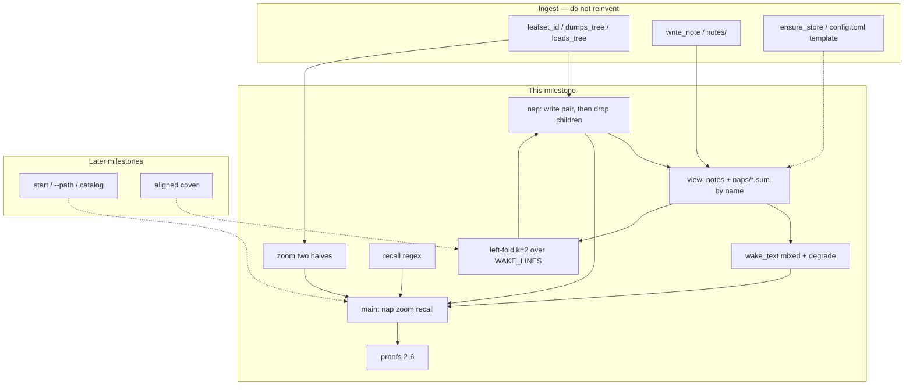
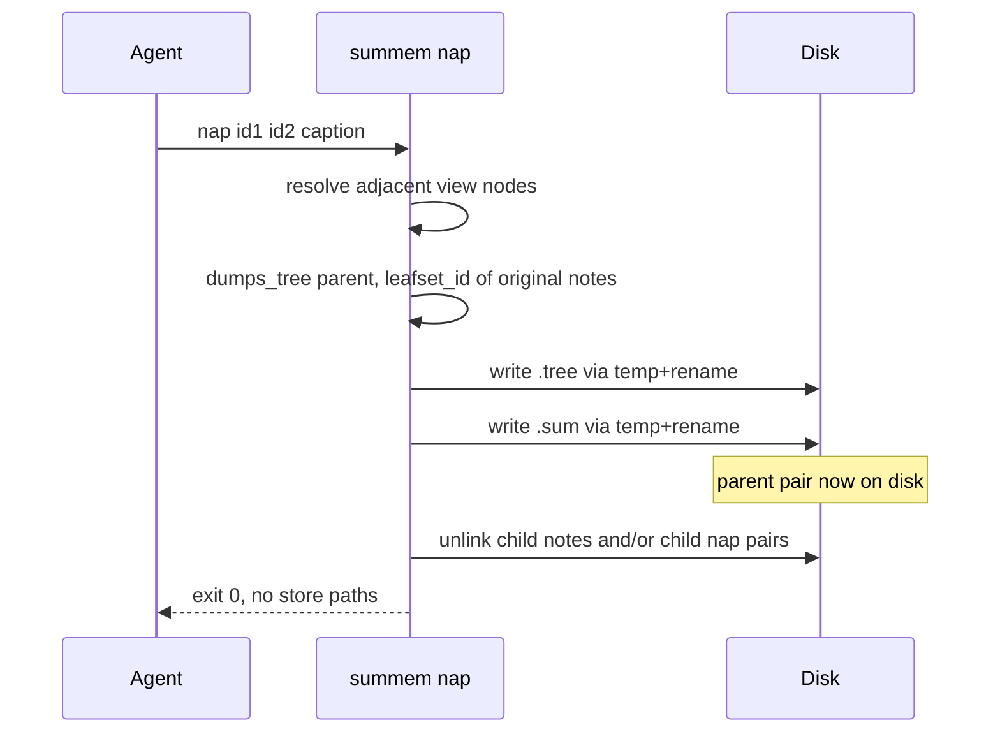
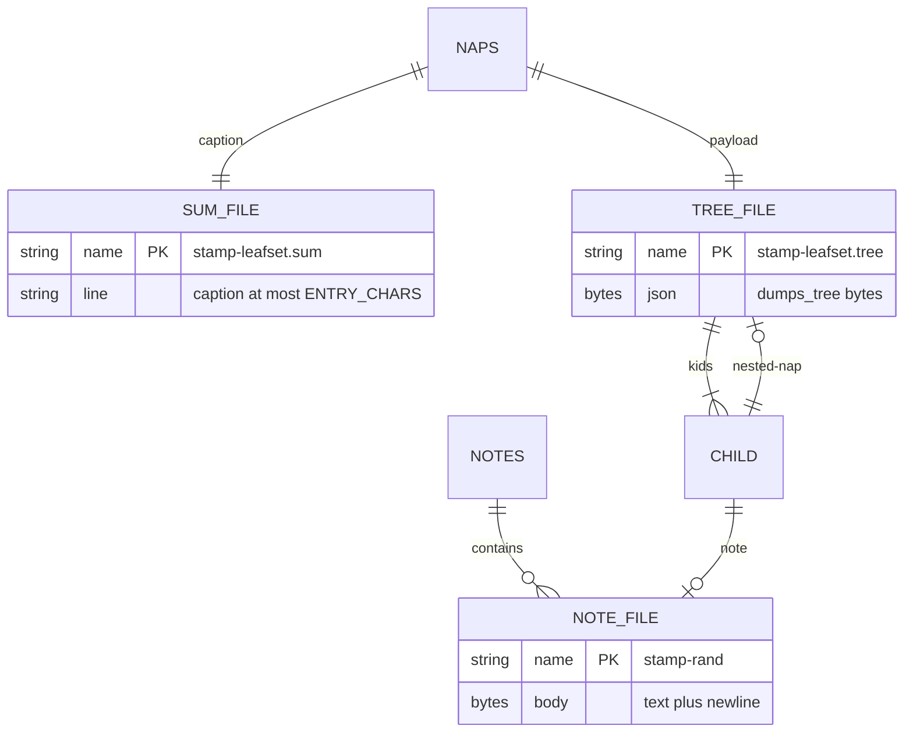

# Task: single-store

* Task ID: single-store
* Complexity: Level 3
* Type: feature

Extend `.summem/summem` from ingest (`wake` / `note` only) to single-store memory: mixed wait-free `wake`, `nap`, `zoom`, `recall`, left-fold of adjacent view nodes, first proofs 2–6. Identity stays `leafset_id` / `dumps_tree` in this file. Architecture is `VISION.md`; this plan only pins CLI arity, nap filenames, and fold triggering so two implementers write the same driver.

## Pinned Info

### Component graph

What this milestone touches, and what it must not.

### Nap write order

Children leave the working tree only after the parent payload exists.

### Store files after a two-note nap

## Component Analysis

### Affected Components
- **Codec (`.summem/summem`)** — already serializes note and nested nap children. No second hash join. This milestone *calls* `leafset_id`, `dumps_tree`, and `loads_tree`; it does not change their bytes.
- **Store boot (`ensure_store`)** — today creates `notes/`, `config.toml` template, and the driver. Also create `naps/`. Do not parse `config.toml`. Do not overwrite an existing driver.
- **View** — new. Union of `notes/` files (no dot-prefix) and `naps/*.sum` (no dot-prefix), sorted by filename. A nap's sort key is the minimum child stamp, encoded as the filename prefix, not compaction time. Do not open `.tree` to sort or to wake.
- **Nap writer** — new. Build a `Tree` of the chosen view nodes ( `NoteChild` or `NapChild` with nested tree). Parent id is `leafset_id` of *original note digests*, not of child nap ids. Write `.tree` then `.sum` (temp + rename). Then delete child view files. Same children → same paths. Different caption → same `.tree` bytes, different `.sum`.
- **Wake (`wake_text`)** — today lists loose notes only. Include nap captions. Grain for a nap is leaf count and min date from the filename, matching the existing ` (1 note, from YYYY-MM-DD) ` note line. Missing `.sum` or `<<<<<<<` in `.sum`: skip the caption, still wait-free (do not refuse). Do not mention `notes/`, `naps/`, or git.
- **Zoom** — new. Load the `.tree` for that leaf-set id, print the two children (id + grain + note text or caption). Nested naps zoom one level per call. Missing `.sum` does not block zoom.
- **Recall** — new. Regex search over view captions/note texts and original note texts inside `.tree` files. Print matching lines. No store paths.
- **Left-fold** — new. `WAKE_LINES = 32` in-script default, injectable for tests. `k = 2`: oldest adjacent view nodes. The script *identifies* the pair; it does not invent a caption. `note` still writes the note; if `len(view) > WAKE_LINES`, print a request that names the two oldest ids so the agent/test can `nap`. Do not auto-write `.sum` text. Do not parse config for this budget.
- **CLI (`main`)** — add `nap`, `zoom`, `recall`. Keep `wake` / `note`. Keep rejecting `--path` and `start`. Change `test_nap_is_unknown` so `nap` is a real command.
- **Proof harness (`tests/gitutil.py` plus new proof tests)** — worktree/merge/clone helpers already used by proof 1. Reuse `init_repo` and subprocess to `sys.executable` + `SCRIPT`.
- **Docs (`VISION.md`, `ROADMAP.md`)** — invocation already says `.summem/summem`. Do not shrink `VISION.md`. Do not implement Later. Optional one-line ROADMAP Phase 2 status only if a prose sentence is now false.

### Cross-Module Dependencies
- Nap writer → codec: parent `.tree` bytes must equal `dumps_tree` of the assembled `Tree`.
- Nap writer → view: children are current view nodes, not arbitrary files.
- Wake → view: listing is the view, captions from `.sum` or note bodies.
- Zoom → codec: `loads_tree` of the parent `.tree`.
- Recall → view + `.tree` payloads.
- Fold → view + nap writer (selection only; caption comes from CLI).
- CLI → all of the above; `main` stays the only agent entry.
- Proofs → CLI as a process (not only imported functions) for 2, 4, 6.

### Boundary Changes
- Public CLI: `nap <id> [<id> ...] <caption>`, `zoom <id>`, `recall <regex>` added. `wake` output may include nap lines. `note` may print a nap request after a successful write when over budget; it still exits 0 on a valid note.
- On-disk: `naps/{minStamp}-{leafset}.sum` and `.tree`. `ensure_store` creates `naps/`.
- Identity: unchanged. Parent leaf-set id is `leafset_id` of original note digests. Nested `NapChild.id` is that child's leaf-set id, as ingest already tested.
- Config: still a commented template. No new knobs read from disk.
- This repo's gitignore already ignores `naps/`.

### Invariants & Constraints
- Agents never write store files.
- Ingest still commutes: two notes are two paths. Nap of the same leaves is two same-path files; only `.sum` may conflict.
- Parent `.tree` exists on disk before any child unlink.
- Sequence is the filename. Nap prefix is min child stamp (UTC `YYYYMMDDTHHMMSSZ`), not now.
- Wake never refuses to print.
- CLI and wake text never mention `notes/`, `naps/`, hashes as paths, or git.
- Missing config means script defaults (`WAKE_LINES = 32`, `ENTRY_CHARS = 280`).
- No `--path`, `start`, catalog, cover, hatchling, root-level `summem`, or second hash scheme.
- Tests load the driver with `SourceFileLoader` via `load_summem`. Process tests use `sys.executable`, not this machine's bare `python3`.
- Do not commit this development tree's store data.

### Plan pins (not creative)

These are the only places `VISION.md` leaves a single implementer-shaped hole. They are pinned here so preflight and build do not fork.

1. **`nap` arity.** `VISION.md` writes `nap <id> "…"`. Proof 2 naps "the same pair." Agents must not hash. Therefore `nap` takes one or more **wake-printed view ids** (the children) and a final caption argument. The script checks they are adjacent in the current view, builds the parent, and derives the parent id. A token matching a positional range (`N-M` or `#…`) is rejected. No ids, or no caption, is rejected. Recaptioning an existing view node (a single id that already *is* one view node) is rejected: fold is 2+ children.
2. **Nap filenames.** Identity is the leaf-set hex. Sort key is min child time, and wake must not open `.tree` to sort. Filename is `{minStamp}-{leafset}.sum` / `.tree`. Same leaves ⇒ same min stamp ⇒ same path. Two agents, same children, different sentences ⇒ conflict on `.sum` only.
3. **Left-fold trigger.** `k = 2`. Budget `WAKE_LINES` is a module constant, injectable in tests, not read from `config.toml`. The script never invents a caption. Over-budget `note` prints the two oldest view ids as a request; tests/agents call `nap`. Proof 4 may nap in a loop without waiting on that request.
4. **Conflict degrade.** Treat a `.sum` as conflict-marked if its bytes contain `<<<<<<<`. Skip that caption on wake. Zoom still uses `.tree`.
5. **Zoom.** One level: print the parent’s two children in view order. A child nap prints its caption and id; a child note prints its text and id.

## Open Questions

None — implementation approach is clear. `VISION.md` already chose files, wait-free wake, leaf-set identity, and proofs 2–6. The pins above close CLI arity, nap names, and fold triggering without a creative loop.

## Test Plan (TDD)

### Behaviors to Verify

- `ensure_store` → `naps/` directory exists; existing driver still not overwritten.
- Two adjacent loose notes, `nap id1 id2 caption` → `.tree` bytes equal `dumps_tree`; `.sum` is caption plus newline; parent id is `leafset_id` of both note digests; both note files gone; wake shows one line with that id and the caption.
- Same children, two captions → same `.tree` bytes and same dest paths; `.sum` contents differ.
- Nap of two naps → parent `NapChild` trees nest; parent id is `leafset_id` of all original note digests; child nap files gone after parent exists.
- Children still on disk if parent `.tree` write has not succeeded (simulate by not calling unlink path; unit: writer writes tree before any unlink).
- Caption empty, caption over `ENTRY_CHARS` UTF-8 bytes, caption with newline → rejected; store unchanged.
- Non-adjacent view ids → rejected; store unchanged.
- Single id that is already one view node → rejected.
- Unknown id → rejected; errors omit `notes/`, `naps/`, git.
- Wake mixed view → notes and naps sorted by filename; nap grain uses leaf count and date from min stamp prefix; note grain unchanged.
- Wake with `<<<<<<<` in `.sum` → that caption omitted; other lines print; exit success.
- Wake with missing `.sum` but `.tree` present → does not refuse; does not crash.
- `zoom id` of a two-note nap → both original texts; does not mention store paths.
- `zoom` of a nap-of-naps → two child captions/ids, not all leaves in one shot.
- `zoom` after `.sum` conflict markers → still prints leaves from `.tree`.
- `recall regex` → matches a loose note, a caption, and a sentence only inside a `.tree`.
- CLI `nap` with `16-31`, `#2-5`, or no id → nonzero, proof 5.
- CLI `zoom` / `recall` similarly require their argument.
- CLI `--path` and `start` still unknown.
- `len(view) > WAKE_LINES` after `note` → stdout/stderr request contains the two oldest ids; note was still written; no new `.sum` until `nap`.
- Injectable `WAKE_LINES=3` with four notes → request names the two oldest.
- Proof 2: two worktrees nap the same two notes with different captions; merge conflicts only on `.sum`; either resolved tree wakes and zooms.
- Proof 3: plant `<<<<<<<` in `.sum`; wake skips caption; zoom prints leaves.
- Proof 4: 100 notes, fold to three naps, squash onto `main`, clone `main`, `zoom` an original sentence; branch log gone.
- Proof 5: covered by CLI range/missing id tests (process-level).
- Proof 6: two branches each fold a disjoint pack; merge clean; wake two pack-grain lines; `nap` those two ids; one parent.

### Test Infrastructure

- Framework: pytest as in `pytest.ini`
- Test location: `tests/`
- Conventions: `load_summem()` from `conftest.py`; `init_repo` from `gitutil.py`; function tests import the driver; proof tests subprocess `[sys.executable, str(SCRIPT), ...]` with `cwd` a throwaway repo under `tmp_path`.
- New test files: `tests/test_view.py`, `tests/test_nap.py`, `tests/test_zoom.py`, `tests/test_recall.py`, `tests/test_fold.py`, `tests/test_proof_conflict.py`, `tests/test_proof_squash.py`, `tests/test_proof_branches.py`
- Extended: `tests/test_wake.py`, `tests/test_cli.py`, `tests/test_store.py`
- Unchanged except if a new `naps/` assertion is added: `tests/test_codec.py`, `tests/test_proof_ingest.py`

### Integration Tests

- Proof 2–3: CLI + git merge / planted markers (`tests/test_proof_conflict.py`)
- Proof 4: CLI + squash + clone (`tests/test_proof_squash.py`)
- Proof 6: CLI + two branches + follow-up nap (`tests/test_proof_branches.py`)
- Proof 5: CLI process (`tests/test_cli.py`)

## Implementation Plan

### 1. Store boot: `naps/` directory — executable

- Files: `tests/test_store.py`, `.summem/summem` (`ensure_store`)

1. Stub tests: `test_ensure_store_creates_naps_dir` (empty body).
2. Stub interface: none new if `ensure_store` already exists; no new signature required.
3. Write tests and run red: first `note` or `wake` in a repo creates `.summem/naps/` as a directory; existing driver still not overwritten (existing tests stay green).
4. Write code and run green: `mkdir` `naps/` beside `notes/` in `ensure_store`.

### 2. View listing — executable

- Files: `tests/test_view.py`, `.summem/summem` (`ViewNode` or equivalent, `list_view`)

1. Stub tests: mixed note+nap sort; skip dot-prefix in `naps/`; skip unreadable note as today.
2. Stub interface: `list_view(parent) -> list` of view nodes with `id`, `sort_name`, `kind`, `caption`.
3. Write tests and run red: two notes and one planted `.sum` sort by filename; nap id is the leaf-set hex from the name; dot-prefix nap temp not listed.
4. Write code and run green: implement `list_view` without reading `.tree`.

### 3. Nap writer — executable

- Files: `tests/test_nap.py`, `.summem/summem` (`write_nap` or equivalent)

1. Stub tests: two-note nap; identical `.tree` for two captions; reject empty/long/newline caption; reject non-adjacent; reject single existing view id; parent files exist before children disappear (order assertion via a helper or by inspecting that `write_nap` writes both dest files then unlinks).
2. Stub interface: `write_nap(parent, ids: list[str], caption: str) -> str` (parent id).
3. Write tests and run red: assertions in Behaviors (two-note, same-tree-bytes, deletes after write, errors omit store paths).
4. Write code and run green: assemble `Tree`, `dumps_tree`, paths `{minStamp}-{leafset}.sum|.tree`, temp+rename, then unlink children. Min stamp from child note names / child nap prefixes. Original digests: note file digest; for a nap child, every note digest in its loaded tree.

### 4. Nap-of-naps — executable

- Files: `tests/test_nap.py`, `.summem/summem`

1. Stub tests: `test_nap_of_two_naps_nests_trees_and_unions_leafset`.
2. Stub interface: same `write_nap`.
3. Write tests and run red: four notes → two naps → one parent; `loads_tree(parent.tree)` has two `NapChild`s; `leafset_id` of four note digests equals parent id; four notes and two child naps gone; parent `.tree` contains original sentences.
4. Write code and run green: `NapChild` path in the assembler (ingest dataclasses already exist).

### 5. Mixed wake and caption degrade — executable

- Files: `tests/test_wake.py`, `.summem/summem` (`wake_text`)

1. Stub tests: wake shows nap caption and 64-hex id; grain for a 2-note nap; conflict-marked `.sum` skips caption; missing `.sum` does not refuse; `loads_tree` is not called during wake (monkeypatch).
2. Stub interface: extend `wake_text` only.
3. Write tests and run red.
4. Write code and run green: iterate `list_view`; on `<<<<<<<` skip caption; never raise for a bad caption.

### 6. Zoom — executable

- Files: `tests/test_zoom.py`, `.summem/summem` (`zoom_text`)

1. Stub tests: two-note nap zoom prints both texts; nap-of-naps zoom prints two child captions; conflict `.sum` still zooms; unknown id rejected without store paths.
2. Stub interface: `zoom_text(parent, id) -> str`.
3. Write tests and run red.
4. Write code and run green: find nap by leaf-set in the filename; `loads_tree`; format two children. Do not dump git.

### 7. Recall — executable

- Files: `tests/test_recall.py`, `.summem/summem` (`recall_text`)

1. Stub tests: match loose note; match caption; match a sentence that exists only inside `.tree` after children were deleted; no path leakage.
2. Stub interface: `recall_text(parent, pattern) -> str`.
3. Write tests and run red.
4. Write code and run green: `re.search` over view strings and over note texts in every `.tree` (walk nested `NoteChild`). Invalid regex → nonzero at CLI, `ValueError` in the function.

### 8. Left-fold selection and over-budget note — executable

- Files: `tests/test_fold.py`, `.summem/summem`

1. Stub tests: `oldest_adjacent(view, k=2)` returns the two oldest ids; `note` with injected `WAKE_LINES=3` and four notes prints those two ids and does not write a nap; `WAKE_LINES` default is 32 and is not read from `config.toml`.
2. Stub interface: `oldest_adjacent`, optional `wake_lines` argument on `write_note` / `main` path; module `WAKE_LINES = 32`.
3. Write tests and run red.
4. Write code and run green: after a successful note, if view is over budget, print a request containing the two ids. Do not call `write_nap` from `write_note`.

### 9. CLI surface — executable

- Files: `tests/test_cli.py`, `.summem/summem` (`main`)

1. Stub tests: replace `test_nap_is_unknown` with success + proof-5 rejects (`16-31`, `#2-5`, missing id, missing caption); `zoom` and `recall` wired; `--path` and `start` still fail; errors omit `notes/`, `naps/`, git.
2. Stub interface: argparse subparsers `nap` (ids + caption), `zoom` (id), `recall` (pattern).
3. Write tests and run red.
4. Write code and run green: dispatch; range-like tokens rejected before lookup.

### 10. Proof 5 (process) — executable

- Files: `tests/test_cli.py` (process subprocess cases if not already)

1. Stub tests: subprocess `nap 16-31 "x"` and `nap` with no id, cwd a real repo.
2. Stub interface: none.
3. Write tests and run red.
4. Write code and run green: already satisfied by unit 9 if process tests are included there; keep this unit if CLI tests were import-only.

### 11. Proofs 2 and 3 — executable

- Files: `tests/test_proof_conflict.py`, `tests/gitutil.py` if a helper is reused

1. Stub tests: `test_two_worktrees_nap_same_leaves_conflict_only_on_sum`; `test_planted_sum_markers_wake_degrades_zoom_still_prints`.
2. Stub interface: none new.
3. Write tests and run red: follow proof 1’s worktree pattern; different captions; `git merge` has conflict; `.tree` files identical and unconflicted; checkout either `.sum`; `wake` and `zoom` succeed. Proof 3 writes markers into `.sum` without merging.
4. Write code and run green: only if units 3–6 were incomplete; do not weaken the proof.

### 12. Proof 4 — executable

- Files: `tests/test_proof_squash.py`

1. Stub tests: 100 notes on a branch, loop `nap` oldest two until three view nodes, commit, squash onto `main`, `git clone` that tip, `zoom` finds an original sentence; `git log` on the clone has no branch commit messages from the 100-note commits.
2. Stub interface: none.
3. Write tests and run red.
4. Write code and run green: use injected clocks so names sort; captions can be short placeholders (`block {n}`) because the agent in the proof is the test.

### 13. Proof 6 — executable

- Files: `tests/test_proof_branches.py`

1. Stub tests: two branches, disjoint notes folded to one nap each, merge to `main` with zero conflicts, `wake` has two lines, `nap` those two ids, one parent, `zoom` still reaches an original from each side.
2. Stub interface: none.
3. Write tests and run red.
4. Write code and run green: nap-of-naps from unit 4 must already work.

### 14. Docs check — prose/policy

- Files: `ROADMAP.md` (only if a Phase 2 sentence is factually wrong after this plan’s pins); `VISION.md` (do not shrink)

1. Read Phase 2 against pins (time-prefix filenames, `nap` arity, `WAKE_LINES` default).
2. If ROADMAP says something false, fix that sentence. Do not add Later work. Do not edit `VISION.md` unless it still claims the driver is not `.summem/summem`.
- No tests: prose/policy artifact

## Technology Validation

No new technology — validation not required. Same shebang driver, stdlib, pytest, `uv run --python 3.11 --with pytest pytest`, `SourceFileLoader`. No `tomllib` import. No new packages.

## Challenges & Mitigations

- **VISION table shows one `<id>` but proof 2 is a pair.** Pin 1: multiple wake-printed child ids, caption last. Mitigation: proof 5 still rejects ranges and missing ids; tests lock arity.
- **Leaf-set stem vs temporal sort.** Hash-only filenames would scramble oldest-neighbor fold. Pin 2: min-stamp prefix. Mitigation: view tests sort by name; proof 6 fails if sort is hash order.
- **`test_nap_is_unknown` will fail as soon as the parser grows `nap`.** Mitigation: unit 9 rewrites that test in the same change as the parser, after writer tests exist so the success path is real.
- **Silent auto-nap would invent captions.** Mitigation: unit 8 only *requests* ids; proofs call `nap` with explicit captions.
- **Unlink-before-write would break zoom after squash.** Mitigation: unit 3 asserts dest files exist before children disappear; proof 4 is the integration net.
- **Proof 4 is slow if it shells 100 times plus many naps.** Mitigation: import `write_note` / `write_nap` for the 100 writes if needed, but squash/clone/zoom must subprocess the installed driver like proof 1. Prefer injected `now` for notes.
- **This development repo must not become a store.** Mitigation: keep gitignore; tests use `tmp_path`; do not run `note` in the SumMem tree during build.
- **Default `python3` here is 3.10.** Mitigation: unchanged — tests via `uv run --python 3.11`; process tests use `sys.executable`.

## Pre-Mortem

- **Plan failed because we napped only raw notes and proof 6 was “later.”** Response: unit 4 is before proofs and is required, not optional. Already a Challenge; keep it on the critical path.
- **Plan failed because wake opened `.tree` and became the budget problem.** Response: `list_view` / `wake_text` must not read `.tree`. Add that as a test: a huge planted `.tree` is never opened on wake (stat mtime or a monkeypatched `loads_tree` that fails if called). Add that assertion to unit 5.
- **Plan failed because we introduced 8-character ids from the Sequence picture.** Response: tests already lock 64-hex; do not add a short alias.
- **Plan failed because `nap` took a precomputed parent leaf-set id agents cannot know.** Response: Pin 1 forbids that; CLI tests pass child ids copied from `wake`.
- **Plan failed because config parsing leaked into this milestone and 3.10 exploded on `tomllib`.** Response: no import; `WAKE_LINES` is a constant. Unit 8 asserts `config.toml` is not read.
- **Plan failed because proof 4 zoomed via `git log`.** Response: clone has only the squashed tip; zoom must read `.tree` at HEAD.

## Status

- [x] Component analysis complete
- [x] Open questions resolved
- [x] Test planning complete (TDD)
- [x] Implementation plan complete
- [x] Technology validation complete
- [x] Pre-Mortem complete
- [ ] Preflight
- [ ] Build
- [ ] QA
