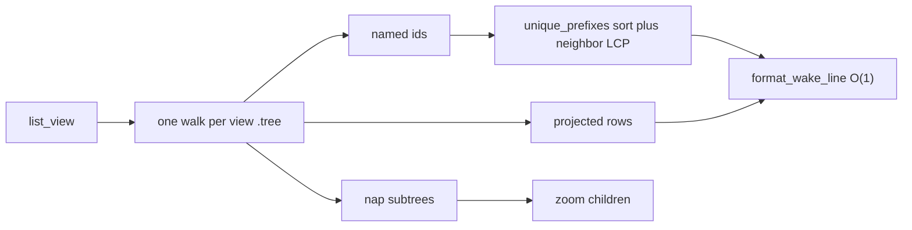

# Task: recall-zoom-prefix

* Task ID: recall-zoom-prefix
* Complexity: Level 2
* Type: simple enhancement

Make `recall` and `zoom` compute unique prefixes once per command and parse each view `.tree` at most once, sharing that walk with `named_ids`. Issue #50 is the spec. Wake and fold may keep today's `short_id` call sites.

## Test Plan (TDD)

### Behaviors to Verify

- Unique prefixes among distinct ids: a set of hex ids → each id maps to the same prefix `short_id` already returns for that id in that set
- Repeated id is one identity: `[cid, cid, other]` → both `short_id` and the prefix table give the floor-length prefix of `cid`
- Shared floor prefix lengthens: two ids that share the first 8 hex → prefixes grow to the first differing character
- Prefix map print path: `format_wake_line` given a `dict` of id → prefix → pack line uses that prefix and does not call `short_id`
- Recall parse-once: `recall_text` on a store with two view packs → `loads_tree` is invoked once per readable `.tree` body
- Zoom parse-once: `zoom_text` of a nested id in a two-pack store → `loads_tree` is invoked once per readable `.tree` body
- Recall still matches note text and nap captions, not grain, day, or id prefix: existing `test_recall_does_not_match_grain_day_or_prefix` stays green
- Unreadable sibling: existing recall/zoom skip-and-warn tests stay green
- `named_ids` still swallows a non-mapping tree child without raising: existing `test_named_ids_skips_non_mapping_tree_child` stays green
- Zoom of a view nap whose tree is unreadable is still `unreadable pack`, not `skipped a pack`
- Wake listing and fold-request output do not change: existing `test_wake.py` / `test_fold.py` stay green

No several-thousand-leaf CI fixture. That acceptance is the product of the prefix table plus parse-once, which the tests above pin. A 5k-leaf store in pytest would test the machine, not the contract.

### Test Infrastructure

- Framework: pytest via `tox` (`py311`–`py314`), `pytest.ini` `testpaths = tests`
- Test location: `tests/`
- Conventions: `load_summem()` from `conftest.py`; `init_repo` from `gitutil.py`; docstring on each test names the behavior; `monkeypatch.setattr(m, "loads_tree", counted)` already used in `tests/test_wake_expand.py`
- New test files: none

## Implementation Plan

### 1. Prefix table — executable

- Files: `summem`, `tests/test_wake.py`

1. Stub tests: in `tests/test_wake.py` add empty `test_unique_prefixes_matches_short_id`, `test_unique_prefixes_repeated_id_is_one_prefix`, `test_unique_prefixes_lengthens_until_unique`, `test_format_wake_line_uses_prefix_map_without_short_id`
2. Stub interface: add `unique_prefixes(ids: list[str], floor: int = 8) -> dict[str, str]` in `summem` with the existing docstring style and an empty body; do not change `short_id` or `format_wake_line` yet
3. Write tests and run red: `unique_prefixes` equals `{cid: short_id(cid, ids) for cid in set(ids)}` on a unique pair, a repeated id, and a shared 8-hex floor; `format_wake_line` on a nap `ProjectedNode` with `{node.id: "deadbeef"}` contains `deadbeef` while `short_id` is monkeypatched to raise
4. Write code and run green: implement `unique_prefixes` as dedupe, sort, longest common prefix with each neighbor, prefix length `max(floor, left+1, right+1)` clipped to `len(cid)`; implement `short_id` as a lookup in `unique_prefixes([*ids, cid], floor)` so existing `short_id` tests stay equivalent; in `format_wake_line`, if `ids` is a `dict` use `ids[node.id]`, else keep `short_id(node.id, ids)`. Leave `wake_text` and `fold_request` call sites passing a list.

### 2. Shared view-tree walk — executable

- Files: `summem`, `tests/test_zoom.py`

1. Stub tests: in `tests/test_zoom.py` add empty `test_named_ids_parses_each_view_tree_once`; keep `test_named_ids_skips_non_mapping_tree_child` as the silent-failure oracle
2. Stub interface: add `_index_tree(tree: Tree)` that will return nested ids in current `_collect_ids` order plus a `dict` of id → `ProjectedNode` and id → child `Tree` for naps; add `_view_packs(parent)` that will parse each view `.tree` at most once and return `(ids, packs)` where each pack records the view node, parse status (`ok` / `missing` / `unreadable`), and the index when ok. Empty bodies. Do not add a new store dataclass.
3. Write tests and run red: two view naps → `named_ids` causes `loads_tree` once per `.tree` body; a non-mapping child still returns the parent id and does not raise
4. Write code and run green: one walk that appends ids in today's preorder (`_collect_ids` order) and returns leaf count and min stamp from descendants so a nap row does not call `_note_children` again; `_view_packs` uses `list_view`, `loads_tree`, and `_TREE_PARSE_ERRORS` the way `named_ids` does today (silent skip); `named_ids` becomes the id list from `_view_packs` and must not parse again. Leave `_projected_child` as the wake-expand path.

### 3. Recall one pass — executable

- Files: `summem`, `tests/test_recall.py`

1. Stub tests: in `tests/test_recall.py` add empty `test_recall_parses_each_view_tree_once` and `test_recall_does_not_call_short_id_per_hit`
2. Stub interface: none new; `recall_text` / `_recall_nested` signatures stay
3. Write tests and run red: two view packs, recall a leaf that lives in the second pack → `loads_tree` once per readable `.tree`; a recall that prints several pack lines with a prefix map installed does not call `short_id`. Existing match-surface and skip-and-warn tests stay in the file and must remain green after the code step
4. Write code and run green: `recall_text` calls `_view_packs` once, builds `unique_prefixes` once, matches view captions then nested note text and nap captions from the already-walked rows, and passes the prefix `dict` to `format_wake_line`. Do not call `named_ids` (that would be a second walk) and do not re-`loads_tree`. Keep `skipped a pack` on unreadable siblings. Drop `_recall_nested` if nothing else calls it.

### 4. Zoom one pass — executable

- Files: `summem`, `tests/test_zoom.py`

1. Stub tests: in `tests/test_zoom.py` add empty `test_zoom_parses_each_view_tree_once`; rewrite `test_ambiguous_prefix_is_error` so it stubs the id list `_view_packs` (or `named_ids` if zoom still reads ids from a helper the test can patch) rather than assuming a second `named_ids` walk
2. Stub interface: none new; `zoom_text` / `_find_in_tree` / `_zoom_kids` signatures may gain an optional prefix map / row map, or stay and ignore unused paths
3. Write tests and run red: zoom a nested note id in a two-pack store → `loads_tree` once per readable `.tree`; existing unreadable-target vs skipped-sibling tests stay the oracles for the two error paths
4. Write code and run green: `zoom_text` uses `_view_packs` once and `unique_prefixes` once. A matching view note prints from the view node. A matching view nap with `missing` raises `unknown id` without the wake hint. A matching view nap with `unreadable` raises `unreadable pack` and does not print `skipped a pack`. Nested lookup uses the index, not a second `loads_tree`. Unreadable siblings in the nested search print `skipped a pack` and continue. `_zoom_kids` formats from precomputed rows when present so it does not call `_projected_child` for those children. Proof walkers stay on `Tree.kids`. Drop `_find_in_tree` / `_collect_ids` if unused.

### 5. Atlas zoom and recall — prose/policy

- Files: `docs/architecture/index.md`
- No tests: prose/policy artifact

1. In the Zoom and recall section, state that recall and zoom build one prefix table per command (sort plus neighbor LCP) and parse each view `.tree` at most once; `named_ids` is that same walk's id list; wake and fold may still call `short_id` per line
2. Do not add a procedure, a benchmark recipe, or a change-detector test

## Technology Validation

No new technology - validation not required

## Dependencies

- Existing `loads_tree`, `list_view`, `format_wake_line`, `resolve_id`, `_TREE_PARSE_ERRORS`, `ProjectedNode`
- Existing pytest helpers: `load_summem`, `init_repo`, `dated_leaf`
- Sibling shards #49 (catalog) and #51 (heal) must not be edited

## Challenges & Mitigations

- Warning vs raise: `named_ids` is silent; zoom of the target view pack raises `unreadable pack`; nested search warns `skipped a pack`. `_view_packs` must record status only. Each command decides whether to warn.
- `test_ambiguous_prefix_is_error` patches `named_ids`. If zoom stops calling `named_ids`, update that test to patch the shared helper. Do not keep a second parse just to satisfy the old patch point.
- `format_wake_line` list-vs-dict: list keeps wake/fold cheap and unchanged; dict is the O(1) path. Tests cover both.
- `short_id` when `cid` is absent from `ids`: today's function still computes a prefix. Implement `short_id` via `unique_prefixes([*ids, cid], floor)[cid]` so that edge stays.
- Do not add a store dataclass. Tuples or a plain dict for pack records. Leave `NoteChild` / `NapChild` / `Tree` / `ViewNode` / `ProjectedNode` alone.
- Empty nested nap: today's `_projected_child` returns `None` and `_zoom_kids` skips it. The index must do the same.

## Pre-Mortem

- Prefix table disagrees with `short_id` on a neighbor-LCP off-by-one: already covered by Challenge on `short_id` plus the equivalence tests in unit 1. If red, fix LCP (`left+1` / `right+1`, not `left`) before touching recall.
- Shared walk warns during id collection and breaks `named_ids` silence or zoom's target-unreadable raise: already covered by the status-only pack record in Challenge 1.
- A process-global parse cache leaks across commands or tests: do not cache. One walk per call, returned to the caller.
- A 5k-leaf pytest fixture makes tox unusable: already excluded in the test plan. Prove the algorithms; do not time the disk.
- Scope leak into catalog or heal while chasing parse counts: stay in lane. `leaf_digests` / `heal_view` may parse trees on mutate; that is #51.

## Status

- [x] Initialization complete
- [x] Test planning complete (TDD)
- [x] Implementation plan complete
- [x] Technology validation complete
- [x] Pre-Mortem complete
- [ ] Preflight
- [ ] Build
- [ ] QA
