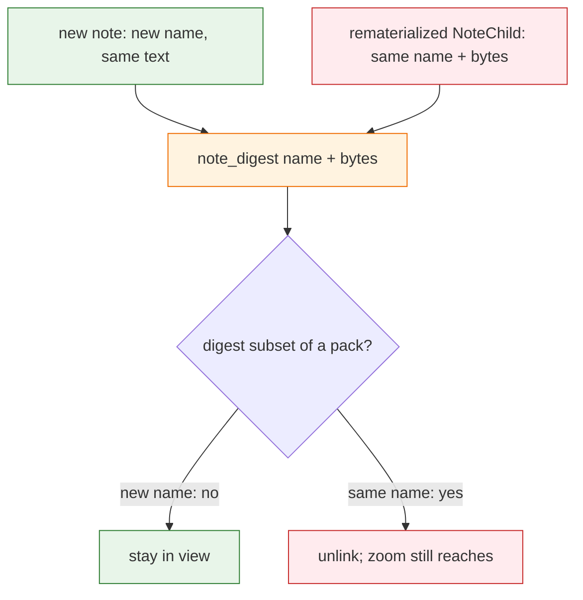

# Task: heal-same-text

* Task ID: heal-same-text
* Complexity: Level 3
* Type: bug fix (identity)

Fix [issue #77](https://github.com/Texarkanine/SumMem/issues/77): a loose note whose text already sits inside a pack must survive heal, and napping two identical notes must not produce a pack whose grain disagrees with its leaf set.

## Pinned Info

### Leaf identity and heal

Per-file identity is the creative winner. Heal overlap and nap grain both walk the same per-file digests, so a new recording is a new leaf and a rematerialized packed name is not.

## Component Analysis

### Affected Components
- `note_digest` / `leafset_id` (`summem`): content-only SHA-256 of file bytes → per-file SHA-256 of `name + NUL + bytes`. `leafset_id` unchanged (sort, join, [:16]).
- View and walks (`list_view`, `leaf_digests`, `_digests_of_tree`, `_digests_of_dict`, `_note_child`, `_projected_child`, `named_ids` walk): pass filename into `note_digest`.
- `heal_view` / `write_nap`: no new overlap rule. Trigger 1 and trigger 2 become honest because leaves differ. Keep rematerialize-drop.
- `migrate.py`: rewrite complete pairs whose stem or nested ids were computed from content-only digests; keep 4-part-64 / 5-part-64. Driver does not dual-read.
- Atlas Identity, `memory-bank/systemPatterns.md`, `docs/theory.md` leak section: two notes with the same text are two leaves.
- This clone’s root and `dogfood` stores: rewrite in the same change.

### Cross-Module Dependencies
- `list_view` note ids and nap stem ids must agree with `_digests_of_tree` after migrate, or zoom nested ids and heal overlap diverge.
- `migrate.py` loads sibling `summem` and must use the new `note_digest` to recompute; tests plant old stems with `hashlib.sha256(file_bytes)` as the content-only oracle.
- Tests across `test_codec.py`, `test_zipper.py`, `test_nap.py`, `test_fold.py`, `test_cli.py`, `test_zoom.py`, `test_migrate.py` currently call `note_digest(bytes)` or assume two same-text notes share an id.

### Boundary Changes
- Breaking on-disk identity: every note view id and nap leaf-set field changes. Same class as #67.
- CLI verbs, Usage, `Saved.`, and fold `Run:` grammar stay. Fold of two identical notes becomes `nap <prefix-a> <prefix-b>`, not `nap <prefix> <prefix>`.

## Open Questions

- [x] Which layer to make honest (per-file identity, multiset heal, nap-reject, or heal-by-filename) → Resolved: per-file identity (see `memory-bank/active/creative/creative-leaf-identity.md`)

## Test Plan (TDD)

### Behaviors to Verify

- `note_digest(name, bytes)` of the same bytes under two names → two digests; same name and bytes → same digest; digest is SHA-256 of `name.encode("utf-8") + b"\0" + file_bytes`.
- Two loose notes with the same text → two view ids; both files survive `heal_view`; they remain a same-grain adjacent pair.
- After a grain-2 fold of two distinct notes, a later `write_note` of one packed sentence survives the next `heal_view`; zoom of the pack still reaches the original sentence.
- Rematerialize a packed `NoteChild` then `heal_view` → that file is gone; pack remains; zoom still reaches it.
- `write_nap` of two identical-text notes → one pack, `leaves == 2`, `|leaf_digests| == 2`, two different child names in the tree.
- `fold_request` for two identical notes quotes two (possibly different) unique prefixes, not one prefix twice unless the ids actually collide.
- `migrate.py` on a complete 5-part-16 pair planted with content-only leaf-set → dest stem and nested `NapChild.id` match per-file `leafset_id`; second pass is a no-op; incomplete pair still exits 1; 4-part-64 / 5-part-64 still shorten.

### Test Infrastructure

- Framework: pytest via `tox -e py311` (iterate); `tox run-parallel` at end-of-work.
- Test location: `tests/`
- Conventions: `tmp_path` + `init_repo`; session `summem` fixture; no `--basetemp`.
- New test files: none. New cases in `tests/test_codec.py`, `tests/test_zipper.py`, `tests/test_migrate.py`. Retarget existing same-id cases in `tests/test_nap.py`, `tests/test_fold.py`, `tests/test_cli.py`.

### Integration Tests

- `test_zipper.py`: fold, new same-text note, heal, files left, zoom.
- `test_migrate.py`: planted content-only pair becomes a driver-readable 5-part-16 pair whose id matches `list_view` after rewrite.
- `test_cli.py`: `nap` of two same-text notes via their prefixes.

## Implementation Plan

### 1. Per-file `note_digest` — executable

- Files: `summem`, `tests/test_codec.py`
- Creative ref: `memory-bank/active/creative/creative-leaf-identity.md`

1. Stub tests: in `tests/test_codec.py`, replace `test_note_digest_is_sha256_of_file_bytes` with name+bytes cases (same text different names differ; round-trip; UTF-8 name; NUL delimiter). Keep `leafset_id` tests, passing a name into `note_digest`.
2. Stub interface: `note_digest(name: str, file_bytes: bytes) -> str` with existing docstring style; empty/wrong body so tests go red.
3. Write tests and run red: `tox -e py311 -- tests/test_codec.py::test_note_digest_is_sha256_of_name_and_file_bytes` (and sibling codec digest tests).
4. Write code and run green: implement SHA-256 of `name.encode("utf-8") + b"\0" + file_bytes`. Then pass `name` at every production call site so the rest of the codec/tree tests can be updated in lockstep in this unit’s green pass: `list_view`, `leaf_digests`, `_note_child`, `_digests_of_tree`, `_digests_of_dict`, `_projected_child`, `named_ids` walk. Update mechanically broken test call sites (`note_digest(bytes)` → `note_digest(name, bytes)` using the real filename or the `NoteChild.name` the test already has). Do not add trigger-1 behavior tests in this unit.

### 2. Heal and nap observable behavior — executable

- Files: `tests/test_zipper.py`, `tests/test_nap.py`, `tests/test_fold.py`, `tests/test_cli.py`
- Creative ref: `memory-bank/active/creative/creative-leaf-identity.md`

1. Stub tests: add `test_note_after_packed_text_survives_heal` in `tests/test_zipper.py` (issue trigger 1). Keep `test_heal_note_covered_by_nap_dropped`. Change `test_nap_two_identical_notes_by_repeated_id`, `test_equal_grain_pair_duplicate_ids_when_same_text`, `test_fold_request_identical_notes_use_short_prefix`, `test_nap_accepts_prefix_of_identical_notes` so they assert two ids, grain 2, `|leaf_digests| == 2`, and two prefixes on `Run:`.
2. Stub interface: none if unit 1 already wired names; if a call site was missed, it shows up red here.
3. Write tests and run red: `tox -e py311 -- tests/test_zipper.py::test_note_after_packed_text_survives_heal` first, then the retargeted same-text cases.
4. Write code and run green: only leftover missed `note_digest` call sites or heal/nap guards that still treat content subset as cover. Do not add a nap/note filename special case. Leave the note/note skip in `_first_overlap`.

### 3. `migrate.py` per-file rewrite — executable

- Files: `migrate.py`, `tests/test_migrate.py`
- Creative ref: `memory-bank/active/creative/creative-leaf-identity.md`

1. Stub tests: plant a complete 5-part-16 pair whose stem leaf-set is the content-only `leafset_id`; after migrate, dest matches per-file ids; nested `NapChild.id` rewritten; second pass no-op; incomplete pair exits 1. Keep existing 64-hex cases, updating their `note_digest` call sites to pass names.
2. Stub interface: extend `_migrate_store` to also consider current 5-part-16 complete pairs whose recomputed leaf-set or nested ids differ.
3. Write tests and run red: `tox -e py311 -- tests/test_migrate.py`.
4. Write code and run green: recompute nested ids from `_digests_of_tree` / `leafset_id`; `_write_pair` then unlink source; skip when dest stem already exists or equals source. Then rewrite this clone’s root and `dogfood` stores with that helper (same change, not a live driver dual-read).

### 4. Atlas and briefing — prose/policy

- Files: `docs/architecture/index.md`, `memory-bank/systemPatterns.md`, `docs/theory.md`
- No tests: prose/policy artifact
- Creative ref: `memory-bank/active/creative/creative-leaf-identity.md`

1. Identity: two notes with the same text are two leaves; the digest includes the filename; rematerialize of the same name is the same leaf.
2. `systemPatterns.md` wake-dates paragraph: drop “two notes with the same text share an id”; adjacency still keeps two view nodes because they are two ids.
3. `docs/theory.md` leak section: the leak is closed; `leafset_id` and `leaf_digests` agree; convergence is over the set of *recordings* (files), not the set of sentences.

## Technology Validation

No new technology - validation not required

## Challenges & Mitigations

- Missed `note_digest` call site still hashes bytes only: grep `note_digest(` in `summem`, `migrate.py`, `surgery.py`, and `tests/` before calling the unit done; zoom `named_ids` walk is the easy miss.
- `test_heal_note_covered_by_nap_dropped` must stay green; if trigger 1 is implemented as “never drop a note that overlaps a nap”, rematerialize-heal breaks. Coverage is digest subset *after* per-file hashing, not a nap/note skip.
- `migrate.py` rewriting nested ids but not the stem, or the reverse, splits `list_view` from `_index_tree`. Recompute both from one tree walk; variant from the rewritten bytes.
- Many tests construct `note_digest(note_file_bytes(text))` without a name. Use the `NoteChild.name` already in that test, or a documented fixture name, never a placeholder that disagrees with the tree.

## Pre-Mortem

- Chose heal-by-filename to avoid migrate, then hit fold-stuck or a lying grain-2 pack: already covered by the creative decision and by unit 2’s grain/`|leaf_digests|` assertion.
- migrate of this clone’s stores is skipped, CI green, dogfood wake still prints pre-fix pack prefixes that do not match zoom children: unit 3 includes rewriting root and `dogfood` in the same change.
- Codec tests pin SHA-256 of bytes only and get “fixed” by keeping the old `note_digest` and adding a wrapper: the plan’s unit 1 replaces that contract; do not leave a bytes-only digest helper.

## Status

- [x] Component analysis complete
- [x] Open questions resolved
- [x] Test planning complete (TDD)
- [x] Implementation plan complete
- [x] Technology validation complete
- [x] Pre-Mortem complete
- [ ] Preflight
- [ ] Build
- [ ] QA
