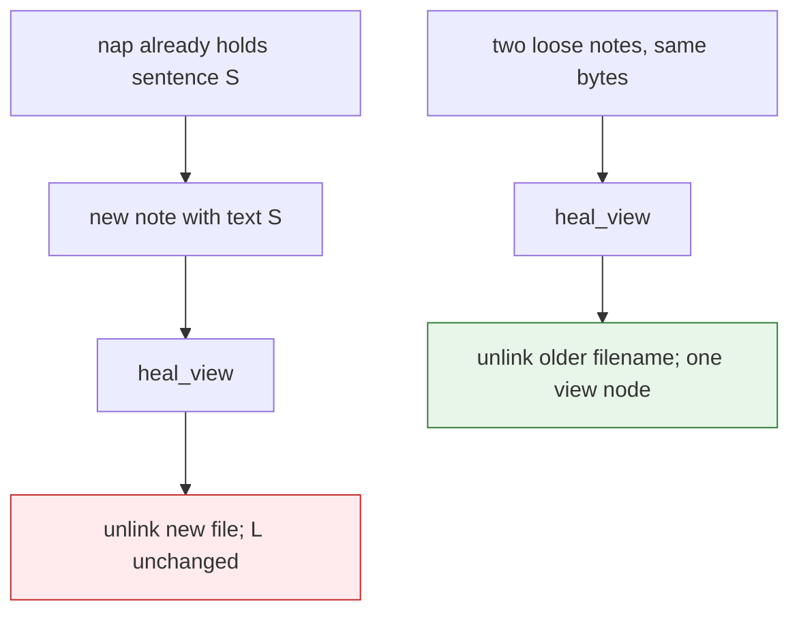

# Task: heal-same-text

* Task ID: heal-same-text
* Complexity: Level 3
* Type: bug fix (identity)

Fix [issue #77](https://github.com/Texarkanine/SumMem/issues/77) under the operator’s vote: `L` is a set of facts. Trigger 1 (heal drops a packed-text loose note) is intended. Trigger 2 (napping two identical notes into grain 2 with one leaf) is the remaining lie. Close the theory “leak” as the shoebox, not as a second identity.

## Pinned Info

### Shoebox heal

Same bytes are one receipt. A loose copy next to a bundle that already holds those bytes is thrown away. Two loose copies collapse the same way.

## Component Analysis

### Affected Components
- `_first_overlap` (`summem`): stop skipping note/note pairs. Same digest set → unlink the older (left, filename order).
- `write_nap`: reject any intersecting digest sets, not only when a nap is on one side.
- Tests that pin two identical notes surviving heal and napping via a repeated id: retarget.
- Atlas Identity, `memory-bank/systemPatterns.md` wake-dates sentence, `docs/theory.md` leak section: `L` is a set of facts; trigger 1 is the shoebox.

### Cross-Module Dependencies
- CLI `note`/`nap` already call `heal_view` before fold. After the skip is gone, `fold_request` should not see two identical notes.
- Direct `write_nap` in tests can still pair two files if heal was not called; the reject closes that path.
- `test_heal_note_covered_by_nap_dropped` is rematerialize of the same name; must stay green.

### Boundary Changes
- No on-disk identity change. No migrate.
- `Saved.` unchanged: the fact is in `L`.
- View after a mutating command holds at most one node per content digest among notes (and a pack still covers that digest).

## Open Questions

- [x] Which layer to make honest → Resolved: keep content identity; trigger 1 intended; collapse loose copies on heal; `write_nap` rejects digest overlap. Operator vote 2026-08-29 (see `memory-bank/active/creative/creative-leaf-identity.md`)

## Test Plan (TDD)

### Behaviors to Verify

- Two loose notes with the same text, then `heal_view` → one file remains (later filename); `L` still has the sentence.
- After a grain-2 fold of two distinct notes, a later `write_note` of one packed sentence, then `heal_view` → that new file is gone; pack remains; zoom still reaches the sentence. (Trigger 1: intended. This is a pin, not a keep-the-file test.)
- Rematerialize a packed `NoteChild` then `heal_view` → file gone; pack remains; zoom still reaches. Unchanged.
- `write_nap` of two identical-text notes (no prior heal) → `ValueError` overlap; no pack written; both files still present until heal.
- CLI `note` of text already inside a pack → exit 0, `Saved.`, new file absent after the command.
- `fold_request` / CLI `nap` of two identical notes after heal: only one view node, so the old `(prefix, prefix)` nap path is gone.

### Test Infrastructure

- Framework: pytest via `tox -e py311` (iterate); `tox run-parallel` at end-of-work.
- Test location: `tests/`
- Conventions: `tmp_path` + `init_repo`; session `summem` fixture.
- New test files: none. Cases in `tests/test_zipper.py`, `tests/test_nap.py`, `tests/test_nap_reject.py` (or existing overlap tests in `tests/test_nap.py`). Retarget `test_nap_two_identical_notes_by_repeated_id`, `test_identical_notes_nappable_after_heal_view`, `test_equal_grain_pair_duplicate_ids_when_same_text`, `test_fold_request_identical_notes_use_short_prefix`, `test_nap_accepts_prefix_of_identical_notes`.

### Integration Tests

- `test_zipper.py`: packed text + new same-text note + heal → file gone, zoom reaches.
- `test_nap.py` / `test_nap_reject.py`: `write_nap` of two same-digest notes raises before write.

## Implementation Plan

### 1. Heal note/note overlap — executable

- Files: `summem`, `tests/test_zipper.py`
- Creative ref: `memory-bank/active/creative/creative-leaf-identity.md`

1. Stub tests: add `test_heal_two_identical_notes_keeps_newer` (two files → heal → one file, later stamp). Change `test_identical_notes_nappable_after_heal_view` / `test_two_identical_notes_stay` so they no longer require both files after heal. Add `test_note_after_packed_text_is_healed_away` pinning trigger 1 as intended (file gone, zoom reaches, `Saved.` still printed if asserted at CLI).
2. Stub interface: none; delete the skip in `_first_overlap` only in step 4.
3. Write tests and run red: `tox -e py311 -- tests/test_zipper.py::test_heal_two_identical_notes_keeps_newer`.
4. Write code and run green: remove the note/note skip in `_first_overlap`.

### 2. `write_nap` rejects digest overlap for notes — executable

- Files: `summem`, `tests/test_nap.py`, `tests/test_nap_reject.py`
- Creative ref: `memory-bank/active/creative/creative-leaf-identity.md`

1. Stub tests: `write_nap` of two same-text notes raises; no `.summ` written. Retarget `test_nap_two_identical_notes_by_repeated_id` and CLI `test_nap_accepts_prefix_of_identical_notes` (after heal there is one node; nap of one id twice still fails).
2. Stub interface: none.
3. Write tests and run red: the new reject case.
4. Write code and run green: drop the `left.kind == "nap" or right.kind == "nap"` conjunct. Keep the existing overlap error string if tests already pin `"overlapping packs"`; if that string is a lie for two notes, use one truthful overlap error and update those tests in this unit — do not add a second error family.

### 3. Fold listings and remaining same-id tests — executable

- Files: `tests/test_fold.py`, `tests/test_cli.py`
- Creative ref: `memory-bank/active/creative/creative-leaf-identity.md`

1. Stub tests: `test_equal_grain_pair_duplicate_ids_when_same_text` and `test_fold_request_identical_notes_use_short_prefix` become: after heal, one node, no `(id, id)` pair. If fold is invoked without heal, do not require a `(prefix, prefix)` Run line.
2. Stub interface: none unless `fold_request` still offers the pair because it lists before heal; mutating CLI heals first. Only change `fold_request` if a failing test shows it still pairs two identical notes that `list_view` can see.
3. Write tests and run red.
4. Write code and run green: only if fold still requests the collapsed pair; otherwise tests-only.

### 4. Atlas and theory — prose/policy

- Files: `docs/architecture/index.md`, `memory-bank/systemPatterns.md`, `docs/theory.md`
- No tests: prose/policy artifact
- Creative ref: `memory-bank/active/creative/creative-leaf-identity.md`

1. Identity: two notes with the same text share an id; heal keeps one. Packed coverage of a later copy is the shoebox.
2. `systemPatterns.md`: drop “they remain two view nodes”; adjacency still needs two distinct ids when two nodes exist.
3. `docs/theory.md` leak section: not a leak. `L` is a set of facts. Heal dropping a packed-text loose note is the design. `note` of a duplicate does not grow `L`. The remaining hole was napping two copies; that path is closed.

## Technology Validation

No new technology - validation not required

## Challenges & Mitigations

- `test_heal_note_covered_by_nap_dropped` must stay: it is the same rule as trigger 1, with the packed child’s name. Do not special-case rematerialize.
- Unlinking `left` of two grain-1 notes keeps the later filename only because `list_view` sorts by name. If a test plants names out of stamp order, “newer” is filename-newer, not clock-newer. Tests should use `write_note` stamps that match name order.
- Existing overlap error says `overlapping packs`. Two notes are not packs. Mitigation: one overlap error; update pinned substrings in this task rather than teach a second phrase.

## Pre-Mortem

- Shipped “keep the new file” tests from the issue’s write-up and fought the shoebox: the plan’s trigger-1 test pins deletion, not survival.
- Left the note/note skip, only rejected `write_nap`, then `fold_request` stuck at budget on `(id, id)`: unit 1 removes the skip so heal runs first on `note`/`nap`.
- Rewrote `note_digest` anyway “for honesty”: unit 1–2 forbid that; no migrate.

## Status

- [x] Component analysis complete
- [x] Open questions resolved
- [x] Test planning complete (TDD)
- [x] Implementation plan complete
- [x] Technology validation complete
- [x] Pre-Mortem complete
- [ ] Preflight
- [ ] Build
- [ ] QA
