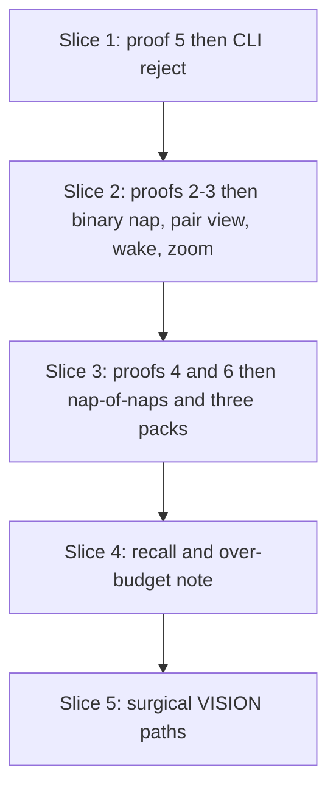
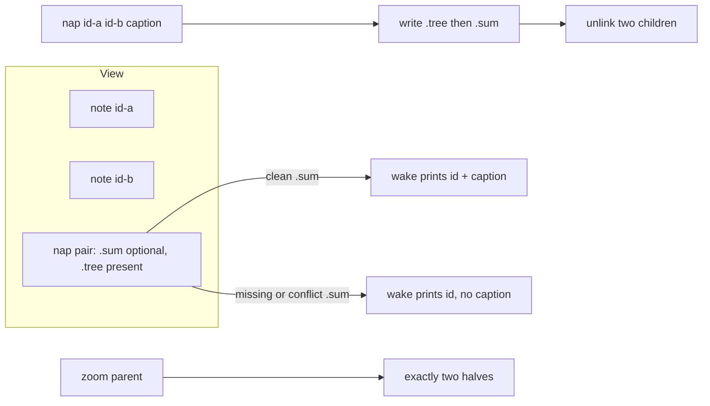
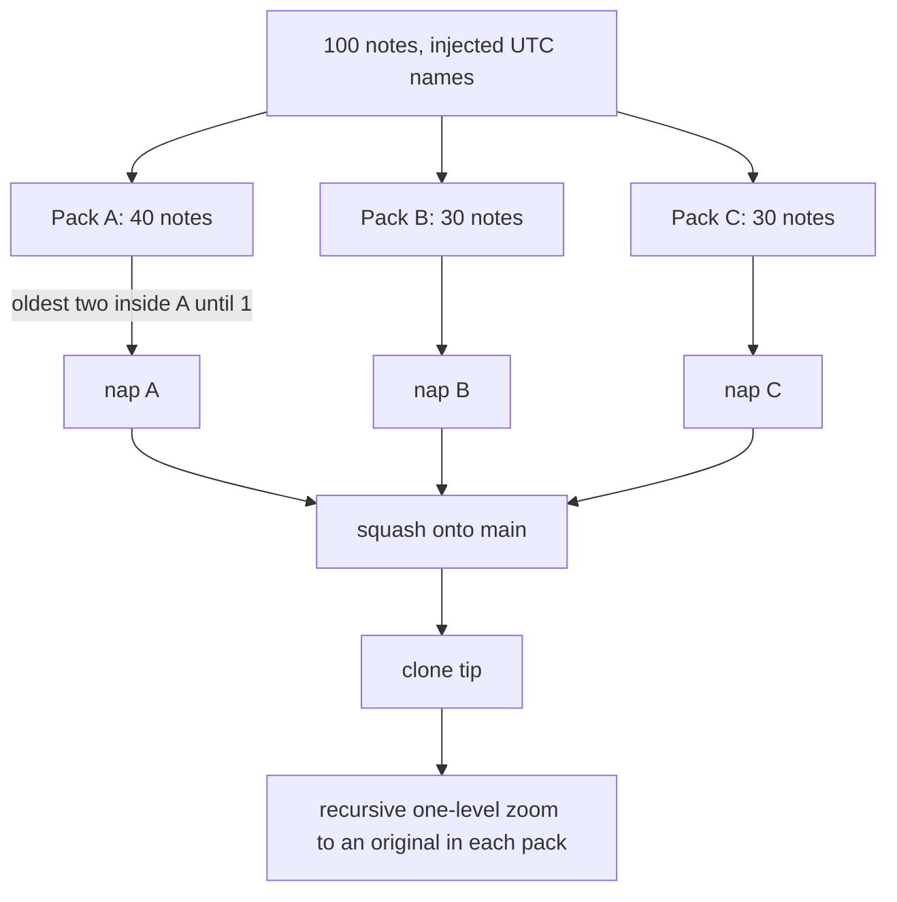

# Task: single-store

* Task ID: single-store
* Complexity: Level 3
* Type: feature

Extend `.summem/summem` from ingest (`wake` / `note`) to single-store memory: binary `nap`, `zoom`, `recall`, pair-aware wait-free `wake`, left-fold of the oldest two view nodes, first proofs 2–6. Identity stays `leafset_id` / `dumps_tree`. This is a **replan** after preflight FAIL: proof tests come first, `nap` is exactly two adjacent wake ids, proof 4 is three explicit packs, missing `.sum` stays visible, and `VISION.md` paths match the filenames.

## Preflight response

| Finding | Plan change |
|---|---|
| Proofs 2–6 after production | Vertical slices: each proof’s tests are steps 1 and 3 of the unit that implements it. No later “proof-only” unit. |
| `nap` arity vs binary zoom | Exactly two adjacent view ids plus caption. Three ids, one id, and ranges are rejected. Zoom of a nap is those two children. |
| Proof 4 → one nap + two notes | Three adjacent packs (40 + 30 + 30). Pairwise-fold the oldest two *inside each pack* until one nap remains per pack. Clone recursively zooms to an original from each pack. |
| Missing `.sum` invisible | View is the union of `.sum` and `.tree` stems. Caption comes from a clean `.sum`. Missing or `<<<<<<<` `.sum`: print the 64-hex id, skip the caption, do not open `.tree`. |
| Filenames vs `VISION.md` | Keep `{minStamp}-{leafset}.sum|.tree` (sequence + identity). Surgical `VISION.md` edits to the naps table and the missing-caption sentence. Do not shrink proofs or Later. *(Stem superseded by the re-run below: a third field, `leaves`, was added. Pin 2 is authoritative.)* |

## Preflight response (re-run)

Ordering, slicing, and the five earlier answers all held. These are the amendments the re-run wrote into the plan. Both tables are a record of what each preflight decided; where they differ, **"Plan pins" and "Component Analysis" below are authoritative.**

| Finding | Plan change |
|---|---|
| Proof 5's assertions pass against `HEAD` today — argparse rejects the unknown word `nap` with exit 2 before the store is touched, so “exits nonzero, writes nothing” can never go red | Unit 1 adds a `nap --help` claim and stderr claims that distinguish “rejected this token” from “never heard of this command”, and states the true red/green sequence |
| `NapChild.sum` was undefined when the child's own `.sum` is missing or conflict-marked — reachable, since pin 3 makes such a nap a normal view node that pin 1 may fold | Pin 7: use `""`, and record the inherited limit that parent `.tree` bytes depend on child captions, not on the leaf set alone |
| `zoom` of a loose-note id was unspecified, though wake prints note ids and nap ids in one undifferentiated listing | Pin 8: succeed and print the note; the recursive walkers in proofs 4 and 6 terminate on it |
| Wake gave naps no grain, so an agent could not tell a 2-note nap from a 40-note one — the exact signal a decaying view exists to carry | `leaves` joins the nap filename. Free (`len(digests)`, already computed for the id), keeps wake off `.tree`, restores `VISION.md`'s own `(16 notes, from …)` line, and lets proof 4 assert `40/30/30` directly |

## Pinned Info

### Proof-first slices

### Binary nap and pair view

### Proof 4 packs

## Component Analysis

### Affected Components
- **Codec** — unchanged bytes. Call `leafset_id`, `dumps_tree`, `loads_tree`. Parent id is `leafset_id` of original note digests, including through nested `NapChild` trees.
- **Store boot (`ensure_store`)** — also create `naps/`. Do not parse `config.toml`. Do not overwrite the driver.
- **View** — union of `notes/` files (no dot prefix) and `naps/*.{sum,tree}` stems. Sort key is the filename. Notes keep ingest names. Naps are `{minStamp}-{leafset}-{leaves}.sum|.tree` where `minStamp` is the minimum child UTC stamp (`YYYYMMDDTHHMMSSZ`), `leafset` is 64 hex, and `leaves` is the decimal count of original notes under that nap. Sorting never reaches `leaves` (equal `leafset` means the same nap), so it needs no padding. Do not open `.tree` to sort or to wake. Caption: clean `.sum` body minus trailing newline. Degrade: stem exists via `.tree` (or `.sum`) but `.sum` is missing or contains `<<<<<<<` → still one view node, empty caption.
- **Nap writer** — exactly two adjacent view nodes. Build `Tree` of two children (`NoteChild` or `NapChild`). `leaves = len(digests)`, the same list already collected for `leafset_id`, so the count is free and cannot disagree with the id. A `NapChild`'s `sum` field is the child's clean `.sum` body, or `""` when that child's `.sum` is missing or contains `<<<<<<<`. Write `.tree` then `.sum` via temp+rename. Then unlink the two children's files (note file, or both `.sum` and `.tree` of a child nap). Same leaves → same dest paths. Injected `.tree` write failure leaves children on disk.
- **Wake (`wake_text`)** — mixed view. Note line unchanged: `{id}  (1 note, from YYYY-MM-DD)  {text}`. Nap with caption: `{id}  ({leaves} notes, from YYYY-MM-DD)  {caption}`. Nap degraded: `{id}  ({leaves} notes, from YYYY-MM-DD)`. Grain and date both come from the filename; wake still never opens `.tree`. Never mention `notes/`, `naps/`, git.
- **Zoom (`zoom_text`)** — one level, exactly two children. Child note: id + text. Child nap: id + caption (or id only if that child's `.sum` is dirty/missing; still loads nested `.tree` for identity). A loose-note id is the terminal case: zoom succeeds and prints `{id}  {text}`, so a recursive walk can stop on a note without treating success as failure. Unknown id rejected without store paths. Conflict on parent `.sum` does not affect zoom.
- **Recall (`recall_text`)** — regex over view strings and `NoteChild` texts inside every `.tree` (nested). Output obeys the same hygiene as wake: no `notes/`, `naps/`, git. Invalid regex is a CLI error.
- **Left-fold** — `WAKE_LINES = 32`, injectable, not read from config. `oldest_adjacent(view)` returns the two oldest ids. `note` still writes; if `len(view) > WAKE_LINES`, print those two ids as a request. Do not auto-write a caption. Proof 4 does not use this request; it calls `nap` on the oldest two **in the pack**.
- **CLI** — `nap <id-a> <id-b> <caption>`, `zoom <id>`, `recall <pattern>`. Reject `N-M`, `#…`, missing ids, one id, three ids, missing caption. `--path` and `start` still unknown. Replace `test_nap_is_unknown` in the same change that adds the subparser.
- **Docs** — surgical `VISION.md` on nap paths and missing-caption wake. `ROADMAP.md` only if a Phase 2 sentence is then false.

### Cross-Module Dependencies
- Nap writer → codec and view (children must be the current two adjacent nodes).
- Wake / zoom / recall / fold → the same pair-aware view.
- Proofs → CLI as a process for 2, 4, 5, 6; proof 3 may plant bytes then call CLI.
- Slice 3 reuses slice 2’s writer; it only adds `NapChild` assembly and pack-scoped folding in tests.

### Boundary Changes
- CLI grows `nap`, `zoom`, `recall`.
- On-disk: `naps/{minStamp}-{leafset}-{leaves}.sum|.tree`.
- `VISION.md` nap table and missing-`.sum` sentence match those files and caption-less degrade.
- Config still unread. `WAKE_LINES` is a module constant.

### Invariants & Constraints
- Agents never write store files.
- Two notes remain two paths. Two nappers of the same two children share paths; only `.sum` may conflict.
- Both parent files exist on disk before any child unlink.
- Sequence is the filename. Nap prefix is min child stamp, not now.
- Wake never refuses. Wake never opens `.tree`.
- Errors and wake text omit `notes/`, `naps/`, hashes as paths, git.
- Missing config means script defaults.
- No `--path`, `start`, catalog, cover, hatchling, root-level `summem`, second hash scheme.
- Tests: `load_summem()`, `init_repo`, `uv run --python 3.11 --with pytest pytest`. Process tests: `sys.executable` + `SCRIPT`.
- Do not commit this repo’s store data.

### Plan pins

1. **`nap` is binary.** Two adjacent wake-printed ids and a caption. Parent id is `leafset_id` of original note digests. Recaptioning a single existing view node is rejected.
2. **Filenames.** `{minStamp}-{leafset}-{leaves}.sum|.tree`. Identity is the leaf-set hex; sort is minStamp; `leaves` is the grain wake prints. All three are derived by the writer from the children — no new identity scheme and nothing for an agent to invent. Surgical `VISION.md` so the canonical table uses this stem, not `naps/<leafset>` alone.
3. **Missing caption.** Pair-aware stem union. Degrade = print id and grain, skip the caption, do not open `.tree`. Zoom reads `.tree`. This is the wait-free reading of “missing `.sum` must not block” once children have already been unlinked.
4. **`WAKE_LINES = 32`.** Injectable. Over-budget `note` requests the two oldest ids and does not nap.
5. **Proof 4 packs.** 40 / 30 / 30 adjacent notes. Fold only inside each pack. Three naps at squash tip.
6. **Proof 2.** Assert both `--ours` and `--theirs` resolutions of `.sum` wake and zoom.
7. **Nap-child caption.** A `NapChild`'s `sum` is the child's clean `.sum` body, or `""` when that `.sum` is missing or conflict-marked. Reachable, because pin 3 makes a caption-less nap a first-class view node that pin 1 may then fold. Consequence to accept, not to fix here: the Phase 1 schema stores the child caption *inside* the parent payload, so parent `.tree` bytes are a function of the leaf set **and** the child captions on disk at fold time. “Same leaves → same bytes” is exact for a nap of raw notes (proof 2's case, and the only case the proofs merge concurrently); for a nap of naps it holds only when both writers see the same child captions. Do not invent a second dump format to close this — record it.
8. **Zoom of a note id.** Succeeds and prints `{id}  {text}`. A raw note is already at raw-note grain, so this is a terminal no-op rather than an error, and the proof 4 / proof 6 recursive walkers can stop on it without special-casing a nonzero exit.

## Open Questions

None — implementation approach is clear. Preflight holes are closed by the pins above, not by a creative study.

## Test Plan (TDD)

### Behaviors to Verify

- `nap` is a known subcommand: `nap --help` exits 0. **This assertion is what makes every rejection test below non-vacuous** — today `nap` exits 2 for *every* input because argparse does not know the word, so a bare “exits nonzero” claim passes against the current script and can never go red.
- Proof 5: process `nap 16-31 …`, `nap` with no ids, `#2-5` → nonzero, and stderr names the range or the missing id rather than an unknown command; no store files written.
- `nap` with one id or three ids → nonzero.
- `--path` / `start` still unknown.
- `ensure_store` creates `naps/`; existing driver not overwritten.
- Two adjacent notes, `write_nap` / CLI `nap` → parent `.tree` equals `dumps_tree`; `.sum` is caption plus newline; dest names share `{minStamp}-{leafset}-2`; both notes gone; wake one line with that id.
- Same two children, two captions → identical `.tree` bytes and paths; `.sum` differs.
- First child unlink: both parent files already exist (instrument `unlink`). Injected parent `.tree` replace failure: no child removed.
- Caption empty / over `ENTRY_CHARS` / newline → rejected; store unchanged.
- Non-adjacent ids, unknown id → rejected; errors omit `notes/`, `naps/`, git.
- Wake mixed view sorts by filename; nap date and `(N notes, …)` grain both come from the filename; `loads_tree` not called (monkeypatch).
- Missing `.sum` with `.tree` present → wake prints id and grain, no caption, does not refuse.
- `.sum` containing `<<<<<<<` → caption omitted; zoom prints leaves from `.tree`.
- Napping a child whose `.sum` is missing or conflict-marked puts `""` in that `NapChild.sum`; the parent still zooms to the grandchildren.
- `zoom` of two-note nap prints both texts; `zoom` of nap-of-naps prints two child ids/captions, not all leaves; `zoom` of a loose-note id exits 0 and prints that note.
- Proof 2: two worktrees, same two note ids, different captions; merge conflicts only on `.sum`; `.tree` clean; **both** resolutions wake and zoom.
- Proof 3: planted markers; wake degrades; zoom prints leaves.
- Proof 4: 100 notes, three packs folded internally to three naps, squash onto `main`, clone, recursive zoom reaches an original from each pack; clone `git log` lacks the branch’s 100-note messages. Assert the clone's wake reads `(40 notes, …)`, `(30 notes, …)`, `(30 notes, …)` — that is the direct proof the packs folded as three and that no fold crossed a pack boundary.
- Proof 6: two branches, one pack each, merge clean, wake two lines, `nap` those two ids, recursive zoom reaches an original from each side.
- `recall` matches a loose note, a caption, and a sentence only inside `.tree`; its output omits `notes/`, `naps/`, git.
- Injected `WAKE_LINES=3` with four notes: `note` prints the two oldest ids, writes the fourth note, writes no nap.
- Default `WAKE_LINES` is 32; `config.toml` is not read.

### Test Infrastructure

- Framework: pytest / `pytest.ini`
- Location: `tests/`
- Conventions: `load_summem()`, `gitutil.init_repo`, subprocess `[sys.executable, str(SCRIPT), …]` for proofs
- New: `tests/test_view.py`, `tests/test_nap.py`, `tests/test_zoom.py`, `tests/test_recall.py`, `tests/test_fold.py`, `tests/test_proof_reject.py`, `tests/test_proof_conflict.py`, `tests/test_proof_squash.py`, `tests/test_proof_branches.py`
- Extended: `tests/test_cli.py`, `tests/test_wake.py`, `tests/test_store.py`
- Untouched except green baseline: `tests/test_codec.py`, `tests/test_proof_ingest.py`

### Integration Tests

- Proof 5: `tests/test_proof_reject.py` (process)
- Proofs 2–3: `tests/test_proof_conflict.py`
- Proof 4: `tests/test_proof_squash.py`
- Proof 6: `tests/test_proof_branches.py`

## Implementation Plan

### 1. Proof 5 and CLI reject — executable

- Files: `tests/test_proof_reject.py`, `tests/test_cli.py`, `.summem/summem` (`main`)

1. Stub tests: `nap --help` exits 0; process `nap` with `16-31`, `#2-5`, no ids, asserting both the nonzero exit *and* that stderr names the offending token rather than an unknown command; import cases for one id and three ids; replace `test_nap_is_unknown` with those two claims.
2. Stub interface: `nap` subparser with `id_a`, `id_b`, `caption`; reject helper for range-like tokens.
3. Write tests and run red. **Expect exactly one red: `nap --help`.** The bare “exits nonzero” claims are already satisfied by the current script, because argparse rejects the unknown word `nap` with exit 2 before the store is ever touched — verified against `HEAD`. That is why step 1 adds the `--help` claim and the stderr claims: without them this unit would write four tests that can never fail and would pass the whole slice on an empty implementation.
4. Write code and run green: parse `nap`; reject ranges / arity errors; **do not** write naps yet (unknown-id on a valid-looking pair may still fail until slice 2 — proof 5 does not require a successful nap). Adding the subparser turns the rejection tests red first (argparse now accepts `16-31` as `id_a`), and the reject helper turns them green.

### 2. Proofs 2–3, binary nap, pair view, wake, zoom — executable

- Files: `tests/test_proof_conflict.py`, `tests/test_nap.py`, `tests/test_view.py`, `tests/test_zoom.py`, `tests/test_wake.py`, `tests/test_store.py`, `.summem/summem`

1. Stub tests: proof 2 (both resolutions), proof 3, two-note nap, same-tree-bytes, instrumented first unlink, injected `.tree` write failure, pair view including missing `.sum`, mixed wake, `loads_tree` not called from wake, zoom two notes, conflict `.sum` still zooms, `naps/` created.
2. Stub interface: `list_view`, `write_nap(parent, id_a, id_b, caption)`, `zoom_text`, `ensure_store` creates `naps/`.
3. Write tests and run red: proofs 2–3 and unit tests fail (no writer / still notes-only wake).
4. Write code and run green: pair-aware view; binary `write_nap` (`.tree` then `.sum` then unlink); `wake_text` mixed + degrade; `zoom_text`; CLI success path for a real pair. Instrument the unlink by monkeypatching `Path.unlink` (or `os.unlink`) to record, at the moment of the first call, whether both parent files are already on disk.

### 3. Proofs 4 and 6, nap-of-naps — executable

- Files: `tests/test_proof_squash.py`, `tests/test_proof_branches.py`, `tests/test_nap.py`, `.summem/summem`

1. Stub tests: nap of two naps nests `NapChild` and unions original digests; `NapChild.sum` is `""` for a child with a missing or conflict-marked `.sum`; proof 4 three packs 40/30/30 with recursive zoom and a `(40|30|30 notes, …)` wake assertion; proof 6 two disjoint packs then `nap` of those two ids with recursive zoom.
2. Stub interface: same `write_nap` (second child kind).
3. Write tests and run red.
4. Write code and run green: assemble `NapChild` from an existing nap pair (`sum` per pin 7, `leaves` from `len(digests)`); no second identity. Test helper (tests only) folds oldest two **within a list of ids** until one remains. Proof 4 must not fold across pack boundaries. Recursive zoom: parse child ids from `zoom` stdout and call `zoom` again until the target sentence appears; a note id terminates the walk (pin 8).
   - Runtime note: pairwise folding 40/30/30 is 97 folds, and each fold needs the current ids, so a pure-subprocess helper is ~200 process spawns. Fold in-process via `write_nap` and reserve the subprocess path for the assertions that must prove end-to-end behavior — wake and zoom on the fresh clone.
   - Shape note: “fold the oldest two” on a list builds a left spine, not a balanced tree, so a pack of 40 is ~39 levels deep and the walk to the *oldest* note is ~39 zooms. Nesting is containment, not duplication, so the payload stays linear in notes; write the walker as a loop with a generous bound, not recursion with a fixed depth.

### 4. Recall and over-budget note — executable

- Files: `tests/test_recall.py`, `tests/test_fold.py`, `.summem/summem`

1. Stub tests: recall hits note, caption, and in-tree original; `oldest_adjacent`; over-budget `note` with injected `WAKE_LINES=3`; `config.toml` unread.
2. Stub interface: `recall_text`, `oldest_adjacent`, `WAKE_LINES = 32`, optional `wake_lines` on the note path.
3. Write tests and run red.
4. Write code and run green: regex search; request two oldest ids after a successful note when over budget; never call `write_nap` from `write_note`.

### 5. Surgical `VISION.md` paths — prose/policy

- Files: `VISION.md`; `ROADMAP.md` only if a Phase 2 sentence is false after the pins

1. In the naps table, name files `naps/<minStamp>-<leafset>-<leaves>.sum|.tree` and state that `minStamp` is minimum child UTC (sequence), `leafset` is identity, and `leaves` is the grain wake prints. The table's current `naps/<leafset>.sum` cannot coexist with two sentences `VISION.md` already commits to — “a nap file's sort key is the minimum child time” and “wake never needs to open a fat `.tree`” — so this edit resolves an inconsistency inside the document rather than shrinking the contract.
2. Replace wait-free missing-`.sum` wording so wake prints the content id and grain, skips the caption, and does not open `.tree`; zoom still reads `.tree`. The existing “split to children or print raw notes” cannot be honored once the children have been unlinked without opening `.tree`, which the same document forbids.
3. Do not drop proofs, Later, or other contract sentences. Do not rewrite the Sequence 8-character picture except to say it is a picture if that is still missing.
- No tests: prose/policy artifact

## Technology Validation

No new technology — validation not required. Same shebang, stdlib, pytest, `uv run --python 3.11 --with pytest pytest`, `SourceFileLoader`. No `tomllib`.

## Challenges & Mitigations

- **Proof 4 pack math.** Global oldest-pair until three nodes remain is one nap plus two notes. Mitigation: 40/30/30 packs, fold only inside each pack (unit 3 tests encode this).
- **Wake vs fat `.tree`.** Leaf counts live in `.tree`. Mitigation: wake grain is date from the name only; zoom/recall open `.tree`.
- **`test_nap_is_unknown` vs slice 1.** Mitigation: rewrite it in unit 1 when the subparser appears; success-path CLI waits for unit 2.
- **Unlink-before-write.** Mitigation: instrument first unlink; inject `.tree` replace failure.
- **This repo must not become a store.** Mitigation: gitignore; `tmp_path`; do not `note` in the SumMem tree.
- **Python 3.10 default.** Mitigation: `uv run --python 3.11`; process tests use `sys.executable`.

## Pre-Mortem

- **Proofs green on first run because production landed first.** Response: units 1–3 put proof tests in steps 1 and 3; implementation is step 4 only.
- **`nap` accepts three ids and zoom still assumes two halves.** Response: pin 1 plus arity tests in unit 1.
- **Missing `.sum` drops the node.** Response: stem union in unit 2; explicit missing-`.sum` wake test.
- **VISION still says `naps/<leafset>.sum` and preflight fails docs.** Response: unit 5 is in the plan, not deferred.
- **Proof 4 zooms a leftover loose note, not a nested original.** Response: three naps on the clone; recursive zoom from each nap id; fail if a pack is still a raw note.
- **Config parsing / `tomllib` on 3.10.** Response: constant `WAKE_LINES`; unit 4 asserts config is unread.
- **A rejection test that passes because the command does not exist.** Response: unit 1 asserts `nap --help` exits 0 and that stderr names the offending token.
- **Two writers fold the same pair of naps and conflict on `.tree`.** Response: accepted and recorded in pin 7, not designed around. The proofs never merge concurrent nap-of-naps, and closing it would mean a second dump format, which Phase 1 froze out.

## Status

- [x] Component analysis complete
- [x] Open questions resolved
- [x] Test planning complete (TDD)
- [x] Implementation plan complete
- [x] Technology validation complete
- [x] Pre-Mortem complete
- [x] Preflight (FAIL — superseded by this replan)
- [x] Preflight (re-run — PASS WITH ADVISORY)
- [x] Build
  - [x] 1. Proof 5 and CLI reject
  - [x] 2. Proofs 2–3, binary nap, pair view, wake, zoom
  - [x] 3. Proofs 4 and 6, nap-of-naps
  - [x] 4. Recall and over-budget note
  - [x] 5. Surgical VISION.md paths
- [ ] QA
