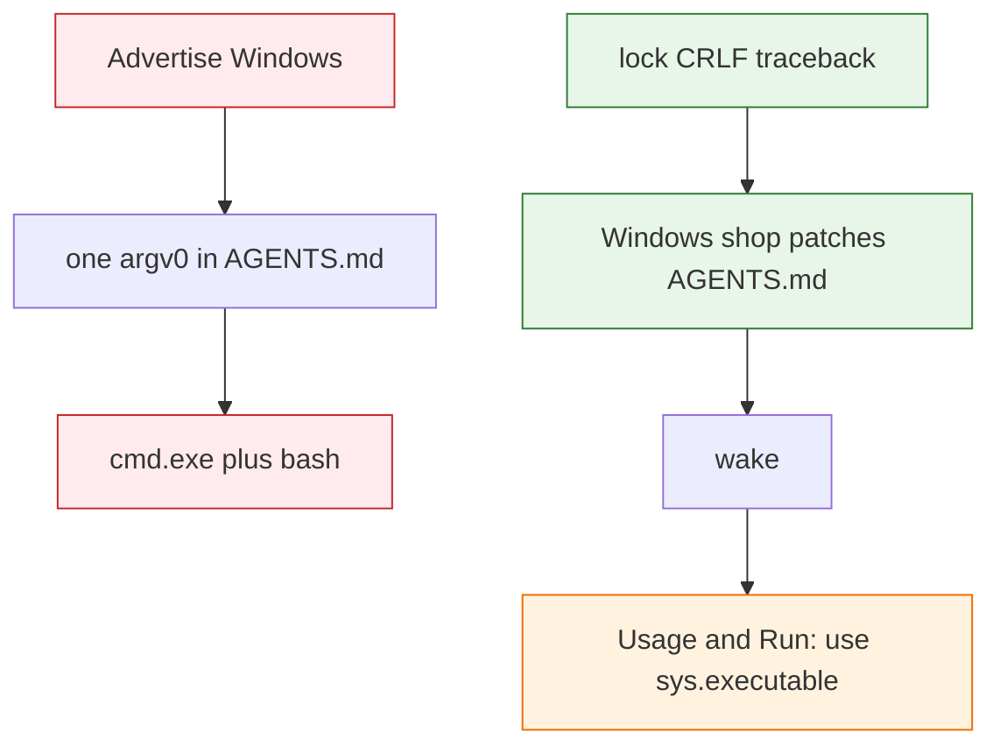

# Windows compatibility findings

Audit for native Windows (not WSL-as-Linux). No port in this task.

**Probe host:** `C:\Python313\python.exe` 3.13.3 (`sys.platform=win32`), Git for Windows 2.53.0.2. `cmd.exe` launched from WSL cannot use a `\\wsl.localhost\…` cwd; throwaway repos lived on `S:\Users\Austin\AppData\Local\Temp`. Default `python` on that CMD PATH can be MobaXterm’s shim — probes used the CPython path above.

**Operator constraint:** committed `AGENTS.md` must not contain a host-specific argv0 or drive path (unknown clone OS). Runtime prints (`how_to_text`, `fold_request` `Run:`) may.

**Product stance:** Do not advertise native Windows. There is no clone-portable command that `cmd.exe` and a Unix shell will both execute. The ceiling is removing script-internal POSIX holes so a Windows-only shop can patch *their* bootstrap and declare they do not support Unix. Default `prompt_text` stays Unix. Runtime Usage and `Run:` **may** print a host-specific invoke (`sys.executable` on Windows): nobody on Windows sees those lines unless they already doctored the bootstrap, and that is fine.

## Already fine

These are not findings. Listed so a later port does not “fix” them.

| Surface | Evidence |
| --- | --- |
| `python` + no-suffix driver | `python S:\…\.summem\summem version` → `0.11.0` |
| Forward vs backslash argv0 | `python .summem/summem` and `python .summem\summem` both exit 0 |
| Absolute Windows argv0 | `python S:\…\summem-path-repo\.summem\summem version` → `0.11.0` |
| `--path` slash style | `pkg\nested`, `pkg/nested`, and `S:\…\pkg\nested` all resolve; `start pkg\nested` exit 0 |
| Catalog / fold `--path` | `Path.as_posix()`; Git for Windows `ls-files` already emits `/`; Python accepts `/` on Windows |
| Store join `.summem` | `Path(parent) / ".summem"` is correct on `nt` |
| `os.replace` | Probe: OK |
| UTF-8 `stdio.reconfigure` | Probe: OK (same idea as OptMem) |
| Note filenames | `YYYYMMDDTHHMMSSZ-{hex}` has no `:`; Windows would reject colon names |
| `version`, `init`, `wake`, `start`, `recall` | Throwaway repo: all exit 0. They never call `with_store_lock` |
| `surgery.py --dry-run` | Does not take the lock (code-certain) |
| `migrate.py` | Loads the driver; does not call `with_store_lock` |

## Product-command failures

### 1. `note`, `nap`, and non-dry-run `surgery` crash on `import fcntl`

**What breaks:** `with_store_lock` does `import fcntl` then `os.open(store / "naps", os.O_RDONLY)` then `fcntl.flock`. On this machine `note "windows probe"` raised `ModuleNotFoundError: No module named 'fcntl'` and dumped a traceback (the CLI ratchet never ran). Callers: `main` for `note` and `nap`; `surgery.py` when not `--dry-run`.

**Also broken even if `fcntl` existed:** `os.open` on a directory is `PermissionError` on this Windows (`[Errno 13] Permission denied` on a temp dir). Directory flock is not a Windows operation.

**Recommended resolution:** One `with_store_lock` that still means “exclusive, same-machine, not a git object.” On POSIX, keep today’s directory flock of `naps/`. On Windows, lock a **file in an OS runtime directory** keyed by the resolved store path (for example `%LOCALAPPDATA%/summem/locks/<hex>`), opened `"a"` (not `"w"`), with `msvcrt.locking` and OptMem’s spin/backoff. Guard `import fcntl` like [OptMem](https://github.com/VictorTaelin/OptMem/blob/main/WINDOWS.md).

**Why that is optimal:** OptMem already proved `msvcrt` + append-mode lock file + backoff under parallel `note`. SumMem’s test `test_with_store_lock_blocks_and_writes_no_lock_file` and product context forbid a lock file **in the store**. A `.summem/.lock` (even gitignored) would fail that test and show up as untracked store clutter. Skipping the lock on Windows would race `heal`/unlink. A third-party locker (`portalocker`) is a dependency the shebang product does not have. Putting the Windows file beside `naps/` copies OptMem’s mechanism into the wrong tree.

### 2. The driver is not a Win32 executable

**What breaks:** `cmd.exe` running `.summem/summem` or `C:\Users\Foo\repo\.summem\summem` is `WinError 193`. Shebang is ignored. The same relative path **as an argument to Python** works.

**What the solution is:** two printers, because one string cannot be both clone-portable and pasteable.

- **After the script is already running** (`how_to_text`, `fold_request` `Run:`): on Windows print this process’s interpreter plus the driver file, quoted. Example: `"C:\Python313\python.exe" .summem/summem nap 45cf7d8a ac119d66 "<your line>"`. On POSIX keep `.summem/summem nap …`. That is a command the same agent can paste into the same host. `sys.executable` is used because `python` / `python3` are not reliable names (Windows has `python`, this Unix seat’s `python3` is 3.10).
- **`AGENTS.md` / `prompt_text()`:** cannot contain that `Run:` line. `sys.executable` is this machine; `python` vs shebang is this OS. The committed block names the driver *file* `.summem/summem` (forward slashes, relative) and says to run `wake`. It is not a POSIX exec and not `C:\Users\…`.

**First wake is not our problem:** Usage cannot help until something has already started the script. Windows users who have not patched `AGENTS.md` never get here. Operator: that is fine. Do not add `.py`, a store `.cmd`, or py2exe.

### 3. Git symlink checkout — punt

This development repo’s `.summem/summem` is a git symlink; Git for Windows `core.symlinks=false` checks it out as the text `../summem`. **Out of scope.** We will develop on Windows against repo-root `summem`. Consumers already copy the driver. Do not spend a port on `core.symlinks` or a `.cmd` wrapper.

### 4. Content-addressed files vs `core.autocrlf`

**What breaks:** Notes, `.tree`, and `.summ` are SHA-256 of exact bytes, written as LF. A consumer’s Git may check those files out as CRLF (`core.autocrlf=true` is a common Windows installer default). Then digest, nap stem, and zipper disagree with the Unix `HEAD` that wrote them.

**Recommended resolution:** SumMem itself. On every read of those files, canonicalize `\r\n` (and lone `\r`) to `\n` *before* digest, JSON parse, and caption. Writes stay LF (`note_file_bytes` already). Do not rewrite the working tree just to strip CR. Do not require `.gitattributes` or `git config` in the consumer repo.

**Why that is optimal:** We do not own the consumer’s Git. Hashing the raw checkout bytes is the bug. Canonical LF on read matches the committed object under the usual autocrlf “LF in repo, CRLF in the Windows worktree” setup. Rewriting every note to LF would dirty a Windows clone for no identity gain.

### 5. Uncaught lock import is a traceback, not a ratchet

**What breaks:** Finding 1’s `ModuleNotFoundError` is not `ValueError`; `main` only catches `ValueError` around `note`. Agents see a Python stack.

**Recommended resolution:** Handle the missing-`fcntl` / directory-open case inside `with_store_lock` (Windows branch), never let `ImportError` reach `main`. Same words as other ratchets: problem, no store paths, no traceback.

**Why that is optimal:** Matches existing CLI error policy. A special “install fcntl” message would be a lie (`fcntl` is not pip-installable on Windows).

## Test-only failures

| Surface | What breaks | Recommended resolution | Why |
| --- | --- | --- | --- |
| `tests/test_zipper.py` | Module-level `import fcntl`; flock monkeypatch; subprocess probe of `LOCK_NB` on `naps/` | After the lock abstraction exists, tests talk to `with_store_lock` / a lock helper, not `fcntl`. Skip the POSIX directory-fd probe on `win32`. | Collection must not die. The no-lock-file assertion stays; it is the product contract. |
| `test_shebang_and_executable_bit` | `S_IXUSR` is not a Windows meaning; shebang still wanted as the Unix first line | Keep the shebang assertion everywhere; gate the execute-bit on `os.name != "nt"` | The file remains a POSIX-exec script; Windows never uses the bit. |
| Mutating pytest (`note`/`nap` via `main`) | Same crash as finding 1 | Falls out of the lock port; do not skip the suite | Skipping would hide a product hole. |
| CI | `.github/workflows/*.yaml` is `ubuntu-latest` only | Optional later `windows-latest` job; not a current red | Ubuntu CI cannot catch findings 1–4. |

## Docs / invocation-only

| Surface | What breaks | Recommended resolution | Why |
| --- | --- | --- | --- |
| `prompt_text` / `AGENTS.md` | `Run \`.summem/summem wake\`` is a POSIX exec. A Windows clone of the same file cannot run it. | Name the driver file; do not pick `python` vs shebang or a drive path. Pasteable argv lives in Usage/`Run:` via `sys.executable` on Windows. | Committed prompt is cloned; OptMem’s installer prompt is not. |
| `how_to_text` / `fold_request` | Same `AGENT_BIN` baked at compile time | Branch on `sys.platform` (or `os.name`) when **printing**, using `sys.executable` on Windows | Runtime may be host-specific; the committed prefix may not. |
| README quickstart | `$ .summem/summem wake` | POSIX examples stay; a one-line Windows note: prefix with the Python 3.11+ interpreter. Do not put `C:\Users\…` in README. | Absolute Windows paths are user-specific. |

## OptMem vs SumMem

[OptMem WINDOWS.md](https://github.com/VictorTaelin/OptMem/blob/main/WINDOWS.md): `fcntl` optional; `msvcrt` on `.lock` opened `"a"`; spin/backoff. That mechanism is the right Windows lock. Their **target** (a file in the memory dir) is wrong for SumMem: OptMem’s store is not a git tree; ours is, and we already test that no lock file appears under `.summem/`.

## Later implementation order

1. `with_store_lock` Windows branch (finding 1 + 5) — unblocks `note`/`nap`/surgery.
2. Canonical CRLF on read (finding 4) — identity under consumer autocrlf.
3. Runtime invoke strings (finding 2) — pasteable `Run:` / Usage on Windows.
4. Tests follow the lock helper; shebang bit gated.
5. `prompt_text` only as far as the wake line is still a POSIX exec (finding 2, docs).
6. Finding 3 (symlink): won’t-do.
