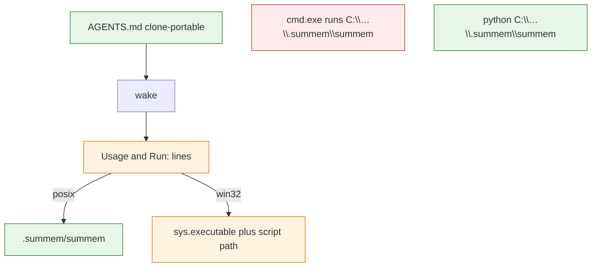

# Windows compatibility findings

Audit for native Windows (not WSL-as-Linux). No port in this task.

**Probe host:** `C:\Python313\python.exe` 3.13.3 (`sys.platform=win32`), Git for Windows 2.53.0.2. `cmd.exe` launched from WSL cannot use a `\\wsl.localhost\…` cwd; throwaway repos lived on `S:\Users\Austin\AppData\Local\Temp`. Default `python` on that CMD PATH can be MobaXterm’s shim — probes used the CPython path above.

**Operator constraint:** committed `AGENTS.md` must not contain a host-specific argv0 or drive path (unknown clone OS). Runtime prints (`how_to_text`, `fold_request` `Run:`) may.

## Already fine

These are not findings. Listed so a later port does not “fix” them.

| Surface | Evidence |
| --- | --- |
| `python` + no-suffix driver | `python S:\…\.summem\summem version` → `0.11.0` |
| Forward vs backslash argv0 | `python .summem/summem` and `python .summem\summem` both exit 0 |
| Absolute Windows argv0 | `python S:\…\summem-path-repo\.summem\summem version` → `0.11.0` |
| `--path` slash style | `pkg\nested`, `pkg/nested`, and `S:\…\pkg\nested` all resolve; `start pkg\nested` exit 0 |
| Catalog / fold `--path` | `Path.as_posix()`; Git for Windows `ls-files` already emits `/`; Python accepts `/` on Windows |
| Store join `.summem` | `Path(parent) / ".summem"` is correct on `nt` |
| `os.replace` | Probe: OK |
| UTF-8 `stdio.reconfigure` | Probe: OK (same idea as OptMem) |
| Note filenames | `YYYYMMDDTHHMMSSZ-{hex}` has no `:`; Windows would reject colon names |
| `version`, `init`, `wake`, `start`, `recall` | Throwaway repo: all exit 0. They never call `with_store_lock` |
| `surgery.py --dry-run` | Does not take the lock (code-certain) |
| `migrate.py` | Loads the driver; does not call `with_store_lock` |

## Product-command failures

### 1. `note`, `nap`, and non-dry-run `surgery` crash on `import fcntl`

**What breaks:** `with_store_lock` does `import fcntl` then `os.open(store / "naps", os.O_RDONLY)` then `fcntl.flock`. On this machine `note "windows probe"` raised `ModuleNotFoundError: No module named 'fcntl'` and dumped a traceback (the CLI ratchet never ran). Callers: `main` for `note` and `nap`; `surgery.py` when not `--dry-run`.

**Also broken even if `fcntl` existed:** `os.open` on a directory is `PermissionError` on this Windows (`[Errno 13] Permission denied` on a temp dir). Directory flock is not a Windows operation.

**Recommended resolution:** One `with_store_lock` that still means “exclusive, same-machine, not a git object.” On POSIX, keep today’s directory flock of `naps/`. On Windows, lock a **file in an OS runtime directory** keyed by the resolved store path (for example `%LOCALAPPDATA%/summem/locks/<hex>`), opened `"a"` (not `"w"`), with `msvcrt.locking` and OptMem’s spin/backoff. Guard `import fcntl` like [OptMem](https://github.com/VictorTaelin/OptMem/blob/main/WINDOWS.md).

**Why that is optimal:** OptMem already proved `msvcrt` + append-mode lock file + backoff under parallel `note`. SumMem’s test `test_with_store_lock_blocks_and_writes_no_lock_file` and product context forbid a lock file **in the store**. A `.summem/.lock` (even gitignored) would fail that test and show up as untracked store clutter. Skipping the lock on Windows would race `heal`/unlink. A third-party locker (`portalocker`) is a dependency the shebang product does not have. Putting the Windows file beside `naps/` copies OptMem’s mechanism into the wrong tree.

### 2. The driver is not a Win32 executable

**What breaks:** `cmd.exe` / Explorer / an agent that runs `.summem/summem` or `C:\Users\Foo\repo\.summem\summem` as a command: `OSError: [WinError 193] %1 is not a valid Win32 application`. Shebang is ignored. `os.access(..., X_OK)` is a lie on Windows (it was True in the probe).

**What works:** `python C:\Users\Foo\repo\.summem\summem` (and the relative forms above) when that path is a **regular file**.

**Recommended resolution:** Keep the no-suffix driver. Do not add `.py`, a `.cmd` inside the store, or py2exe. Runtime Usage and `fold_request` `Run:` on `win32` print `{sys.executable}` plus the script path (quoted). POSIX keeps `{AGENT_BIN}` as today. Committed `AGENTS.md` / `prompt_text()` must **not** choose `python` vs shebang or `C:\…` (clone OS unknown). It may name the **file** `.summem/summem` (forward slashes, relative) and say to run `wake`; recipes live on wake.

**Why that is optimal:** `python <no-suffix>` already works (probe). Prefixing `python` in `AGENTS.md` is wrong on Unix (this seat’s `/usr/bin/python3` is 3.10; `python` may be absent). `sys.executable` is the interpreter that actually loaded the script, so the `Run:` line pastes. Renaming to `summem.py` churns SourceFileLoader, tests, and the “one shebang file” identity for no Windows gain.

### 3. This repo’s `.summem/summem` is a git symlink

**What breaks:** Git for Windows here has `core.symlinks=false` (system). Mode `120000` checks out as a text file `../summem`, not a link. `python .summem/summem` then parses that text as Python. Creating a real symlink without Developer Mode: `WinError 1314`. Via UNC, Windows Python could not even open this checkout’s `.summem\summem` (`Errno 2`); repo-root `summem` via UNC **did** run `version`.

**Recommended resolution:** Consumers already **copy** the driver (README). Leave that. Do not teach `ensure_store` to copy (existing contract). For this development repo, Windows contributors run `python summem` at the root (the real file). Do not require `core.symlinks=true` as the product install. A later port may add a contributor note, not a committed `.cmd` in `.summem/`.

**Why that is optimal:** The store must not gain a Windows launcher the script does not own. Copy-vs-symlink is already the consumer vs dogfood split.

### 4. Content-addressed files vs `core.autocrlf`

**What breaks:** There is no `.gitattributes`. This machine’s Git for Windows has `core.autocrlf=false`, so it did not bite here. The common installer choice `true` would check out notes / `.tree` / `.summ` as CRLF. Digests and nap stems are SHA-256 of exact bytes (`note_file_bytes` is `\n` only). Zipper identity would lie; zoom would disagree with `HEAD`.

**Recommended resolution:** `.gitattributes` marking `.summem/notes/**` and `.summem/naps/**` as `-text` (binary). Optionally `summem text eol=lf`.

**Why that is optimal:** `eol=lf` still lets a tool convert; `-text` matches “these bytes are the id.” OptMem has no git-tree store, so it never hit this. This is the one Windows-adjacent hole that can corrupt a POSIX clone’s history if a Windows contributor commits through autocrlf.

### 5. Uncaught lock import is a traceback, not a ratchet

**What breaks:** Finding 1’s `ModuleNotFoundError` is not `ValueError`; `main` only catches `ValueError` around `note`. Agents see a Python stack.

**Recommended resolution:** Handle the missing-`fcntl` / directory-open case inside `with_store_lock` (Windows branch), never let `ImportError` reach `main`. Same words as other ratchets: problem, no store paths, no traceback.

**Why that is optimal:** Matches existing CLI error policy. A special “install fcntl” message would be a lie (`fcntl` is not pip-installable on Windows).

## Test-only failures

| Surface | What breaks | Recommended resolution | Why |
| --- | --- | --- | --- |
| `tests/test_zipper.py` | Module-level `import fcntl`; flock monkeypatch; subprocess probe of `LOCK_NB` on `naps/` | After the lock abstraction exists, tests talk to `with_store_lock` / a lock helper, not `fcntl`. Skip the POSIX directory-fd probe on `win32`. | Collection must not die. The no-lock-file assertion stays; it is the product contract. |
| `test_shebang_and_executable_bit` | `S_IXUSR` is not a Windows meaning; shebang still wanted as the Unix first line | Keep the shebang assertion everywhere; gate the execute-bit on `os.name != "nt"` | The file remains a POSIX-exec script; Windows never uses the bit. |
| Mutating pytest (`note`/`nap` via `main`) | Same crash as finding 1 | Falls out of the lock port; do not skip the suite | Skipping would hide a product hole. |
| CI | `.github/workflows/*.yaml` is `ubuntu-latest` only | Optional later `windows-latest` job; not a current red | Ubuntu CI cannot catch findings 1–4. |

## Docs / invocation-only

| Surface | What breaks | Recommended resolution | Why |
| --- | --- | --- | --- |
| `prompt_text` / `AGENTS.md` | `Run \`.summem/summem wake\`` is a POSIX exec. A Windows clone of the same file cannot run it. | Keep the bootstrap clone-portable: name the driver path with forward slashes; do not make the wake line a host argv0. Recipes on root wake. | Operator constraint: you do not know the clone OS. `init` already says command syntax comes from wake. |
| `how_to_text` / `fold_request` | Same `AGENT_BIN` baked at compile time | Branch on `sys.platform` (or `os.name`) when **printing**, using `sys.executable` on Windows | Runtime may be host-specific; the committed prefix may not. |
| README quickstart | `$ .summem/summem wake` | POSIX examples stay; a one-line Windows note: prefix with the Python 3.11+ interpreter. Do not put `C:\Users\…` in README. | Absolute Windows paths are user-specific. |

## OptMem vs SumMem

[OptMem WINDOWS.md](https://github.com/VictorTaelin/OptMem/blob/main/WINDOWS.md): `fcntl` optional; `msvcrt` on `.lock` opened `"a"`; spin/backoff. That mechanism is the right Windows lock. Their **target** (a file in the memory dir) is wrong for SumMem: OptMem’s store is not a git tree; ours is, and we already test that no lock file appears under `.summem/`.

## Later implementation order

1. `.gitattributes` `-text` for notes/naps (protects identity before anyone notes from Windows).
2. `with_store_lock` Windows branch (finding 1 + 5) — unblocks `note`/`nap`/surgery.
3. Runtime invoke strings (finding 2) — unblocks agents after the lock works.
4. Tests follow the lock helper; shebang bit gated.
5. `AGENTS.md` / `prompt_text` only if the wake line is still an argv0 (finding, docs).
