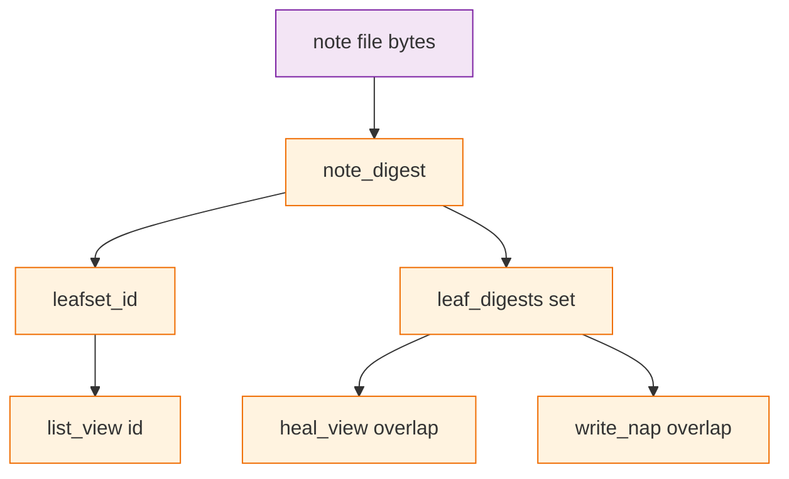

# TASK ARCHIVE: heal-same-text

## SUMMARY

[Issue #77](https://github.com/Texarkanine/SumMem/issues/77) is closed under the operator vote: `L` is a set of facts. Heal drops a loose note whose text already sits inside a pack (trigger 1: the shoebox) and collapses two identical loose notes; `write_nap` rejects any intersecting digest sets so a pack cannot claim grain 2 for one receipt. `note_digest` stayed bytes-only; no migrate; `Saved.` stayed. Drafted as [PR #79](https://github.com/Texarkanine/SumMem/pull/79). QA passed after a names-and-prose rework. py311: 371 passed, 1 skipped.

## REQUIREMENTS

From the project brief:

- `L` is a set of facts. Two recordings of the same sentence are one leaf. Trigger 1 is intended, not a keep-the-file bug.
- Trigger 2: napping two identical notes must not produce a pack whose grain disagrees with its leaf set.
- `note_digest` stays content-only. No migrate.
- `Saved.` stays. Do not add an “already remembered” message.
- Recency-by-renoting a packed fact is out of scope. Do not design around a broken third-party write rule that re-notes the same line.
- Script remains the only writer. Do not invent a repair in CLI output.

Acceptance: after a fold, a later `note` of packed text is absent after heal, zoom still reaches, stdout is `Saved.`; two loose identical notes heal to one view node; direct `write_nap` of that pair raises overlap and writes no pack; atlas and `docs/theory.md` describe trigger 1 as the shoebox, not a leak.

## IMPLEMENTATION

The first creative pass treated `docs/theory.md` “Where the theory leaks” as spec and recommended per-file identity (`note_digest(name + NUL + bytes)` plus migrate). The operator vote discarded that: a fact is a fact whenever it is noted. Options that were not chosen:

| Option | Why not |
|---|---|
| Per-file identity | That is not `L`. Every stored id would change. |
| Multiset heal (issue option 2) | `L` has no multiplicity; copies would stay until covered. |
| Nap-reject only (issue option 3) | Stops trigger 2. Leaves two loose copies, so `fold_request` can stick on `(id, id)` at budget. |

**Selected:** remove the note/note skip in `_first_overlap`, and reject any intersecting digest sets in `write_nap`. No new signatures. Production was four lines.

`leafset_id` hashes a list and keeps repeats. `leaf_digests` is a set. Heal trusts the set. Equal grain-1 sets: `left.leaves <= right.leaves`, unlink `left` (older filename; view is filename-sorted). Packed vs note: unchanged. `write_nap` dropped the `left.kind == "nap" or right.kind == "nap"` conjunct. Error string stayed `overlapping packs` (one family; CLI-unreachable for two loose duplicates because mutating commands heal first). `fold_request` needed no code: heal runs first.

`tests/gitutil.py::assert_unique_cover` dropped its note/note skip so the helper is not blind to this class. Zoom and recall tests that used to nap identical text now plant a children file so pre-change packs stay readable. Atlas Identity and Zipper, `systemPatterns.md`, and `docs/theory.md` Duplicate receipts match `L` as a set. After reflect, Duplicate receipts was rewritten in `L` / `leaves` / partition language; helper names stay off the why-page.

Key files: `summem`, `tests/test_zipper.py`, `tests/test_nap.py`, `tests/test_nap_reject.py`, `tests/test_cli.py`, `tests/test_fold.py`, `tests/gitutil.py`, `docs/architecture/index.md`, `memory-bank/systemPatterns.md`, `docs/theory.md`.

## TESTING

TDD in existing files; no new test files. Four units: heal skip, nap overlap, fold/CLI same-id retargets, atlas/theory. Preflight failed three times (missing `write_nap` retarget, `assert_unique_cover` skip, CLI `note` packed-duplicate assertions), then PASS. Fourth preflight confirmed `note` heals then prints `Saved.\n` and `fold_request` is empty for a single-node view.

`/niko-qa` round 1 FAIL (test/prose-local, not a plan change): three tests still wore the old names (`test_write_nap_identical_text_notes_still_concat`, `test_nap_accepts_prefix_of_identical_notes`, `test_identical_notes_nappable_after_heal_view`); `test_two_identical_notes_stay` docstring still denied unlink (body never called `heal_view`; renamed/scoped to `test_leaf_digests_shared_for_identical_notes`); theory closer was ungrammatical and had dropped `leafset_id` / `leaf_digests`. Round 2 PASS. `uvx --with tox tox run-parallel`: py311 and py314 passed; py312 and py313 skipped (interpreters unavailable).

## LESSONS LEARNED

- The shoebox is the spec: a loose copy of a packed sentence is thrown away. `Saved.` is true of `L`, not of the new file remaining.
- A why-page “leak” or “bug” section is the issue talking until the operator says otherwise. Treating it as spec caused a first creative pass that would have migrated every id.
- Heal trusts the set. `write_nap` must refuse any intersecting digest sets or a list-hash can still mint a grain-2 pack with one fact.
- After heal, two concurrent same-text files are one view node (later filename). Git still has both in history.
- `docs/theory.md` names the system in `L` / `leaves` / partition language. Function names stay out of the why-page except where two helpers disagree and that disagreement is the defect.

## PROCESS IMPROVEMENTS

- A retargeted test is not done until the **name** matches the body. Docstrings do not show up in `-k` or failure output. Preflight cannot catch this when the plan still cites the old names.
- Opening a draft PR before the QA names-and-prose loop is a process miss; the branch moved afterward.
- Preflight’s “leave `test_two_identical_notes_stay` alone” correctly protected the body and accidentally protected a false docstring. When protecting a case, say what the name and docstring must still claim.

## TECHNICAL IMPROVEMENTS

Not adopted this task:

- Preflight advisory: a `view_is_consistent` proof helper so tests do not duplicate the zipper pairwise walk in `assert_unique_cover`.
- Preflight radical-innovation advisory: `_first_overlap` skip conditions as an `OVERLAP_POLICY` table keyed by `(kind, kind)`. Worth a follow-up only if a third node kind appears.
- Recency bump by re-noting a packed fact would require keeping the new file. That is a different product.

## NEXT STEPS

None required for this task. PR #79 is open. Recency-by-renoting stays a new task if it becomes a product, not a silent identity change.
