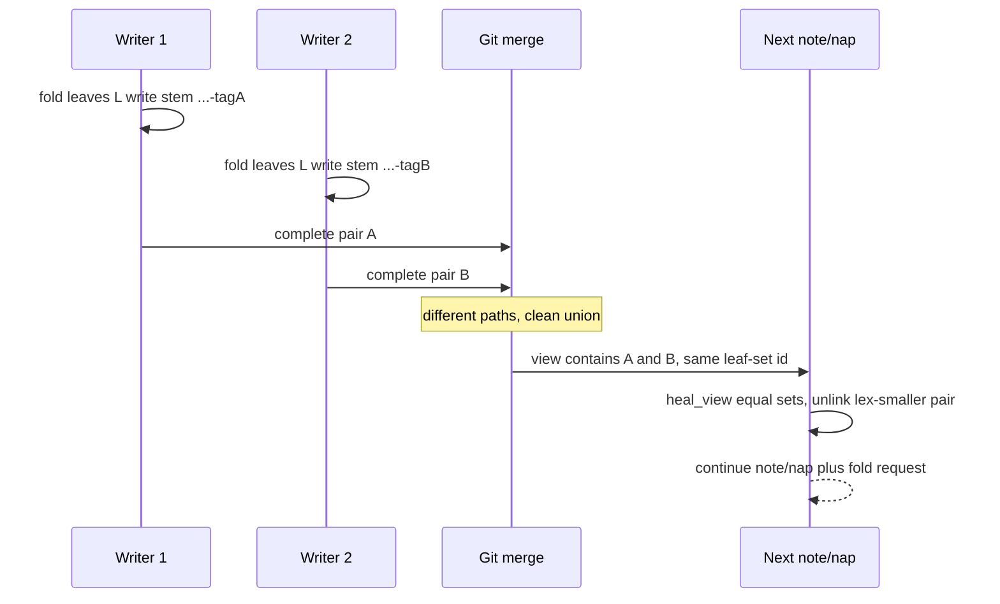

# TASK ARCHIVE: nap-variant-stems

## SUMMARY

Nap pairs now share a five-part stem `{seq-prefix}-{leaf-set id}-{grain}-{variant}`. The last field is the first 16 hex of a domain-tagged SHA-256 over length-prefixed `.tree` bytes and length-prefixed caption bytes. Concurrent same-block folds with different pair bytes land on different paths; git unions them; the existing zipper keeps the lexicographically greatest complete equal-leaf-set variant on the next `note` or `nap`. Clean break: `_parse_nap_stem` reads five-part stems only. Sibling `migrate.py` is the only four-part reader. This clone's root and `dogfood` stores are already five-part. Draft [PR #62](https://github.com/Texarkanine/SumMem/pull/62) on `fix-the-hole` closes [#61](https://github.com/Texarkanine/SumMem/issues/61) and supersedes [#59](https://github.com/Texarkanine/SumMem/issues/59). `tox` 349 passed on py311–py314.

## REQUIREMENTS

From the project brief and [issue #61](https://github.com/Texarkanine/SumMem/issues/61):

- Five-part stem; variant tag is first 16 hex of SHA-256 over domain tag `b"SumMem nap pair v1\0"` plus 8-byte big-endian length of the tree, the tree bytes, 8-byte length of the caption, and the caption bytes.
- `write_nap` and rematerialize share one serialize-then-name path. Bytes hashed are bytes written.
- `_parse_nap_stem` accepts five-part stems only. `migrate.py` is the only four-part reader. New folds and rematerialized children always use five-part stems.
- Public commands and leaf-set identity unchanged. Agents never see or type the variant tag.
- Sequence prefix stays the inherited leftmost-note `{timestamp}-{random}`. The tag is a same-block arbitrary tie-break.
- After merge, `heal_view` drops equal-leaf-set variants by existing overlap (`<=`); survivor is the lex-greatest complete stem. Wake stays read-only.
- Ship a script that rewrites four-part stores to five-part stems.
- Atlas, `systemPatterns.md`, and product success criteria retire “caption is the only honest conflict.” Close #59 as superseded in the PR body.
- Pre-1.0 clean break: no merge driver, no wake-time heal, no user-facing dedupe command, no preserving every competing summary. `.tree` and `.summ` stay one atomic variant pair.

## IMPLEMENTATION

Level 3. Eight plan units, then post-QA DRY and an operator clean break.

### Stem grammar

[`summem`](../../../summem) gained `variant_tag`, `nap_stem`, and later `child_nap_stem`. `_parse_nap_stem` returns `(stamp, rand, leafset, grain, variant)`. After the clean break it returns `None` for four-part names. The variant tag is not a public id.

### Writes

`write_nap` serializes the tree and caption once, names the stem from those buffers, and writes them through `_write_pair` (temp-replace `.tree` then `.summ`). `rematerialize_child` and `surgery.py` `plan_break_out` share `child_nap_stem` so predicted dest names cannot drift from what rematerialize writes. `_nap_stem` was deleted.

### Merge then zipper

`heal_view` and `_first_overlap` were not changed. Equal leaf sets already `<=`; filename sort makes the lex-smaller complete pair the one unlinked. A four-part stem is a proper prefix of its five-part twin, so lex order already drops leftover legacy if any still exist on disk.

### Migration helper

Creative mega-unknown: where the rewrite lives.

Options: sibling `migrate.py` (surgery analogue); `summem migrate` verb; fold into `surgery.py`; shell snippet in the PR.

Selected: sibling [`migrate.py`](../../../migrate.py). Correctness (driver-owned digest) and the stable README command table beat a new CLI verb. Folding into surgery mixes rename-of-pairs with excision. A shell reimplementation of the domain-tagged digest will drift.

The helper loads sibling `summem` by `__file__` via `SourceFileLoader`, hashes **on-disk** pair bytes (never re-`dumps_tree`), renames complete four-part pairs, skips dest-exists silently, prints incomplete pairs and exits 1, does not heal. `--path` limits to one store. Default run rewrites every started store of cwd. No `__version__`, not a Release Please extra-file. `_four_part_stem` is the only four-part parser after the clean break.

### Store listing

`started_stores(git_root)` is shared by catalog and migrate. After QA: the git root is listed only when `.summem` is a directory, so a tracked `.summem/` path cannot invent a phantom root.

### Docs and stores

Atlas nap-naming and the union-then-zipper invariant replaced “caption is the only honest conflict.” Product success criteria now say same-block naps with different pair bytes merge as distinct paths and zipper-collapse. `techContext.md` notes `migrate.py` has no `__version__`. This repository’s `.summem/naps` and `dogfood/.summem/naps` were rewritten in the same breaking change.

### What stayed out

- `--dry-run` on `migrate.py` (preflight advisory; would have needed its own tests).
- Crash-recoverable pair rename (PR review; operator dismissed — kill window is real and near-zero; happy-path two-`replace` stays).
- Dual-read of four-part names (operator dropped after Reflect).

## TESTING

TDD in plan order. First preflight `FAIL (fixable)`: `test_same_children_same_tree_bytes_and_paths` and `test_same_pair_two_captions_conflict_only_on_sum` were scheduled three units after `write_nap` would turn them red. Re-plan inverted both in unit 2. Second preflight `PASS WITH ADVISORY` (`--dry-run` left out).

New and inverted coverage:

- [`tests/test_codec.py`](../../../tests/test_codec.py) — digest, length prefixes, five-part parse, reject bad shapes.
- [`tests/test_fold.py`](../../../tests/test_fold.py) / [`tests/test_nap.py`](../../../tests/test_nap.py) / [`tests/test_view.py`](../../../tests/test_view.py) / [`tests/test_wake.py`](../../../tests/test_wake.py) — write hashes the bytes it writes; wake line uses the leaf-set prefix, not the tag.
- [`tests/test_caption_conflict.py`](../../../tests/test_caption_conflict.py) — two worktrees, different captions, merge returncode 0, two same-id view rows.
- [`tests/test_zipper.py`](../../../tests/test_zipper.py) / [`tests/test_surgery.py`](../../../tests/test_surgery.py) — rematerialize idempotent; surgery predicted kid stem equals rematerialize dest; lex-greatest equal-set survivor.
- [`tests/test_nap_variants.py`](../../../tests/test_nap_variants.py) — union/heal/squash, merge-order determinism, triple-worker 1→2→4, no conflict markers, no mismatched pair.
- [`tests/test_migrate.py`](../../../tests/test_migrate.py) — complete pair rename, second-run no-op, incomplete skip, `--path`, default run across root plus cataloged store.

QA (`/niko-qa`) PASS at 346. Advisories: four copies of the child-stem block (fixed post-QA with `child_nap_stem`); consumer-repo migrate sentence (carried into the PR body); silent dest-exists skip (kept); dead `SystemExit` guard (kept); near-dead `started_stores` root branch (fixed); two tests five-part stems had made vacuous (repaired). Independent check: every committed root and `dogfood` pair is five-part and its tag equals `variant_tag` of the on-disk bytes.

Clean break added parse-only-five-part tests and brought the suite to 349 on py311–py314.

PR #62 review (CodeRabbit + Cursor): stale 346 in QA-phase records; brief missing “length-prefixed” on the caption; `_write_pair` mixed-pair; migrate crash between the two `replace` calls. Operator dismissed all of them.

## LESSONS LEARNED

- A four-part stem is a proper prefix of the matching five-part stem. Lex heal needs no format branch. Unit 4 pinned that with no production change.
- Deleting `_nap_stem` in favor of `nap_stem` is not reuse if every caller still serializes the pair itself. `child_nap_stem(child) -> (stem, tree_bytes, caption_bytes)` is the shared write path; `nap_stem` is only the name grammar.
- Dual-read was a skip-migrate cushion, not a migrate gap. Once the operator's 0.x set does not need it, four-part files are invisible and `migrate.py` is the rewrite.
- `migrate.py` must not grow a `__version__` or a Release Please extra-file. It is a one-shot store rewrite. `surgery.py` is the opposite (it already versions).
- Two `Path.replace` calls can split a pair if the process dies between them. The window is microseconds against milliseconds of read-and-hash. Retry cannot reassemble. The operator accepted that leftover.

## PROCESS IMPROVEMENTS

- Invert or retire tests in the same unit that changes the behavior they pin. “We'll fix that oracle in a later unit” fails the TDD Plan Encoding check and would strand intermediate commits red. Preflight's encoding check is what caught the first plan.
- A sibling operator script that loads `summem` by `__file__` needs the same “from a clone of this repository” sentence `surgery.py` already has. An atlas change-surface row is not that sentence. The PR body carries it.
- Preflight is not a DRY review. The plan's delete-`_nap_stem` shape passed preflight and shipped; QA named the four remaining serialize-then-name copies as the strongest advisory.
- PR review of a one-shot helper should weigh kill-window probability against leftover severity. Here the leftover is bad and the window is near-zero; dismissing matched the happy-path call already on the record.

## TECHNICAL IMPROVEMENTS

`--dry-run` on `migrate.py` remains an unbuilt trust aid. Crash-recoverable pair rewrite (write both dests, then unlink sources; retry completes a missing suffix) remains unbuilt. Neither is scheduled.

## NEXT STEPS

- [PR #62](https://github.com/Texarkanine/SumMem/pull/62) is open on `fix-the-hole`. Mark ready and squash-merge so the `BREAKING CHANGE:` footer lands in the release notes. Close #61; close #59 as superseded.
