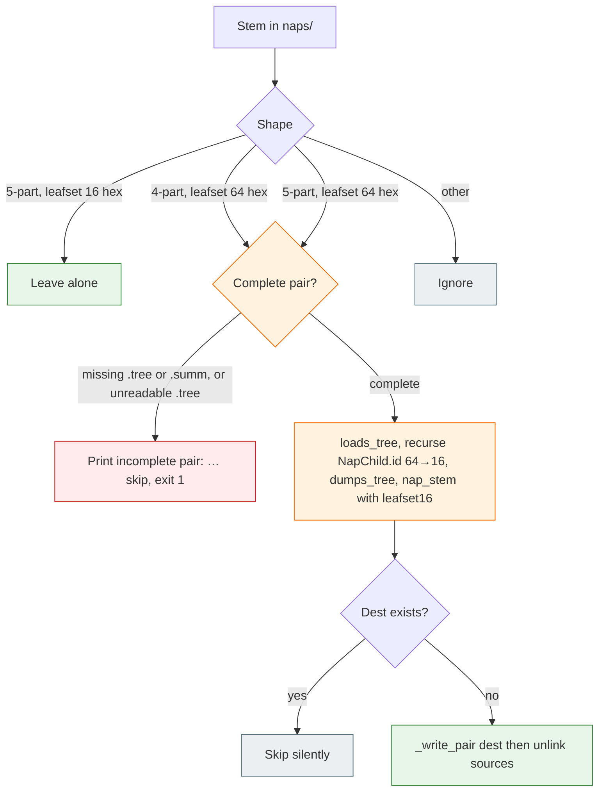

# TASK ARCHIVE: 16-hex-leafset

## SUMMARY

Stored public leaf-set ids are the first 16 hex of the existing SHA-256 (`leafset_id` returns `hexdigest()[:16]`). The driver writes and parses only five-part stems `{seq}-{leafset16}-{grain}-{variant16}`. Four-part stems and five-part stems whose leaf-set field is 64 hex are not view nodes. Sibling `migrate.py` is the only old-stem reader: one pass rewrites complete 4-part-64 and 5-part-64 pairs (including nested `.tree` `NapChild.id` fields) to five-part-16, recomputes the variant tag from rewritten bytes, persists via `_write_pair` then unlinks sources. This clone's root and `dogfood` stores were rewritten in the same change. Atlas Identity/Zoom/Naps/change-surfaces, `memory-bank/systemPatterns.md`, and the README walkthrough leaf-set field now show 16 hex stored / unique-prefix displayed.

Spec: [SumMem #67](https://github.com/Texarkanine/SumMem/issues/67). Non-draft [PR #68](https://github.com/Texarkanine/SumMem/pull/68) on `save-file-length` (operator reported 2026-08-26: no reviewer findings, including CodeRabbit). `tox run-parallel` py311–py314 green (366 tests).

## REQUIREMENTS

From the project brief and issue #67:

- Store the public leaf-set id as the first 16 hex of the existing SHA-256. Still compute the full digest; do not change the hash algorithm.
- Target stem: `{seq-prefix}-{leafset16}-{grain}-{variant16}`. Seq, grain, and the 16-hex variant tag stay.
- The driver writes and parses **only** this form. Four-part and five-part-64 are not view nodes.
- New folds and rematerialized children always write that form. `write_nap` / `child_nap_stem` stay one serialize-then-name path.
- `migrate.py` one pass: 4-part-64 and 5-part-64 become 5-part-16 (rewrite nested tree ids 64→16, recompute `variant_tag`); 5-part-16 left alone; incomplete pair prints and exits 1; dest already exists skips silently.
- Filename-only truncate is not enough: truncate every stored leaf-set id, including JSON `id` fields, so `list_view` and `_index_tree` agree.
- `migrate.py` remains the only old-stem reader (sibling script, not a `summem` verb, no `__version__`).
- Atlas, `systemPatterns.md`, and the README on-disk walkthrough update to 16 hex stored / unique-prefix displayed. There is no #61 “do not shorten” sentence in-tree.
- This clone's root and `dogfood` stores are rewritten in the same change.
- Wake / nap / zoom / recall still address by unique prefix of the (now 16-hex) leaf-set field. `short_id` floor 8 unchanged. Agents never see or type the variant tag.

Constraints: breaking change, same clean-break class as #61 — no dual-read of 64-hex stems in the driver. Not this issue: shortening seq, grain, note rands, or the variant tag; Base32; a new `summem migrate` verb; changing `short_id` floor 8. After reflect: open a **non-draft** PR with a copyable `BREAKING CHANGE:` footer.

## IMPLEMENTATION

Level 3 enhancement (breaking on-disk identity width). Four plan units. No creative phase — width change plus a second migrate source did not need a design fork. Leftover `memory-bank/active/creative/` files from prior tasks were unused.

### Stem grammar and driver width

[`summem`](../../../summem): `leafset_id` still SHA-256 of sorted concatenated note-digest hex; return value is `[:16]` so every stored public id (note `ViewNode.id`, nap stem field, `NapChild.id` from `write_nap`) is 16 hex from one function. `_parse_nap_stem` requires `len(leafset) == 16` (variant stays 16). Four-part and five-part-64 stems return `None`.

Truncation lives **inside** `leafset_id`, not at call sites. Call-site slicing would leave note view ids at 64 hex and reintroduce prefix ambiguity. No production `leafset_id_full`; migrate tests that plant 64-hex fixtures compute the full digest with `hashlib` in the test module.

`write_nap` / `child_nap_stem` / `nap_stem` stayed one serialize-then-name path. After truncation they write five-part-16. `_as_child` copies `node.id` from the stem, so new folds cannot emit a 64-hex nested id without a separate write-path change.

Post-reflect: driver docstrings (`NapChild`, `nap_stem`, `_parse_nap_stem`, `zoom_text`) name the 16-hex width.

### Migrate dispatch

The driver never reads the two old forms; only the helper does.

[`migrate.py`](../../../migrate.py): `_old_stem` accepts 4-part-64 and 5-part-64 only. `_shorten_tree` **recurses** into every nested `NapChild.tree` (`m._replace(child, id=child.id[:16], tree=...)`). Persist rewritten buffers with `_write_pair`, then unlink sources. Never `Path.replace` source `.tree` onto dest — that would install old 64-hex bytes under a dest stem hashed from rewritten buffers. Caption content is unchanged. Incomplete / dest-exists / `--path` / default-all-started-stores policy unchanged. Still no `__version__`, still not a `summem` verb.

Grain-2 note-only trees keep the same variant tag after migrate (canonical `dumps_tree` round-trip). Grain-4+ recomputes it because nested ids change the tree bytes.

### Docs and stores

Atlas Identity step 3 now names `[:16]` on the join hash; Zoom/Naps/change-surfaces say 16 hex stored / unique-prefix displayed. `systemPatterns.md` filenames and `.tree` nap identity stay 16 hex. README walkthrough leaf-set truncated to `cfbf987aa25d8492` (variant `8f8111f124e6075e` unchanged; example `.tree` is note-only).

Root `.summem/naps` and `dogfood/.summem/naps` rewritten with `migrate.py` in the same change. View has three complete root pairs (grain-32 and two grain-16); grain-8 exists as nested JSON inside those trees. Nested nap `"id"` values are 16 hex. Wake still lists packs.

### What stayed out

- Dual-read of 64-hex stems in the driver.
- Shortening seq, grain, note rands, or the variant tag; Base32; `summem migrate` verb; `short_id` floor change.
- Content-rebuild migrate (rebuild identity from note bytes). Issue #67 is stored-id truncation.
- Heal still hashes **note file bytes**; that 64-hex layer is unchanged.

### Plan accuracy

Four units were the right split. Leaving `tests/test_migrate.py` red through unit 1 was load-bearing: after `leafset_id` truncates, `write_nap` cannot plant 64-hex fixtures. Planned challenges showed up — planting old stems with `hashlib`, re-`dumps_tree` so the variant matches rewritten bytes, and not `Path.replace`ing source `.tree` onto dest. Inventory surprise: build notes said four root pairs; the view has three, with grain-8 nested inside those trees. Stores were still migrated correctly.

## TESTING

TDD in plan order. Three preflights, then QA.

**Preflight 1 — FAIL (fixable):** README still showed a 64-hex basename; a phantom in-tree “do not shorten” sentence; migrate tests would have been planted 16-hex after unit 1. Replan: README into unit 3; strike the phantom clause; unit 1 names `tests/test_migrate.py` as expected-red.

**Preflight 2 — FAIL (fixable):** grain-4 fixture cannot prove `_shorten_tree` recursion; implementation computed rewritten tree bytes without persisting them before `Path.replace`. Live inspection also corrected a false “root has no nested id fields” claim. Replan: grain-8 two-depth fixture; `_write_pair` then unlink.

**Preflight 3 — PASS WITH ADVISORY:** grain-8 fixture and `_write_pair` verified against live code. Advisories (non-blocking): a declarative legacy-stem-upgrade table for `migrate.py` (future-proofing); docstring-precision nits in two unrelated tests.

Coverage added or inverted:

- [`tests/test_codec.py`](../../../tests/test_codec.py) — `leafset_id` is `hexdigest()[:16]`; `_parse_nap_stem` five-part-16 only; 64-hex leafset is `None`.
- [`tests/test_nap_variants.py`](../../../tests/test_nap_variants.py) — planted five-part-64 is not a view node.
- [`tests/test_wake.py`](../../../tests/test_wake.py) / [`tests/test_caption_conflict.py`](../../../tests/test_caption_conflict.py) — stored id length 16; over-budget wake still refuses to print a full stored id.
- [`tests/test_migrate.py`](../../../tests/test_migrate.py) — 4-part-64, 5-part-64 grain-2/4/8 (two nested depths), 5-part-16 untouched, incomplete, unreadable `.tree`, dest-exists, `--path`, default root+catalog. Fixtures planted with `hashlib`, not `write_nap`.

QA (`/niko-qa`) PASS. No product-code edits. Advisories (non-blocking): nested-fold test does not assert `len(NapChild.id) == 16` (write path copies the 16-hex view id); four-vs-three root-pair count. Independent check: every committed root and `dogfood` pair is five-part-16; nested nap `"id"` values are 16 hex; dest stems equal `nap_stem` of the on-disk pair bytes.

`tox run-parallel` py311–py314: 366 collected, green.

PR #68 review (operator, 2026-08-26): no findings, including CodeRabbit.

## LESSONS LEARNED

### Technical

- Mixing 16-hex view ids with leftover 64-hex nested `.tree` ids makes `resolve_id` treat the short id as a prefix of the long one. Truncation has to live in `leafset_id` (so notes and naps share a width) and in every nested `NapChild.id`, not only the filename.
- `_as_child` copies `node.id` from the stem. After `leafset_id` returns 16 hex, new folds cannot emit a 64-hex nested id without a separate write-path change. That is why the missing nested-length assert is an advisory, not a hole.
- Grain-2 note-only trees round-trip under shorten; grain-4+ must recompute `variant_tag` because `dumps_tree` bytes change.
- `Path.replace` moves the original file bytes. Computing a new buffer and hashing it into the destination stem does not write that buffer.

### Process

- Preflight on a width-changing migrate needs a test that a one-level walk cannot satisfy, and an implementation step that persists rewritten bytes before any rename. Grain-4 is one nested id; recursion needs a grandchild.
- Store inventory from memory is cheaper than opening the trees. It was also wrong once. Count view pairs from `list_view`, and nested ids from `.tree`, separately.
- Two preflight FAIL (fixable) rounds prevented the expensive mistakes. Those defects would have shipped mixed widths or a dest name that disagreed with dest bytes. QA did not have to rediscover them.

## PROCESS IMPROVEMENTS

- A migrate that changes identity width must name leftover fixtures as expected-red in the same unit that changes the writer. “We'll fix that oracle in a later unit” fails TDD Plan Encoding and would strand intermediate commits red.
- Recursion tests need a depth the production walk cannot satisfy with a single `kids` iteration. One nested id is not recursion.
- Persist-then-unlink (or write dest then remove source) belongs in the implementation step, not as an implied `Path.replace`. Preflight's second round is what caught that.

## TECHNICAL IMPROVEMENTS

A declarative legacy-stem-upgrade table for `migrate.py` remains an unbuilt future-proofing note from preflight 3. Content-rebuild migrate (rebuild identity from note bytes) stays out of scope. Neither is scheduled.

## NEXT STEPS

- [PR #68](https://github.com/Texarkanine/SumMem/pull/68) is open on `save-file-length`, review-clean as of 2026-08-26. Squash-merge so the `BREAKING CHANGE:` footer lands in the release notes. Close #67.
