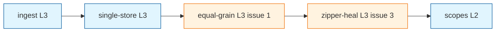
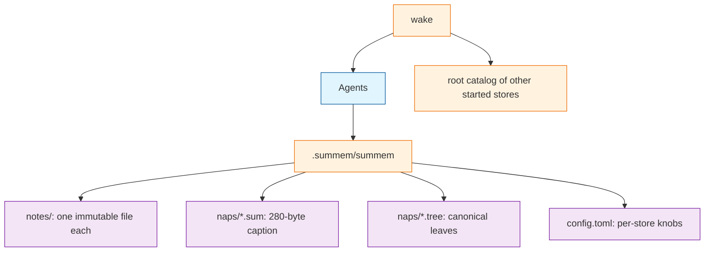

# TASK ARCHIVE: file-backend

## SUMMARY

The first file backend of SumMem is in the tree. One shebang driver at `.summem/summem` owns every store file. Agents run `wake`, `note`, `nap`, `recall`, `zoom`, and `start`. They never invent names or edit the store. First proofs 1–8 hold. 156 pytest tests.

The original L4 was three sequential phases: ingest, single-store memory, scopes. Two GitHub issues became extra L3 milestones between single-store and scopes: equal-grain fold (issue #1) and zipper-heal after overlapping packs (issue #3). `ROADMAP.md` Later stays out.

## REQUIREMENTS

From the original L4 brief:

- Implement the first file backend as specified in `VISION.md`, sequenced as ingest, single-store memory, and scopes.
- Satisfy first proofs 1–8. Those proofs are the acceptance bar, not a change-detector on the vision document.
- Agents never write the store. They run a script.
- The agent interface does not mention store files, hashes as paths, or git.
- First language is Python 3 with SHA-256 from `hashlib`.
- No actor, lease, lock file, shared mutable index, or custom merge driver. A same-machine `fcntl.flock` of `naps/` on one mutating invocation is not a committed object.
- Sequence is in the filename, not in `git log`. Zoom is a property of `HEAD`.
- Wake never refuses to print.
- Personal and machine facts stay out of the repository.
- A scope is a started directory, not a package manifest.
- Missing config means script defaults. Knobs live in the store, not the environment.
- A missing piece of `VISION.md` is unfinished work, not a reason to shrink the contract.

Out of this L4: other backends, harness hooks, full OptMem aligned cover, pack-size cap, shipping an agent prompt or Cursor rule (issue #2), a filled `README.md`.

## MILESTONE LIST

Original list from L4 plan:

1. Implement ingest: Python 3 CLI, git-root store auto-create, `note` and wait-free `wake` of loose notes, first proof 1, freeze store layout and leaf-set hashing
2. Implement single-store memory: `nap`, `zoom`, `recall`, left-fold of adjacent view nodes, first proofs 2-6
3. Implement scopes: `start`, `--path` walk-up, root-wake catalog, per-store config, first proofs 7-8

What changed:

- After ingest reflected, the operator rejected a hatchling-package plan. The product became one no-suffix shebang file. The milestone text did not change; the shape of the rest of the L4 did.
- After single-store reflected, issue #1 was inserted as its own L3. Single-store had shipped a 40/30/30 fold that could request 16+1 and that used `minStamp` alone, so two notes in the same UTC second could reorder. ROADMAP Phase 2 already named equal-grain; the original milestone had bundled it into single-store.
- After equal-grain reflected, issue #3 was inserted as its own L3 before scopes. Overlapping nap leaf-sets after merge were not a planned Phase 2 hole; they are a merge case the disjoint-pack proof does not cover.
- Scopes stayed last and stayed L2. Nothing was removed.

Final executed list:

1. ingest (L3)
2. single-store (L3)
3. equal-grain / issue #1 (L3)
4. zipper-heal / issue #3 (L3)
5. scopes (L2)

## IMPLEMENTATION

One committed driver, `.summem/summem`. Tests live under `tests/` and load it with `SourceFileLoader` because the path has no `.py` suffix. There is no `pyproject.toml`. Invoke tests with `uv run --python 3.11 --with pytest pytest`. This machine's bare `python3` is 3.10 and cannot import `tomllib`.

Store layout frozen in ingest and not reinvented later:

- `.summem/summem` — the driver, copied into a new store only when missing
- `.summem/config.toml` — commented template; omitted names mean script defaults
- `.summem/notes/` — one immutable file per note; UTC `{stamp}-{rand}` name; at most 280 UTF-8 bytes
- `.summem/naps/{id}.sum` — one-line caption
- `.summem/naps/{id}.tree` — canonical JSON payload of original sentences
- Leaf-set id: SHA-256 of file bytes, sorted hex digests, no-delimiter join, SHA-256 of the join. Wake prints 64 hex.

Commands resolve one store by walking from `--path` or `$PWD` toward the git root and taking the first directory that already has a store. Git-root auto-create on first `wake` or `note` is a different walk. `start <dir>` is the only way to create a store elsewhere.

Key modules in the driver grew in place: codec and identity, store I/O, wait-free wake, binary `nap` / `zoom` / `recall`, equal-grain picker plus in-memory expand, zipper-heal on mutate, then addressing and catalog. `tests/gitutil.py` holds worktree helpers and, after zipper-heal QA, the unique-cover oracle used by merge proofs.

This development tree is not itself a store until a hook binds the driver. `.gitignore` drops generated data and tracks only the driver.

## SUB-RUN SUMMARIES

### ingest

Shipped `note` and wait-free `wake` of loose notes. Proof 1 passed on the first run: identical driver bytes plus two note paths merge with zero conflicts. Identity bytes were written into `VISION.md` so later milestones could not invent a second scheme.

The first hatchling plan would have been the wrong product. Operator pushback plus a second plan was cheaper than building a package and tearing it out. The load recipe in the accepted plan was still incomplete: dataclasses with postponed annotations need the module registered in `sys.modules` before `exec_module`. The throwaway PoC never used dataclasses, so preflight did not see it.

QA passed. Advisories left standing: unused `summem` pytest fixture; `VISION.md` Sequence still shows an 8-character id while the product prints 64 hex.

### single-store

Shipped binary `nap`, pair-aware wait-free `wake`, `zoom`, `recall`, and a fold request that is not an auto-nap. Proofs 2–6. 79 tests.

The first preflight FAIL prevented a three-id nap and a proof 4 that folded to one nap plus two notes. The plan that got built was binary nap, 40/30/30 packs, pair-aware missing `.sum`, `leaves` in the filename.

First QA failed for a real product bug: `write_nap` keyed a dict by id, so two adjacent notes with the same text could not be napped. A content id names leaves, not a unique view row. Ingest already made two identical texts two paths and one id. Second QA passed the multiplicity fix and the CLI table edit that unit 5's surgical doc list had missed.

Do not put seven chevrons in the driver source: `ensure_store` copies that file into the store, and proof 1 scans every store file for conflict markers.

### equal-grain

Issue #1. Equal-grain file pairs never 16+1. Catch-up after `nap`. Nap names inherit `{stamp}-{rand}` from the left child so same-second notes keep interval order. `WAKE_LINES` is a printed-line budget: when the directory is short, wake expands the newest nap in memory and does not write children back. `write_nap` still unlinks. Proof 4 is 64/32/4. 101 tests.

The first creative pass (notes stay, wake covers) did not hold. The operator locked unlink plus in-memory expand before plan. Stale "notes stay" paragraphs and "Wake uses OptMem's cover" survived unit 4 until QA.

First QA failed on a wait-free crash and a double parse: a valid JSON tree with an empty nested nap still raised from `min()`, and a failed `.tree` load was retried on every expand iteration. Wait-free fallback is not `except JSONDecodeError`. Second QA passed the rework.

`wake_text` is the printed cut, not the file oracle. Tests that need ids for `nap` should use `list_view`.

### zipper-heal

Issue #3. Overlapping nap leaf-sets after merge are rematerialized on the next `note` or `nap` into a cover of unique leaves. ⊆ drop, then split-smaller from `.tree`. Skip note-note. Vanished nap ids succeed. Remainder keeps grain (`8+2+1` does not concat). `fcntl.flock` of `naps/` for one mutating invocation. Crash order is write-children-then-unlink; recovery is ⊆. Wake stays wait-free and does not zipper. 134 tests.

The plan was rewritten twice before a passing preflight: first it still had a containment pass, an action-list return, and a lock file; then TDD order sat after production code, `Action` was undefined, and termination was not a decreasing measure. `heal_view` returns `None`. Tests assert store state.

First QA found no product bug: heal already yielded a disjoint cover, but the flagship merge proof's unique-cover assert sat under `continue`. The helper was promoted to `tests/gitutil.py`. The iteration ceiling lives in tests (`test_heal_odd_arity_finishes_under_iteration_cap`). A production ceiling would turn a hang into a silent overlapping store.

`WAKE_LINES` is not shrink-to-fit. Heal to `8, 2, 1` at budget 2 lists three files and prints no fold request. Same-process `flock` is not contention.

### scopes

Last slice. `start`, `--path` walk-up, per-store `config.toml`, root-wake catalog. Nested stores are started directories, not inferred packages. Walk-up never creates a store. Git-root auto-create stays. Catalog is a computed walk that honors git ignore, including `.git/info/exclude`. `wake_text` is still the decaying document. Identity, nap, zipper, and zoom-from-`HEAD` unchanged. Proofs 7–8. 156 tests.

Preflight's three amendments were real: `--path` on `nap`/`zoom`/`recall`, `ENTRY_CHARS` through `write_note`/`write_nap`, and `store_stats` grain instead of loose-file count.

The surprise was in the tests: duplicate empty stub names in the pytest module overwrote the filled catalog tests, so the first red run was a lie. QA passed on the first try.

Million-dollar question: if addressing had existed in ingest, `find_store_parent` would never have meant "the git root is the store." Git-root auto-create and first-`.summem/` resolve are two walks. That split is what shipped.

## SYSTEM STATE

What exists now that did not exist before this L4: a working file backend that matches the `VISION.md` CLI table.

End to end:

1. First `wake` or `note` in a git tree creates the root store if missing.
2. `note` writes one immutable file. Two worktrees merge as two paths.
3. When the file count exceeds `WAKE_LINES`, wake prints an equal-grain fold request. The agent `nap`s two adjacent content ids. Children leave the view only after the parent payload exists.
4. Wake at or over budget lists files and does not open `.tree`. Under budget it may expand the newest nap in memory.
5. After a squash onto `main`, a fresh clone can `zoom` to original sentences because they live in `.tree` at `HEAD`.
6. Overlapping packs from a merge are healed on the next `note` or `nap`, not inside wake.
7. `start <dir>` opts a directory in. `--path` walks up. Root wake catalogs other started stores. A pull prints only that store.

`VISION.md` is still the contract. Persistent memory-bank files (`productContext.md`, `systemPatterns.md`, `techContext.md`) already describe this system and were not rewritten in this archive.

## TESTING

Each sub-run wrote tests first, then code. Proofs 1–8 are executable worktree merges and CLI contracts, not document assertions.

| Sub-run | Tests at reflect | `/niko-qa` |
|---|---|---|
| ingest | proof 1 green on first run | PASS, advisories only |
| single-store | 79 | FAIL then PASS: duplicate-content ids; obsolete CLI row |
| equal-grain | 101 | FAIL then PASS: wait-free nested empty tree; one-load cache; leftover aligned-cover sentence |
| zipper-heal | 134 | FAIL then PASS: unique-cover assert after `continue`; product already sound |
| scopes | 156 | PASS first try |

Final suite: 156 pytest, `uv run --python 3.11 --with pytest pytest`. Proof 4 remains the slow test (100 commits plus in-process folds).

## CROSS-RUN INSIGHTS

Identity frozen in ingest paid for every later milestone. Codec, leaf-set hashing, canonical `.tree` bytes, and 64-hex wake ids did not get a second scheme. What later milestones had to unlearn was not identity; it was assumptions piled on top of it.

A content id is not a unique view row. Ingest made two identical texts two paths and one id. Single-store indexed the view with a dict keyed by that id and could not nap adjacent duplicates. Every later lookup had to keep both.

`WAKE_LINES` is how many lines wake prints, not a shrink-to-fit, not a file-count oracle, and not OptMem `cover(T)`. Single-store treated it as a pack budget. Equal-grain made it a printed-line budget with in-memory expand. Zipper-heal had to accept that `8+2+1` at budget 2 lists three files. Plans that wrote "two lines via expand" were fighting a contract equal-grain had already locked.

Wait-free is an invariant that tests keep under-planting. Decode-only malformed fixtures are not enough. A tree that parses and has two kids can still be unsplittable. An acceptance proof that copies a helper can go green while the copy's assert never runs.

Preflight earned its keep by killing the wrong product shape before build: hatchling package, three-id nap, containment pass plus lock file plus `Action` list. QA earned its keep on holes the plan text could not see: duplicate ids, semantic emptiness, unreachable asserts, leftover cover sentences. Those are different classes of error. Two preflights spent stripping encoding the locked design did not ask for is the recurring L3 tax on this project.

The million-dollar question from scopes applies backward: git-root auto-create and nearest-store resolve were one function until addressing existed. Later milestones inherited `find_store_parent` as "the git root is the store." The split is the shape that belongs; it arrived last.

L4 milestone insertion worked. Equal-grain and zipper-heal were real holes, not ceremony. Bundling them into single-store would have hidden which proof broke. Inserting them did not disturb ingest's freeze or scopes' addressing bar.

## LESSONS LEARNED

- A loader PoC that does not instantiate the types the product will use is not a load proof.
- When the operator rejects the product shape after preflight, replan. Do not implement the discarded layout.
- Do not index a view with a dict keyed by content id.
- Same-second order is the left child's `{stamp}-{rand}`, not `minStamp` alone.
- `wake_text` is the printed cut. Tests that need ids for `nap` should use `list_view`.
- A note that intersects a nap is a subset. After the ⊆ branch, split always rematerializes a nap.
- Two functions with the same name in a pytest module mean only the last is collected.
- Seven chevrons in the driver source will fail proof 1 after `ensure_store` copies the file.

## PROCESS IMPROVEMENTS

- Tombstone revoked creative notes in the same unit that edits `VISION.md`. Stale "notes stay" next to a locked unlink sentence will fail QA.
- A surgical docs unit that lists specific sentences will miss the CLI table sitting next to them. If the interface changed, name the interface table.
- When the headline behavior is a new merge case, either add a First proof item in the same unit that edits the narrative, or write down that the existing item still stands. Leaving the checklist unchanged keeps failing documentation QA.
- Put shared proof oracles in `tests/gitutil.py`. Scan for statements after `continue` / `return` before calling a proof done.
- Do not encode a lock file, an action-list API, or a production iteration ceiling that the locked design did not ask for.
- Leftover `pass` stubs after filling tests will silently eat the real cases. Delete them before the first red run.

## TECHNICAL IMPROVEMENTS

- `VISION.md` First proof item 6 still names only disjoint packs. Overlapping merge is covered by tests and by the Long-lived branches paragraph, not by a numbered proof.
- `VISION.md` Sequence still shows an 8-character id. The Identifiers section and the product print 64 hex.
- Do not add a production heal-iteration ceiling. The cap belongs in tests; in the driver it would turn a hang into a silent overlapping store.
- Full aligned `cover(T)` after merge is still Later. Equal-grain plus in-memory expand is not that rebuild.

## NEXT STEPS

From `ROADMAP.md` Later, not required to call the file backend done:

- A second backend. The CLI table in `VISION.md` stays put.
- Harness hooks. They may nag; they are not how memory loads.
- Full OptMem aligned cover after merge.
- Pack-size cap, unless a `.tree` approaches a host blob warning.
- Shipping the agent prompt or Cursor rule that makes root wake mandatory (issue #2).
- A filled `README.md`.

Optional contract tidy, not a new L4: number an overlapping-pack proof, or record that proof 6 remains the disjoint case; replace the Sequence 8-character id with 64 hex.
