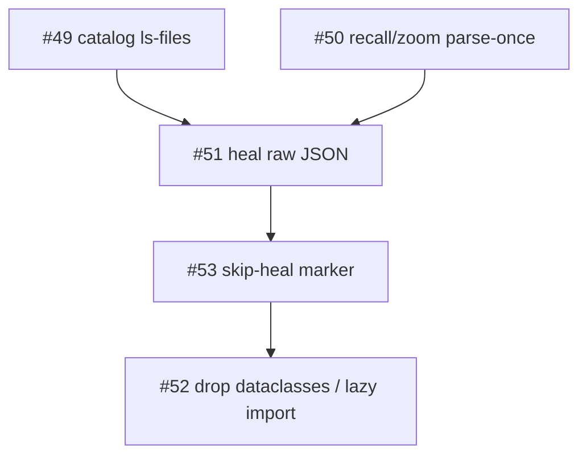

# TASK ARCHIVE: perf-shards

## SUMMARY

Parent-operated L4: five GitHub shards from the 2026-08-25 perf audit, one shebang file. [#49](https://github.com/Texarkanine/SumMem/issues/49)–[#52](https://github.com/Texarkanine/SumMem/issues/52) shipped as [PR #54](https://github.com/Texarkanine/SumMem/pull/54)–[#57](https://github.com/Texarkanine/SumMem/pull/57) and are on `main` (`ebb2583`). [#53](https://github.com/Texarkanine/SumMem/issues/53) is [won't-do-YET](https://github.com/Texarkanine/SumMem/issues/53#issuecomment-5416332389): leftover no-overlap heal is ~1 ms here / ~44 ms at 5k leaves, and a stem-hash marker cannot skip `note` because write-then-heal always changes the stem set first.

After #56 and #57 landed, #54 and #55 add/add-conflicted the same 4-pack stem on both `.tree` and `.summ` (same four notes, same grouping, different nested captions). Resolves took `origin/main`'s matching pair. [Issue #59](https://github.com/Texarkanine/SumMem/issues/59) records the rule: never mismatch a stem; take every conflicting `.summem/` path from one side.

## REQUIREMENTS

- Judge each of [#49](https://github.com/Texarkanine/SumMem/issues/49)–[#53](https://github.com/Texarkanine/SumMem/issues/53). Implement only what passes. Close won't-do or comment won't-do-YET otherwise.
- One direct report per issue, own worktree, full standalone `/niko` through a non-draft PR. Parent writes no product code.
- Sequence: #49 ∥ #50, then #51, then #53, then #52. Workers stay in lane; overlapping `summem` edits are merge failures, not extra scope.
- Parent L4 files stay off `main` until this capstone. Parent L4 preflight of the milestone list is skipped.
- Script is the only writer. Wake stays wait-free and does not heal. Catalog is not a committed index. Prefix uniqueness is among distinct ids. Python 3.11 floor stays immediately after `import sys`. No marshal/`.pyc` cache.

## MILESTONE LIST

Original list from L4 plan; none added, removed, or reordered. #53 was deferred instead of built. #49's catalog sentinel was re-scoped at review from `config.toml` only to any git-visible `/.summem/` path.

1. Evaluate and dispose #49: root-wake catalog via one `git ls-files` — estimated L2, classified L2
2. Evaluate and dispose #50: recall and zoom parse each pack once and unique-prefix in linear time — estimated L2, classified L2
3. Evaluate and dispose #51: heal overlap checks walk raw tree JSON and thread one `list_view` — estimated L2, classified L2
4. Evaluate and dispose #53: skip-heal marker when the view stem set is unchanged, or won't-do / won't-do-YET — estimated L3, deferred
5. Evaluate and dispose #52: drop dataclasses and lazy-import command-only modules — estimated L2, classified L2

#49 and #50 ran in parallel from `main` `3e30660`. Later milestones started from then-current `main`, not stacked, except #53 which stacked on `feat/heal-raw-json` so it could wrap the new heal.

## SUB-RUN SUMMARIES

### catalog-ls-files (L2, PR #54, Fixes #49)

Replaced `os.walk` plus per-store `git check-ignore` (`_ignored_store`) with one `git ls-files -z --cached --others --exclude-standard`. First ship filtered on `config.toml`. Review finding: file-level ignore of that sentinel hid a live store. Landed filter: any git-visible path under `/.summem/`. `--others --exclude-standard` keeps untracked `start` stores. Git failure returns empty catalog. Atlas left as “a walk that honors git ignore,” not a committed index. First tox 287; after the review fix, 288 on py311–py314. QA PASS.

Merge onto post-#57 `main`: store took main’s matching 4-pack `.tree`/`.summ`. Driver kept ls-files catalog and lazy-imported `subprocess` (incoming still had `_ignored_store`).

### recall-zoom-prefix (L2, PR #55, Fixes #50)

One unique-prefix table per command (sort plus neighbor LCP). Each view `.tree` parsed once; `named_ids` is that walk’s id list. Wake and fold may still call `short_id` per line. First QA FAIL: an id-keyed row map collapsed two same-text notes onto one stamp and printed nested captions after their leaves. Rework keeps every dated row in preorder hits. Review fixes: pack map keyed by `node.name`; `_index_tree` inside the parse `try`. Tox 295 then 299 on py311–py314. QA FAIL then PASS.

Merge onto post-#57 `main`: store took main’s matching 4-pack pair. Driver auto-merged.

### heal-raw-json (L2, PR #56, Fixes #51)

`leaf_digests` walks `json.loads` dicts with the same keys as `_tree_from_dict` so a malformed pack still yields `None`. Rematerialize and pack writes still build `Tree`. `heal_view` returns the final view; `note`/`nap` thread that list and knobs. `list_view` left closed. Preflight advisory (`StoreContext`) declined. Tox 290 on py311–py314. QA PASS. Merged before #54/#55.

### skip-heal-marker (L3 estimated, #53 deferred)

No PR. After #51, no-overlap heal is ~1.1 ms on this store and ~44 ms at 5k leaves (was ~81 ms). A hash of the view stem list written after a successful heal cannot skip `note`: write-then-heal adds a stem first, so the common path never hits the skip. Reopen when a real store has a multi-thousand-leaf pack in view, or when someone settles nap-stems-only vs heal-order vs sidecar.

### drop-dataclasses (L2, PR #57, Fixes #52)

Five frozen dataclasses → `__slots__` plus `_replace` / `_eq_by_slots`. `tomllib` / `fcntl` / `subprocess` / `random` / leftover `argparse` load only on the paths that need them. `version` / `init` / handwritten `-h` skip those imports. 3.11 gate still immediately after `import sys`. First tox: py314 failed because pathlib imports `fcntl`; isolation probe switched from `sys.modules` to the driver’s `__import__`. Second tox: 287 on py311–py314. `/usr/bin/python3.10 ./summem version` still prints the floor message. QA PASS. Merged before #54/#55.

## IMPLEMENTATION

Parent stayed on `niko/perf-shards` in `~/.cursor/worktrees/summem-ops-perf-shards/SumMem` and did not implement product code. Workers: `feat/catalog-ls-files`, `feat/recall-zoom-prefix`, `feat/heal-raw-json`, `feat/skip-heal-marker` (notes only), `feat/drop-dataclasses`. Standing consent through reflect and a non-draft PR. Parent L4 preflight stayed skipped so a verify-only pass would not swallow this list as one implementation plan.

Human merged #57 then #56, then #54 and #55 after the parent resolved the 4-pack add/add.

## TESTING

Each implemented sub-run: TDD, full `tox` py311–py314, Niko preflight + QA. Parent re-ran tox on the #54 and #55 merge resolutions (297 and 308). Capstone is documentary.

## SYSTEM STATE

On `main` `ebb2583`:

- Root catalog is one `git ls-files` of any git-visible `/.summem/` path.
- Recall and zoom unique-prefix once and parse each view `.tree` once.
- Heal overlap checks walk raw tree JSON; `note`/`nap` reuse one view list.
- View types are slots; command-only modules are lazy; 3.11 floor still prints on 3.10.
- No skip-heal marker. No new store file from this wave.

## CROSS-RUN INSIGHTS

Same leaf-set id with different nested captions is the same id and different children-file bytes. Git then add/add-conflicts **both** `.tree` and `.summ`. The designed honest conflict (`test_same_pair_two_captions_conflict_only_on_sum`) is caption-only when the dumps match. Mismatching a stem’s pair makes wake/recall print one wording and zoom the other. Taking every conflicting `.summem/` path from one side loses only the other phrasing. That is the surgery this product is supposed to refuse. Script cannot enforce a git merge; [#59](https://github.com/Texarkanine/SumMem/issues/59) is the doc follow-up.

#52 last was right: it rewrote the type and import spine the others sat on. Starting later shards from `main` rather than stacking kept product hunks three-way-mergeable except the store add/add.

Parent L4 files on `main` before the children start still make workers see `milestones.md` and try to run the parent L4. This wave kept them on the ops branch until capstone.

## LESSONS LEARNED

- A stem-hash skip-heal cannot wrap write-then-heal `note`. Measure leftover cost after the cheap heal before adding store state.
- 3.14 pathlib imports `fcntl`. Isolation oracles must trace the driver’s importer, not `sys.modules`.
- Prefix uniqueness is among distinct ids; printed rows are not. Do not key dated wake rows by content id alone.
- Catalog “ask git for the tree” is the ignore contract. A `config.toml` sentinel is not, once that file can be ignored while notes remain.

## PROCESS IMPROVEMENTS

Document the two all-conflicting-`.summem/` checkouts in the atlas ([#59](https://github.com/Texarkanine/SumMem/issues/59)). `--ours` / `--theirs` flip on rebase; name `origin/main` and `HEAD` instead. Do not `git checkout <side> -- .summem/`.

## TECHNICAL IMPROVEMENTS

None from this capstone beyond #59. Do not implement the #53 marker as specified.

## NEXT STEPS

- [#59](https://github.com/Texarkanine/SumMem/issues/59): document never-mismatch and the two resolve invocations.
- [#53](https://github.com/Texarkanine/SumMem/issues/53): remains open as won't-do-YET.
- Worker worktrees can be removed.
