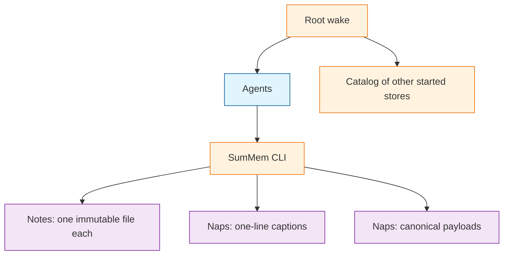

# System Patterns

## How This System Works

SumMem is a script that owns a grow-only set of facts in the git tree, and a decaying view of that set. Agents never touch the store. They run `wake`, `note`, `nap`, `recall`, `zoom`, and `start`. The script assigns names, times, and hashes. The committed driver is `.summem/summem`, sibling to store data inside the brand directory.

The view matches [OptMem](https://github.com/VictorTaelin/OptMem): short notes, a merge tree of summaries, a bounded wake. The store does not. OptMem's one append-only log and position-as-identity cannot survive squash-merge, uninterested conflict resolution, or many writers at once. SumMem keeps the view and replaces the single log with a directory of immutable files.

Ingest is wait-free union: one immutable file per note. Integrate is cooperative: the script may fold a sealed block into a one-line caption plus a self-contained payload, then drop the children from the view. Wake is wait-free: it prints whatever captions exist and never blocks on a missing nap.

A command resolves one store by walking from `--path` or `$PWD` toward the git root and taking the first started directory. Root wake pushes that store's decaying document and a computed catalog of every other started store. A pull (`wake --path`) prints only the nearest store. Child memory in context is advertised, not enforced.

`VISION.md` is the design contract. This file is the briefing subset. If the working tree lacks a piece of this model, that is work to build, not a signal that the model is wrong. Change-surface routing lives in `VISION.md` under "Change surfaces".

## Script is the only writer

Agents never create, edit, or delete store files. Invented filenames and rewritten notes are the failure this boundary prevents. The backend is swappable only if this holds.

## A scope is a started directory

Walk up. Do not parse workspace manifests. Do not create a store because someone recorded a note from a deep folder. The git root auto-creates on first `wake` or `note`. Every other store is `start <dir>`. Empty packages stay empty.

## Ingest commutes; naps are content-addressed

Two notes are two paths. There is no next id and no shared index. A nap's identity is a digest of the leaves, never of the summary sentence. Same children produce the same id and the same payload bytes. Different wording produces the same id and a different caption.

## Sequence is in the filename

Note names carry writer time in UTC. Nap names carry the minimum child time, not when compaction ran. Git-add date, squash commit time, and `git log` are the wrong clock.

## Wake prints content ids, never positional ranges

A range such as `#16-31` is a picture of one listing and a lie after the next merge. `nap` accepts two content ids a wake printed; `zoom` accepts one. A command that looks like a range is rejected. A content id names leaves, not a unique view row: two notes with the same text print the same id, and adjacency must keep both.

## Payloads are write-once; captions are the honest conflict

Fold writes a new pair. Children leave the view only after the parent payload exists on disk. Zoom is a property of `HEAD`: every sentence still owed lives in a file at the tip. Conflict markers in a caption mean skip that caption. Conflict markers in a payload are the failure the canonical dump exists to avoid.

## Wake is wait-free

A missing or conflict-marked caption degrades to the content id and grain. Wake does not open `.tree`. Writers must not serialize on "cannot wake."

## Root pushes; other stores pull

Session start wakes the true root once. That print includes the catalog: walk the tree, honor git ignore (including `.git/info/exclude`), do not keep a committed index. `wake --path` does not reprint root or the full catalog. Do not load every started store in the root wake.

## Knobs live in the store

Budgets are per-store committed config, not environment variables. Missing names fall back to script defaults. The file is not rewritten unless someone runs `start` or an explicit config command.

## What this system is not

Not OptMem's on-disk log. Not Niko's `memory-bank/`. Not a lease, primary agent, vector clock, or custom merge driver. Not git history as the zoom tree. Not harness hooks as the load mechanism. Personal and machine identity stays in a separate tool.
