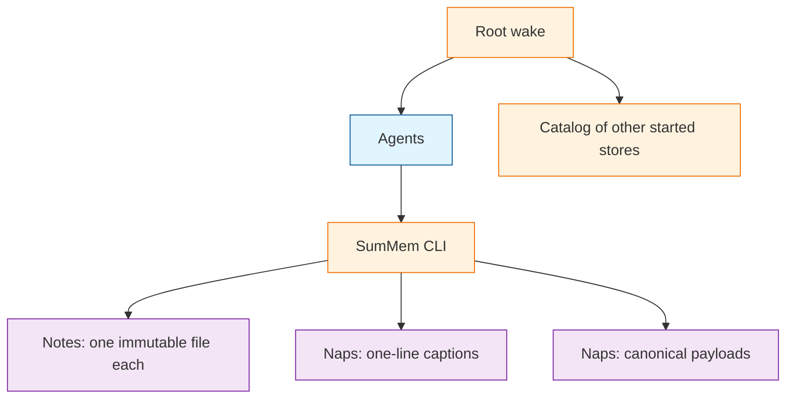

# System Patterns

## How This System Works

SumMem is a script that owns a grow-only set of facts in the git tree, and a decaying view of that set. Agents never touch the store. They run `wake`, `note`, `nap`, `recall`, `zoom`, `start`, and `init` via `.summem/summem`. Bare invocation and `-h` print a handwritten catalog (`usage_text`); a command registered only with argparse will not appear there. `usage_text` uses `CLI_NAME` (`summem`). `prompt_text` and `fold_request`'s `Run:` line use `AGENT_BIN` (`.summem/summem`). `init` prints the baked agent prompt; that block at the top of committed `AGENTS.md` is how a repository opts in. The script assigns names, times, and hashes. This development repo’s record is repo-root `summem`; `.summem/summem` (and dogfood’s) is a symlink to it. `ensure_store` creates `notes/`, `naps/`, and default config when missing. It does not place the driver.

The view matches [OptMem](https://github.com/VictorTaelin/OptMem): short notes, a merge tree of summaries, a bounded wake. The store does not. OptMem's one append-only log and position-as-identity cannot survive squash-merge, uninterested conflict resolution, or many writers at once. SumMem keeps the view and replaces the single log with a directory of immutable files.

Ingest is wait-free union: one immutable file per note. Integrate is cooperative: the script may fold a sealed block into a one-line caption plus a self-contained payload, then drop the children from the view. Wake is wait-free: it prints whatever captions exist and never blocks on a missing nap.

A command resolves one store by walking from `--path` or `$PWD` toward the git root and taking the first started directory. Outside a repository, store commands fail; `init` and help still print. Root wake pushes a labeled catalog (`== Additional SumMem Catalogs ==` and `./path` lines, not pull commands) then that store's decaying document under `== Project-root Memories ==` only when the document is non-empty. A pull (`wake --path`) prints only the nearest store. Child memory in context is advertised, not enforced.

This file is the briefing. The atlas is [`docs/architecture/index.md`](../docs/architecture/index.md). What this backend is not yet lives in [`docs/notes.md`](../docs/notes.md).

## Agent-facing errors are ratchets

Stderr states the problem. It adds a next step only when that step is known and not obvious. Do not invent a repair. The same words can name two causes: `unknown id` on an identity miss says to copy an id from wake; `unknown id` when a view nap has no children file does not. Shared `require_entry` copy must be true for both `note` and `nap`.

## Script is the only writer

Agents never create, edit, or delete store files. Invented filenames and rewritten notes are the failure this boundary prevents. The backend is swappable only if this holds. The files the script writes are part of your work; leaving them untracked is a publish failure, not a writer-boundary success. CLI output stays silent on git.

## A scope is a started directory

Walk up. Do not parse workspace manifests. Do not create a store because someone recorded a note from a deep folder. The git root auto-creates on first `wake`, `note`, `nap`, `zoom`, or `recall`. Every other store is `start <dir>`. Empty packages stay empty.

## Ingest commutes; naps are content-addressed

Two notes are two paths. There is no next id and no shared index. A nap's identity is a digest of the leaves, never of the summary sentence. The same two loose notes produce the same id and the same payload bytes; different wording produces the same id and a different caption. Nested captions and grouping are part of the payload, so the same leaf set can dump to different bytes.

## Sequence is in the filename

Note names carry writer time in UTC. Nap names carry the leftmost child's `{stamp}-{rand}`, not when compaction ran. Git-add date, squash commit time, and `git log` are the wrong clock.

## Wake prints undated lines, never positional ranges

A range such as `#16-31` is a picture of one listing and a lie after the next merge. Wake prints `text` for a note and `xN <prefix>: caption` for a pack. `nap` and `zoom` accept the unique prefix of a content id they can already name; a command that looks like a range is rejected. Filenames and `.tree` identity stay 64 hex. A content id names leaves, not a unique view row: two notes with the same text share an id, and adjacency must keep both. Prefix uniqueness is among distinct ids, not view-row count; a repeated id is still that one prefix.

## Payloads are write-once; captions are the honest conflict

Fold writes a new pair. Children leave the view only after the parent payload exists on disk. Zoom is a property of `HEAD`: every sentence still owed lives in a file at the tip. Conflict markers in a caption mean skip that caption. Conflict markers in a payload are the failure the canonical dump exists to avoid.

## Wake is wait-free

A missing or conflict-marked caption degrades to grain and unique prefix with no caption. Wake does not open `.tree` to list an at-or-over-budget view. It may open `.tree` to expand an under-budget view. Wake does not open `.tree` to heal overlapping packs; mutating `note` and `nap` may. Writers must not serialize on "cannot wake." Fold requests are equal-grain adjacent view nodes and still unlink; wake may expand in memory when the view is short.

## Root pushes; other stores pull

Session start wakes the true root once, because of the `AGENTS.md` block, not a harness hook. Skip if a root wake is already in the conversation. That print includes the catalog: walk the tree, honor git ignore (including `.git/info/exclude`), do not keep a committed index. `wake --path` does not reprint root or the full catalog. Do not load every started store in the root wake.

## Settings live in the store

Budgets are per-store committed config, not environment variables. Missing values fall back to script defaults. The file is not rewritten unless someone runs `start`.

## What this system is not

Not OptMem's on-disk log. Not Niko's `memory-bank/`. Not a lease, primary agent, vector clock, or custom merge driver. Not git history as the zoom tree. Not harness hooks as the load mechanism. Personal and machine identity stays in a separate tool.
